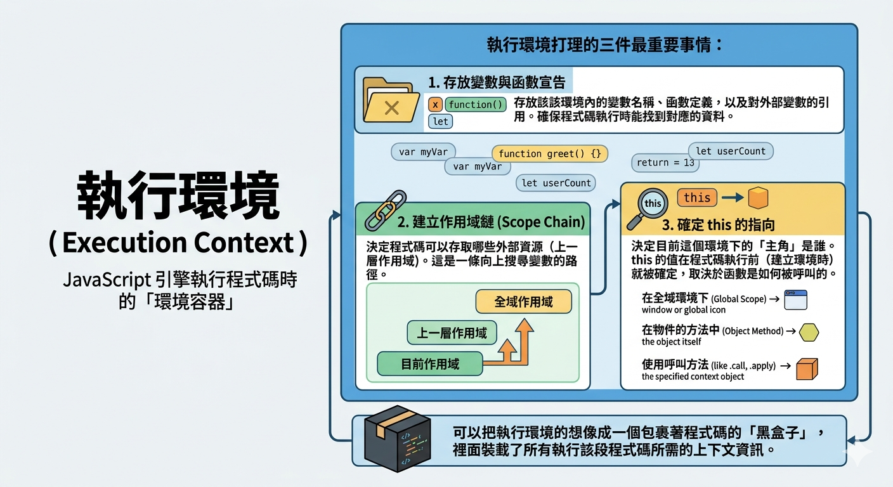
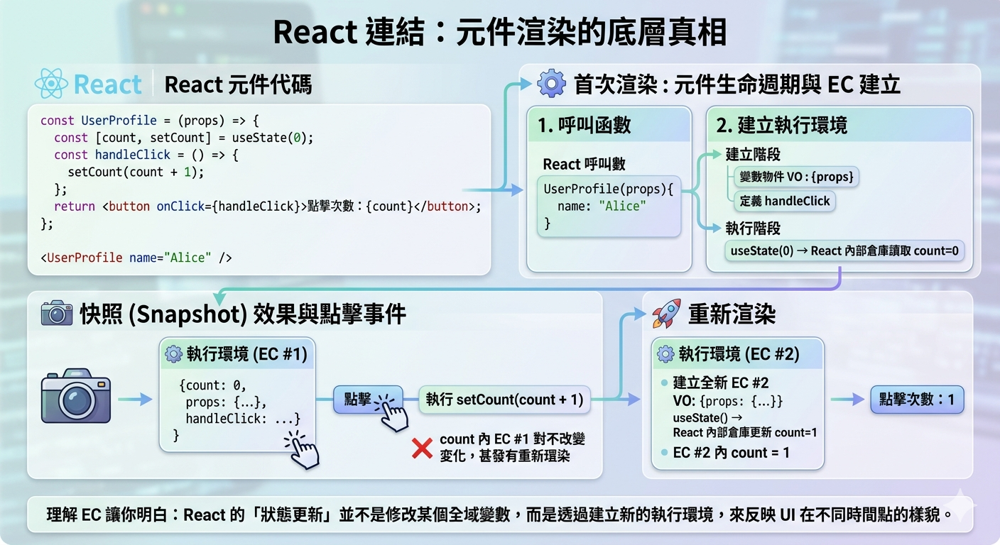

---
mdx:
  format: md
---

> 課程：JavaScript 與 React 底層原理
> 第 1 堂：JS 執行模型基礎

# 01 執行環境（EC）

在正式進入 JavaScript 的各種語法細節之前，我們必須先看透這門語言在背後是如何「預備」執行的。你有沒有想過，為什麼你在程式碼中還沒定義某個變數，JavaScript 卻好像已經知道它的存在（雖然可能是 `undefined`）？或者，為什麼同樣一個 `this` 關鍵字，在不同的函數裡面指涉的對象卻完全不同？

這一切的答案，都藏在一個名為 **「執行環境」（Execution Context，簡稱 EC）** 的機制裡。

如果把 JavaScript 引擎想像成一位大廚，那麼「執行環境」就是他在開火烹飪之前，必須準備好的「廚房空間」。在這個空間裡，他會擺好砧板、瓦斯爐，並確認調味料放在哪裡。沒有這個預先準備好的環境，大廚就無法正確地執行食譜（也就是你的程式碼）。

## 什麼是執行環境？

簡單來說，**執行環境（Execution Context）** 就是 JavaScript 引擎執行一段程式碼時的「環境容器」。

每當 JavaScript 引擎開始解析你的程式碼時，它並不是直接「讀一行跑一行」那麼簡單。它會先為這段程式碼打造一個專屬的執行環境。這個環境負責打理三件最重要的事情：

1. **存放變數與函數宣告**：確保程式碼執行時能找到對應的資料。
2. **建立作用域鏈（Scope Chain）**：決定程式碼可以存取哪些外部資源。
3. **確定 **`**this**`** 的指向**：決定目前這個環境下的「主角」是誰。

你可以把 EC 想像成一個包裹著程式碼的「黑盒子」，裡面裝載了所有執行該段程式碼所需的上下文資訊。



## 執行環境的三種類型

在 JavaScript 中，執行環境主要分為三類。雖然我們在本課程中不涉及 `class` 語法，但了解執行環境的分類對於理解函數式元件（Functional Components）至關重要。

### 1. 全域執行環境 (Global Execution Context)

這是最基礎的環境。當你的 JavaScript 檔案一載入，引擎就會立刻建立一個「全域執行環境」。

- **唯一性**：一個程式中只會有一個全域執行環境。
- **預設行為**：它會建立一個全域物件（在瀏覽器中是 `window`），並將 `this` 指向這個全域物件。
- **生命週期**：除非你關閉分頁或程式結束，否則全域執行環境會一直存在。

### 2. 函數執行環境 (Function Execution Context)

這是我們最常接觸的環境。**每當一個函數被「呼叫」時**，引擎就會為該函數建立一個新的執行環境。

- **動態性**：函數定義時不會產生 EC，只有在「執行（呼叫）」的那一刻才會產生。
- **多樣性**：同一個函數被呼叫三次，就會產生三個獨立的函數執行環境。這點在 React 中極其重要——每次元件渲染（Render）其實就是一次函數呼叫，產生了一個全新的環境。

### 3. Eval 執行環境 (Eval Execution Context)

這是在執行 `eval()` 函數內部的程式碼時產生的環境。由於 `eval` 存在安全性與效能問題，現代開發極少使用，我們可以暫且忽略它。

---

## 執行環境的建立：兩個關鍵階段

這是理解 JavaScript 底層運作最核心的部分。一個執行環境的生命週期分為兩個階段：**建立階段（Creation Phase）** 與 **執行階段（Execution Phase）**。

### 第一階段：建立階段 (Creation Phase)

在你的程式碼真正開始跑之前，JS 引擎會先掃描一遍程式碼，這時候它會做以下幾件事：

1. **建立變數物件（Variable Object / Activation Object）**：
  - 尋找所有的 `function` 宣告，並將函數名稱指向該函數的記憶體位址（這就是為什麼你可以先呼叫函數再定義它）。
- 尋找所有的 `var` 變數宣告，並將其初始化為 `undefined`。
- 辨識 `let` 與 `const` 變數，但**不會**初始化它們（這導致了所謂的 TDZ，暫時性死區）。
2. **建立作用域鏈（Scope Chain）**：確定目前這個環境可以往外看到哪裡。
3. **確定 This Binding**：決定這個環境中 `this` 的具體指向。

### 第二階段：執行階段 (Execution Phase)

這時候，引擎才會開始逐行執行程式碼。

- 它會進行**變數賦值**（把剛才 `var` 賦予的 `undefined` 替換成真正的數值）。
- 執行函數呼叫、條件判斷等邏輯。

### 💡 預測與發現：為什麼 `undefined` 會出現？

讓我們來看一段經典的程式碼，請你預測它的輸出：

```javascript
console.log(name);
var name = "React Expert";

sayHello();

function sayHello() {
  console.log("Hello!");
}
```

**你的預測是什麼？**
如果你來自其他語言，可能會覺得第一行應該報錯（因為 `name` 還沒定義）。但實際上，這段程式碼的執行結果是：

1. `undefined`
2. `Hello!`

**為什麼？**
因為在 **「建立階段」**，執行環境已經把 `var name` 登記為 `undefined`，並把 `sayHello` 函數完整地存入了記憶體。等到 **「執行階段」** 跑第一行 `console.log(name)` 時，它從環境中抓到的值就是 `undefined`。這就是大家常聽到的 **Hoisting（提升）**，它的本質其實就是執行環境「建立階段」的副作用。

---

## 執行環境的內部結構：VE 與 LE

為了更精確地管理 ES6 以後的語法（如 `let` 與 `const`），現代 JavaScript 引擎將 EC 的內部結構細分為兩個主要部分：

### 1. Variable Environment (變數環境，簡稱 VE)

這主要用來存放由 `var` 定義的變數。在建立階段，這些變數會被初始化為 `undefined`。

### 2. Lexical Environment (詞法環境，簡稱 LE)

這是更先進的儲存機制，用來存放：

- `let` 與 `const` 定義的變數（它們在建立階段被登記，但未初始化）。
- `function` 宣告。
- 對外部環境（Outer Environment）的參考（這決定了 Scope Chain）。

**為什麼要分開？**
這是為了區分「傳統的提升行為」與「現代的區塊作用域規範」。當你使用 `let` 時，它被存在 Lexical Environment 中，引擎規定在它被正式賦值前不能存取。

---

## This Binding 基礎：誰是主角？

在建立執行環境時，`this` 的指向會被確定下來。這是一個讓許多開發者頭痛的主題，但在 EC 的視角下，它其實有一套邏輯：

1. **全域執行環境下**：`this` 預設指向全域物件（如 `window`）。
2. **函數執行環境下**：`this` 的指向取決於**函數是如何被呼叫的**。
  - 如果是直接呼叫 `myFunc()`，`this` 通常是全域物件（嚴格模式下是 `undefined`）。
- 如果是作為物件的方法呼叫 `obj.myFunc()`，`this` 就會指向該物件 `obj`。
3. **箭頭函數（Arrow Functions）的特殊性**：
這對 React 開發者至關重要。**箭頭函數沒有自己的 **`**this**`** 指向**。當它被建立時，它會直接「繼承」外部環境的 `this`。

> **為什麼這在 React 中很重要？**
> 在早期的 Class Component 中，我們常需要手動 `bind(this)`。而在現代 Hooks 開發中，我們大量使用箭頭函數來定義 Event Handler，這確保了函數內部的邏輯能夠正確地引用到它被定義時的上下文，而不會因為非同步呼叫或 DOM 事件觸發而導致 `this` 丟失。

---

## React 連結：元件渲染的底層真相

現在，讓我們把這些枯燥的 JS 原理與 React 連結起來。這會讓你明白，為什麼 React 元件的行為是可預測的。

當你寫下一個 React 函數元件並使用它時：

```javascript
const UserProfile = (props) => {
  const [count, setCount] = useState(0);

  const handleClick = () => {
    setCount(count + 1);
  };

  return (
    <button onClick={handleClick}>點擊次數：{count}</button>
  );
};

// 在別處使用
<UserProfile name="Alice" />
```

當 `<UserProfile name="Alice" />` 被渲染時，底層發生了什麼？

1. **呼叫函數**：React 呼叫了 `UserProfile` 函數。
2. **建立執行環境 (Function EC)**：
  - **建立階段**：引擎建立了一個新的 EC。它把 `props` 存入變數物件，定義了 `handleClick` 函數。
- **執行階段**：執行 `useState`。這時候，React 會從它的內部「倉庫」拿出目前的 `count` 值（假設是 0）。
3. **快照（Snapshot）效果**：
這個 EC 就像一張照片，記錄了這一次渲染時所有變數的狀態。`count` 在這個環境裡永遠是 `0`。即使你點擊了按鈕觸發 `setCount`，它也不會改變「當前這個 EC」裡的 `count`。它做的是**觸發下一次渲染**。
4. **重新渲染**：
下一次渲染時，React **再次呼叫** `UserProfile` 函數，於是引擎又建立了一個**全新的執行環境**。在這個新環境裡，`count` 被初始化為 `1`。

**理解 EC 讓你明白：React 的「狀態更新」並不是修改了某個全域變數，而是透過不斷建立新的執行環境，來反映 UI 在不同時間點的樣貌。**



### 思考題：如果沒有執行環境會怎樣？

想像如果 JS 沒有 EC 的概念，所有的變數都混在一起。當你在 React 中快速點擊按鈕 5 次，這 5 次點擊所產生的非同步回呼函數（Callback）可能會互相干擾，因為它們都在搶同一個變數空間。正是因為每一次呼叫都有獨立的 EC，才保證了資料的隔離與渲染的穩定性。


## 重點總結與銜接

在這個部分中，我們揭開了 JavaScript 執行的第一道面紗：

- **執行環境 (EC)** 是程式執行的容器，負責管理變數、作用域與 `this`。
- **全域 EC** 只有一個，**函數 EC** 則在每次呼叫時動態產生。
- **建立階段**（記憶體配置、Hoisting）與 **執行階段**（賦值、運算）的區分，解釋了 JS 許多獨特的行為。
- **箭頭函數**繼承外部環境的 `this`，這在處理事件時非常方便。
- **React 元件的每次渲染**，本質上都是在建立一個新的函數執行環境。

掌握了執行環境的內部構造後，你可能會好奇：當程式碼中存在多個函數互相呼叫（例如元件裡面又呼叫了其他 API 或子元件）時，JavaScript 是如何同時管理這麼多個執行環境而不混亂的呢？

這就是我們下一部分要探討的主題：**Call Stack（呼叫堆疊）機制**。我們將看到 JavaScript 引擎如何像玩疊疊樂一樣，有條不紊地管理這些執行環境。
