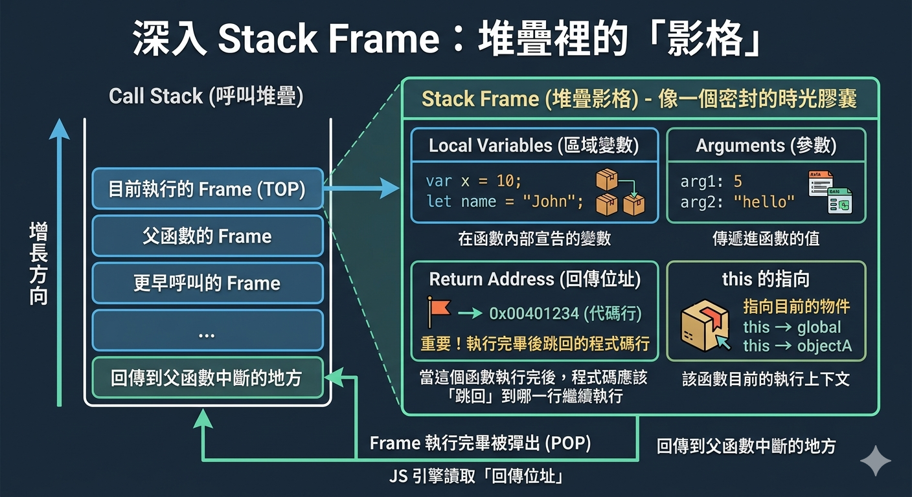
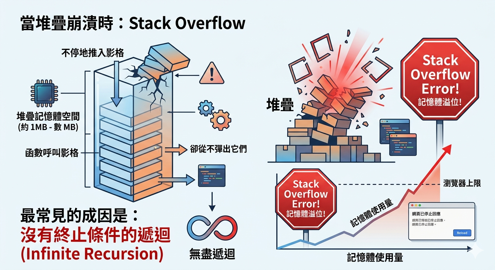
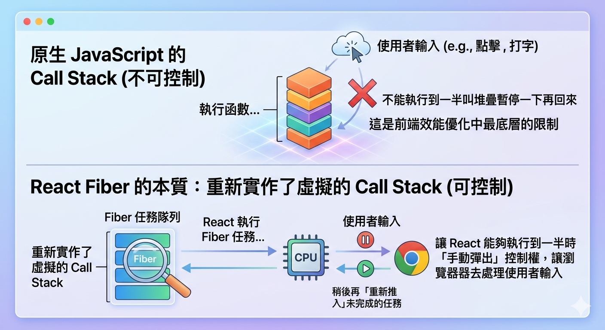

---
mdx:
  format: md
---

> 課程：JavaScript 與 React 底層原理
> 第 1 堂：JS 執行模型基礎

# 02 Call Stack 機制

想像你正在廚房準備一場盛大的晚餐。你正在切洋蔥（主任務），突然電話響了（中斷），你放下刀子去接電話。通話中，門鈴又響了（另一個中斷），你請電話那頭的朋友稍等，跑去開門收包裹。收完包裹後，你回到電話旁結束通話，最後才回到砧板前繼續切那顆還沒切完的洋蔥。

這種「處理到一半，先去做新來的任務，完成後再依序退回」的邏輯，正是 JavaScript 引擎管理程式執行的核心方式。在上一單元中，我們學習了什麼是執行環境（Execution Context, EC），現在我們要看 JS 引擎如何利用 **Call Stack（呼叫堆疊）** 這個資料結構，來有條不紊地管理這些環境。

## 什麼是 Call Stack？

**Call Stack（呼叫堆疊）** 是 JavaScript 引擎中的一個基本結構，它的唯一職責就是：**追蹤程式目前的執行位置**。

當你呼叫一個函數時，引擎會為該函數建立一個新的執行環境（EC），並將它「推入（Push）」堆疊的最頂端。當函數執行完畢後，引擎會將它從堆疊中「彈出（Pop）」，並將控制權交還給下方的執行環境。

### LIFO：後進先出的邏輯

Call Stack 遵循的是資料結構中的 **LIFO（Last-In-First-Out，後進先出）** 原則。你可以把它想像成一疊洗好的盤子：

- 你最後放上去的那個盤子（最新呼叫的函數），必須最先被拿走。
- 你最先放下去的那個盤子（全域執行環境），必須等上面的盤子全部拿走後，才能輪到它。

這就是為什麼在 JavaScript 中，如果函數 A 呼叫了函數 B，B 必須完全執行完畢，A 才能繼續執行剩下的部分。

---

## 深入 Stack Frame：堆疊裡的「影格」

每一個被推入 Call Stack 的執行環境，在底層都被稱為一個 **Stack Frame（堆疊影格）**。

你可以把 Stack Frame 想像成一個密封的時光膠囊，裡面保存了該函數在「那一刻」的所有狀態。當一個函數被呼叫並形成一個 Frame 時，它會包含以下關鍵資訊：

1. **Local Variables（區域變數）**：在函數內部宣告的變數。
2. **Arguments（參數）**：傳遞進函數的值。
3. **Return Address（回傳位址）**：這非常重要！它記錄了當這個函數執行完後，程式碼應該「跳回」到哪一行繼續執行。
4. `**this**`** 的指向**：該函數目前的執行上下文。

當 Call Stack 頂端的 Frame 執行完畢被彈出時，JS 引擎會讀取那個「回傳位址」，就像在書籤上標記的位置一樣，瞬間回到父函數中中斷的地方。這就是為什麼 JavaScript 雖然是單執行緒（Single Threaded），卻能處理極其複雜的嵌套呼叫而不會迷路。



---

## 運作流程模擬：從全域到嵌套呼叫

讓我們透過一個具體的預測練習，來看看 Call Stack 是如何變化的。請觀察以下程式碼：

```javascript
const greet = () => {
  console.log("1. 準備打招呼");
  sayHello();
  console.log("3. 打完招呼了");
};

const sayHello = () => {
  console.log("2. 你好！");
};

greet();
```

### 預測一下

當這段程式執行時，Call Stack 的最高峰時期會同時存在幾個執行環境？哪一個函數會最先從堆疊中消失？

### 揭曉：Call Stack 的生命週期

這段程式的執行過程就像一場精密的接力賽：

1. **程式啟動**：JS 引擎首先建立 **Global Execution Context（全域執行環境）**，並將它推入 Call Stack 的底部。這是堆疊中的第一個元素。
2. 呼叫 `greet()`：引擎為 `greet` 建立一個 Function EC，並將它推入堆疊頂端。此時堆疊有：`[Global, greet]`。
3. **執行 **`**greet**`** 內部**：印出「1. 準備打招呼」。
4. 呼叫 `sayHello()`：引擎在 `greet` 還沒執完時，又為 `sayHello` 建立了 Function EC 並推入頂端。此時堆疊達到最高峰：`[Global, greet, sayHello]`。
5. **執行 **`**sayHello**`** 內部**：印出「2. 你好！」。
6. `**sayHello**`** 結束**：`sayHello` 執行完畢，它的 EC 從堆疊中被 **彈出（Pop）**。控制權根據「回傳位址」回到 `greet`。此時堆疊剩下：`[Global, greet]`。
7. 回歸 `greet`：繼續執行剩下的程式碼，印出「3. 打完招呼了」。
8. `**greet**`** 結束**：`greet` 執行完畢，從堆疊彈出。此時堆疊剩下：`[Global]`。
9. **全域結束**：直到你關閉瀏覽器標籤頁或終止 Node.js 程序，Global EC 才會從堆疊彈出。

**關鍵啟示**：雖然 `greet` 比 `sayHello` 早呼叫，但 `sayHello` 卻比 `greet` 更早結束。這就是 LIFO 的具體展現。

---

## 追蹤複雜範例：三層嵌套

為了確保你已經掌握了這個邏輯，我們來挑戰一個更深層的例子。這在開發複雜的業務邏輯或處理多層資料轉換時非常常見。

```javascript
const multiply = (a, b) => a * b;

const square = (n) => {
  const result = multiply(n, n);
  return result;
};

const printSquare = (x) => {
  const squared = square(x);
  console.log(squared);
};

printSquare(5);
```

讓我們逐步拆解 Call Stack 的動態：

1. `**Stack: [Global]**`
  - 程式載入，Global EC 準備就緒。
2. `**Stack: [Global, printSquare]**`
  - `printSquare(5)` 被呼叫，推入堆疊。
3. `**Stack: [Global, printSquare, square]**`
  - 在 `printSquare` 內部，呼叫了 `square(5)`。此時 `printSquare` 的狀態被暫停，保留在堆疊中。
4. `**Stack: [Global, printSquare, square, multiply]**`
  - 在 `square` 內部，又呼叫了 `multiply(5, 5)`。這是堆疊的最深處。
5. `**Stack: [Global, printSquare, square]**`
  - `multiply` 回傳了 `25`，任務完成，被彈出。`square` 接收到值，從暫停處恢復。
6. `**Stack: [Global, printSquare]**`
  - `square` 回傳了 `25`，任務完成，被彈出。`printSquare` 拿到結果。
7. `**Stack: [Global]**`
  - `printSquare` 印出結果後結束，被彈出。

這就像是一連串的「待辦事項」，每一層都在等待下一層給出答案。

---

## 當堆疊崩潰時：Stack Overflow

雖然 Call Stack 非常高效，但它不是無限大的。瀏覽器賦予每個堆疊的記憶體空間都有上限（通常約為 1MB 到幾 MB，取決於引擎）。

當你不停地向堆疊推入影格，卻從不彈出它們時，就會發生著名的 **Stack Overflow（堆疊溢位）**。最常見的成因是：**沒有終止條件的遞迴（Infinite Recursion）**。



### 錯誤示範

```javascript
const runForever = () => {
  runForever(); // 自己呼叫自己，沒有終止條件
};

runForever();
```

當你執行這段程式時：

1. `runForever` 被推入堆疊。
2. 它又呼叫了 `runForever`，新的影格被推入。
3. 重複上述步驟...

短短幾毫秒內，堆疊就會被數萬個 `runForever` 的影格填滿，直到擠爆記憶體。瀏覽器會報錯：`Uncaught RangeError: Maximum call stack size exceeded`。

這提醒了我們，在處理遞迴邏輯（例如遍歷樹狀結構的資料）時，必須極其小心地設定「基準情況（Base Case）」，確保堆疊最終能依序彈出。

---

## React 連結：為什麼渲染是「不可中斷」的？

理解了 Call Stack 的線性本質後，你就能理解 React 歷史上的一個重大設計決策。

在 React 16 以前（使用所謂的 **Stack Reconciler** 時代），React 渲染元件的方式與我們剛才看到的 `A -> B -> C` 完全一樣：

- 當你呼叫 `root.render(<App />)`。
- React 開始執行 `App` 元件。
- 如果 `App` 裡面有 `Header`，它就呼叫 `Header`。
- 如果 `Header` 裡面有 `Nav`，它就呼叫 `Nav`。

### 效能的瓶頸

這個過程是完全依靠 **Call Stack** 驅動的。這意味著：

1. **同步且不可中斷**：一旦 React 開始渲染，它就會佔據整個 Call Stack。在 `App` 到最底層元件全部執行完畢並彈出堆疊之前，瀏覽器的主執行緒（Main Thread）是沒辦法做任何其他事的。
2. **掉幀（Jank）**：如果你有一個非常龐大的元件樹（例如幾千個節點），React 可能需要花 200 毫秒來走完這個堆疊。在這 200 毫秒內，使用者如果點擊按鈕或試圖滾動頁面，瀏覽器完全無法回應，因為 Call Stack 正忙著處理渲染任務。

這就是為什麼 React 後來要開發 **Fiber 架構**。Fiber 的本質是「重新實作了虛擬的 Call Stack」，讓 React 能夠執行到一半時「手動彈出」控制權，讓瀏覽器去處理使用者輸入，稍後再「重新推入」未完成的任務。

**記住這一點**：原生 JavaScript 的 Call Stack 是不可控制的（你不能執行到一半叫堆疊暫停一下再回來），這是前端效能優化中最底層的限制。



---

## 總結與回顧

Call Stack 是 JavaScript 執行模型中的導航員。它不僅管理著函數的執行順序，更決定了程式碼的同步本質。

- **LIFO 特性**：保證了函數呼叫與回傳的正確邏輯，最後進去的函數最先執行完畢。
- **Stack Frame**：封裝了每一層呼叫的狀態，包含區域變數、參數與回傳位址。
- **Stack Overflow**：警示我們記憶體是有限的，遞迴必須有出口。
- **單一執行緒的代價**：Call Stack 只有一個。如果它被一個長任務佔滿，整個應用程式就會失去回應。

掌握了執行環境的「堆疊管理」後，你已經知道程式是如何「移動」的。下一個部分，我們將深入探討變數是如何在這些堆疊環境中被找到的——這就是 **作用域鏈（Scope Chain）** 的奧秘。它將解釋為什麼內層函數可以存取外層變數，而外層卻看不見內層。
