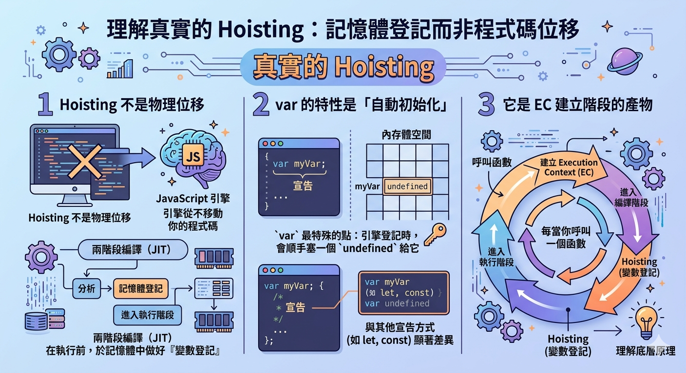

---
mdx:
  format: md
---

> 課程：JavaScript 與 React 底層原理
> 第 2 堂：Hoisting 到 Closure

# 04 var 的 Hoisting 機制

想像一下，如果你在一個嚴格的程式語言（例如 C++ 或 Java）中，試圖在宣告變數之前就去讀取它，程式肯定會毫不留情地崩潰並噴出錯誤。但在 JavaScript 的世界裡，卻發生了一件讓初學者感到莫名其妙、甚至有點「靈異」的事情：

```javascript
console.log(greeting); // 預測一下，會噴錯還是輸出什麼？
var greeting = "Hello, React!";
```

如果你執行這段程式碼，主控台不會報錯，而是冷冷地印出 `undefined`。

為什麼 JavaScript 知道 `greeting` 這個變數存在，卻又不知道它的值是什麼？為什麼它沒有因為變數未定義而當掉？這就是我們今天要拆解的核心謎團：**Hoisting（提升）**。

## 為什麼「提升」只是一個比喻？

在許多入門教材中，Hoisting 常被解釋為：「JavaScript 引擎會把所有的變數宣告『移動』到程式碼的最頂端」。

雖然這是一個很好理解的視覺化比喻，但這並非事實。**JavaScript 引擎並不會去修改你的原始碼，也不會搬動任何程式碼。**

所謂的 Hoisting，其實是 **執行環境（Execution Context）建立階段** 的一個副產品。當我們說一個變數被「提升」時，真正的意思是：在程式碼還沒開始執行第一行之前，JavaScript 引擎就已經在記憶體中為這些變數預留了位置。

要理解這點，我們必須回到上一節課提到的觀念：執行環境的生命週期。

---

## 執行環境的兩階段旅程

JavaScript 執行程式碼並非「一邊讀一邊跑」那麼簡單。每當一個執行環境（例如全域執行環境或函數執行環境）被建立時，它會經歷兩個關鍵階段：

### 1. 建立階段 (Creation Phase)

這是引擎最忙碌的預備時期。在這一階段，引擎會先快速掃描一遍你的程式碼，它不關心具體的邏輯運算，它只關心一件事：**「這裡有哪些變數和函數需要準備？」**

當引擎掃描到 `var` 關鍵字時，它會執行以下動作：

- 在記憶體中開闢一個空間給這個變數名稱。
- 將這個變數登記在 **變數環境（Variable Environment）** 中。
- **關鍵的一步**：將該變數初始化為 `undefined`。

這就是為什麼在程式碼正式執行前，變數就已經「存在」於記憶體中了。

### 2. 執行階段 (Execution Phase)

預備工作完成後，引擎才開始從第一行程式碼向下執行。這時才會處理賦值（Assignment）運算。

讓我們用剛剛的範例來拆解引擎的視角：

```javascript
// 原始程式碼
console.log(greeting); 
var greeting = "Hello, React!";
```

**【建立階段】引擎的筆記本：**

1. 看到 `var greeting`。
2. 在記憶體開個洞，名字叫 `greeting`。
3. 把 `greeting` 的初始值填上 `undefined`。

**【執行階段】引擎開始跑：**

1. 第一行：`console.log(greeting)`。引擎去筆記本找 `greeting`，發現它目前的值是 `undefined`，於是印出 `undefined`。
2. 第二行：`greeting = "Hello, React!"`。引擎把筆記本裡的 `undefined` 擦掉，改寫成 `"Hello, React!"`。

---

## 底層機制：Variable Environment 的預先填充

為了更深入地理解，我們需要稍微觸碰一下 ECMAScript 規格中的細節。

在早期的規格中，這被稱為 **Variable Object (VO)**，而在現代規格中則是 **Variable Environment (VE)** 的一部分。當引擎進入一個函數或全域環境時，它會先建立一個物件來存放該環境內的所有宣告。

對於使用 `var` 宣告的變數，JS 引擎有一種「未審先判」的傾向。它在掃描到 `var x` 時，會立即在 VE 物件中建立一個 key 叫做 `x`，並直接關聯到一個 `undefined` 的原始值。

這與我們下一部分要講的 `let` 與 `const` 有著本質上的不同。`let` 和 `const` 雖然也會在建立階段被掃描到，但引擎會刻意讓它們處於一種「未初始化」的狀態，如果你在賦值前去碰它們，引擎就會報錯。而 `var` 的設計初衷是為了寬容，這導致了它在記憶體中被「預先填充」了 `undefined`。

### 為什麼 JS 這樣設計？

你可能會問：「為什麼要搞得這麼複雜？為什麼不乾脆報錯就好了？」

這背後有歷史原因。在 JavaScript 誕生之初，它的設計者 Brendan Eich 希望這門語言能對非專業開發者更友善、更「寬容」。Hoisting 的存在（特別是函數的 Hoisting）是為了讓開發者可以先調用函數，再在程式碼下方定義函數，這在當時被認為是一種更自然、更具宣告式的撰寫風格。然而，對於變數的 Hoisting，它產生的副作用（例如 `undefined`）後來被證明是許多 Bug 的溫床。

---

## 實戰追蹤：多層級的 Hoisting 陷阱

當 Hoisting 遇上函數作用域時，事情會變得更加有趣。請看以下這段程式碼，並試著預測輸出的順序：

```javascript
var name = "Global Context";

function sayName() {
    console.log("1:", name); 
    var name = "Local Context";
    console.log("2:", name);
}

sayName();
```

這是一個經典的面試題。如果你認為第一個輸出應該是 `"Global Context"`，那你可能忽略了 **函數執行環境（Function EC）** 的建立過程。

### 逐步拆解流程：

1. **全域建立階段**：`var name` 被提升，初始化為 `undefined`。
2. **全域執行階段**：`name` 被賦值為 `"Global Context"`。
3. 呼叫 `sayName()`：一個新的「函數執行環境」被建立。
4. **函數建立階段（關鍵點）**：
  - 引擎掃描 `sayName` 內部的程式碼。
- 它看到 `var name = "Local Context"`（注意，這是在函數內部）。
- 引擎在「函數變數環境」中建立一個 `name`，並初始化為 `undefined`。
- **注意**：這個內部的 `name` 會遮蔽（Shadow）外部全域的 `name`。
5. **函數執行階段**：
  - 執行 `console.log("1:", name)`。引擎在當前的函數 VE 中找到了 `name`，它的值目前是 `undefined`。
- 執行 `name = "Local Context"`。內部的 `name` 被更新為新值。
- 執行 `console.log("2:", name)`。輸出 `"Local Context"`。

**最終結果：**

```text
1: undefined
2: Local Context
```

這個例子告訴我們：Hoisting 是以 **執行環境** 為單位的。每個函數都有自己的提升過程，而且內部的變數提升會直接影響該作用域內的變數查找順序。

---

## 總結誤解：什麼才是真實的 Hoisting？

在我們結束這一節之前，請務必記住以下三點，這能幫助你從「會寫程式」晉升到「理解底層原理」：

1. **Hoisting 不是物理位移**：JavaScript 引擎從不移動你的程式碼。它只是在執行前，透過兩階段編譯（JIT）的特性，先在記憶體中做好了「變數登記」。
2. **var 的特性是「自動初始化」**：`var` 最特殊的點在於，引擎在登記它的時候，會順手塞一個 `undefined` 給它。這與其他變數宣告方式有顯著差異。
3. **它是 EC 建立階段的產物**：每當你呼叫一個函數，這個過程就會重新發生一次。

理解了 `var` 的 Hoisting 之後，你就會發現 JavaScript 的設計其實非常有邏輯，雖然這種邏輯在某些情況下（比如看到滿螢幕的 `undefined` 時）會讓你很頭痛。



## 承先啟後：從寬容走向嚴謹

雖然我們掌握了 `var` 的行為，但在現代 React 開發中，我們幾乎不再使用 `var`。原因就在於 `var` 的這種自動初始化與提升行為，常常導致開發者在不經意間使用了尚未賦值的變數，造成難以追蹤的邏輯錯誤。

為了修正這個問題，ES6 引入了 `let` 與 `const`。它們同樣會經歷執行環境的建立階段，同樣會被引擎「掃描」到，但它們卻有一套截然不同的處理邏輯，那就是所謂的 **TDZ（暫時性死區）**。

在下一部分，我們將深入探討 `let` 與 `const` 如何透過更嚴格的限制來保護我們的程式碼，以及為什麼函數宣告（Function Declaration）在提升時，會比變數提升得「更徹底」。

---

## 重點知識點回顧

- **建立階段 (Creation Phase)**：引擎掃描宣告並分配記憶體空間。
- **執行階段 (Execution Phase)**：引擎逐行執行，進行變數賦值與運算。
- **Variable Environment (VE)**：執行環境內部的資料結構，負責管理該作用域的變數。
- **預先初始化 (Auto-initialization)**：`var` 被提升時會被預設為 `undefined`，這是它能在宣告前被使用的原因。
- **作用域獨立性**：提升發生在每一個獨立的執行環境中，互不干擾。
