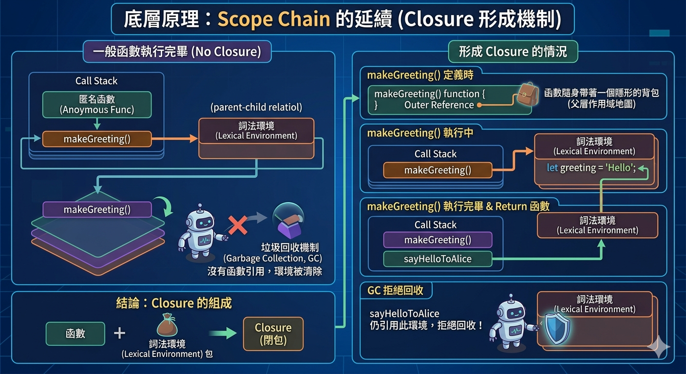

---
mdx:
  format: md
---

> 課程：JavaScript 與 React 底層原理
> 第 2 堂：Hoisting 到 Closure

# 07 Closure 的形成原理

想像一下，你走進一間圖書館借了一本書。在你離開圖書館（函數執行完畢）後，你依然可以坐在家裡的沙發上閱讀這本書的內容。即便圖書館的大門已經關上，你手中的這本書依然連結著當初借閱時的知識。

在 JavaScript 的世界裡，有一種機制能讓函數在「離開家門」後，依然記得家裡發生過的事情。這種機制被我們稱為 **Closure（閉包）**。許多開發者覺得 Closure 是魔術，或是某種需要刻意開啟的「進階功能」，但事實上，Closure 只是 JavaScript 作用域規則（Scope Chain）與記憶體管理機制結合後的自然產物。只要你寫過函數，你可能就已經在使用 Closure 了。

## 為什麼變數沒有「死掉」？

在之前的單元中，我們學習了 **執行環境（Execution Context, EC）**。我們知道當一個函數被呼叫時，JS 引擎會建立一個新的 EC 並推入 **Call Stack**。當函數執行結束，這個 EC 就會從堆疊中彈出（Pop），通常這代表著該環境內部的所有區域變數都會被銷毀。

但是，請看下面這段程式碼，並試著預測它的行為：

```javascript
const makeGreeting = (name) => {
  const message = `你好，${name}！`;
  
  // 我們回傳了一個內部的箭頭函數
  return () => {
    console.log(message);
  };
};

const sayHelloToAlice = makeGreeting("Alice");

// 此時 makeGreeting("Alice") 已經執行結束並從 Call Stack 彈出了
// 理論上 message 變數應該已經消失了
sayHelloToAlice(); // 預測一下，這裡會印出什麼？
```

如果按照「執行完畢就銷毀」的直覺，`sayHelloToAlice()` 應該會報錯，因為 `message` 變數應該已經隨著 `makeGreeting` 的結束而消失了。

然而，當你執行這段程式碼時，它會完美地印出 `你好，Alice！`。

這就是 Closure 的魔力：**內部函數被移出了它當初定義時的作用域，但它依然保留了對那個作用域的存取權。**

## 底層原理：Scope Chain 的延續

要理解 Closure 的形成，我們必須回到執行環境的內部結構。

當一個函數被定義（注意是「定義」，不是「呼叫」）時，它會悄悄地在自己的內部屬性中記錄下它「出生」時的環境參考（Outer Reference）。這就像是每個函數都隨身帶著一個隱形的背包，裡面裝著它出生地（父層作用域）的地圖。



### 1. 詞法環境（Lexical Environment）的保留

在 JavaScript 中，變數儲存在 **詞法環境（Lexical Environment）** 中。通常情況下，當一個函數執行完畢，Call Stack 會把該執行環境彈出，而 JS 的 **垃圾回收機制（Garbage Collection, GC）** 會發現：「嘿，這個環境已經沒有人在用了，我可以把它從記憶體中清掉了。」

但是，如果這個函數在執行過程中 **回傳（Return）** 了另一個函數，且這個「被回傳的函數」內部參考了父層的變數，情況就會發生變化：

1. **建立連結**：內部的箭頭函數擁有一個指向父層 `makeGreeting` 詞法環境的指針。
2. **拒絕回收**：當 `makeGreeting` 執行結束從 Call Stack 彈出時，GC 會過來檢查。但它發現：`sayHelloToAlice` 這個變數依然存活在全域環境中，且它指向的那個匿名函數正抓著 `makeGreeting` 的詞法環境不放。
3. **環境凍結**：因為還有「人」在參考這個環境，GC 就不能把它清除掉。於是，這個詞法環境被保留在記憶體（Heap）中，形成了一個閉包。

**結論：Closure 本質上就是一個函數加上它「出生」時周圍的環境包。**

## 經典範例：計數器（Counter）

為了更透徹地理解 Closure 如何「記住」狀態，我們來看一個最經典的應用場景：計數器工廠。

```javascript
const createCounter = () => {
  let count = 0; // 這個變數被封裝在 createCounter 的作用域內

  return () => {
    count++; // 箭頭函數透過 Scope Chain 找到父層的 count
    console.log(`目前的次數是：${count}`);
  };
};

const counterA = createCounter();
const counterB = createCounter();

counterA(); // 目前的次數是：1
counterA(); // 目前的次數是：2

counterB(); // 目前的次數是：1
```

### 逐步拆解執行脈絡

讓我們用之前學到的 EC 追蹤法來看看發生了什麼：

1. 呼叫 `createCounter()`：
  - 建立了一個 `createCounter` 的執行環境。
- 在其 Lexical Environment 中初始化 `count = 0`。
- 回傳了一個箭頭函數，這個函數攜帶著指向「這個特定 `count` 環境」的參考。
- `createCounter` 從 Call Stack 彈出，但它的 Lexical Environment 因為被 `counterA` 引用而留在了 Heap 記憶體中。
2. 執行 `counterA()`：
  - JS 引擎在 `counterA` 的環境中找不到 `count`。
- 沿著 **Scope Chain**（也就是那個隱形的背包參考）往外找，找到了剛才被保留下來的 `createCounter` 詞法環境。
- 找到 `count`，將其加 1。
3. **為什麼 **`**counterB**`** 是 1？**：
  - 這是最關鍵的一點：**每次呼叫 **`**createCounter**`** 都會產生一個全新的執行環境與全新的變數執行個體。**
- `counterB` 攜帶的是「第二次呼叫 `createCounter` 時產生的環境」。它跟 `counterA` 的環境是完全獨立的。

這就是為什麼 Closure 可以用來做 **資料封裝**。外部環境完全無法直接修改 `count`（你沒辦法寫出 `counterA.count = 10`），只有透過我們回傳的那個函數，才能安全地操作這個變數。

## 與 React 的初步連結：useState 的秘密

你可能會問：「這跟我學 React 有什麼關係？」

事實上，React 最核心的 Hook —— `useState`，其底層邏輯正是基於 Closure。當你在 React 元件中這樣寫時：

```javascript
const [count, setCount] = useState(0);
```

React 實際上是在元件函數之外（在 Fiber 節點上）儲存了這個狀態。當元件重新渲染（重新執行函數）時，React 會利用 Closure 的特性，讓你的元件能夠「記住」上一次的 `count` 是多少。

雖然 React 內部實作更為複雜（涉及鏈結串列與調度機制），但「函數執行完後依然能存取特定變數」的這個核心概念，完全是 Closure 的功勞。如果你不理解 Closure 捕獲變數的時機，你在處理 `useEffect` 的非同步操作或是 `setTimeout` 時，就會遇到惡名昭彰的 **Stale Closure（過時的閉包）** 問題——這我們會在後面的單元深入探討。

## 澄清觀念：Closure 隨處可見

Closure 並不是什麼高深莫測、只出現在面試題裡的冷知識。它在現代 JavaScript 開發中無處不在：

- **Event Listeners**：當你在按鈕點擊事件中使用外部變數時。
- **Ajax / Fetch**：當你在處理非同步回傳的 Callback 中存取定義時的變數時。
- **Timers**：在 `setTimeout` 的回呼函數中存取參數時。

```javascript
const delayedMessage = (msg, delay) => {
  // setTimeout 接收的函數就是一個 Closure
  setTimeout(() => {
    console.log(msg); // 在 delay 毫秒後，它依然記得 msg 是什麼
  }, delay);
};

delayedMessage("這是一則來自過去的訊息", 2000);
```

在這個範例中，`delayedMessage` 在執行後立刻就結束了。但 2 秒後，傳入 `setTimeout` 的那個匿名函數依然能正確印出 `msg`。這證明了 Closure 能夠跨越時間，將變數的生命週期延長到它本該結束之後。

### Closure 的三個核心特點總結

1. **定義時決定**：Closure 的範圍是在函數「寫下」的位置決定的，這就是 Lexical Scope 的本質。
2. **生命週期延長**：原本該被銷毀的變數，因為被內部函數參考而得以在記憶體中存活。
3. **私有性**：外部無法直接存取 Closure 內部的變數，只能透過特定的介面（回傳的函數）進行操作。

## 總結與銜接

在本單元中，我們將 Closure 從一個神秘的術語還原成了 **Scope Chain** 的自然延伸。你已經學會了函數如何透過 Outer Reference 攜帶「環境背包」，以及 JS 引擎如何透過保留詞法環境來實現狀態的持久化。

這是我們關於「JavaScript 執行模型」的最後一個純理論單元。接下來，我們將進行一個完整的 **Review**，把從 Execution Context、Call Stack、Scope Chain 到 Closure 的所有知識點串聯起來。

在下一堂課中，我們將進入實戰領域，探討 Closure 如何幫助我們實作 **模組模式（Module Pattern）** 與 **資料封裝**，並診斷那些讓新手崩潰的 Closure 陷阱（例如在迴圈中建立 Closure）。掌握了這些，你才算真正拿到了進入 React Hooks 底層世界的門票。

我們已經看過了變數如何被提升、執行環境如何堆疊，現在又理解了它們如何被「記住」。現在，準備好進入下一階段的複習，鞏固你的 JS 內功基礎。
