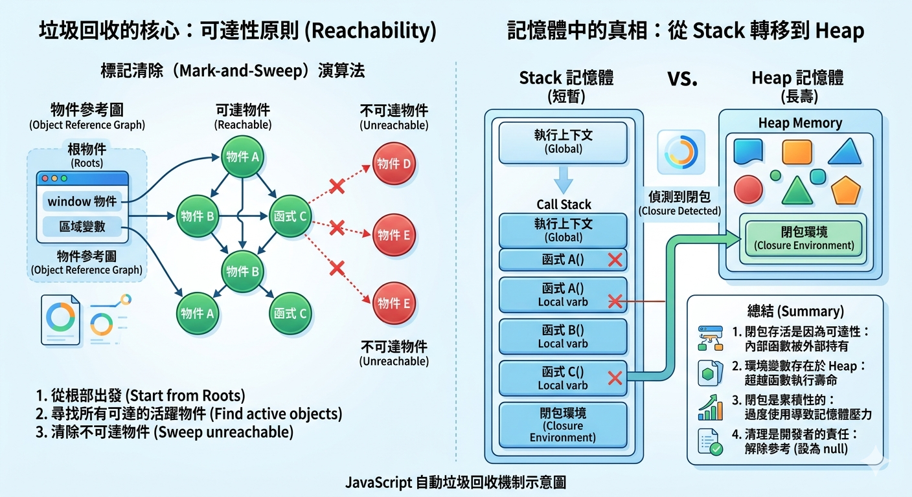

---
mdx:
  format: md
---

> 課程：JavaScript 與 React 底層原理
> 第 3 堂：Closure 完整應用

# 10 Closure 與記憶體

在先前的章節中，我們將閉包（Closure）形容為一個「隨身攜帶的環境背包」。這個背包非常強大，它讓函數即使在父層環境執行完畢後，依然能記住並存取那些本該消失的變數。

但你有沒有想過：**既然父層函數已經從 Call Stack（呼叫堆疊）中彈出了，這些變數到底儲存在哪裡？為什麼 JavaScript 的垃圾回收機制（Garbage Collection）不把它們清掉？**

如果我們不斷地建立這些「背包」，卻從不丟掉它們，電腦的記憶體會不會被塞爆？這就是我們這一節要探討的核心問題：閉包與記憶體管理之間的權衡。

## 為什麼閉包能阻止垃圾回收？

要理解閉包如何影響記憶體，我們必須先回頭看 JavaScript 引擎是如何決定「什麼東西該被丟掉」的。

### 垃圾回收的核心：可達性原則（Reachability）

JavaScript 具有自動垃圾回收機制（GC）。現代瀏覽器（如 Chrome 的 V8 引擎）主要採用 **標記清除（Mark-and-Sweep）** 演算法。

這個演算法的邏輯非常直觀：

1. **根物件（Roots）**：垃圾回收器會從「根」出發。在瀏覽器中，根通常是 `window` 物件，或是當前執行堆疊中的區域變數。
2. **可達性（Reachability）**：如果一個物件從根出發，透過引用鏈結（Reference）可以被找到，那麼它就是「活躍的（Active）」，不能被回收。
3. **標記與清除**：無法從根部觸及的所有物件，都會被標記為「不再需要」，並在下一次 GC 運作時被清理掉。

### 當執行環境遇上堆疊彈出

在一般的函數呼叫中，當函數執行完畢，它的 **執行環境（Execution Context, EC）** 會從 Call Stack 彈出。此時，該環境內的區域變數因為沒有人引用它們，會變得「不可達」，隨後被 GC 清除。

**但是，閉包打破了這個常規。**

讓我們看這個預測練習：

```javascript
const createPowerBank = () => {
  let energy = 100; // 這是父層環境的變數
  
  return () => {
    energy -= 10;
    console.log(`剩餘電力：${energy}%`);
  };
};

const usePower = createPowerBank(); 
// 預測：當 createPowerBank 執行完後，energy 會被回收嗎？
```

**揭曉答案：**
不會。原因在於 `usePower` 這個變數。

當 `createPowerBank` 執行時，它在 **記憶體堆疊（Heap）** 中建立了 `energy` 變數。當它回傳內部函數並賦值給全域變數 `usePower` 時，形成了一條引用鏈：
`Global Window` -> `usePower` -> `內部函數` -> `父層 Lexical Environment (包含 energy)`。

因為 `usePower` 位於全域（根部），它死死地抓著內部函數，而內部函數又死死地抓著它的「環境背包」。只要 `usePower` 還在，`energy` 就是「可達的」。

### 記憶體中的真相：從 Stack 轉移到 Heap

這是一個常見的誤解：認為所有區域變數都存在 Call Stack。
實際上，當 JavaScript 偵測到一個變數可能被閉包引用時，它會將該變數從 **Stack（快速但短暫）** 搬移到 **Heap（較大且長壽）** 中儲存。這確保了即便 Stack 已經清空，變數依然安穩地待在 Heap 裡。

## 記憶體累積的風險：封裝的代價

閉包是「以記憶體換取功能」的典型例子。雖然它提供了強大的封裝性，但如果不加節制地使用，或是閉包內持有了不必要的大型資料，就會造成資源浪費。

### 案例：閉包持有了「巨無霸」資料

請觀察以下程式碼，預測記憶體的使用情況：

```javascript
function heavyDataProcessor() {
  const massiveData = new Array(1000000).fill('🚀'); // 建立一個巨大的陣列
  
  return function(id) {
    console.log(`正在處理任務：${id}`);
    // 注意：這個內部函數「完全沒有用到」massiveData
  };
}

const processor = heavyDataProcessor();
```

在上面的例子中，雖然內部的回傳函數完全沒有存取 `massiveData`，但在某些舊版的 JS 引擎中，只要內部函數存在，它所屬的整個父層環境（Lexical Environment）都會被保留。

雖然現代引擎（如 V8）已經非常聰明，會進行「逃逸分析（Escape Analysis）」來自動釋放閉包中未使用的變數，但在複雜的巢狀閉包中，這種自動優化並不總是完美。

**重點結論**：如果你在一個長壽命的閉包中宣告了大型物件，即使你後來不再使用它，只要閉包函數本身還活著，這份大型資料就有可能一直佔據記憶體。

## 常見的記憶體洩漏（Memory Leak）場景

所謂的記憶體洩漏，並不是記憶體真的「漏掉」了，而是你**不再需要某些資料，但卻因為程式邏輯錯誤，導致 GC 認為它依然「可達」，因而無法回收。**

以下是三個與閉包密切相關的常見陷阱：

### 1. 遺忘的事件監聽器（Dangling Event Listeners）

這是前端開發中最經典的洩漏原因。

```javascript
function attachHandler() {
  const largeData = { name: "Big Object", data: new Array(10000) };
  const button = document.getElementById('save-button');

  button.addEventListener('click', () => {
    // 閉包捕獲了 largeData
    console.log(`儲存中：${largeData.name}`);
  });
}

attachHandler();
```

假設這個按鈕稍後從 DOM 中被移除（例如透過 `element.remove()`），但我們**忘記**呼叫 `removeEventListener`。
這時：

- `window` 依然持有對 DOM 元素的引用（透過事件系統）。
- 事件監聽器（那個閉包）依然附加在按鈕上。
- 閉包依然抓著 `largeData`。

結果：即便使用者離開了這個功能頁面，`largeData` 依然會永遠留在記憶體中。

### 2. 意外的全域變數與長生命週期閉包

如果你將一個閉包存放在一個全域的陣列或物件中，除非你手動清空那個陣列，否則所有被捕獲的環境變數都會長生不老。

```javascript
const globalCache = [];

function addToCache() {
  let localSecret = "I am a secret " + Math.random();
  globalCache.push(() => console.log(localSecret));
}

// 如果我們不停地呼叫 addToCache，globalCache 會無限增長
// 每個閉包都帶著自己的 localSecret 環境
```

### 3. 閉包與定時器（setInterval）

如果我們在 `setInterval` 裡面使用閉包，且沒有適當地呼叫 `clearInterval`，那麼閉包內引用的所有變數都會一直存在。

```javascript
function startTimer() {
  let count = 0;
  let largeArray = new Array(1000).fill('📦');

  const timerId = setInterval(() => {
    count++;
    console.log(`執行次數：${count}`, largeArray.length);
  }, 1000);

  // 如果這裏沒有機制停止 timer，largeArray 將永遠不會被回收
}
```

## 如何診斷與主動釋放

既然我們知道閉包是透過「引用鏈」來存活的，那麼要釋放記憶體，最簡單的方法就是**斷開鏈結**。

### 主動解除參考（Dereferencing）

當你確定不再需要某個閉包時，請將持有該閉包的變數設為 `null`。

```javascript
let myPower = createPowerBank(); // 建立閉包
myPower(); // 使用

// 當我不再需要它時：
myPower = null; 
```

一旦 `myPower = null`，那條從全域出發的引用鏈就斷了。GC 會在下一次掃描時發現那個「環境背包」已經不可達，進而回收它所佔用的記憶體。

### React 的預演：清理副作用

在 React 中，我們經常在 `useEffect` 中使用閉包。這就是為什麼 React 設計了「清理函數（Cleanup Function）」的原因。

考慮以下情境：

```javascript
useEffect(() => {
  const handler = () => { console.log(count); };
  window.addEventListener('scroll', handler);

  // 這是最重要的部分：斷開鏈結！
  return () => {
    window.removeEventListener('scroll', handler);
  };
}, [count]);
```

如果沒有 `removeEventListener`，每當 `count` 改變，React 就會建立一個新的閉包監聽器。舊的監聽器若沒被移除，就會像殭屍一樣留在記憶體中，這不只是效能問題，還會導致邏輯錯誤（Stale Closure 問題）。

## 思考題：你能看出洩漏在哪嗎？

讓我們來做一個分析練習。以下程式碼片段模擬了一個簡單的「資料訂閱器」：

```javascript
function createDataSubscriber() {
  const cache = new Array(100000).fill('💾');
  
  const subscriber = {
    getData: () => cache,
    logInfo: () => console.log("Subscriber is active")
  };

  return subscriber;
}

let activeSubscriber = createDataSubscriber();
let infoLogger = activeSubscriber.logInfo;

// 執行這行後，原本的 subscriber 物件被覆蓋了
activeSubscriber = null; 

// 問題：此時 cache 所佔用的空間會被釋放嗎？
```

**解析：**
答案是：**不會被釋放。**

雖然 `activeSubscriber` 設為了 `null`，但變數 `infoLogger` 依然持有對 `subscriber.logInfo` 這個函數的引用。
而 `logInfo` 與 `getData` 是在同一個 Lexical Environment 中定義的，它們共用同一個「環境背包」（包含 `cache`）。
只要 `infoLogger` 還可以被呼叫，它背後的環境就必須存在。這就是閉包記憶體管理的微妙之處。

### 總結

- **閉包能存活是因為「可達性」**：內部函數被外部持有，導致其父層 Lexical Environment 無法被標記清除。
- **環境變數存在於 Heap**：為了讓變數超越函數執行的壽命，JS 引擎會將閉包變數存放在 Heap。
- **閉包是累積性的**：每一個閉包都是一個物件，過度使用且不清理會導致記憶體壓力。
- **清理是開發者的責任**：在處理事件監聽器、定時器或長效快取時，務必透過「解除參考（設為 null）」或「移除監聽器」來斷開引用鏈。



## 知識連結

| JS 原理 | React 對應現象 | 影響 |
| --- | --- | --- |
| **可達性原則** | 元件卸載（Unmount） | 卸載後若還有非同步回呼持有 State，會造成洩漏 |
| **環境背包 (Closure)** | `useEffect` 捕獲變數 | 若不清理副作用，閉包會持續佔用記憶體並造成 Stale Closure |
| **解除參考 (Nulling)** | `useEffect` Cleanup | 這是 React 提供的主動斷開引用鏈的機制 |

這節課我們深入探討了閉包在記憶體層面的「體重」。閉包就像一個背包，雖然裝滿了我們需要的工具，但如果不用的時候不把它放下，它終究會變成程式負擔。

在下一節中，我們將把所有的 Closure 知識點——從基本原理、陷阱到記憶體管理——全部串聯起來，看看 React 究竟是如何巧妙地運用閉包來實作 `useState` 與 `useEffect` 的。你會驚訝地發現，React 的靈魂其實就藏在這些 JS 基礎之中。

---

## 複習重點

- **標記清除演算法**是 JavaScript 回收記憶體的主要方式，核心在於物件是否可從「根部」被觸及。
- **閉包會延長變數的生命週期**，因為內部函數對父層環境的引用，讓該環境在 GC 眼中保持為「活躍」。
- **記憶體洩漏**通常發生在「我們以為變數沒用了，但 JS 引擎不這麼認為」的情況下，最常見於未清除的事件監聽器與定時器。
- **主動斷開引用鏈**（如將變數設為 `null`）是手動釋放閉包記憶體的有效手段。
