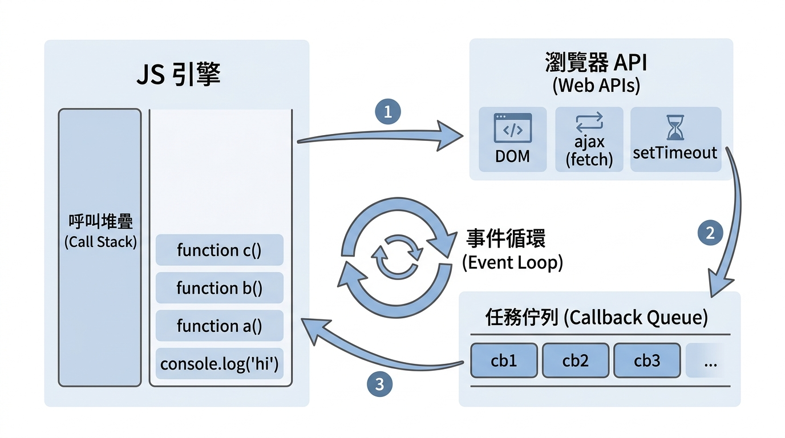

---
mdx:
  format: md
---

> 課程：JavaScript 與 React 底層原理
> 第 7 堂：非同步 JavaScript

# 18 Event Loop 運作模型

想像你在一家只有一名廚師（JavaScript 引擎）的小餐館用餐。這名廚師非常厲害，但他有一個堅持：一次只能處理一件事。如果他在切洋蔥，他就不能同時翻炒鍋裡的飯。如果這時有一位客人點了一道需要燉煮 3 小時的湯，難道全餐廳的客人都得等這 3 小時，直到湯煮好廚師才能炒下一盤菜嗎？

顯然，這不是現代網頁運作的方式。當你點擊一個按鈕、發送一個網路請求或設定一個定時器時，網頁並不會因此卡死（Freeze）。這就引出了一個核心矛盾：**既然 JavaScript 是單執行緒（Single-threaded）的語言，它是如何同時處理這麼多「非同步」任務的？**

這一切神祕現象的背後，都指向同一個機制：**事件循環（Event Loop）**。

## 單執行緒的本質與非同步的必要性

在深入架構之前，我們必須先釐清一個關鍵事實：**JavaScript 引擎本身是單執行緒的。**

這意味著它只有一個 **Call Stack（呼叫堆疊）**。回想我們在 Topic 1 所學的內容，當一個函數被呼叫時，它會被推入 Call Stack 建立執行環境（Execution Context）；當函數執行完畢後，它會從堆疊中被彈出（Pop）。

### 阻塞（Blocking）的代價

如果所有的任務都是同步執行的，當我們執行一個耗時的操作（例如：從遠端伺服器下載 1GB 的資料，或者運行一個極其複雜的數學計算），Call Stack 就會被這個任務佔據。在該任務完成並彈出堆疊之前，引擎無法執行任何其他程式碼。

在瀏覽器環境中，這意味著：

- 使用者無法點擊任何按鈕。
- 畫面無法捲動。
- 動畫會卡在原地。
- 瀏覽器最終會跳出「網頁沒有回應」的警告。

這就是所謂的「阻塞」。為了避免這種糟糕的使用者體驗，JavaScript 必須具備處理非同步任務的能力。但請記住，非同步並不等於「並行（Parallelism）」。JavaScript 並沒有變出第二個廚師，它只是發明了一套極其精妙的**排程機制**。

## 非同步架構全貌：不僅僅是 JS 引擎

要理解非同步，你必須跳出「JavaScript 只有引擎」的思維。當我們在瀏覽器中運行 JavaScript 時，其實是在一個完整的**宿主環境（Host Environment）**中運行。

這個環境包含了幾個核心組件，它們共同協作完成了非同步任務的排程：

### 1. JavaScript 引擎 (JS Engine)

包含 **Call Stack**（處理同步任務執行）與 **Memory Heap**（儲存物件與變數）。它是我們那位專注的廚師，負責執行真正的程式碼邏輯。

### 2. Web APIs (瀏覽器提供的 API)

這是非同步魔法的真正來源。雖然 JS 引擎只有一個執行緒，但瀏覽器本身是多執行緒的。當你呼叫 `setTimeout`、`fetch` 或監聽 DOM 事件時，JS 引擎其實是把這些工作「發包」給了瀏覽器提供的 Web API。

- **Timer 執行緒**：負責倒數計時。
- **Network 執行緒**：負責處理 HTTP 請求。
- **Event 監聽執行緒**：負責監控滑鼠點擊、鍵盤輸入。

### 3. Callback Queue (或稱 Task Queue / Macrotask Queue)

這是一個「候選區」。當 Web API 完成了它的工作（例如：時間到了、資料下載完了），它會把預先註冊好的 **Callback 函數（回呼函數）** 丟進這個佇列中排隊，等待被執行。

### 4. Event Loop (事件循環)

它是整個系統的「交通警察」或「調度員」。它唯一的工作就是：**不斷檢查 Call Stack 是否為空。** 如果 Stack 是空的，它就會去 Callback Queue 看看有沒有人在排隊；如果有，就將排在第一位的任務推入 Stack 執行。



> *JavaScript 非同步架構示意圖：JS 引擎負責執行，Web API 負責等待，Event Loop 負責調度。*

## Event Loop 的輪詢機制：規則只有一個

很多人誤以為 Event Loop 會在非同步任務完成的瞬間就執行它。這是錯的。

Event Loop 的運作邏輯非常嚴謹，可以簡化為以下的無限迴圈：

1. **檢查 Call Stack**：目前的堆疊裡還有函數在執行嗎？
2. **如果堆疊不為空**：Event Loop 什麼都不做，靜靜等待堆疊清空。這就是為什麼「同步程式碼永遠優先於非同步程式碼」。
3. **如果堆疊為空**：Event Loop 會去查看 **Callback Queue**。
4. **取出任務**：如果 Queue 裡有任務，取走第一個（最舊的）任務，並將其對應的執行環境推入 Call Stack。
5. **回到步驟 1**。

這個機制保證了 JavaScript 的執行完整性（Run-to-completion）：一旦一個函數開始在 Stack 中執行，它就不會被 Event Loop 的其他任務中斷，直到它完全執行完畢。

## 具體範例：穿梭在 Stack、API 與 Queue 之間

讓我們用一段經典的程式碼來追蹤這個過程。請先預測這段程式碼的輸出結果：

```javascript
console.log('1: 餐廳開張');

setTimeout(() => {
  console.log('2: 燉湯好了（這是一個 Callback）');
}, 0);

console.log('3: 廚師繼續炒菜');
```

即使 `setTimeout` 的延遲時間設定為 `0` 毫秒，輸出的順序依然是：

1. `1: 餐廳開張`
2. `3: 廚師繼續炒菜`
3. `2: 燉湯好了（這是一個 Callback）`

為什麼？讓我們拆解每一毫秒發生的事情：

### 第一步：執行第一行

`console.log('1: 餐廳開張')` 被推入 Call Stack。螢幕印出文字。執行完畢後，該函數立即從 Stack 彈出。

### 第二步：遇到 setTimeout

`setTimeout` 被推入 Call Stack。

- **關鍵點**：JS 引擎發現這是一個 Web API 調用。它告訴瀏覽器：「嘿，幫我啟動一個計時器，延遲 0ms。時間一到，請把這個 `() => { console.log('2...') }` 函數丟進 Callback Queue。」
- 計時器被交給瀏覽器的 Timer 執行緒處理，`setTimeout` 本身就從 Call Stack 彈出消失了。

### 第三步：執行第三行

這時計時器可能已經在 0.0001ms 內完成了，但 Event Loop 正在檢查 Stack——發現 Stack 不為空（因為正在執行第三行 `console.log('3...')`）。

- 螢幕印出 `3: 廚師繼續炒菜`。
- 執行完畢後，第三行從 Stack 彈出。

### 第四步：Stack 清空，Event Loop 出動

此時同步程式碼全部執行完畢，Call Stack 變回空的狀態。

- Event Loop 偵測到 Stack 為空。
- 它轉向 Callback Queue，發現裡面有一個「燉湯好了」的回呼函數在排隊。
- Event Loop 將該函數推入 Call Stack。

### 第五步：執行回呼函數

`console.log('2...')` 終於在 Stack 裡執行，印出文字。最後彈出，結束。

---

### 為什麼 setTimeout(0) 不是真的 0？

這個範例揭示了一個重要的觀念：`**setTimeout**`** 的延遲時間，代表的是「最快何時可以將任務放入 Queue」，而非「何時會執行任務」。**

如果你的同步程式碼（例如一個執行 10 億次的 `for` 迴圈）佔據了 Call Stack 達 5 秒之久，那麼即便你設了 `setTimeout(..., 0)`，這個回呼函數也必須乖乖在 Queue 裡等 5 秒，直到 Stack 完全被清空為止。

## 深入探究：當 Callback Queue 變長時

為了確保你真正理解了非同步並非並行，我們來看一個更極端的例子。

### 思考題：誰先執行？

```javascript
function heavyComputation() {
  const start = Date.now();
  while (Date.now() - start < 5000) {
    // 模擬一個耗時 5 秒的同步計算
  }
  console.log('耗時計算完成');
}

setTimeout(() => console.log('非同步定時器 1 (1s)'), 1000);
setTimeout(() => console.log('非同步定時器 2 (0s)'), 0);

heavyComputation();

console.log('主程式結束');
```

**執行分析：**

1. 兩個 `setTimeout` 被呼叫。瀏覽器開始計時（一個倒數 1 秒，一個立即到期）。
2. `heavyComputation()` 被推入 Stack。接下來的 5 秒鐘，JS 引擎（那位廚師）發瘋似地在切洋蔥，**Call Stack 被完全佔用**。
3. 在這 5 秒期間：
  - 0ms 時，定時器 2 任務進入 Callback Queue 排隊。
- 1000ms 時，定時器 1 任務也進入 Callback Queue 排隊。
- **此時 Queue 裡有兩個任務，但 Event Loop 發現 Stack 還沒清空，所以什麼都不能做。**
4. 5 秒後，`heavyComputation` 結束，印出「耗時計算完成」並彈出 Stack。
5. 接著執行 `console.log('主程式結束')` 並彈出。
6. **現在 Stack 終於空了！** Event Loop 依序將 Queue 裡的任務搬上 Stack。

**最終輸出順序：**

1. (等待 5 秒...)
2. `耗時計算完成`
3. `主程式結束`
4. `非同步定時器 2 (0s)`
5. `非同步定時器 1 (1s)`

這個例子告訴我們：**非同步任務永遠無法打斷正在執行中的同步任務。** 這就是為什麼在處理複雜運算時，我們需要使用 `Web Workers`（真正的多執行緒）或將任務切碎，否則 Event Loop 會被卡死，導致 UI 完全失去回應。

## 為什麼這與 React 有關？

你可能會問：「這跟我開發 React 有什麼關係？」

事實上，React 的演進史就是一部與 Event Loop 搏鬥的歷史。
在 React 16 以前的 **Stack Reconciler**，當 React 開始更新 DOM 時，它會像 `heavyComputation` 一樣遞迴地執行，直到整棵樹更新完畢才會讓出 Call Stack。如果組件樹很大，就會造成明顯的卡頓。

而 React 16 之後引入的 **Fiber 架構**，核心思想就是「可中斷的渲染」。React 透過內部的調度器，會主動觀察 Event Loop 的狀態。如果發現執行太久了，React 會暫停目前的渲染，把控制權交還給瀏覽器（讓出 Call Stack），好讓瀏覽器去處理點擊事件或動畫。等瀏覽器忙完了，Event Loop 會再把 React 剩下的渲染任務推回 Stack 繼續執行。

理解了 Event Loop 的輪詢與非阻塞特性，你才能真正體會到為什麼 React 要設計得這麼複雜，以及為什麼 `useEffect` 的執行時機總是排在渲染之後。

## 總結與銜接

在本小節中，我們拆解了 JavaScript 非同步執行的黑盒子：

- **JS 引擎是單執行緒的**：一次只能處理一個 Call Stack。
- **非同步是由宿主環境（瀏覽器）支援的**：Web API 負責處理耗時的等待。
- **Event Loop 是調度核心**：它唯一的條件是 **「Call Stack 必須為空」**，才會從 Callback Queue 搬運任務。
- **非同步不是並行**：它是任務的「排程執行」。

### 承上啟下

我們目前討論的 Callback Queue 裡存放的任務（如 `setTimeout`、DOM 事件），在規範中被正式稱為 **Macrotask（巨任務）**。

但是，並非所有的非同步任務都享有同樣的待遇。在現代 JavaScript 中，還有一類任務叫做 **Microtask（微任務）**，最典型的例子就是 **Promise**。微任務的優先級比巨任務高得多——高到可以在 Event Loop 輪詢的間隙中「插隊」。

在下一個部分，我們將深入探討 Microtask 與 Macrotask 的愛恨情仇，這將幫助你精確預測 Promise 鏈的執行順序，並理解 React 狀態更新的批次處理（Batching）底層邏輯。

## 重點回顧與自我檢測

1. **為什麼 **`**setTimeout(fn, 0)**`** 不會立即執行？**
  - 因為它會被放入 Callback Queue。根據 Event Loop 規則，必須等到 Call Stack 中所有的同步程式碼（主執行環境）執行完畢且清空後，才會去執行 Queue 裡的任務。
2. **什麼是阻塞（Blocking）？在單執行緒中如何發生？**
  - 當 Call Stack 被一個耗時很長的同步任務佔據時，JS 引擎無法處理後續的程式碼，Event Loop 也無法從 Queue 中取出新任務（如 UI 事件），導致程式失去回應。
3. **瀏覽器中的 JavaScript 執行環境包含哪些主要部分？**
  - JS 引擎（Stack & Heap）、Web APIs、Callback Queue、Event Loop。
4. **如果同步任務正在執行，Event Loop 會如何處理已經到期的非同步回呼？**
  - Event Loop 會繼續監控 Stack，直到 Stack 清空為止。到期的回呼函數會持續在 Callback Queue 中排隊等待。
