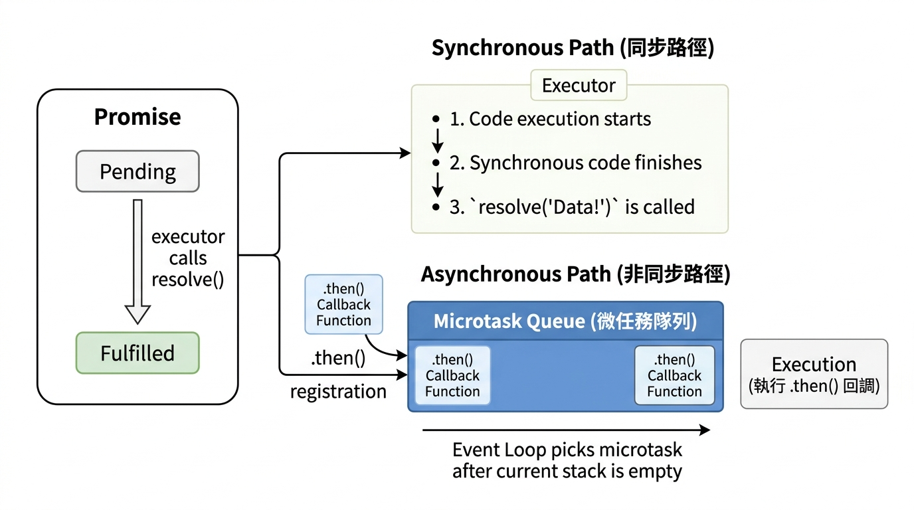

---
mdx:
  format: md
---

> 課程：JavaScript 與 React 底層原理
> 第 7 堂：非同步 JavaScript

# 20 Promise 底層原理

在上一節中，我們觀察到 `Promise.then` 的回調函數會進入 Microtask Queue（微任務佇列），優先級高於 `setTimeout`。但你有沒有想過，Promise 內部到底是怎麼「記住」那些回調函數，又是如何在正確的時機觸發它們的？

如果我們把非同步操作想像成一場「未知的旅程」，那麼 Promise 就像是一份**具有法律效力的合約**。這份合約保證了無論旅程結果如何，它都會給你一個明確的答覆。這一節我們將拆解這個「合約容器」的內部構造，理解它如何管理狀態，以及為何 `.then` 能夠無限鏈式呼叫。

---

## 狀態機：Promise 的三種契約狀態

Promise 的本質是一個**狀態機（State Machine）**。它存在的目的，就是封裝一個非同步操作的最終結果（成功或失敗）。在任何時間點，一個 Promise 必定處於以下三種狀態之一：

1. **Pending（進行中）**：這是初始狀態。操作尚未完成，合約還沒兌現。
2. **Fulfilled（已成功）**：操作成功完成。此時 Promise 會持有最終的「值（Value）」。
3. **Rejected（已失敗）**：操作發生錯誤或失敗。此時 Promise 會持有失敗的「原因（Reason）」。

### 關鍵特性：不可逆性（Immutability）

這是 Promise 設計中最核心的原則：**狀態一旦從 Pending 轉變為 Fulfilled 或 Rejected，就永遠固定，再也無法更改。**

想像你向餐廳點了一份牛排：

- 剛點完餐，你的訂單處於 **Pending**。
- 主廚把牛排端上桌，狀態變為 **Fulfilled**。這時候，廚房不能突然衝出來把牛排搶走，說「抱歉，其實這單失敗了」。
- 如果廚房失火了，服務生告訴你「沒牛排了」，狀態變為 **Rejected**。這時候，即便火滅了，這張訂單也不會奇蹟般地變回 Pending 或 Fulfilled。

這種設計避免了傳統 Callback 模式中，回調函數可能被多次呼叫或在錯誤時機呼叫的混亂情況。

---

## Executor：誰說 Promise 是非同步的？

這是一個非常經典的面試陷阱題。請觀察以下程式碼，並預測列印順序：

```javascript
console.log('1. 開始執行');

const promise = new Promise((resolve, reject) => {
  console.log('2. 進入 Executor');
  resolve('成功的值');
  console.log('3. resolve 之後的程式碼');
});

promise.then((val) => {
  console.log('4. 收到結果：', val);
});

console.log('5. 結束執行');
```

如果你預測的順序是 `1 -> 2 -> 3 -> 5 -> 4`，恭喜你，你已經掌握了關鍵。

### Executor 是同步執行的

在 `new Promise((resolve, reject) => { ... })` 中傳入的那個函數被稱為 **Executor（執行器）**。**它是同步執行的。**

當 JS 引擎執行到 `new Promise` 時，會立即呼叫這個 Executor 函數。這非常符合邏輯：如果你不立即開始執行非同步任務（例如發送 API 請求），那麼 Promise 就無從得知任務何時開始。

### 為什麼「4」排在最後？

雖然 `resolve('成功的值')` 在「3」之前就呼叫了，但「4」（也就是 `.then` 裡面的內容）卻排在最後。這是因為：

1. 呼叫 `resolve()` 的作用是**修改 Promise 的內部狀態**（從 Pending 變為 Fulfilled）。
2. 狀態變更後，Promise 會將 `.then` 註冊的回調函數**排入 Microtask Queue**。
3. 根據我們學過的 Event Loop，必須等到 Call Stack（同步程式碼）完全清空後，才會去執行微任務。



> *Promise 的狀態轉換會驅動回調函數進入微任務佇列*

---

## 深度拆解：.then 的鏈式呼叫（Chaining）

Promise 最令人著迷（也最難理解）的特性就是鏈式呼叫：`promise.then().then().catch()...`。要理解為什麼可以一直 `.then` 下去，我們必須記住一個金科玉律：

`**.then()**`** 方法永遠會回傳一個「全新的 Promise 物件」。**

這個新 Promise 的狀態，取決於前一個 `.then` 回調函數的執行結果。我們來看看三種常見場景：

### 1. 回傳一個普通值

如果 `.then` 的回調函數回傳一個數字、字串或物件，新 Promise 會立即變為 **Fulfilled**，並將該值傳遞給下一個 `.then`。

```javascript
const p1 = Promise.resolve(10);

const p2 = p1.then(val => {
  return val * 2; // 回傳普通值 20
});

p2.then(finalVal => console.log(finalVal)); // 印出 20
```

### 2. 回傳另一個 Promise

如果回調函數回傳的是另一個 Promise（我們稱為 `pInner`），那麼 `.then` 回傳的那個新 Promise 會**「鎖定（Lock-in）」**到 `pInner` 的狀態。它會等待 `pInner` 完成，並吸收它的結果。

這是解決 **Callback Hell** 的關鍵。它讓非同步操作可以像排隊一樣，一個接一個地執行，而不是嵌套在一起。

```javascript
fetch('/user')
  .then(res => res.json()) // json() 回傳一個 Promise
  .then(user => fetch(`/posts/${user.id}`)) // 再次回傳一個 Promise
  .then(posts => console.log(posts));
```

### 3. 拋出錯誤（Throw Error）

如果回調函數中發生錯誤（或是你手動 `throw`），新 Promise 會變為 **Rejected**。

```javascript
const p1 = Promise.resolve('ok');

p1.then(val => {
  throw new Error('壞掉了');
}).catch(err => {
  console.log(err.message); // 印出 "壞掉了"
});
```

---

## 動手實作：一個簡化版的 Promise 骨架

為了讓你徹底理解，我們來模擬一下 Promise 內部的樣子。雖然真正的 Promise 是 C++ 實作的，但我們可以用 JS 寫出它的邏輯原型：

```javascript
class MySimplePromise {
  constructor(executor) {
    this.state = 'pending'; // 初始狀態
    this.value = undefined; // 成功的值
    this.reason = undefined; // 失敗的原因
    this.onFulfilledCallbacks = []; // 暫存待執行的 .then 回調

    const resolve = (value) => {
      if (this.state === 'pending') {
        this.state = 'fulfilled';
        this.value = value;
        // 這裡會觸發微任務（簡化版先用同步模擬）
        this.onFulfilledCallbacks.forEach(fn => fn());
      }
    };

    const reject = (reason) => {
      if (this.state === 'pending') {
        this.state = 'rejected';
        this.reason = reason;
        // 觸發失敗回調...
      }
    };

    try {
      executor(resolve, reject);
    } catch (err) {
      reject(err);
    }
  }

  then(onFulfilled) {
    // 實際上這裡會回傳一個 new MySimplePromise
    if (this.state === 'fulfilled') {
      onFulfilled(this.value);
    } else if (this.state === 'pending') {
      this.onFulfilledCallbacks.push(() => onFulfilled(this.value));
    }
    return this; // 簡化版直接回傳 self 以支持鏈式
  }
}
```

這個骨架展示了兩件事：

1. **收集依賴**：當 Promise 還是 Pending 時呼叫 `.then`，回調函數會被存進一個陣列（`onFulfilledCallbacks`）。
2. **觸發更新**：當 `resolve` 被呼叫時，我們會遍歷這個陣列並執行所有回調。

---

## 靜態方法預覽：集體行動的 Promise

在實戰中，我們經常需要同時處理多個 Promise。JS 提供了幾個強大的靜態方法：

- **`Promise.all([p1, p2, p3])`**：
  - **「全拿或全不拿」**。只有當所有 Promise 都成功時，它才會回傳所有結果組成的陣列。只要有一個失敗，整個 `Promise.all` 就會立即變成 Rejected。
- *應用場景：* 一次初始化頁面所需的三個獨立 API。
- **`Promise.race([p1, p2, p3])`**：
  - **「賽跑模式」**。誰最快完成（無論成功或失敗），結果就跟誰走。
- *應用場景：* 給 API 請求設置超時（超時 Promise vs. 資料請求 Promise）。
- **`Promise.allSettled([p1, p2])`**：
  - 不管成功或失敗，等到所有人都「塵埃落定（Settled）」才回傳。它會給你一個包含每個任務結果狀態的陣列。

---

## 總結：從 Callback 到「狀態容器」

Promise 的出現徹底改變了 JavaScript 處理非同步的方式。它不只是減少了縮排（Indentation），更重要的是它**將非同步操作物件化了**。

- **以前**：我們傳入一個回調函數，然後「祈禱」對方會在正確的時候呼叫它。
- **現在**：非同步函數回傳一個 Promise 物件。我們可以把這個物件傳給任何人，大家都可以透過 `.then` 來訂閱它的結果。這就是所謂的「關注點分離」。

Promise 透過明確的**三種狀態**和**微任務機制**，建立了一套可預測的執行模型。這也為我們下一節要討論的 **async/await** 鋪平了道路——你會發現，那層優雅的同步語法糖下，依然跳動著 Promise 的心臟。

### 重點複習：

- Promise 的三種狀態：Pending, Fulfilled, Rejected。
- 狀態轉變是**不可逆**的。
- `new Promise` 裡的 **Executor 是同步執行**的。
- `.then` 總是回傳一個 **新的 Promise**，這是鏈式呼叫的基礎。
- 狀態改變後，回調函數會進入 **Microtask Queue** 等待執行。

在接下來的章節中，我們將看看如何使用 `async` 與 `await` 讓這些鏈式呼叫變得更加直覺，就像寫同步程式碼一樣輕鬆。
