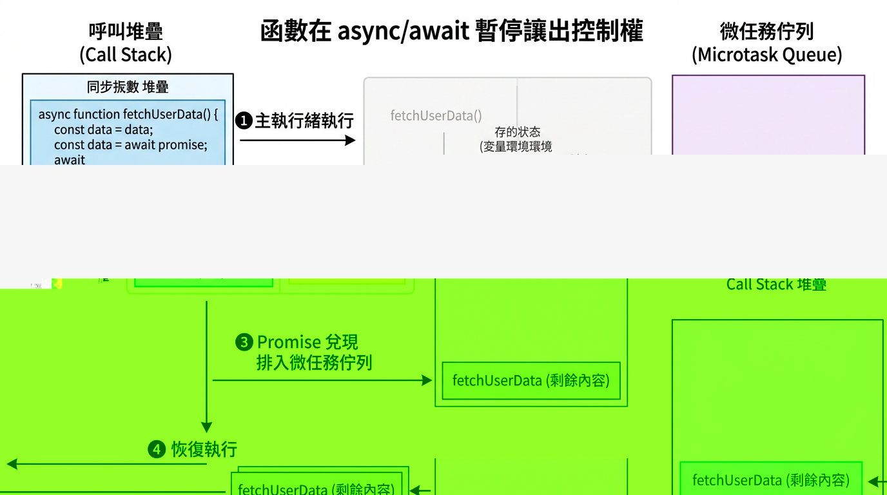

---
mdx:
  format: md
---

> 課程：JavaScript 與 React 底層原理
> 第 7 堂：非同步 JavaScript

# 21 async/await 與錯誤處理

想像一下，如果你可以讓非同步的程式碼讀起來跟同步的一樣順暢，不用再寫一長串的 `.then()`，也不用在腦中不斷追蹤那些嵌套的匿名函數。這就是我們今天要探討的 `async/await`。

在上一節中，我們學會了 Promise 的鏈式呼叫，雖然它解決了「回調地獄（Callback Hell）」，但連續的 `.then()` 在複雜邏輯下依然顯得瑣碎，程式碼看起來像是一條長長的輸送帶，而不是我們習慣的線性邏輯。

這引出了一個關鍵問題：**有沒有一種方式，能讓我們享受非同步的「不阻塞」優勢，同時保有同步程式碼的「線性閱讀感」？**

## async 關鍵字：Promise 的隱形包裝

首先，我們要理解 `async` 這個關鍵字的本質。在 JavaScript 中，一旦你在函數定義前加上 `async`，你就是在告訴引擎：這是一個**非同步函數**。

但「非同步函數」最核心的特性不在於它怎麼執行，而是在於它**回傳什麼**。

### 永遠回傳 Promise

一個 `async` 函數的回傳值永遠會被封裝成一個 Promise 物件。即使你在函數內部回傳一個普通的數字、字串或物件，JavaScript 引擎都會自動用 `Promise.resolve()` 將其包裝起來。

請看以下兩個函數的對比：

```javascript
// 寫法 A：傳統 Promise
function getNumberA() {
  return Promise.resolve(42);
}

// 寫法 B：使用 async
async function getNumberB() {
  return 42; 
}

console.log(getNumberA()); // Promise { <fulfilled>: 42 }
console.log(getNumberB()); // Promise { <fulfilled>: 42 }
```

這兩者在功能上是完全等價的。這意味著，如果你呼叫一個 `async` 函數，你永遠不能直接拿到裡面的值，你必須透過 `.then()` 或另一個 `await` 來取得它。

### 為什麼要這樣設計？

這種設計確保了 `async` 函數的調用者始終能以統一的方式（Promise 介面）來處理結果。它建立了一個穩固的約定：只要看到 `async`，就知道結果是異步的，必須做好「等待」的準備。

---

## await 的魔法：暫停與讓出主權

如果 `async` 是包裝，那麼 `await` 就是這個語法糖的靈魂。很多人對 `await` 的誤解是「它會阻塞程式碼執行」，但事實恰恰相反——它會**暫停**函數內部的執行，並**讓出**主執行緒。

### 拆解 await 的運作流程

當 JavaScript 引擎執行到 `async` 函數內部的 `await` 關鍵字時，會發生以下極其精妙的事情：

1. **暫停執行**：該函數目前的執行環境（Execution Context）會被暫停。
2. **封裝剩餘內容**：`await` 之後的所有程式碼（包括該行賦值的動作），本質上都會被包進一個隱形的 `.then()` 回調函數中。
3. **讓出主權（Yielding）**：函數會立即回傳一個 Pending 狀態的 Promise 給呼叫者，並將該 `async` 函數從 Call Stack 中彈出。這意味著主執行緒（Main Thread）現在自由了，可以去處理其他的任務（例如渲染畫面或處理使用者點擊）。
4. **排入微任務**：當 `await` 後方的 Promise 狀態變更（fulfilled）後，之前被「封裝」的剩餘程式碼會被排入 **Microtask Queue（微任務佇列）**。
5. **恢復執行**：當 Call Stack 再次清空，且 Event Loop 輪詢到這個微任務時，該函數會重新回到 Call Stack 中，從暫停的地方繼續執行。

讓我們用一個具體的範例來追蹤這個過程：

```javascript
async function showWorkflow() {
  console.log("1. 函數開始執行");
  
  const result = await Promise.resolve("2. 非同步資料回傳");
  
  console.log(result);
  console.log("3. 函數執行完畢");
}

console.log("--- 全域開始 ---");
showWorkflow();
console.log("--- 全域結束 ---");
```

**預測一下，印出的順序是什麼？**

如果你理解了「讓出主權」的概念，你會發現正確順序是：

1. `--- 全域開始 ---`
2. `1. 函數開始執行`
3. `--- 全域結束 ---` （因為函數在 await 處暫停並回傳了，主線程繼續往下走）
4. `2. 非同步資料回傳` （Promise 完成，微任務執行）
5. `3. 函數執行完畢`

### await 如何改變執行流程

為了幫助你理解 `await` 如何在單執行緒的環境下實現「暫停與恢復」，我們來看這張流程圖：



> *這張圖展示了 *`*await*`* 絕非阻塞主執行緒，而是優雅地暫停自己，讓瀏覽器有機會去處理其他更緊急的事情（如 UI 互動），等到資料準備好後再透過微任務佇列悄悄回來。*

---

## 錯誤處理：回歸經典的 try/catch

在 Promise 的時代，我們必須使用 `.catch()` 來捕捉錯誤。當非同步邏輯變得複雜（例如：步驟 A 成功後做 B，B 失敗後做 C...），`.catch()` 的位置往往會讓人感到困惑。

`async/await` 最大的貢獻之一，就是讓**非同步錯誤處理**回歸到我們最熟悉的 `try/catch` 語法。

### 在 async 函數中使用 try/catch

當你 `await` 一個 Promise 時，如果該 Promise 被拒絕（rejected），它會像拋出一個同步異常一樣，直接進入 `catch` 區塊。

```javascript
async function fetchData() {
  try {
    const user = await fetchUser(1); // 如果這裡失敗
    const posts = await fetchPosts(user.id); // 或者這裡失敗
    return posts;
  } catch (error) {
    // 兩者中任一個失敗，都會在這裡被捕捉
    console.error("抓取資料時發生錯誤：", error);
  } finally {
    console.log("請求嘗試結束");
  }
}
```

這種寫法有兩個明顯的優勢：

1. **範圍統一**：你可以用一個 `try/catch` 包裹多個 `await` 操作，處理邏輯更加集中。
2. **混合處理**：`try/catch` 同時能捕捉到同步的程式碼錯誤（例如 `JSON.parse` 失敗）與非同步的 Promise rejection，這在以前必須混合使用 `.catch()` 與 `try/catch`。

### 未捕捉的異常（Unhandled Rejections）

如果你在 `async` 函數中沒有寫 `try/catch`，且內部的 Promise 被 rejected 了，這個錯誤會像同步錯誤一樣向上冒泡。

由於 `async` 函數回傳的是 Promise，這意味著這個「異常」最終會變成該回傳 Promise 的 rejection。如果最外層也沒有處理，瀏覽器會觸發全域的 `unhandledrejection` 事件。

**面試小提醒**：在實務開發中，我們強烈建議在關鍵的 `async` 操作周圍加上 `try/catch`，或者確保在調用該 `async` 函數的地方有 `.catch()` 處理，以防止程式無預警崩潰。

---

## 程式碼對比：從鏈式到線性

讓我們透過一個真實的場景來感受 `async/await` 的優越性：假設我們要先驗證使用者，再根據權限抓取檔案，最後解析檔案內容。

### 寫法 A：Promise 鏈式呼叫

```javascript
function processFile(userId) {
  validateUser(userId)
    .then(user => {
      if (user.isAdmin) {
        return fetchAdminFile(user.id);
      } else {
        return fetchUserFile(user.id);
      }
    })
    .then(file => {
      return parseContent(file);
    })
    .then(content => {
      console.log("解析成功：", content);
    })
    .catch(err => {
      console.error("處理失敗：", err);
    });
}
```

雖然這已經比 Callback 好很多，但邏輯被 `.then()` 切碎了。如果我們想在最後一個 `.then()` 裡存取第一個 `.then()` 的 `user` 變數，還得透過外層變數或傳遞物件來實現，非常麻煩。

### 寫法 B：async/await 線性寫法

```javascript
async function processFile(userId) {
  try {
    const user = await validateUser(userId);
    
    // 邏輯直接橫向展開，變數 user 可以在後續自由存取
    const file = user.isAdmin 
      ? await fetchAdminFile(user.id) 
      : await fetchUserFile(user.id);
    
    const content = await parseContent(file);
    console.log("解析成功：", content);
    
  } catch (err) {
    console.error("處理失敗：", err);
  }
}
```

這就是我們追求的**線性閱讀感**。程式碼的層級變淺了，邏輯分支一目瞭然，變數的作用域也變得直觀。

---

## 總結：它是糖，但也是結構化非同步的基礎

在這一部分中，我們拆解了 `async/await` 的語法設計。請記住，它並未改變 JavaScript 的非同步本質。

- `**async**` 確保函數回傳 Promise。
- `**await**` 是一個「優雅的暫停鍵」，它利用微任務（Microtask）機制將後續程式碼排入 Event Loop。
- `**try/catch**` 讓非同步錯誤處理變得如同同步程式碼般直覺。

這種語法糖之所以強大，是因為它在底層極大化地利用了我們在前兩節學到的 Event Loop 與 Microtask 知識。當你在寫 `await` 時，你其實是在告訴引擎：「請幫我把剩下的程式碼放進微任務佇列，等這個承諾兌現後再幫我執行」。

### 為何這對 React 如此重要？

在 React 的世界裡，我們經常需要在 `useEffect` 中執行非同步請求，或者在點擊事件中等待 API 回傳。理解 `await` 如何讓出主執行緒，對於理解為什麼 React 可以在資料載入時依然保持 UI 響應（或者為何有時會發生狀態更新的 Stale Closure）至關重要。

## 承上啟下

掌握了 `async/await` 與錯誤處理，我們已經完整拼湊出了 JavaScript 非同步執行架構的拼圖。現在，我們對 Call Stack、Web APIs、Task Queue、Microtask 以及 Promise 都有了深刻的理解。

在下一個（也是 Topic 4 的最後一個）部分中，我們將把這些看似抽象的底層知識，直接連結到 **React 的調度系統（Scheduler）**。我們會探討 React 為何不直接用 `setTimeout(0)` 或 `Promise.then` 來安排渲染，而是選擇了 `MessageChannel`？以及這些非同步機制是如何支撐起 React 的「自動批次更新（Batching）」與「時間切片（Time Slicing）」的。準備好了嗎？讓我們進入最後的整合視角！
