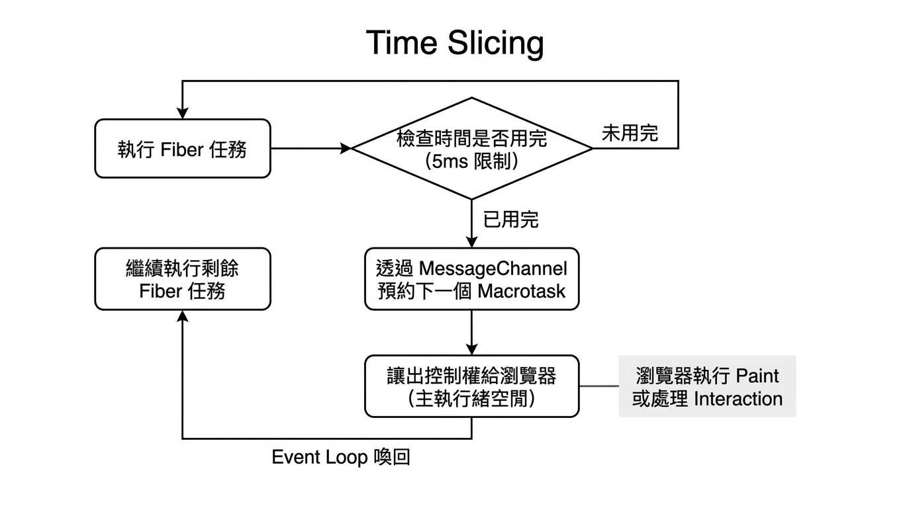

---
mdx:
  format: md
---

> 課程：JavaScript 與 React 底層原理
> 第 7 堂：非同步 JavaScript

# 22 Event Loop 與 React 調度

我們已經深入探討了 JavaScript 的非同步機制——從 Call Stack 的同步執行，到 Microtask 的插隊特權，再到 `async/await` 的語法糖。現在，是時候揭開這門課最核心的謎底：**React 究竟是如何利用這些底層工具，將「單執行緒」的 JavaScript 轉化為一個能夠處理複雜互動、甚至支援「可中斷渲染」的強大框架？**

許多開發者知道 React 16 之後有了 Fiber 架構，也聽說過 Concurrent Mode（並行模式），但往往對其背後的調度邏輯感到模糊。其實，React Scheduler 的精髓就隱藏在 Event Loop 的每一輪輪詢之間。

## 為什麼 React 需要自己的調度器？

在深入技術細節前，我們先來思考一個問題：為什麼我們不能直接讓 JavaScript 執行渲染？

傳統的 Web 開發中，如果你有一個包含一萬個節點的列表需要更新，JavaScript 會在 Call Stack 中佔用極長的時間進行遞迴運算。根據我們在 4.1 學到的知識，只要 Call Stack 不為空，Event Loop 就無法處理其他的 Macrotask（如點擊事件）或讓瀏覽器進行渲染（Paint）。這就是所謂的「掉幀」——使用者點擊按鈕沒反應，畫面凍結。

React 的解決方案是：**不要一次做完所有事。**

React 將大的更新任務拆解成無數個微小的「工作單元（Fiber Nodes）」，並利用 Event Loop 的間隙來執行。如果時間不夠了，它會主動「讓出控制權（Yield）」給瀏覽器，處理完緊急的 UI 互動後再回來繼續。這種機制被稱為「時間切片（Time Slicing）」。

## MessageChannel vs setTimeout：尋找完美的「讓出時機」

為了實現時間切片，React 需要一種方式來告訴 Event Loop：「我現在要做一點點工作，做完之後請讓我排在隊伍後面，先讓瀏覽器處理互動，等一下再叫我回來。」

你可能會直覺地想到 `setTimeout(fn, 0)`。但在 React Scheduler 的原始碼中，你會發現它最終選擇了 `MessageChannel`。這背後有兩個極為關鍵的技術考量：

### 1. 嵌套延遲的 4ms 魔咒

根據 W3C 規範與各家瀏覽器的實作，當 `setTimeout` 的嵌套層數超過 5 層時，瀏覽器會強制設定最小 4ms 的延遲。

雖然 4ms 看起來很短，但對於需要精確控制渲染時間（通常每幀只有 16.6ms）的 React 來說，這是巨大的浪費。如果一個大的更新被拆成 100 個小任務，光是 `setTimeout` 產生的強制等待時間就高達 400ms，這會讓 UI 顯得異常遲鈍。

### 2. Macrotask 的本質與渲染時機

`MessageChannel` 的 `port.postMessage` 同樣會產生一個 **Macrotask**。為什麼 React 堅持要用 Macrotask 而不是 Microtask 來安排下一個工作單元？

- **如果使用 Microtask：** 我們在 4.2 學過，Event Loop 會在當前 Macrotask 結束後清空「所有」的微任務。這意味著如果你在微任務中不斷產生新的微任務（遞迴處理 Fiber 節點），Call Stack 依然會被長久佔用，瀏覽器根本沒機會進行渲染（Paint）。
- **如果使用 Macrotask（MessageChannel）：** 每次 `postMessage` 都會將任務排入 Callback Queue 的末端。根據 Event Loop 規則，在一輪 Macrotask 執行完後，瀏覽器有機會進行渲染，且其他使用者互動（如滑鼠點擊）的事件回調（也是 Macrotask）也有機會被插入執行。

`MessageChannel` 提供了接近 0ms 的延遲，且具備 Macrotask 的特性，完美符合 React 「執行一部分任務 -> 讓出主執行緒 -> 等待下一輪喚醒」的需求。

> **對於好奇的學生：** 為什麼不用 `requestAnimationFrame`？
> 雖然 `rAF` 與渲染頻率同步，但它的執行時機是在瀏覽器 Paint 之前。如果 React 任務太重，在 `rAF` 裡執行會直接導致該幀延遲 Paint。React 需要的是在「Paint 之後」的空閒時間做事，或者說，它需要更靈活的調度，而不僅僅是跟隨螢幕重新整理率。

## 自動批次更新（Automatic Batching）：微任務的妙用

雖然 React 的調度主要依賴 Macrotask 來實現時間切片，但它在處理「狀態更新」時，卻極度依賴 **Microtask**。這就是 React 18 廣受好評的「自動批次更新」底層機制。

想像你有以下代碼：

```javascript
const handleClick = () => {
  setCount(c => c + 1);
  setFlag(f => !f);
  // 同步代碼結束
};
```

在 React 18 中，這兩次 `setCount` 和 `setFlag` 不會觸發兩次渲染。React 是怎麼做到的？

1. 當你呼叫 `setState` 時，React 並不立即開始渲染，而是將更新物件推入一個「更新隊列（Update Queue）」。
2. React 會利用 `queueMicrotask` 或 `Promise.resolve().then()` 安排一個微任務。
3. 當 `handleClick` 這個同步函數執行完畢，Call Stack 清空，Event Loop 準備進入微任務階段。
4. 在這個微任務中，React 會一次性取出隊列中的所有更新，計算出最終狀態，然後**僅觸發一次** Virtual DOM 的比對與渲染。

**這發生在瀏覽器渲染（Paint）之前。** 這種設計確保了狀態更新的高效率，避免了中間狀態（如 Count 變了但 Flag 沒變）被呈現給使用者，保證了 UI 的一致性。

## 時間切片 (Time Slicing) 的實作邏輯

現在我們來整合所有知識，看看 Fiber 架構下最核心的 `workLoop` 是如何運作的。

React Scheduler 內部維護了一個大約 **5ms** 的時間片。它認為如果 JavaScript 運算超過 5ms，就應該暫停一下，看看有沒有更緊急的事情（如使用者輸入）要處理。

其虛擬碼邏輯如下：

```javascript
function workLoop(hasTimeRemaining, initialTime) {
  let currentTime = initialTime;
  
  // 遍歷每一個 Fiber 節點（工作單元）
  while (workInProgress !== null && !shouldYieldToHost()) {
    // 執行該節點的更新任務（beginWork/completeWork）
    workInProgress = performUnitOfWork(workInProgress);
  }

  // 如果工作沒做完，但 shouldYieldToHost() 回傳 true（時間到了）
  if (workInProgress !== null) {
    // 透過 MessageChannel 預約下一個 Macrotask，等一下回來繼續
    schedulePerformWorkUntilDeadline();
  }
}

function shouldYieldToHost() {
  const timeElapsed = getCurrentTime() - startTime;
  if (timeElapsed < frameInterval) { // frameInterval 預設為 5ms
    return false;
  }
  // 時間超過 5ms 了，主動讓出控制權
  return true;
}
```

這套機制讓 React 從「不可中斷的遞迴（Stack Reconciler）」進化到了「可中斷的循環（Fiber Reconciler）」。

### 時間切片流程圖

下圖展示了 React 如何與瀏覽器 Event Loop 協作完成一次長任務的調度：



> *React 時間切片流程：透過將長任務拆解並在 5ms 臨界點讓出控制權，確保瀏覽器能及時響應使用者與渲染畫面。*

## 深度對照：JS 原理與 React 設計決策

學習到這裡，你會發現 React 的每一項高級特性，其實都是對 JavaScript 非同步機制的精妙應用。下表總結了我們在 Topic 4 學到的 JS 原理如何支撐 React 的核心行為：

| JavaScript 原理 | 對應的 React 行為 / 設計決策 | 為什麼這樣設計？ |
| --- | --- | --- |
| **Call Stack 單執行緒** | **Fiber 架構與工作單元** | JS 一次只能做一件事，所以必須將渲染拆細，否則會阻塞主執行緒。 |
| **Macrotask (MessageChannel)** | **時間切片 (Time Slicing)** | 利用 Macrotask 之間會觸發「瀏覽器渲染」的特性，讓長任務不卡死 UI。 |
| **Microtask (Promise/queueMicrotask)** | **自動批次更新 (Batching)** | 在當前同步代碼執行完後、渲染前，快速合併所有狀態更新，減少渲染次數。 |
| **Event Loop 優先級** | **useEffect 的執行時機** | `useEffect` 是在 Commit Phase 結束並「讓出控制權」後的非同步回調，避免阻塞視覺呈現。 |
| **async/await / Generators** | **Concurrent Mode (並行模式)** | 利用「暫停與恢復」的概念，讓 React 能夠在處理低優先級任務時，被高優先級任務「插隊」。 |

## 為什麼這對你有意義？

身為開發者，理解這層連結能讓你從「寫 React」晉升到「調校 React」：

1. **解決效能瓶頸：** 當你發現畫面卡頓，你現在知道這不是因為 React 慢，而是因為你的某個同步計算（可能是資料轉換或大循環）過長，導致 React 無法在 5ms 內讓出控制權。
2. **理解 useEffect 的非同步性：** 你現在明白為什麼 `useEffect` 裡抓不到剛更新的 DOM 佈局（那是 `useLayoutEffect` 的事），因為它被排在了下一輪事件循環中。
3. **預測 Batching 行為：** 在 React 18 之前，在 `setTimeout` 裡的兩次 `setState` 不會合併；現在你知道 React 18 統一使用了微任務調度，所以無論在哪裡呼叫，都能享受批次更新的效能红利。

## 總結與銜接

在本章中，我們從最底層的 Event Loop 出發，一路登頂到了 React Scheduler 的設計精髓。非同步 JavaScript 不再只是面試常考的順序預測題，它是構建現代高效能 UI 框架的鋼骨結構。

到目前為止，我們已經完成了 **Topic 1 至 Topic 4** 的所有內容。你已經掌握了：

- **執行環境與作用域：** 程式碼在哪裡跑，變數去哪裡找。
- **閉包與記憶體：** Hooks 儲存狀態的祕密容器。
- **原型與物件：** JS 的委派哲學（這讓我們在 React 中不需要 Class）。
- **非同步與調度：** React 如何在單執行緒的世界裡，玩轉時間切片。

這四大支柱構成了 JavaScript 的核心。接下來，在我們正式踏入 React 的大門（Topic 6）之前，我們還需要一套現代化的武器——**Topic 5: ES6+ 現代語法精要**。我們將快速掃過解構賦值、展開運算子、箭頭函數等語法，這些不僅僅是「寫起來比較漂亮」，它們直接對應了 React 中的 Props 傳遞、不可變狀態更新與元件組合模式。

準備好了嗎？讓我們在進入複習階段前，先為這場非同步之旅畫下完美的句點。

## 課程銜接：Topic 4 總結

本部分正式完成了非同步 JavaScript 的教學。我們從宏觀的 Event Loop 模型出發，細化到微任務與巨任務的爭奪戰，最後落實到 React Scheduler 如何將這些底層機制轉化為流暢的使用者體驗。理解了「讓出控制權」與「批次更新」的原理後，你對 React 的理解已經超越了大多數只會使用 API 的開發者。

接下來，請進入 **Topic 4: Review** 階段，我們將透過幾個關鍵問題來測試你的理解深度。
