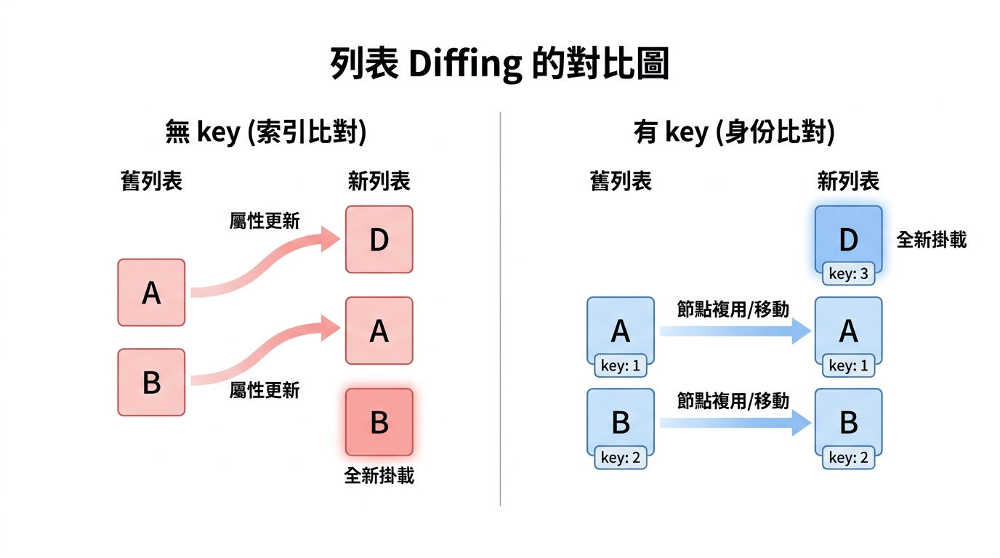

---
mdx:
  format: md
---

> 課程：JavaScript 與 React 底層原理
> 第 12 堂：Reconciliation 收尾與複習

# 37 key 的識別機制

在開發 React 列表時，你一定看過控制台噴出這條紅色的警告：「Each child in a list should have a unique 'key' prop.」。大多數開發者為了消掉警告，會直覺地塞進一個 `index` 或者資料的 `id`。但你是否曾經好奇過：為什麼 React 這麼執著於這個 `key`？如果我不給它，或者給錯了，除了警告之外，底層到底發生了什麼驚天動地的大事？

事實上，`key` 並不是給開發者看的標記，它是 React Reconciliation（協調）過程中的「導航地圖」。沒有這張地圖，React 在面對變動的列表時，就像是一個記憶力極差的搬運工，只能機械式地對號入座，這不僅會拖慢效能，更可能引發詭異的 UI Bug。

## 預設策略：由上而下的「逐位比對」

要理解 `key` 的價值，我們得先看看「沒有 `key`」（或是 React 退化到使用索引比對）時，它是怎麼運作的。

假設我們有一個簡單的任務列表，原本裡面有兩個元件：

1. `<Task name="學習 React" />`
2. `<Task name="健身" />`

現在，我們在列表的最**前方**插入了一個新任務：「吃早餐」。列表變成了：

1. `<Task name="吃早餐" />`
2. `<Task name="學習 React" />`
3. `<Task name="健身" />`

對於人類來說，這很明顯：只是原本的兩項往後移了，前面多了一項。但對於 React 的 Diffing 演算法（在沒有 `key` 的情況下）來說，它的邏輯是極度「死板」的：它會由上而下、一對一地比較同一個位置的節點。

### 慘烈的比對過程：

- **位置 0：** 發現原本是「學習 React」，現在變成了「吃早餐」。React 認為：「喔，這個節點內容變了，我要更新它。」
- **位置 1：** 發現原本是「健身」，現在變成了「學習 React」。React 認為：「喔，這個位置也變了，我要更新它。」
- **位置 2：** 發現原本沒東西，現在多了一個「健身」。React 認為：「喔，這是新來的，我要掛載（Mount）一個新元件。」

這就是所謂的 **Index-based Fallback（基於索引的退化方案）**。在這種模式下，React 並不知道「學習 React」這個元件其實只是「搬家」了，它會認為所有位置的內容都發生了位移後的「質變」。

這會導致兩個嚴重的後果：

1. **效能低落**：原本只需要新增一個 DOM 節點，現在卻導致所有現存的節點都需要觸發更新（Re-render）。
2. **狀態錯亂**：如果 `<Task />` 元件內部有一個輸入框（Input）或者 `useState` 記錄了「是否已勾選」，你會發現，當你在頂部插入新任務時，原本「學習 React」的勾選狀態竟然留在了第一個位置（現在變成了「吃早餐」），因為 React 認為位置 0 的元件沒變，只是 Props 變了。



> *當沒有 key 時，React 只能對號入座，導致不必要的更新；有了 key，React 就能追蹤元素的真實身份。*

## key 的本質：穩定的身份識別符

為了修正上述的問題，React 引入了 `key`。

你可以把 `key` 想像成每個 React Element 的「身分證字號」。當 React 進行 Diffing 時，它不再只看「這是在第幾個位置」，而是先問：「這一層級中，有沒有 `key` 等於某個值的節點？」

如果 React 發現新舊樹中存在相同的 `key`，它就會明白：**「雖然這傢伙在陣列中的位置變了，但它的靈魂（身份）還是同一個。」**

這就是為什麼我們強調 `key` 必須是**穩定**且**唯一**的。

- **穩定**：這張身分證不能每次渲染都換新的（例如用 `Math.random()`），否則 React 會以為每次都是全新的人。
- **唯一**：在同一群兄弟（Siblings）之間，不能有兩個人拿同一張證件，否則 React 會無法分辨誰是誰。

## 當身份改變：Unmount 與 State 的歸零

在上一堂課（7.3）中，我們學到如果一個節點的 `type` 從 `div` 變成 `span`，React 會直接銷毀整棵子樹。`key` 扮演了非常類似的角色。

如果一個元件的 `type` 沒變，但其 `key` 改變了，React 會發生什麼事？

**答案是：徹底重建。**

當 React 發現某個位置的 `key` 從 `A` 變成了 `B`，它會執行以下動作：

1. **觸發 Unmount**：舊的 `key="A"` 元件會被從 DOM 中移除，對應的 `useEffect` 清理函數會執行。
2. **丟棄 State**：該元件內部的所有 `useState`、`useReducer` 狀態會被徹底清空。
3. **重新 Mount**：根據 `key="B"` 建立一個全新的元件實例，並插入 DOM。

### 為什麼這很重要？

有時候這是一個「坑」，例如你誤用了會變動的 `key`，導致使用者在輸入框打字到一半，輸入框就突然消失又出現，內容全沒了。

但有時候這是一個「強大的特性」。例如，你有一個顯示使用者詳細資訊的元件 `<UserDetail />`。當切換不同的使用者 ID 時，你希望徹底重置該元件內部的所有 Loading 狀態與暫存資訊。這時，你只需要給它 `key={userId}`，React 就會在你換人時自動幫你把舊的狀態掃進垃圾桶，並給你一個乾淨的新元件。這比手動去清空五六個 `useState` 要優雅得多。

## 當位置改變：移動而非重建的藝術

現在回到那個「在開頭插入元素」的例子。如果我們給了正確的 `key`：

```javascript
// 舊
[
  <Task key="task-1" name="學習 React" />,
  <Task key="task-2" name="健身" />
]

// 新
[
  <Task key="task-3" name="吃早餐" />, // 新插入
  <Task key="task-1" name="學習 React" />, // key 一致，位置變了
  <Task key="task-2" name="健身" /> // key 一致，位置變了
]
```

當 React 進行比對時，它的邏輯會進化成：

1. 看位置 0：發現 `key="task-3"` 是新的，建立並掛載。
2. 尋找 `key="task-1"`：發現它在舊列表中存在，只是位置從 0 變到了 1。React 會**保留這個元件的 Fiber 節點與所有內部狀態**，僅僅是在 DOM 中將它移動到正確的位置。
3. 尋找 `key="task-2"`：同上，保留狀態，移動位置。

這就是 **穩定識別符** 的威力：React 能夠跨越陣列索引的限制，精準地找到「那個元件」。

### 深度剖析：React 如何實現「移動」？

在底層，React 在處理列表時，會先將舊的子節點放入一個以 `key` 為鍵（Key）的 **Map** 中。
當遍歷新列表時，React 會去這個 Map 裡面查詢是否有對應的 `key`。

- **Map 命中**：直接複用舊的 Fiber 節點，並標記為「需要移動」。
- **Map 未命中**：視為全新元素，進行建立。

這種機制讓列表的操作從 O(n²) 或 O(n) 的全量更新，變成了極其高效的節點遷移。

## key 的作用域：只要兄弟之間唯一即可

關於 `key`，有一個常見的誤解是「它必須全域唯一」。

其實不然。`key` 的作用範圍僅限於 **「同一個層級的兄弟節點（Siblings）」**。

考慮以下結構：

```javascript
<div>
  <section>
    <Item key="1" />
    <Item key="2" />
  </section>
  <aside>
    <Item key="1" /> {/* 這是合法的！ */}
    <Item key="3" />
  </aside>
</div>
```

在上面的例子中，兩個 `key="1"` 的元件並不會產生衝突。為什麼？因為 React 的 Reconciliation 是 **遞迴進行的**。
當 React 比對 `section` 的子節點時，它只會在 `section` 內部的陣列裡找 `key`；當它比對 `aside` 的子節點時，它是另一個獨立的任務。

這就像是：在一年甲班有一個「1 號」跟「2 號」，在一年乙班也有一個「1 號」跟「3 號」。只要你在點名時知道你在哪個班級，就不會叫錯人。只有在同一個班級（同一個父節點的 `children` 陣列）中出現兩個「1 號」時，React 才會陷入混亂，不知道該把誰的狀態傳給誰。

## 從 DOM 身份到渲染優化

總結來說，`key` 的識別機制是 React 高效更新的關鍵。它將原本模糊的「第幾個節點」轉變成了精確的「這個特定節點」。

我們學習了：

1. **Index-based Fallback**：沒有 `key` 時，React 被迫使用索引比對，這在列表重排時會導致效能災難與狀態錯誤。
2. **身份識別**：`key` 是穩定的身份識別符，幫助 React 追蹤「搬家」後的元件。
3. **生命週期控制**：改變 `key` 是主動觸發元件重置（Unmount/Mount）的最強手段。
4. **作用域**：`key` 只需要在同級兄弟間唯一，這與 React 的遞迴 Diffing 策略相吻合。

理解了 `key` 如何幫助 React 識別「是誰」之後，我們接下來要探討的是「什麼時候」更新。React 18 引入了一個非常強大的機制，叫做 **Automatic Batching**。它能讓我們在處理多個狀態更新時（例如在一個事件中多次呼叫 `setState`），不需要擔心多次冗餘的渲染，而是聰明地「批次處理」。

讓我們進入下一個部分，看看 React 18 是如何利用微任務（Microtask）來優化渲染時機的。
