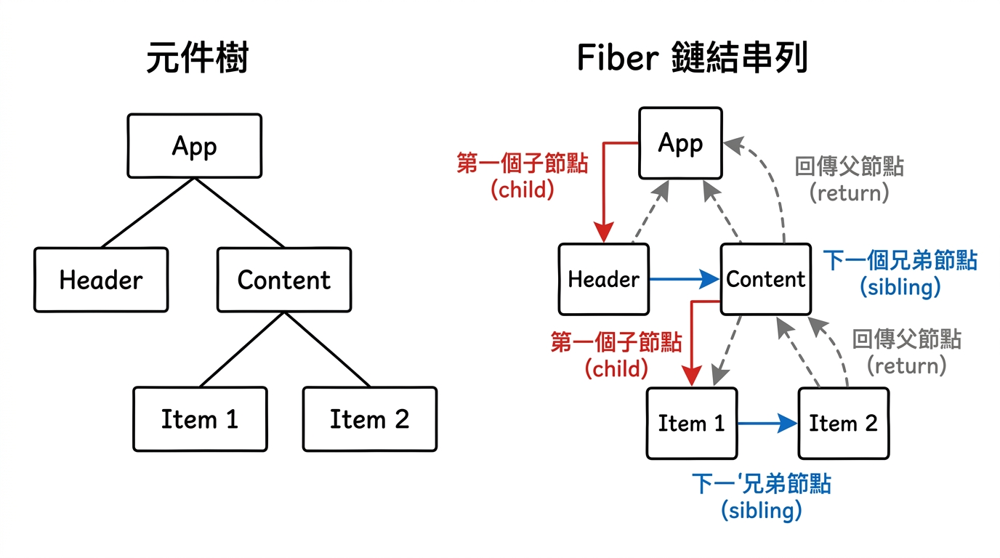
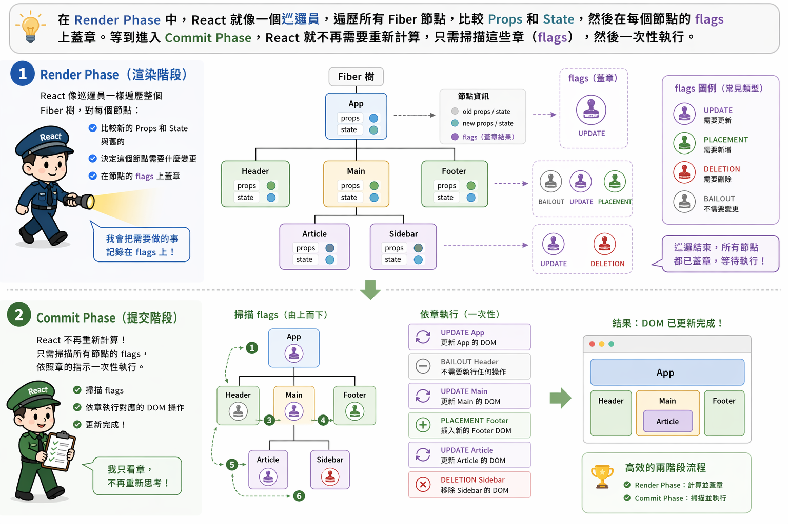
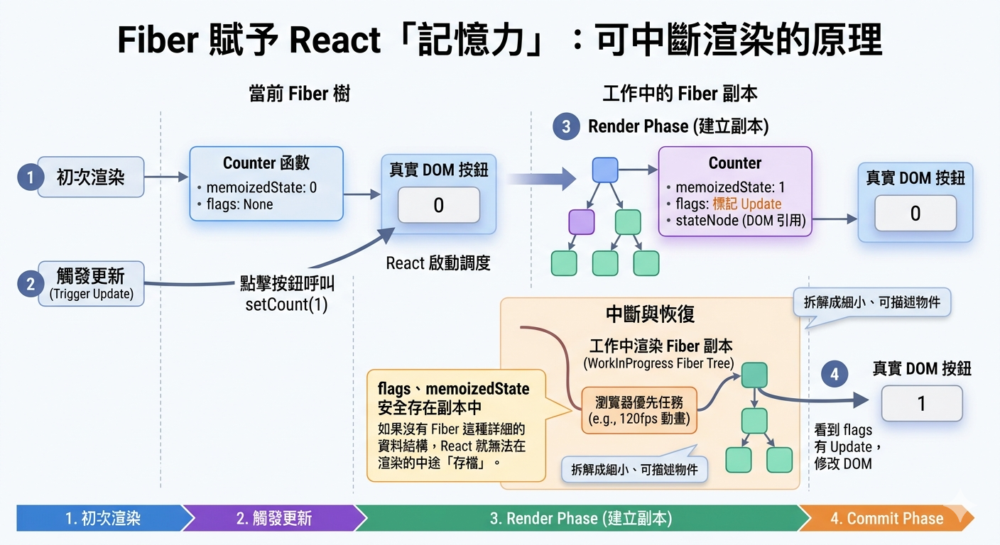

---
mdx:
  format: md
---

> 課程：JavaScript 與 React 底層原理
> 第 13 堂：Fiber 架構基礎

# 41 Fiber 節點資料結構

在上一節中，我們看到 Stack Reconciler 就像一輛一旦發車就無法停下的同步火車，最終導致了 UI 的卡頓。為了打破這個僵局，React 團隊進行了長達兩年的重構，將原本隱含在 JavaScript 呼叫堆疊（Call Stack）中的遞迴邏輯，「物件化」成了儲存在堆積記憶體（Heap）中的資料結構。

這個資料結構，就是 **Fiber**。

## 從虛擬堆疊幀理解 Fiber 的本質

在標準的 JavaScript 執行模型中，當一個函數呼叫另一個函數時，執行環境（EC）會被推入 Call Stack。這個過程是引擎層級控制的，開發者無法在中途說：「嘿，先停在這裡，我出門買個咖啡，回來再從這行繼續執行。」

Fiber 的核心設計思想，就是實作了一個**虛擬的堆疊幀（Virtual Stack Frame）**。

React 將每一個元件（Component）視為一個工作單元，並為其建立一個 Fiber 節點。當 React 在遍歷元件樹時，它不再是單純地進行函數遞迴，而是在操作一個由 Fiber 節點組成的物件網。

為什麼這能解決問題？因為「物件」是可以被儲存、被移動、被暫停處理的。透過將執行狀態從 Call Stack 移到 Heap 中的 Fiber 物件上，React 擁有了對渲染進度的「手動控制權」。它可以處理完 A 元件的 Fiber 後，檢查一下是否有高優先級的任務（如使用者點擊），如果有，就先放下 B 元件的 Fiber，等空閒了再回來。

## 視覺化：從樹狀結構到鏈結串列

在學習 Fiber 之前，我們習慣將 React 應用想像成一棵「樹」。但在 Fiber 的底層實作中，這棵樹其實是以**鏈結串列（Linked List）**的形式存在的。這種結構轉換是為了讓遍歷過程變得「可中斷」。

讓我們透過這張圖來看看，一個典型的元件樹是如何被轉換成 Fiber 的鏈結串列指標系統的：

> *Fiber 透過 child、sibling 與 return 三個指標，將原本深層嵌套的樹狀結構扁平化為一個可隨時記錄位置的鏈結串列軌跡。*

### 關鍵指標的導航邏輯

1. `child`：指向該節點的「第一個」子節點。注意，Fiber 節點不直接持有所有子節點的陣列，它只認得大兒子。
2. `sibling`：指向下一個兄弟節點。如果一個父元件下有三個子元件，大兒子會透過 `sibling` 找到二兒子，以此類推。
3. `return`：指向父節點。這個命名的巧思在於，當一個 Fiber 節點的工作處理完成（completeWork）後，它會「回傳」到父節點繼續處理下一個兄弟。

這種設計模仿了遞迴的行為，但卻是使用 `while` 迴圈來執行的。React 只需要在全域維護一個 `workInProgress` 指標，記錄目前正在處理哪一個 Fiber 節點。如果主執行緒需要讓出控制權，React 只要記住這個指標，下次恢復時就能從同一個地方繼續，而不需要重新跑一遍整個 Call Stack。

## Fiber 節點的欄位深度拆解

一個 Fiber 節點本質上是一個巨大的 JavaScript 物件。我們可以將它的屬性歸納為三大類，每一類都承載著 React 運行的核心邏輯。

### 1. 靜態描述資訊：它是什麼？

這部分屬性描述了該節點對應的原始資訊，類似於我們在 Topic 6 看到的 React Element。

- `type`：描述元件的類型。對於原生 DOM 元素（如 `div`, `h1`），它是字串；對於 Function Component，它就是那個函數本身的參考。
- `key`：我們在 Topic 7 強調過的身份標識，用於在 Reconciliation 過程中比對節點是否可以複用。
- `**stateNode**`**：**這是連結虛擬與真實世界的地圖。如果該 Fiber 對應的是原生 DOM，`stateNode` 就會指向真實的 DOM 節點；如果是類別元件，則指向元件實例。透過這個欄位，React 才能在計算完差異後，精準地找到要修改哪個真實的 DOM。

### 2. 架構連結資訊：它在哪裡？

這就是剛才提到的 `child`、`sibling` 和 `return`。

這裡有一個隱藏的細節：為什麼不使用 `children` 陣列？
想像一下，如果你正在處理一個擁有 1000 個子節點的陣列，處理到第 500 個時被中斷了。下次回來時，你必須記得「我處理到索引 500 了」。
但在鏈結串列中，你只需要持有「第 500 個節點的物件參考」。這個物件本身就透過 `sibling` 指向了第 501 個。這讓資料結構本身就具備了「狀態恢復」的能力，而不需要額外的計數器。

### 3. 動態數據與副作用：它要做什麼？

這是 Fiber 最強大的地方，它記錄了元件的狀態以及「未來要做的事」。

- `memoizedState`：這是 **Hooks 存活的土壤**。對於 Function Component 來說，這裡儲存的是一個鏈結串列，包含了 `useState`、`useReducer` 等 Hook 的狀態。這也解釋了為什麼 Hooks 不能寫在條件式中：因為 React 是按順序在這個 `memoizedState` 鏈結串列中存取狀態的，一旦順序亂了，整個狀態系統就會崩潰。
- `memoizedProps`：上一次渲染時的 Props。
- `pendingProps`：本次渲染傳入的新 Props。透過對比這兩者，React 可以快速判斷元件是否需要更新。
- `**flags**`**（舊版稱為 **`**effectTag**`**）**：這是一個二進位的位元集（Bitmask），記錄了這個節點需要執行的 DOM 操作。例如，如果該節點需要被刪除，`flags` 就會包含 `Deletion`；如果需要更新文字，則包含 `Update`。

在 Render Phase 中，React 就像一個巡邏員，遍歷所有 Fiber 節點，比較 Props 和 State，然後在每個節點的 `flags` 上蓋章。等到進入 Commit Phase，React 就不再需要重新計算，只需掃描這些章（flags），然後一次性執行。

## 為什麼說 Fiber 賦予了 React 「記憶力」？

讓我們用一個具體的例子來串聯這些概念。

假設你有一個計數器元件 `Counter`，內部使用 `useState(0)`。

1. **初次渲染**：React 建立一個 Fiber 節點。`type` 是 `Counter` 函數，`memoizedState` 儲存了數值 0。`stateNode` 指向畫面上那個真實的數字按鈕。
2. **觸發更新**：你點擊按鈕，呼叫 `setCount(1)`。
3. **Render Phase**：React 啟動調度。它建立一個「工作中的 Fiber 副本」（即下一節會講到的 `workInProgress` 樹）。在這個副本中，它執行 `Counter` 函數，發現新的狀態是 1。
4. **標記副作用**：React 比較副本與當前的 Fiber，發現內容變了。於是，它在副本 Fiber 的 `flags` 上標記了一個 `Update`。
5. **中斷與恢復**：如果在計算過程中，瀏覽器突然要處理一個 120fps 的動畫，React 可以暫停。因為 `flags`、`memoizedState` 都安全地存在這個副本 Fiber 物件中。
6. **Commit Phase**：動畫結束，React 回來完成剩下的工作。它看到 `flags` 有 `Update`，於是根據 `stateNode` 找到真實 DOM，將數字改為 1。

如果沒有 Fiber 這種詳細的資料結構，React 就無法在渲染的中途「存檔」。Fiber 讓 React 能夠將龐大的更新任務拆解成一個個細小的、可被描述的物件，這就是「可中斷渲染」的底層物理基礎。

## 總結與銜接

Fiber 節點不僅僅是 Virtual DOM 的升級版，它是一個完整的**執行上下文**。它透過鏈結串列指標解決了遍歷的中斷問題，透過 `memoizedState` 解決了狀態的持久化問題，並透過 `flags` 解決了 DOM 操作的收集問題。

這賦予了 React 兩種核心能力：

- **記憶力**：知道每個元件目前的狀態、對應的 DOM 以及 Hooks 的進度。
- **中斷力**：隨時可以停下來，並在未來準確地從斷點恢復。

然而，這引發了一個新的挑戰：如果我們在背景慢慢地、斷斷續續地修改這棵 Fiber 樹，而使用者此時正在看螢幕，他們會不會看到一個「處理到一半」的殘缺畫面？為了防止這種「畫面撕裂」現象，React 引入了另一項關鍵技術。

## 雙緩衝與 UI 原子性

當我們在背景慢慢刻劃這棵代表「下一個版本」的 Fiber 樹時，React 必須確保螢幕上顯示的內容是穩定且完整的。這就像是在更換舞台背景時，必須先拉上幕簾，在後台布置好一切後，再一次性拉開，而不是讓觀眾看著工作人員一個個搬動道具。

在 React 中，這個「後台布置」與「一次性揭曉」的機制被稱為**雙緩衝樹（Double Buffering）**。下一節，我們將深入探討 `current` 樹與 `workInProgress` 樹是如何透過 `alternate` 指標交織協作，確保 UI 更新的原子性。
