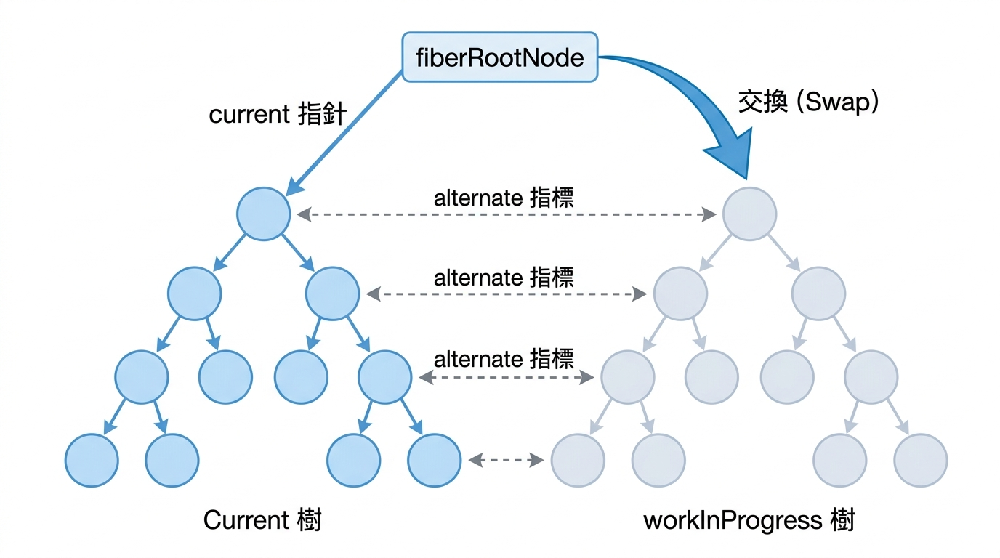
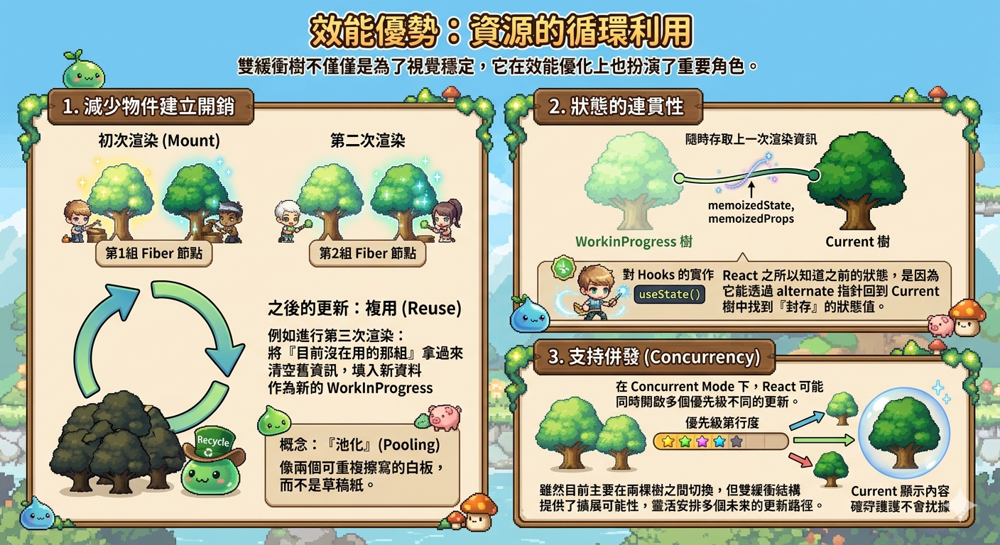
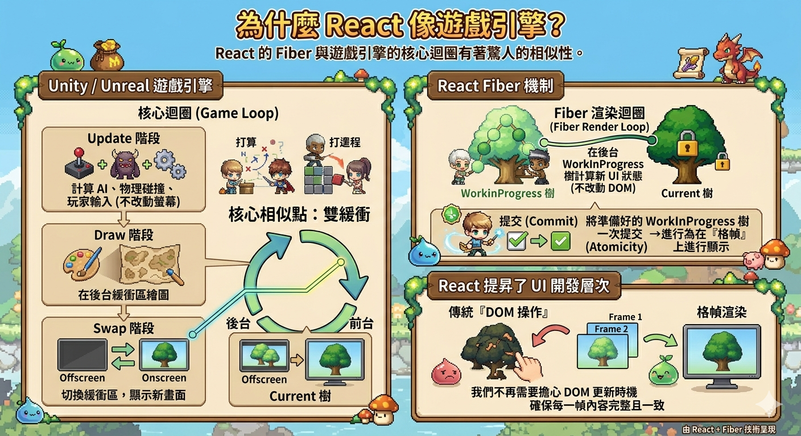

---
mdx:
  format: md
---

> 課程：JavaScript 與 React 底層原理
> 第 13 堂：Fiber 架構基礎

# 42 雙緩衝樹機制

想像一下，你正在玩一款高畫質的 3D 遊戲。如果顯示卡在計算每一幀畫面時，是「直接一邊計算一邊把畫素畫在螢幕上」，你會看到什麼？你會看到畫面瘋狂閃爍，甚至會看到角色移動到一半、背景只畫了三分之一的「半成品」殘影。這種現象在電腦圖學中被稱為「畫面撕裂」（Tearing）。

為了避免這種糟糕的體驗，顯示卡採用了**雙緩衝（Double Buffering）**技術：它會在記憶體中準備兩個緩衝區，一個是目前正在顯示的「前台緩衝區」，另一個是正在悄悄繪製下一幀的「後台緩衝區」。只有當後台完全畫好了，顯示卡才會瞬間將兩個緩衝區切換，讓你看到的永遠是完整的畫面。

React 的 Fiber 架構也面臨著同樣的挑戰。既然我們在上一部分學到 Fiber 是「可中斷、異步」的，這意味著 React 可能在計算 UI 變更到一半時，因為主執行緒需要去處理更緊急的使用者輸入而停下來。如果這時候 React 直接去動真實的 DOM，使用者就會看到一個崩潰、不完整的介面。

React 是如何借鑒顯示卡的智慧，在「異步渲染」的同時保證 UI 的完美穩定呢？答案就是 **雙緩衝樹（Double Buffering Tree）** 機制。

## 為什麼需要兩棵樹？

在 React 16 以前的 Stack Reconciler 中，更新是同步且直接發生的。一旦開始，就沒辦法回頭，這雖然簡單，但卻會造成嚴重的卡頓。而在 Fiber 架構中，React 的目標是實現「時間切片」（Time Slicing），這意味著渲染過程可以被拆解成無數個微小的任務。

這種「斷斷續續」的渲染特性帶來了一個核心問題：**狀態的一致性**。

如果我們只有一棵樹，而這棵樹在計算過程中被不斷修改，那麼：

1. **渲染不一致**：如果渲染被中斷，畫面上可能會顯示一部分舊資料、一部分新資料。
2. **資訊遺失**：在計算新狀態的過程中，我們往往需要參考「目前畫面上是什麼樣子」來進行 Diffing。如果直接在原有的物件上修改，舊的資訊就會遺失。

因此，React 在記憶體中維持了兩棵 Fiber 樹，這就像是擁有了一個「現實世界」與一個「鏡中世界」。

## Current 樹與 WorkInProgress 樹

在 React 運作時，記憶體中會同時存在兩棵 Fiber 樹：

### Current 樹（當前樹）

這棵樹代表了**目前正顯示在螢幕上的 UI 狀態**。它是「真實世界」的映射，React 所有的事件處理、生命週期回呼，在邏輯上都與這棵樹掛鉤。當你看到螢幕上有一個按鈕，在 Fiber 架構中就一定有一個對應的 Fiber 節點存在於 Current 樹中。

### WorkInProgress 樹（工作中樹）

這就是 React 的「後台緩衝區」。當 `setState` 被觸發後，React 會開啟一次新的渲染任務。此時，React 不會去動 Current 樹，而是在記憶體中根據 Current 樹的架構，開始建立（或複用）另一棵樹，這就是 WorkInProgress 樹。

所有的計算、Diffing、打標籤（EffectTag）都在這棵 WorkInProgress 樹上悄悄進行。這棵樹對使用者來說是完全不可見的，就像是在後台草擬的一份「改版計畫」。

### FiberRootNode 的導航作用

這兩棵樹是如何被管理的？React 中有一個核心節點叫做 `fiberRootNode`（注意它與 `rootFiber` 不同，它是整個應用的根控器）。`fiberRootNode` 上有一個關鍵的指針叫做 `current`。

- 當 `current` 指向樹 A 時，樹 A 就是 Current 樹。
- 此時，React 會在背景以樹 A 為藍本，建立樹 B 作為 WorkInProgress 樹。



> *React Fiber 雙緩衝機制示意圖：透過切換 current 指針，實現 UI 的原子性更新。*

## Alternate：連結兩個世界的傳送門

你可能會好奇，React 在建立 WorkInProgress 樹時，是怎麼知道「某個節點以前是什麼樣子」的？如果每一棵樹都是獨立的，那 Diffing 演算法就無法運作了。

這就是 `alternate` 屬性的魔力。在 Fiber 節點的資料結構中，有一個名為 `alternate` 的欄位，它是一個指針：

- **Current 節點**的 `alternate` 指向其對應的 **WorkInProgress 節點**。
- **WorkInProgress 節點**的 `alternate` 則指回其對應的 **Current 節點**。

這就像是一對雙胞胎，即使他們身處不同的樹（不同的世界），他們依然透過 `alternate` 連結在一起。

當 React 在 WorkInProgress 階段處理一個組件時，它會先檢查 `current.alternate`。如果發現已經存在對應的 WorkInProgress 節點，React 就可以直接複用這個物件，而不是重新建立一個全新的 JS 物件。這種設計不僅讓 Diffing 變得極其快速（因為可以直接進行指標比對），還極大地減少了垃圾回收（Garbage Collection）的壓力。

## 原子性更新：瞬間切換的藝術

「雙緩衝」最核心的價值在於保證了更新的**原子性（Atomicity）**。

在電腦科學中，原子性意味著「要麼全部發生，要麼全部不發生」，絕對不會停留在中間狀態。

React 的渲染流程分為兩個大階段：

1. **Render Phase（渲染階段）**：這是在 WorkInProgress 樹上工作的階段。它是**可中斷**的。React 可以在這裡計算很久，甚至因為高優先級任務插隊而把算到一半的 WorkInProgress 樹丟掉重來。
2. **Commit Phase（提交階段）**：一旦 WorkInProgress 樹完全計算完畢（所有 Diffing 都做完了，變更標籤都打好了），React 就會進入 Commit 階段。

在 Commit 階段的尾聲，React 會執行一個極其關鍵的動作：

```javascript
// 簡化的邏輯概念
fiberRootNode.current = workInProgress;
```

這個「指針切換」的動作是瞬間完成的。就在這一刻，原本在後台默默工作的 WorkInProgress 樹搖身一變，成為了新的 Current 樹。

對於使用者來說，雖然 React 在後台可能花了 100 毫秒才算完複雜的列表更新，但因為有雙緩衝機制，UI 的跳轉是瞬間發生的，不會有任何中間態的閃爍。這就是為什麼 React 即使在執行重度渲染時，依然能維持極高的視覺穩定性。

## 效能優勢：資源的循環利用

雙緩衝樹不僅僅是為了視覺穩定，它在效能優化上也扮演了重要角色。

### 1. 減少物件建立開銷

如果每次 `setState` 都要把整棵虛擬 DOM 樹的物件重新 new 一遍，記憶體很快就會被耗盡。在 Fiber 的雙緩衝機制中，React 其實是在兩組 Fiber 節點之間反覆切換。

當第一次渲染（Mount）時，React 建立一組 Fiber 節點。
當第二次渲染時，React 會建立第二組 Fiber 節點。
但在之後的更新中，React 會盡量**複用**已經存在的物件。例如，現在要進行第三次渲染，React 會把「目前沒在用的那一組 Fiber 節點」拿過來，清空上面的舊資訊，填入新資料，將其作為新的 WorkInProgress。

這種「池化」（Pooling）的概念讓 React 就像是有兩個可以重複擦寫的白板，而不是用完即丟的草稿紙。

### 2. 狀態的連貫性

因為有 `alternate` 的連結，React 在 WorkInProgress 樹中可以隨時存取到上一次渲染的 `memoizedState` 和 `memoizedProps`。這對於 Hooks 的實作至關重要。當你呼叫 `useState` 時，React 之所以能知道你之前的狀態是什麼，正是因為它能透過 `alternate` 指針回到 Current 樹中找到那個被「封存」的狀態值。

### 3. 支持併發（Concurrency）

在 Concurrent Mode 下，React 可能會同時開啟多個不同優先級的更新。雖然目前主流的 React 依然主要在兩棵樹之間切換，但雙緩衝的結構提供了擴展的可能性，讓 React 能夠在不破壞當前顯示內容的前提下，靈活地安排多個未來的更新路徑。



## 為什麼說這讓 React 像是一個遊戲引擎？

如果你去研究像 Unity 或 Unreal 這樣的遊戲引擎，你會發現它們的核心迴圈（Game Loop）與 React 的 Fiber 機制驚人地相似。

遊戲引擎通常遵循：

1. **Update 階段**：計算物理碰撞、AI 行為、玩家輸入（不改動螢幕）。
2. **Draw 階段**：在後台緩衝區繪圖。
3. **Swap 階段**：切換緩衝區，顯示新畫面。

React 透過 Fiber 的雙緩衝機制，實際上將 UI 開發從傳統的「DOM 操作」提昇到了「格幀渲染」的高度。這種設計讓我們不再需要擔心 DOM 更新的時機問題，因為 React 確保了每一幀提交到螢幕上的內容都是完整且一致的。



### 總結一下雙緩衝的關鍵點：

- **安全性**：在背景計算，不會阻塞或破壞目前的 UI。
- **一致性**：透過指針瞬間切換，保證更新的原子性。
- **效能**：透過 `alternate` 指標複用物件，減少記憶體波動。
- **連貫性**：讓 React 能夠對比新舊 Props 與 State，實現精準的 Diffing。

## 準備進入實戰分工

理解了雙緩衝樹的「兩棵樹、一個指針、一個傳送門」的結構後，我們就具備了拆解 React 渲染詳細流程的基礎。既然我們知道 React 會在背景悄悄準備 WorkInProgress 樹，那麼這個「準備」的過程具體是在做什麼？而那個「指針切換」的瞬間，又會觸發哪些 DOM 操作？

在下一部分，我們將深入探討 **Render Phase** 與 **Commit Phase** 的分工。你會看到這兩棵樹是如何在不同的階段被讀取、修改與交換的，這將揭開 `useEffect` 和 `useLayoutEffect` 執行時機的最終奧秘。

## 核心要點總結與銜接

### 重點回顧

- **雙緩衝機制**是 React Fiber 解決「異步渲染導致 UI 不一致」的核心方案，概念源自顯示卡的緩衝切換。
- **Current 樹**對應目前螢幕顯示，**WorkInProgress 樹**是正在記憶體中計算的草稿。
- **alternate 指針**連結了兩棵樹中的對應節點，是 Diffing 演算法與 Hooks 狀態複用的關鍵。
- **原子性更新**確保了使用者永遠不會看到「半成品」UI，因為只有在 WorkInProgress 樹完整構建後才會進行指針切換。
- **資源複用**減少了頻繁建立 JS 物件帶來的效能損耗。

既然我們已經掌握了 Fiber 的「靜態結構」與「緩衝策略」，接下來我們將進入 Fiber 的「動態行為」。我們將詳細拆解 Render Phase 與 Commit Phase 的具體工作，理解 React 如何在不阻塞主執行緒的前提下，完成複雜的 UI 計算並最終安全地同步到真實 DOM。
