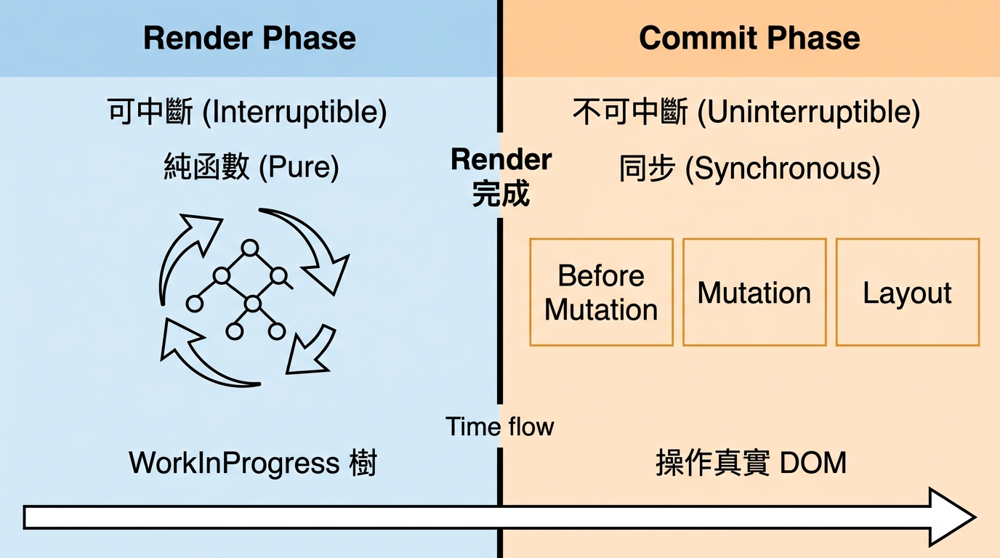

---
mdx:
  format: md
---

> 課程：JavaScript 與 React 底層原理
> 第 13 堂：Fiber 架構基礎

# 43 Render 與 Commit 分工

你有沒有想過，為什麼 React 的核心開發團隊要花費數年時間把架構從 Stack Reconciler 全部打掉重練成 Fiber？在上一節中，我們學到了「雙緩衝樹（Double Buffering）」機制，這讓 React 擁有了「草稿」與「正本」兩棵樹。但光有結構是不夠的，React 必須有一套嚴密的「工作流程」來決定什麼時候該寫草稿、什麼時候該把草稿發佈到真實的螢幕上。

想像你在編寫一本百科全書：你會先在筆記本上塗塗改改、查閱資料、決定哪幾頁要修改（這是一個可以被打斷、可以反悔的過程）；等到內容全部確認無誤後，你才會一次性把這些修改印刷到最終的書稿上。

這就是 React 的核心渲染流水線：**Render Phase（渲染階段）**與 **Commit Phase（提交階段）**。理解這兩者的分工，是掌握 React 併發（Concurrent）特性的最後一塊拼圖。

## 渲染的兩大關卡：從思考到執行

在 React 中，一次更新並不代表立即畫出畫面。它會經歷一個「先思考、再動手」的過程。



> *React 的渲染流水線：Render Phase 負責在背景「計算差異」，而 Commit Phase 則負責「更新真實世界」。*

### 1. Render Phase：謹慎的規劃師

Render Phase 的主要職責是**遍歷 WorkInProgress 樹並計算差異**。在這個階段，React 會調用你的元件函數，並與舊的 Fiber 節點進行比對（Diffing）。

這個階段最迷人的地方在於它的兩個特性：

#### **特性一：它是可中斷的（Interruptible）**

因為 Render Phase 所有的工作都在 JavaScript 的物件（Fiber 樹）上進行，還沒有觸及到昂貴且具備副作用的真實 DOM。這意味著 React 可以「玩陰的」：如果 React 正在計算一個大型列表的更新，突然使用者在輸入框打了一個字（高優先級任務），React 可以立刻丟下算到一半的 WorkInProgress 樹，先去處理輸入框的渲染，等主執行緒空閒了，再回來繼續計算或重新計算剛才的列表。

這就是為什麼在 Fiber 架構下，長任務不再會鎖死瀏覽器。React 就像一個聰明的時間管理者，發現更重要的事情時會隨時暫停手邊的文書工作。

#### **特性二：它必須是純函數（Pure）**

這是一個極度重要的約束。既然 Render Phase 可能會被中斷、暫停甚至因為過時而直接丟棄並重啟，那麼**元件函數內部絕對不能有任何副作用**。

假設你在元件的主體（Body）中寫了 `window.count += 1` 或發送了一個 API 請求。如果 React 因為調度原因重複執行了三次 Render Phase，你的 `count` 就會莫名其妙地加了 3。這就是為什麼 React 官方一直強調：渲染邏輯必須是純粹的「UI = f(state)」。

**Render Phase 的產出物：**
當這棵 WorkInProgress 樹遍歷完成後，每個 Fiber 節點上都會被打上標籤（在原始碼中稱為 `flags`，舊版叫 `effectTag`）。例如：

- **Placement**: 這個節點是新來的，需要插入 DOM。
- **Update**: 節點還在，但 props 變了，需要更新屬性。
- **Deletion**: 這個節點沒用了，準備從 DOM 移除。

這就像是裝潢工人在施工前，先在牆上貼滿「待拆」、「刷漆」、「走線」的標籤，但牆壁本身還沒被動過。

---

### 2. Commit Phase：果斷的執行者

一旦 Render Phase 完成，React 拿到了一棵打滿標籤的 WorkInProgress 樹，它就會進入 **Commit Phase**。

與 Render Phase 截然不同，Commit Phase 的職責是**將計算結果同步到真實 DOM**。這個階段有兩個不可動搖的原則：

1. **同步且不可中斷**：你絕對不希望看到網頁更新到一半就停住。如果 Commit Phase 是可以中斷的，使用者可能會看到一個只有一半內容的表格，或者一個背景色變了但文字還沒變的按鈕。這稱為「UI 撕裂（Tearing）」。為了保證 UI 的一致性與原子性，一旦開始 Commit，React 就會一口氣衝到底。
2. **操作真實世界**：這裡會觸發所有的 DOM 操作、執行生命週期方法與 Hooks 副作用。

#### **Commit 的三個子階段**

為了管理複雜的副作用，React 將 Commit Phase 細分為三個小步驟：

1. **Before Mutation 階段**：
這是 DOM 還沒被正式改動之前的最後一刻。雖然在 Function Component 中較少直接用到，但 Class Component 的 `getSnapshotBeforeUpdate` 就是在這裡觸發的。這是一個「拍照留念」的機會，記錄下 DOM 改變前的狀態（如捲軸位置）。
2. **Mutation 階段（真正的改動）**：
**這是最核心的時刻**。React 會遍歷剛才在 Render Phase 收集到的標籤（Flags），並呼叫 `appendChild`、`removeChild` 或 `setAttribute` 等原生 DOM API。當這個階段結束時，WorkInProgress 樹所描述的結構已經真實地存在於螢幕上的 DOM 節點中了。
3. **Layout 階段**：
此時 DOM 已經更新完成，但**瀏覽器還沒有進行重繪（Paint）**。這是一個非常特殊的時機點，因為 DOM 已經變了，你可以讀取到最新的元素幾何資訊（如 `getBoundingClientRect()`），但使用者還沒看到畫面閃爍。
這就是 `useLayoutEffect` 執行的地方。

**最後一步：指標交換**
當這三個階段都完成後，React 會執行最後的操作：
`fiberRootNode.current = workInProgress`
這就是我們在上一節提到的「切換指針」。現在，這棵剛剛裝修完畢的樹正式成為了「當前樹（Current Tree）」。

---

## Hooks 的執行時機：為什麼順序很重要？

理解了這兩個階段，你就能從底層解釋 `useEffect` 與 `useLayoutEffect` 之間那個著名的「閃爍問題」。

### useLayoutEffect：Commit 階段的守門員

`useLayoutEffect` 是在 Commit Phase 的 **Layout 階段**「同步」執行的。

- **流程**：DOM 更新 -> `useLayoutEffect` 執行 -> 瀏覽器重繪。
- **影響**：如果你在 `useLayoutEffect` 裡又觸發了狀態更新，React 會立即再次啟動渲染流程，而瀏覽器會等到這一切都搞定後才畫出畫面。
- **代價**：它會阻塞瀏覽器渲染。如果裡面的計算太重，頁面會顯得卡頓。但優點是使用者永遠不會看到中間的過渡狀態（例如 Tooltip 先出現在左上角再跳回正確位置的過程）。

### useEffect：Commit 之後的非同步任務

`useEffect` 則完全不同。它不會在 Commit Phase 同步執行，而是會被「排程（Schedule）」。

- **流程**：DOM 更新 -> 瀏覽器重繪（使用者看到畫面） -> **一小段時間後** -> `useEffect` 執行。
- **影響**：它不會阻塞畫面。這是絕大多數副作用（如 API 請求、事件監聽）的理想場所。
- **代價**：如果你在 `useEffect` 裡修改 DOM 樣式，使用者可能會先看到舊的樣式，然後畫面突然閃爍一下變成新樣式。

---

## 為什麼 Render Phase 必須是純函數？一個預測實驗

讓我們做一個思想實驗來鞏固這個觀念。

假設我們有一個計數器元件，但我們在元件主體（這屬於 Render Phase）寫了一個副作用：

```javascript
let renderCount = 0;

const Counter = ({ count }) => {
  // ❌ 錯誤：在 Render Phase 執行副作用
  renderCount += 1; 
  console.log("正在渲染，當前次數：", renderCount);

  return <div>當前數字：{count}</div>;
};
```

在舊的 React（Stack Reconciler）中，這段程式碼可能看起來沒問題。但在 Fiber 架構下，如果發生了以下情況：

1. React 開始渲染 `Counter`，`renderCount` 變成了 1。
2. 此時一個高優先級的動畫任務進來了，React 決定暫停 `Counter` 的渲染。
3. 動畫結束後，React 發現剛才算到一半的 `Counter` 已經過時了（可能 props 已經變了），於是它丟棄剛才的結果，重新開始渲染。
4. `Counter` 再次執行，`renderCount` 變成了 2。

**結果**：明明畫面只更新了一次，但你的全域變數 `renderCount` 卻增加了兩次。如果你這行程式碼是「領取優惠券」或「送出訂單」，後果將不堪設想。

這就是為什麼 **Render Phase 必須 Pure** 的深層理由。

---

## 總結與銜接

總結來說，Fiber 架構下的渲染是一場「謀定而後動」的兩幕劇：

- **Render Phase** 負責「想」：它是可中斷的、非同步的。它在記憶體中反覆推敲最優的 DOM 更新方案。它要求極致的純度，不允許弄髒真實世界。
- **Commit Phase** 負責「做」：它是不可中斷的、同步的。它把所有的規劃變成現實，並在結束後切換樹的指針，確保 UI 的原子性。

這種分工讓 React 既能保持高效的併發能力，又能保證最終呈現給使用者的畫面是完整且穩定的。

我們現在已經理解了 Fiber 的靜態結構（Node）與動態流程（Phase）。但還有一個關鍵問題：**這列「區間車」到底是怎麼在每一站（Fiber Node）停靠、檢查進度，並在被中斷後還能找回正確的路徑繼續前進的？**

在下一節中，我們將進入 Fiber 的遍歷演算法的核心，拆解 **8.5 工作單元與中斷恢復**。我們將看到 `workLoop` 函數是如何利用 JavaScript 的微秒級空檔，優雅地調度成千上萬個節點的。
