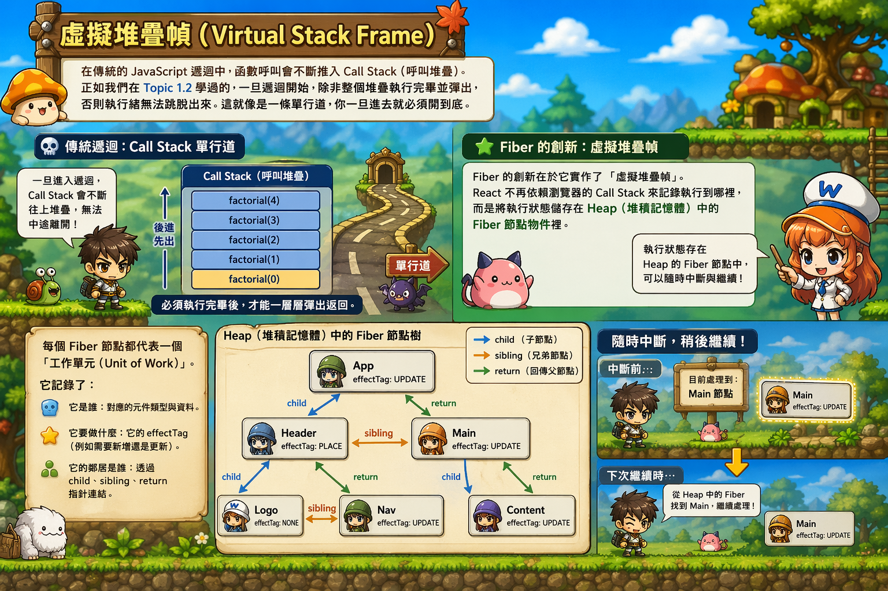
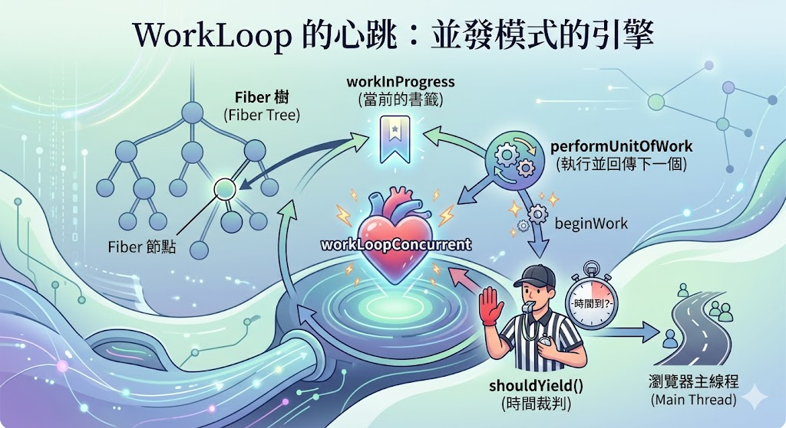
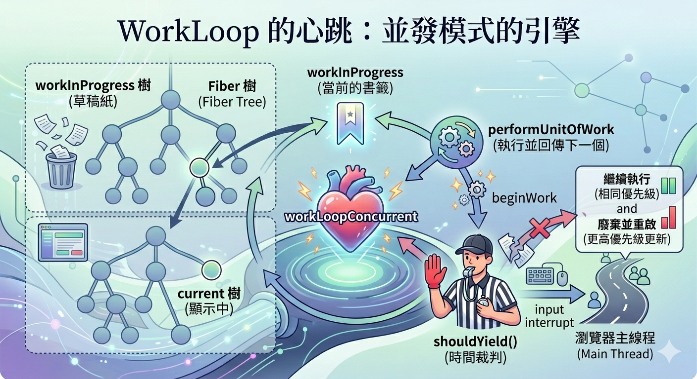

---
mdx:
  format: md
---

> 課程：JavaScript 與 React 底層原理
> 第 14 堂：Fiber 執行機制

# 44 工作循環與讓出控制

想像你正在進行一場長達十公里的馬拉松。在 React 16 以前的「Stack Reconciler」架構下，這場馬拉松是一口氣跑完的，中途不能停下來喝水，甚至不能轉頭擦汗。如果路邊有人（使用者）想問你路，你必須等跑完全程才能理會他。這就是為什麼過去當 React 在處理大型列表或複雜組件時，瀏覽器會出現幾百毫秒的「假死」狀態——因為 JavaScript 的執行緒被這場馬拉松佔滿了。

到了 Fiber 架構，React 變成了一個聰明的「區間車」駕駛。它每跑一小段路（一個 Fiber 節點），就會停下來看錶（檢查時間），並探頭出窗外看看車站有沒有緊急乘客（使用者輸入、動畫請求）。如果有，它會立刻靠邊停車，把路權讓出來。

這種「跑跑停停」的魔力，核心就在於我們今天要拆解的 **工作循環（Work Loop）** 與 **讓出機制（Yielding）**。


## Fiber 作為最小工作單元

在深入程式碼之前，我們必須先釐清一個概念：為什麼以前的 React 不能中斷，而現在可以？

### 虛擬堆疊幀（Virtual Stack Frame）

在傳統的 JavaScript 遞迴中，函數呼叫會不斷推入 **Call Stack**（呼叫堆疊）。正如我們在 Topic 1.2 學過的，一旦遞迴開始，除非整個堆疊執行完畢並彈出，否則執行緒無法跳脫出來。這就像是一條單行道，你一旦進去就必須開到底。

Fiber 的創新在於它實作了 **「虛擬堆疊幀」**。React 不再依賴瀏覽器的 Call Stack 來記錄執行到哪裡，而是將執行狀態儲存在 **Heap（堆積記憶體）** 中的 Fiber 節點物件裡。

每個 Fiber 節點都代表一個「工作單元（Unit of Work）」。它記錄了：

1. **它是誰**：對應的元件類型與資料。
2. **它要做什麼**：它的 `effectTag`（例如需要新增還是更新）。
3. **它的鄰居是誰**：透過 `child`、`sibling`、`return` 指針連結。

當執行權從 Call Stack 移交給 Heap 上的資料結構後，React 就能隨意中斷：只要把「目前處理到哪一個 Fiber」的指標記下來，即便 Call Stack 清空了，下次還是能從 Heap 裡把那個 Fiber 找出來繼續。



### 為什麼是「最小」工作單元？

因為 Fiber 節點與 DOM 節點幾乎是一一對應的。React 決定，每次處理完「一個節點」的計算，就是一次最理想的檢查點。這確保了中斷的顆粒度足夠細，細到足以讓使用者感受不到延遲。

---

## workLoop 的心跳：並發模式的引擎

在 React 原始碼中，負責驅動這一切的核心函數叫做 `workLoopConcurrent`。雖然它看起來非常簡單，但卻是 React 實現非同步渲染的靈魂。

### 拆解 `workLoopConcurrent` 邏輯

讓我們看看這段關鍵的虛擬碼：

```javascript
function workLoopConcurrent() {
  // 只要還有工作要做，且「不應該讓出」控制權
  while (workInProgress !== null && !shouldYield()) {
    // 執行一個工作單元（處理一個 Fiber 節點）
    performUnitOfWork(workInProgress);
  }
}
```

這段程式碼揭示了 Fiber 運作的三個支柱：

1. `workInProgress`：這是一個全域指針，指向 React 當前正在處理的 Fiber 節點。你可以把它想像成書籤，標記了 React 讀到書的哪一頁。
2. `performUnitOfWork`：這是具體的執行邏輯。它會處理當前的 Fiber（即 `beginWork`），並回傳下一個要處理的節點。
3. `shouldYield()`：這是裁判。它會告訴 React：「喂，時間到了，該把執行緒還給瀏覽器了。」
  

### 預測與發現：如果沒有 `shouldYield()` 會怎樣？

在進入下一小節前，你可以試著預測：如果我們把 `!shouldYield()` 拿掉，會發生什麼事？

**答案是：** 我們會退回到 React 15 的行為。即使使用了 Fiber 資料結構，如果沒有檢查機制強制中斷，React 依然會同步地跑完所有的 Fiber 節點，直到 `workInProgress` 變成 `null` 為止。這說明了 Fiber 架構是「基礎設施」，而 `workLoop` 則是「政策執行者」。

---

## 讓出機制：5 毫秒的權衡

現在，讓我們把鏡頭拉近，看看裁判 `shouldYield()` 到底在看什麼。

### 時間切片（Time Slicing）與 5ms 預算

瀏覽器為了維持 60 FPS 的流暢度，每一幀大約有 16.6 毫秒。但在這 16.6 毫秒內，瀏覽器除了執行 JS，還要處理樣式計算、佈局、繪製。

React Scheduler（調度器）經過權衡後，設定了一個預設的**時間片（Time Slice）為 5 毫秒**。

為什麼是 5ms？

- **太長（如 100ms）**：使用者會感覺到明顯的掉幀，因為輸入事件（如 Click 或 Keydown）會被阻塞。
- **太短（如 1ms）**：切換任務的開銷（Context Switch）會佔據太高比例，導致整體渲染效率大幅下降。

5ms 是一個甜蜜點，既能保證 JS 執行有進度，又能讓出足夠的空間給瀏覽器處理高優先級的互動。

### 為什麼選擇 MessageChannel 而非 setTimeout？

當 `shouldYield()` 判定時間用完後，React 需要告訴瀏覽器：「我現在要暫停了，請你在有空的時候叫我回來繼續跑。」

在 Event Loop 的知識中（Recall Topic 4.2），我們知道 `setTimeout(fn, 0)` 可以發起一個宏任務（Macrotask）。但 React 並不使用它，原因有二：

1. **4ms 延遲**：根據 HTML 規範，嵌套層級超過 5 層的 `setTimeout` 會有至少 4ms 的強制延遲。對於追求效能的 React 來說，這太慢了。
2. **優先級**：React 希望這個恢復任務能盡可能緊跟在瀏覽器繪製之後。

因此，React 選擇了 `MessageChannel`。

`MessageChannel` 是一個輕量級的通訊 API，它的回調函數同樣會進入 Macrotask 佇列，但它沒有 `setTimeout` 的那種人工延遲。這讓 React 能以極高的頻率在 JS 執行與瀏覽器渲染之間進行切換。


> *React Fiber 工作循環與讓出機制的互動流程：展示了 React 如何在 5ms 預算內循環，並透過 MessageChannel 實現非阻塞式更新。*

---

## 中斷與恢復：指針的藝術

當 `shouldYield()` 回傳 `true`，`while` 迴圈終止，`workLoopConcurrent` 函數執行完畢並退出 Call Stack。這時候，React 的狀態處於一個神祕的「中間態」。

### `workInProgress` 的書籤作用

關鍵在於 `workInProgress` 是一個存在於閉包或模組作用域中的變數。雖然 `workLoop` 函數結束了，但這個變數依然保留著：它指向了那個「剛算完，但還沒來得及處理子節點」的 Fiber 物件。

當瀏覽器處理完緊急任務（例如更新了一個 Input 的文字），執行 `MessageChannel` 的回調時，React 會再次進入 `workLoopConcurrent`。

這時候，奇蹟發生了：

```javascript
// 第二次進入循環
function workLoopConcurrent() {
  // 此時的 workInProgress 依然是上次暫停時的那個節點！
  while (workInProgress !== null && !shouldYield()) {
    performUnitOfWork(workInProgress);
  }
}
```

React 不需要重新從根節點遍歷。它直接從書籤處拿起筆，繼續往下寫。這就是 **「可中斷且可恢復」** 渲染的真相。

### 這裡有一個潛在的問題

你可能會想：如果我在 React 暫停的這段時間裡，又發起了一個新的 `setState` 怎麼辦？或者如果暫停的時間太長，原本的計算結果過時了怎麼辦？

這就是為什麼我們需要 **Topic 8.3 提到的「雙緩衝樹」**。所有的計算都在 `workInProgress` 樹（草稿紙）上進行，即便中斷了、被丟棄了，也不會影響到目前正在畫面上顯示的 `current` 樹。React 可以根據情況決定：

- **繼續執行**：如果新舊更新優先級相同。
- **廢棄並重啟**：如果來了一個更高優先級的更新（例如使用者輸入），React 可能會直接把這份跑了一半的草稿撕掉，重新計算最新的狀態。



---

## 總結與銜接

在這一部分中，我們揭開了 React Fiber 「能屈能伸」的底層秘密。

我們學到：

- **Fiber 是容器**：它把執行狀態從 Call Stack 搬到了 Heap，讓暫停成為可能。
- **workLoop 是節奏**：透過 `while` 循環與 `shouldYield` 的配合，React 實現了協作式多工（Cooperative Multitasking）。
- **時間切片是策略**：5ms 的預算確保了渲染進度與 UI 響應性之間的平衡。
- **MessageChannel 是媒介**：它比 `setTimeout` 更精準地觸發任務恢復。

這套框架搭建好了 React 運行的「規則」。但具體到每一站，React 到底是怎麼處理節點的？它是如何「向下展開」元件，又是如何「向上收集」變更的？

接下來，我們將進入 Fiber 遍歷的具體實作—— `**beginWork**`** 階段**。如果說 `workLoop` 是火車的調度系統，那麼 `beginWork` 就是火車每到一站時，負責開門讓乘客（子節點）上車的具體動作。

## 知識點回顧

- **工作單元（Unit of Work）**：單個 Fiber 節點的處理過程。
- **時間切片（Time Slicing）**：將長任務分割成多個 5ms 區間。
- **協作式讓出**：React 主動詢問是否需要讓出控制權，而非被作業系統強制中斷。
- **恢復點**：利用 `workInProgress` 指針實現從中斷處繼續執行。
