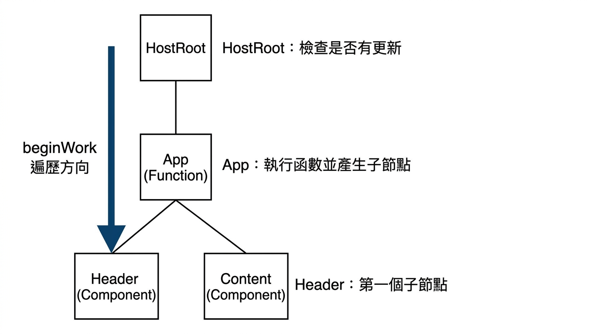
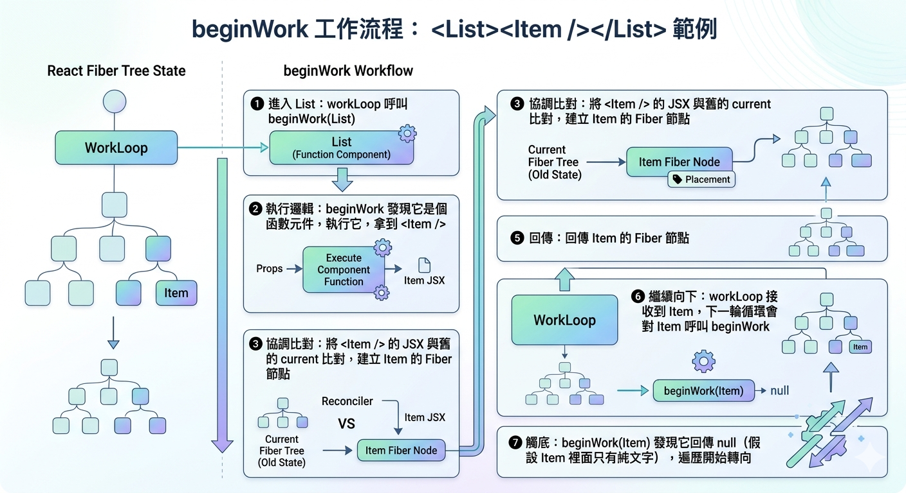
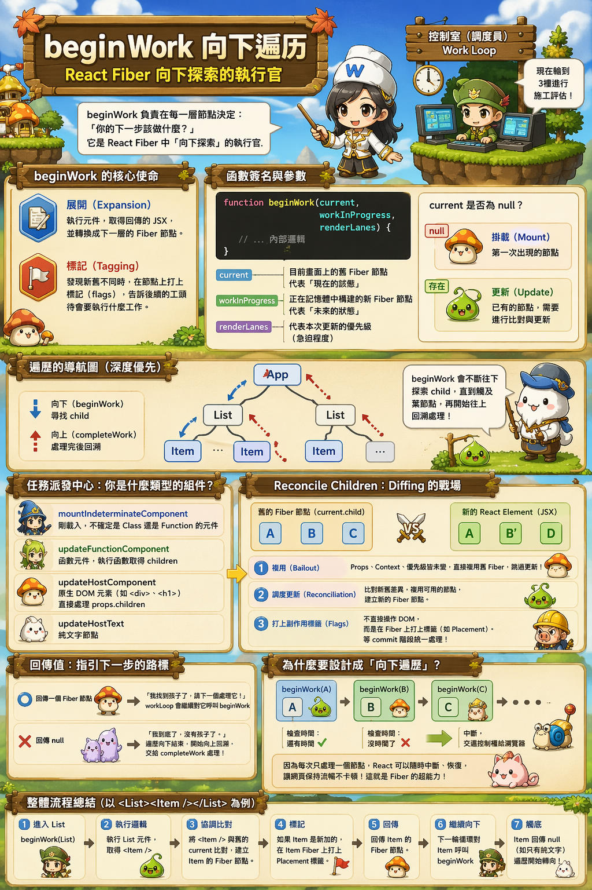

---
mdx:
  format: md
---

> 課程：JavaScript 與 React 底層原理
> 第 14 堂：Fiber 執行機制

# 45 beginWork 向下遍歷

想像你正在帶領一支建築團隊，要根據客戶的新要求改建一棟大樓。上一節課我們學到了「工作循環」（Work Loop）就像是那個坐在控制室的總調度員，他負責盯著時鐘（5ms 預算），確保團隊不會佔用街道太久。但當調度員說「現在輪到 3 樓進行施工評估」時，具體負責走進 3 樓、推開門、看著舊的裝潢並對照新的設計圖、最後決定要拆掉哪面牆的人是誰？

這就是我們今天要探討的主角：`beginWork`。它是 React Fiber 架構中「向下探索」的執行官，負責在每一層節點決定：「你的下一步該做什麼？」

## beginWork 的核心使命：接收當前，回傳未來

在 Fiber 的世界裡，渲染不是一次性完成的，而是拆解成一個個「工作單元」。`beginWork` 的定位非常明確：它是處理**單個 Fiber 節點**的入口。

如果把整個渲染過程比喻成一場深度優先遍歷（DFS）的旅程，那麼 `beginWork` 就是那隻不斷向下伸出的手。每當它處理完一個節點，它的任務就是告訴調度員：「我已經看過這個節點了，這是它的第一個子節點，請接下來處理它。」

它的核心職責可以總結為兩點：

1. **展開（Expansion）**：如果這是一個元件（如 `<App />`），它會執行這個元件的函數，拿到回傳的 JSX，並將其轉換成下一層的 Fiber 節點。
2. **標記（Tagging）**：如果發現新的設計圖和舊的長得不一樣（例如原本是 `<div>` 現在變成了 `<span>`），它會在節點上打個記號（稱為 `flags`），告訴後面的工頭說：「這個地方待會要拆掉重蓋」。

### 函數簽名的深意：三個關鍵參數

在 React 原始碼中，`beginWork` 的長相大約是這樣的：

```javascript
function beginWork(current, workInProgress, renderLanes) {
  // ... 內部邏輯
}
```

這三個參數代表了 React 進行決策時的所有依據：

- `current`：這是目前正顯示在螢幕上的、舊的 Fiber 節點。它代表了「現在的狀態」。
- `workInProgress`：這是我們正在記憶體中偷偷構建的、新的 Fiber 節點。它代表了「未來的狀態」。
- `renderLanes`：這與我們之後會學到的「優先級」有關。它告訴 `beginWork` 這次更新有多急（是使用者點擊觸發的，還是背景資料載入觸發的）。

這裡有一個有趣的細節：如果 `current` 是 `null`，代表這個節點是第一次出現（Mount）；如果 `current` 存在，則代表這是一次更新（Update）。`beginWork` 會根據這點來決定要不要進行昂貴的比較工作。

## 遍歷的導航圖：由上而下的探索

在進入具體邏輯前，我們必須先掌握 `beginWork` 在整個樹狀結構中的移動路徑。



> *beginWork 的遍歷過程是「深度優先」的，它會不斷嘗試尋找 child 節點，直到觸及葉節點為止。*

## 任務派發中心：你是什麼類型的組件？

當 `beginWork` 拿到一個 `workInProgress` 節點時，它首先會看這個節點的 `tag`。這就像是海關人員查看護照上的身分：你是函數元件？原生 DOM 元素（Host Component）？還是 Context Provider？

根據不同的身分，`beginWork` 會將工作轉交給專門的處理函數：

1. `mountIndeterminateComponent`：對於剛載入、還不知道自己是 Class 還是 Function 的元件（雖然本課程專注於 Function，但 React 底層仍保留了這個檢查步驟）。
2. `updateFunctionComponent`：這是我們最常待的地方。它會執行你的函數組件（呼叫那寫滿 Hooks 的函數），獲取 `children`。
3. `updateHostComponent`：處理像 `<div>` 或 `<h1>` 這樣的原生標籤。它不會執行函數，而是直接看 `props.children`。
4. `updateHostText`：處理純文字節點。

這種分派機制確保了 React 能以最高效率處理不同性質的任務。例如，處理 `<div>` 時，React 知道它不需要擔心 Hooks 的執行，只需要比對屬性即可。

## Reconcile Children：Diffing 演算法的真正戰場

無論是哪種類型的組件，最終都會走向同一個關鍵步驟：`reconcileChildren`。

這是 `beginWork` 的核心心臟，也是我們之前在 Topic 7 討論過的「協調（Reconciliation）」發生的地點。在這裡，React 會執行一個極其關鍵的比對：

> **舊的 Fiber 節點 (**`**current.child**`**)  vs  新的 React Element (JSX 回傳的物件)**

這裡會發生幾種情況：

### 1. 複用（Bailout）

如果 React 發現：

- Props 沒有變。
- Context 沒有變。
- 優先級顯示這個組件不需要更新。

那麼 `beginWork` 就會選擇「偷懶」，它會直接複製舊的 Fiber 節點，不再進入元件內部執行。這就是為什麼 `React.memo` 能夠提升效能的底層原因——它讓 `beginWork` 在這裡直接按下了「跳過」鍵。

### 2. 調度更新（Reconciliation）

如果必須更新，`reconcileChildren` 就會根據 JSX 物件產出**新的子 Fiber 節點**。

- 如果是**更新（Update）**：它會盡可能找找看有沒有可以複用的舊 Fiber，並標記差異。
- 如果是**掛載（Mount）**：它會像生產線一樣，全新製造出一批 Fiber 節點。

### 3. 打上副作用標籤（Flags）

這是一個非常容易被誤解的點：`**beginWork**`** 階段絕對不會操作真實的 DOM。**

當 `beginWork` 發現一個節點需要被新增到畫面上時，它不會執行 `document.createElement`。相反地，它會在該 Fiber 節點的 `flags` 欄位打上一個二進位標記，例如 `Placement`（代表需要插入）。

這就像是一個建築設計師在圖紙上畫個紅圈，寫著：「這裡之後要放一台飲水機」。真正的搬運工作（Commit Phase）會等所有圖紙都畫完後，才由工人們統一處理。

## 回傳值：指引下一步的路標

`beginWork` 執行完畢後，它必須回傳一個值給 `workLoop`。這個回傳值決定了火車接下來往哪裡開：

- **回傳一個 Fiber 節點**：代表「我找到了我的孩子，請下一個處理它」。`workLoop` 收到後，會立刻對這個回傳的節點再次呼叫 `beginWork`。這就是我們看到的「向下展開」過程。
- 回傳 `null`：代表「我已經到底了（葉節點），我沒有孩子了」。

當回傳為 `null` 時，就是一個重要的轉折點。這代表這條分支的「向下」工作已經結束。這時候，調度員會說：「既然這條路走到底了，那我們開始往回走，把剛才標記好的工作匯總一下吧！」

這時，程式碼的執行權會交給 `completeUnitOfWork`，進而進入我們下一個要討論的階段：`completeWork`。

## 為什麼要設計成「向下遍歷」？

你可能會問，為什麼不直接一次把整棵樹算完？為什麼要這麼麻煩地一個節點一個節點呼叫 `beginWork`？

這種「單元化」的設計是為了實現**可中斷性**。

因為 `beginWork` 每次只處理一個節點，並回傳下一個節點，React 可以在任何兩個節點之間停下來。

1. `beginWork(A)` -> 回傳 B
2. 檢查時間：還有剩餘時間嗎？有。
3. `beginWork(B)` -> 回傳 C
4. 檢查時間：沒時間了！
5. **中斷**，把控制權還給瀏覽器處理動畫。
6. 等瀏覽器有空了，從 C ~~節點~~**恢復**，繼續執行 `beginWork(C)`。

如果 `beginWork` 是一次性遞迴處理整棵樹，我們就無法在中間切斷它。這種「向下鋪軌、隨時停工」的靈活性，正是 Fiber 架構能讓網頁保持流暢的秘密武器。

## 總結 beginWork 的工作流程

讓我們用一個具體的例子來串連整個邏輯：假設你有一個元件 `<List><Item /></List>`。

1. **進入 List**：`workLoop` 呼叫 `beginWork(List)`。
2. **執行邏輯**：`beginWork` 發現它是個函數元件，執行它，拿到 `<Item />`。
3. **協調比對**：將 `<Item />` 的 JSX 與舊的 `current` 比對，建立 `Item` 的 Fiber 節點。
4. **標記**：如果 `Item` 是新加的，在 `Item` Fiber 上打個 `Placement` 標籤。
5. **回傳**：回傳 `Item` 的 Fiber 節點。
6. **繼續向下**：`workLoop` 接收到 `Item`，下一輪循環會對 `Item` 呼叫 `beginWork`。
7. **觸底**：`beginWork(Item)` 發現它回傳 `null`（假設 `Item` 裡面只有純文字），遍歷開始轉向。





## 承上啟下

我們現在已經理解了 Fiber 樹是如何「由上而下」一步步展開、執行元件邏輯、並在記憶體中建立起新結構的。這就像是在工廠裡，設計師已經把每一層樓的施工藍圖都畫好，並在需要變動的地方貼上了「待處理」的標籤（Flags）。

然而，光有藍圖和標籤是不夠的。我們還需要把這些零散的標籤收集起來，並把那些在記憶體中計算出來的虛擬屬性，真正轉換成可以操作的 DOM 實體。

接下來，當 `beginWork` 觸底反彈，我們將進入 `completeWork` 的階段——看看 React 如何「由下而上」地收網，將所有分散的副作用匯聚成一條強大的執行鏈結。
