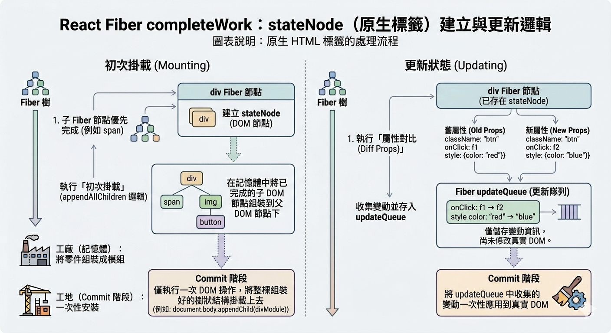
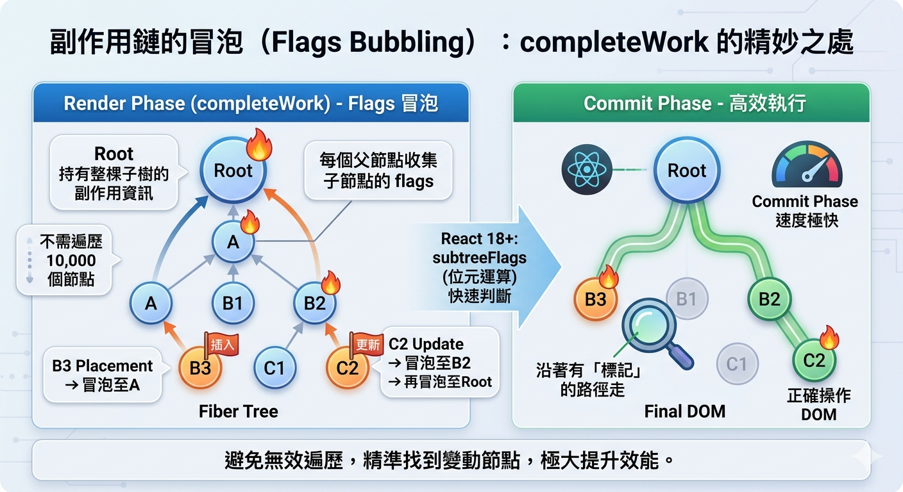
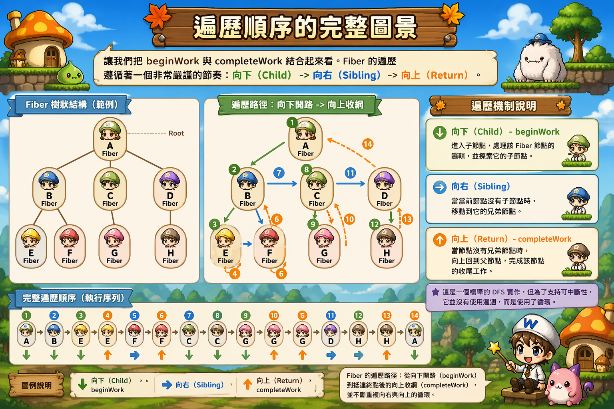
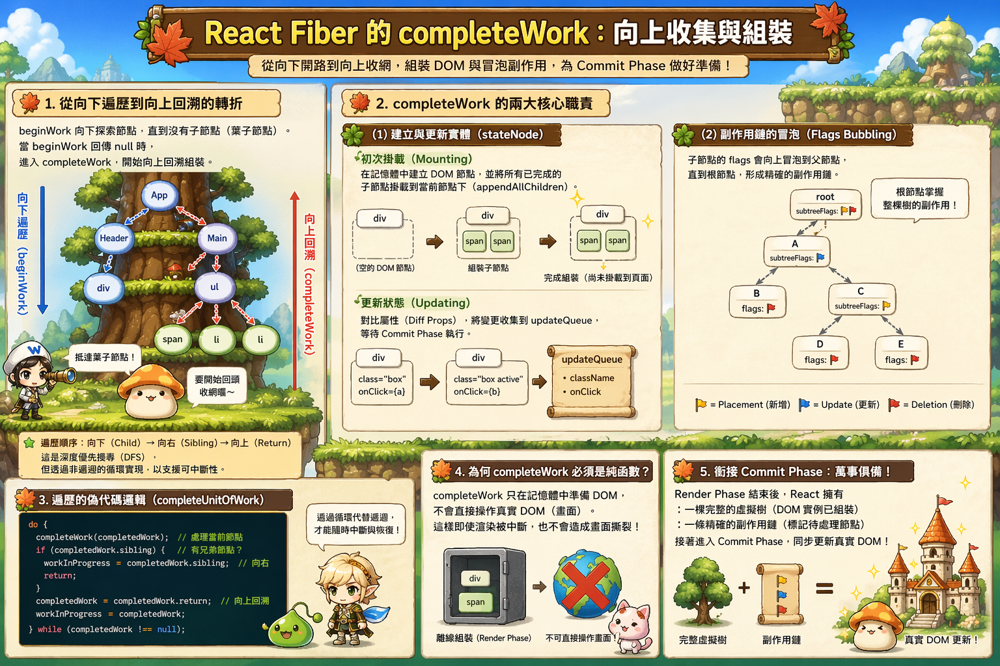

---
mdx:
  format: md
---

> 課程：JavaScript 與 React 底層原理
> 第 14 堂：Fiber 執行機制

# 46 completeWork 向上收集

當 React 遍歷到 Fiber 樹的最深處，就像一名探險家抵達了洞穴的盡頭。既然沒路可走了，接下來該怎麼辦？

在上一節中，我們看到 `beginWork` 像一名先遣部隊，不斷向下開路（向下遍歷）、標記差異（Diffing）。但光有標記是不夠的，React 還需要把這些零散的標記與準備好的 DOM 節點「打包」起來，整齊地送到 Commit Phase 進行最後的物理渲染。

這就是 `completeWork` 的戰場。如果說 `beginWork` 是「由上而下」的拆解與對比，那麼 `completeWork` 就是「由下而上」的收網與組裝。

## 從向下遍歷到向上回溯的轉折

在 Fiber 的工作循環 `workLoop` 中，當 `beginWork` 回傳 `null` 時，代表當前的節點已經沒有子節點（也就是所謂的葉子節點，Leaf Node）。這時候，React 就會進入一個名為 `completeUnitOfWork` 的函數邏輯。

這個轉折點非常關鍵：它標誌著 **Render Phase 的「遞」階段結束，進入了「歸」階段**。

我們可以想像成一棵樹的遍歷：

1. **遞（beginWork）**：沿著樹枝一直向下爬，直到爬到葉子。
2. **歸（completeWork）**：處理這片葉子，然後看看旁邊有沒有其他葉子（兄弟節點）。如果沒有，就回退到樹枝（父節點），處理樹枝，再繼續向上。

這是一個深度優先搜尋（DFS）的過程，但 `completeWork` 的職責遠比單純的遍歷要沉重得多。

## completeWork 的核心職責：組裝與標記

在 `completeWork` 階段，React 主要執行兩件極其重要的大事：**建立/更新 DOM 實例**，以及**副作用鏈（Flags）的向上冒泡**。

### 1. 建立與更新實體（stateNode）

對於原生的 HTML 標籤（在 React 中稱為 Host Component，例如 `<div>`、`<span>`），`completeWork` 需要確保對應的真實 DOM 已經準備好了。

- **初次掛載（Mounting）時**：
React 會在記憶體中建立一個新的 DOM 節點。這就是為什麼我們在 Fiber 結構中會看到 `stateNode` 這個欄位。
  有趣的是，React 並非單純地建立一個 `<div>` 而已。在 `completeWork` 期間，它還會執行一個「初次組裝」：它會將所有已經建立好的子 DOM 節點，掛載到當前這個父 DOM 節點之下（透過 `appendAllChildren` 邏輯）。
  **為什麼要在這裡做？**
因為當我們在處理父節點的 `completeWork` 時，所有的子節點（以及子節點的子節點）都已經完成了它們自己的 `completeWork`。這意味著子節點的 DOM 已經建好了。在記憶體中先把這棵小型的 DOM 樹拼好，效能遠比在 Commit Phase 頻繁操作真實 DOM 高得多。這就像是在工廠先把零件組裝成模組，最後再送到工地一次安裝。
- **更新狀態（Updating）時**：
如果 DOM 已經存在了，`completeWork` 的任務就變成了「對比屬性（Diff Props）」。它會檢查哪些 `onClick`、`className` 或 `style` 發生了變化，並將這些變化收集起來。注意：它**不會**立即修改畫面，而是將這些變動資訊存在 Fiber 節點的一個 updateQueue 中，等候 Commit Phase 發落。
  

### 2. 副作用鏈的冒泡（Flags Bubbling）

這是 `completeWork` 最精妙的地方。

在 `beginWork` 期間，如果一個節點需要被插入、刪除或更新，React 會給它打上一個 `flags`（在舊版本中稱為 `effectTag`）。例如，一個新節點會被打上 `Placement`，一個屬性變動的節點會被打上 `Update`。

但是，如果整棵 Fiber 樹有 10,000 個節點，而其中只有 2 個節點有變動，React 在 Commit Phase 難道要重新遍歷 10,000 個節點去找那 2 個有變動的地方嗎？那太低效了。

因此，`completeWork` 採用了一種「冒泡」機制：

- 每個父節點在完成自己的 `completeWork` 時，會把所有子節點的 `flags`「收集」到自己身上。
- 這個過程會一直持續到根節點 `root`。

最終，根節點會持有整棵子樹中所有需要處理的副作用資訊。在 React 16/17 中，這形成了一條像火車一樣的「Effect List」鏈結串列；而在 React 18+ 中，則是透過位元運算的 `subtreeFlags` 來快速判斷某個路徑下是否存有副作用。

這讓 Commit Phase 的速度變得極快，因為 React 只需要沿著有「標記」的路徑走，就能精準地找到那些真正需要操作 DOM 的節點。



## 遍歷順序的完整圖景

讓我們把 `beginWork` 與 `completeWork` 結合起來看。Fiber 的遍歷遵循著一個非常嚴謹的節奏：**向下（Child） -> 向右（Sibling） -> 向上（Return）**。

這是一個標準的 DFS 實作，但為了支持可中斷性，它並沒有使用遞迴，而是使用了循環。



> *Fiber 的遍歷路徑：從向下開路（beginWork）到抵達終點後的向上收網（completeWork），並不斷重複向右與向上的循環。*

### 遍歷的偽代碼邏輯

如果你去讀 React 源碼中的 `completeUnitOfWork`，你會看到類似這樣的邏輯（簡化版）：

```javascript
function completeUnitOfWork(unitOfWork) {
  let completedWork = unitOfWork;

  do {
    const current = completedWork.alternate;
    const returnFiber = completedWork.return;

    // 1. 執行當前節點的 completeWork
    // 這裡會處理 DOM 建立、屬性更新、flags 冒泡
    completeWork(current, completedWork);

    // 2. 看看有沒有兄弟節點
    const siblingFiber = completedWork.sibling;
    if (siblingFiber !== null) {
      // 如果有兄弟，就把 workInProgress 指向兄弟
      // 結束 complete 的過程，回到 workLoop 讓兄弟執行 beginWork
      workInProgress = siblingFiber;
      return;
    }

    // 3. 如果沒有兄弟，就向上回溯
    // 繼續循環，處理父節點的 completeWork
    completedWork = returnFiber;
    workInProgress = completedWork;

  } while (completedWork !== null);
}
```

這個循環確保了 React 能在不使用遞迴的情況下遍歷整棵樹。這對於「可中斷渲染」至關重要，因為循環的狀態（即 `workInProgress` 指針）可以輕易地被儲存與恢復。

## 為何 completeWork 必須是純函數？

雖然 `completeWork` 會建立 DOM 節點，但這些節點目前都只是「離線（Off-screen）」的。它們還沒有被掛載到網頁上（也就是沒有執行 `appendChild` 到真實的 `document.body` 中）。

這意味著 `completeWork` 仍然屬於 Render Phase。正如我們之前強調的，Render Phase 的工作隨時可能被中斷、丟棄或重啟。

如果我們在 `completeWork` 中直接操作了畫面上的 DOM（這是一種 Side Effect），一旦任務被中斷，畫面就會出現一半更新、一半沒更新的「撕裂」現象。因此，`completeWork` 必須保持乾淨：它只在記憶體中做準備，不對外部世界造成影響。

## 銜接 Commit Phase：萬事俱備

當最後一個節點（通常是根節點 `root`）執行完 `completeWork` 後，Render Phase 正式宣告結束。

此時，React 手中握著兩樣寶物：

1. **一棵新的、完整的虛擬樹**：所有的 DOM 實例都已經在記憶體中建好並掛載成一個個小組件。
2. **一條精確的副作用鏈**：所有需要更新畫面的節點都被標記出來了。

React 接著會進入 Commit Phase。這是一個同步、不可中斷的過程。React 會拿著這份「副作用清單」，以雷霆萬鈞之勢，將所有變更一次性地同步到真實的 DOM 畫面上。



### 總結一下 `beginWork` 與 `completeWork` 的分工：

| 特性 | beginWork (下行) | completeWork (上行) |
| --- | --- | --- |
| **主要任務** | 組件渲染、Diffing、打上標籤 (Flags) | 建立/更新 DOM 實例、收集標籤 (Bubbling) |
| **遍歷方向** | 樹的根部 -> 葉子 | 葉子 -> 根部 |
| **操作對象** | React Elements (虛擬描述) | Host Instances (DOM 實體) |
| **結束標誌** | 到達沒有 child 的節點 | 回到根節點 Root |

## 學習總結與銜接

在本章節中，我們深入剖析了 Fiber 架構中最核心的執行機制。你現在應該明白，React 並不是在畫面上「魔術般」地更新，而是透過一套精密的雙緩衝機制（Double Buffering）與 DFS 遍歷，在記憶體中完成所有複雜的計算與組裝。

我們從 `workLoop` 的時間切片出發，理解了 React 如何「優雅地讓路」給瀏覽器；接著我們追蹤了 `beginWork` 是如何向下規劃藍圖，以及 `completeWork` 是如何向上組裝實體並冒泡副作用。

理解了這些「幕後黑手」的運作方式，當你之後遇到 `useEffect` 為何在渲染後才執行、或是為什麼 `setState` 是批次更新的，你將能從底層原理給出最自信的答案。

接下來，我們將進入 **Topic 9：Lane 模型與優先級調度**。在那裡，我們將探討 React 如何決定哪些工作「先做」、哪些「後做」，這正是 Concurrent Mode 能夠在重度負載下依然保持流暢的最高機密。
