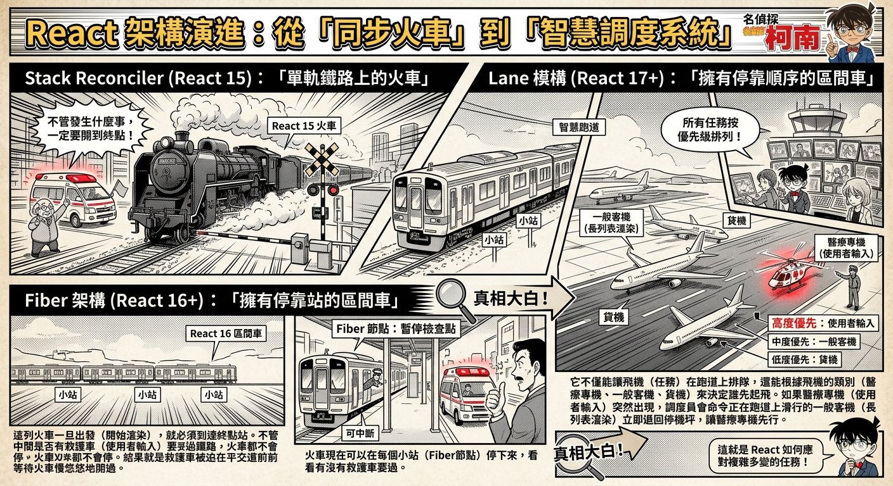

---
mdx:
  format: md
---

> 課程：JavaScript 與 React 底層原理
> 第 15 堂：Lane 模型基礎

# 47 優先級調度的動機

想像一下，你正在使用一個精美的旅遊網站，頂部有一個搜尋框，下方則是一個展示了數千個景點的長列表。當你在搜尋框輸入「日本」時，網頁突然僵住了，你打的字過了兩秒才緩緩出現在螢幕上。這種「打字卡頓」的經驗，是使用者最討厭的體驗之一。

我們在 Topic 8 學習了 Fiber 架構，知道了 React 現在擁有了「中斷與恢復」的能力。就像是一部可以隨時按下暫停鍵的電影，React 不再像以前那樣一旦開始渲染就停不下來。但這引發了一個更深層的問題：**既然可以暫停，那暫停之後，React 應該先去做哪件事？**

這就是我們今天要探討的核心：**優先級調度（Priority Scheduling）**。

## 從「能中斷」到「誰優先」的思維轉變

在進入具體的 Lane 模型之前，我們必須先理解為什麼「可中斷渲染」只是解決問題的一半。

### 回顧：Fiber 的「暫停鍵」

在 Topic 8 中，我們學到 Fiber 將渲染工作拆分成了一個個微小的「工作單元（Unit of Work）」。透過 `workLoopConcurrent` 迴圈，React 會在處理每一個 Fiber 節點前詢問：「還有時間嗎？瀏覽器有更緊急的事要做嗎？」

```javascript
// Fiber 的核心工作迴圈 (簡化版)
function workLoopConcurrent() {
  // 只要還有工作，且 shouldYield() 回傳 false (代表還有時間)
  while (workInProgress !== null && !shouldYield()) {
    performUnitOfWork(workInProgress);
  }
}
```

這個 `shouldYield()` 就像是一個裁判，確保 React 不會霸佔主執行緒（Main Thread）超過 5 毫秒，從而留出空間給瀏覽器去處理動畫或使用者點擊。

### 核心問題：暫停之後呢？

雖然 React 願意「讓路」給瀏覽器，但當瀏覽器處理完緊急任務（例如更新了滑鼠位置）並把控制權還給 React 時，React 面臨一個抉擇：

1. **繼續做剛才沒做完的長任務？**（例如：繼續渲染那 5000 個景點列表）
2. **先處理剛才使用者產生的新任務？**（例如：使用者剛才在搜尋框又打了一個字）

如果 React 只是盲目地按照先來後到的順序處理任務，那麼即使有了 Fiber，使用者依然會感到卡頓。為什麼？因為那個「5000 個景點的渲染任務」雖然被中斷了很多次，但它依然排在隊伍的最前面，擋住了後面的「打字更新任務」。

**結論：僅有「中斷機制」是不夠的，我們需要一套「插隊機制」。**

## 案例分析：沒有優先級的世界

讓我們透過一個具體的程式碼場景來觀察，如果沒有優先級調度，會發生什麼事。

假設我們有一個元件，它同時維護兩個狀態：

1. `inputValue`: 使用者在輸入框打的字（極度要求即時反應）。
2. `listData`: 根據輸入內容計算出的數千條過濾結果（計算量極大，可以稍後呈現）。

### 預測：當使用者快速打字時

當使用者輸入了一個字母 "A"，React 啟動了渲染程序：

- **任務 1**：更新輸入框的文字（快）。
- **任務 2**：重新計算並渲染 5000 個列表項（慢）。

在 Fiber 架構下，任務 2 正在執行。執行到一半時，使用者又輸入了一個字母 "B"。

#### 情況 A：沒有優先級（只有中斷）

1. React 執行 `shouldYield()`，發現使用者有輸入，於是暫停「渲染 5000 個項目」的任務，讓出主執行緒。
2. 瀏覽器處理輸入事件，並告訴 React：「嘿，現在 `inputValue` 變成 'AB' 了，請更新。」
3. React 將「更新為 AB」的任務排入佇列，放在「渲染 5000 個項目（A 的結果）」之後。
4. React 恢復執行，因為它必須先完成「渲染 5000 個項目（A 的結果）」。
5. **結果**：使用者螢幕上的輸入框依然停留在 "A"，直到那 5000 個舊的列表項渲染完畢，才會輪到新的 "AB" 更新。

這就是所謂的 **Jank（掉幀/卡頓）**。雖然 React 中途停下來了，但它回頭又去處理那個已經「過時」且「耗時」的舊任務，這在邏輯上是低效的。

#### 情況 B：有了優先級（理想狀態）

1. React 收到「更新為 AB」的請求。
2. React 發現這個請求來自「使用者輸入（Input Event）」，這被標記為 **High Priority（高優先級）**。
3. React 對比目前正在做的「渲染 5000 個項目」，發現那是 **Low Priority（低優先級）** 的背景更新。
4. React 果斷**丟棄或暫停**舊的低優先級任務，直接插隊開始處理高優先級的「更新為 AB」。
5. **結果**：輸入框立刻顯示出 "AB"，使用者感覺非常流暢。至於那 5000 個列表，等 React 有空了再慢慢更新。

## 16.6ms 幀預算與人類的感知邊界

為什麼我們對「打字」這麼敏感，卻對「列表延遲」比較寬容？這涉及到我們在 Topic 8 提到的 **16.6ms 幀預算** 以及人類感知的心理學。

### 重新審視 60 FPS

在螢幕更新率為 60Hz 的設備上，每一幀的時間約為 16.6 毫秒。在這極短的時間內，瀏覽器要完成：

1. 執行 JavaScript
2. 樣式計算（Style）
3. 佈局（Layout）
4. 繪製（Paint）
5. 合成（Composite）

如果 JavaScript 執行時間過長，擠壓到了後面的繪製步驟，畫面就會跳過這一幀，產生視覺上的卡頓。

### 感知門檻：緊急 vs 非緊急

React 的優先級設計參考了人類對不同互動的容忍度：

- **立即反應（Discrete Events）**：如點擊、按鍵輸入。使用者期望在 **100 毫秒** 內看到反應。如果超過這個時間，大腦就會感覺到「不跟手」。這類更新在 React 中具有極高的優先級。
- **連續反應（Continuous Events）**：如拖曳、捲動（Scroll）。這類事件發生頻率極高，且需要畫面保持極高的流暢度（接近 16ms 一幀），否則會產生殘影感。
- **導覽/轉換（Transitions）**：如從分頁 A 切換到分頁 B。使用者心理上預期這需要一點時間（約 **500ms - 1s**），因此可以被標記為較低優先級。
- **背景預載（Idle Work）**：如預取下一頁的資料。這類工作完全不應該干擾使用者的互動，只有在完全沒事做時才執行。

**優先級調度的本質，就是將有限的 16.6ms 資源，優先分配給那些「最影響使用者觀感」的任務。**


## 從「同步火車」到「智慧調度系統」

為了更好地理解這個動機，我們可以做一個類比：

- **Stack Reconciler（React 15）是「單軌鐵路上的火車」**：
這列火車一旦出發（開始渲染），就必須到達終點站。不管中間是否有救護車（使用者輸入）要過鐵路，火車都不會停。結果就是救護車被迫在平交道前等待火車慢悠悠地開過。
- **Fiber 架構（React 16+）是「擁有停靠站的區間車」**：
火車現在可以在每個小站（Fiber 節點）停下來，看看有沒有救護車要過。
- **Lane 模型（React 17+）則是「擁有優先順序的航空調度系統」**：
它不僅能讓飛機（任務）在跑道上排隊，還能根據飛機的類別（醫療專機、一般客機、貨機）來決定誰先起飛。如果醫療專機（使用者輸入）突然出現，調度員會命令正在跑道上滑行的一般客機（長列表渲染）立即退回停機坪，讓醫療專機先行。
  

### 為什麼是現在？

你可能會問：為什麼以前的 Web 開發不需要這麼複雜？
原因在於現代 Web 應用的複雜度已不可同日而語。現在的網頁不再只是靜態文件，而是充滿了複雜狀態、即時搜索、動畫效果的大型應用程式。單純靠「優化程式碼速度」已經無法應對所有場景，我們必須從「資源管理」的角度，賦予框架像作業系統一樣的**任務調度能力**。

## 總結與展望：邁向 Lane 模型

我們已經建立了一個共識：**為了確保 UI 的流暢性，React 必須能夠識別哪些任務是緊急的，並在必要時中斷非緊急任務。**

然而，要實作這套系統，React 面臨幾個技術挑戰：

1. **如何表示優先級？** 是簡單的數字（1, 2, 3）嗎？如果多個低優先級任務想合併在一起做怎麼辦？
2. **如何快速比較優先級？** 在高性能要求的渲染迴圈中，比較運算必須極快。
3. **如何處理優先級的「過期」？** 如果一個任務一直被插隊，它會不會永遠做不完？

為了優雅地解決這些問題，React 團隊放棄了早期的簡單優先級數字（Expiration Times），轉而設計了一套極其精妙的機制：**Lane 模型（車道模型）**。

在下一節中，我們將深入探討 Lane 模型的底層設計——它是如何利用二進位的 **Bitmask（位元遮罩）**，用極高的效率解決了任務分類、合併與插隊的問題。

## 關鍵觀念複習

- **中斷不等於流暢**：僅有 Fiber 的中斷能力是不夠的，必須配合「優先級調度」才能解決任務競爭產生的卡頓。
- **緊急性 vs 耗時性**：使用者輸入是緊急的（High Priority），大列表渲染是耗時的（Low Priority）。
- **幀預算 (16.6ms)**：優先級系統的目標是確保緊急任務能在 16.6ms 的預算內被優先處理，避免 UI 掉幀。
- **插隊機制**：當高優先級任務進入時，React 可以丟棄正在進行的低優先級工作（Render Phase），這正是為什麼 Render Phase 必須是「純函數」的原因。

---

## 承先啟後

我們已經理解了優先級調度的「為什麼」。這就像是我們知道機場需要一套塔台系統來排隊。現在，讓我們準備進入「怎麼做」的部分。

React 選擇了一種非常硬核的實作方式：**位元運算（Bitwise Operations）**。為什麼要用這麼底層的技術？這與 React 對效能的極致追求有關。在下一個單元，我們將拆解 32 位元的整數，看看 React 如何在這一串 0 與 1 之間，精巧地管理著數十種複雜的任務狀態。
