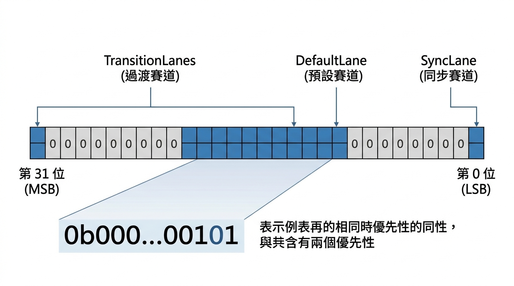

---
mdx:
  format: md
---

> 課程：JavaScript 與 React 底層原理
> 第 15 堂：Lane 模型基礎

# 48 Lane 的位元表示法

在上一節中，我們理解了 React 為什麼需要一套「優先級系統」來區分緊急與非緊急的更新。想像一下，如果 React 是一個交警，他現在手裡拿到了一堆不同任務：有的要立即變更輸入框文字（緊急），有的要從後端抓取資料後更新列表（不緊急）。

如果你是這位交警，你會如何記錄這堆任務？你可能會想：「簡單啊，用一個陣列 `[priority1, priority2]` 存起來，或者給每個任務一個數字編號。」

但在 React 的底層架構中，工程師們做出了一個極其聰明、甚至是有些「硬核」的決定：他們不使用陣列，也不使用簡單的物件，而是使用了電腦科學中最古老且高效的技術——**位元遮罩（Bitmask）**。

為什麼 React 執著於處理 0 與 1 的二進位運算？這背後隱藏著對效能的極致追求。


## 從 ExpirationTime 到 Lane：一場思維革命

在 React 16 的早期版本中，優先級是用一種叫做 `ExpirationTime`（過期時間）的數字來表示的。當時的邏輯很直覺：數字越小，代表截止日期越近，優先級就越高。

但這種「單一數字」的模型遇到了一個棘手的問題：**它很難表示「一組」任務。**

想像一個場景：你正在進行一個低優先級的背景渲染（任務 A），突然使用者輸入了一個字元（任務 B，高優先級）。在舊架構下，任務 B 會直接「蓋掉」任務 A，或者你必須透過複雜的數學計算來決定現在該做誰。

React 團隊意識到，他們需要的不是一個「排隊順序」，而是一套**「賽道系統」**。

- 有些賽道（Lane）是給救護車走的（緊急 UI 更新）。
- 有些賽道是給大卡車走的（大量資料處理）。
- 重點是：我們可以同時觀察多條賽道的狀況，並隨時決定要合併哪些賽道一起處理。

為了實現這種「多賽道同時管理」的靈活性，React 引入了 **Lane 模型**，並選擇了 **Bitmask（位元遮罩）** 作為資料結構。

## 什麼是 Bitmask？32 位元的「超迷你陣列」

在 JavaScript 中，雖然數字通常以 64 位元浮點數儲存，但在進行位元運算（如 `&`, `|`）時，JS 會將其視為 **32 位元的有號整數**。

React 利用了這 32 個位元（Bit），將每一個位元都想像成一條「賽道」。
一個 32 位元的整數看起來像這樣：

`0b00000000000000000000000000000000`

每一個位置的 `0` 或 `1`，都代表了一種特定的優先級狀態。例如：

- 最後一位（最右邊）可能是最緊急的 `SyncLane`。
- 中間某一位可能是處理使用者滾動的 `InputContinuousLane`。
- 更左邊的可能是 `TransitionLane`。

### 視覺化：React Lane 的 32 位元結構

為了幫助你直觀理解，我們可以把這 32 位元看作是一條擁有 32 線道的超級公路。



> *32 位元 Lane 結構圖：每一位元代表一條獨立的賽道，1 表示該賽道有任務正在排隊，0 表示空閒。*

透過這種方式，React 只需要用 **一個數字**（例如 `21`），就能代表一整組複雜的任務集合。例如 `0b101`（十進位的 5）代表了「第 0 條賽道」和「第 2 條賽道」都有任務要處理。

## 位元運算的魔力：極致的 O(1) 效能

你可能會問：「為什麼不直接用一個陣列 `[ 'SyncLane', 'DefaultLane' ]`？那樣不是更易讀嗎？」

答案只有兩個字：**效能**。

React 的 Reconciliation（協調）過程是一個每秒鐘可能執行數千次的循環。在這個循環裡，React 需要不斷地問三個問題：

1. 現在這批任務中，有沒有包含「某個特定的優先級」？
2. 我想把一個新的任務「加入」到目前的任務群中。
3. 我想把已經做完的任務「移出」任務群。

如果使用陣列，這些操作通常需要遍歷（Loop），複雜度是 **O(N)**。但在位元運算面前，這些都只需要一個 CPU 指令，複雜度是完美的 **O(1)**。

讓我們來看看 React 是如何操作這些「賽道」的：

### 1. 合併賽道：OR (|) 運算

當有多個不同優先級的更新同時發生時，React 需要將它們「合併」到一個待處理的集合（Pending Lanes）中。

在二進位中，`OR` 運算的邏輯是：只要其中一個是 `1`，結果就是 `1`。

```javascript
// 假設 SyncLane 是 0b0001
// 假設 DefaultLane 是 0b0100
const SyncLane = 0b0001;
const DefaultLane = 0b0100;

// 將兩個賽道合併
let pendingLanes = 0b0000;
pendingLanes = pendingLanes | SyncLane;    // 現在是 0b0001
pendingLanes = pendingLanes | DefaultLane; // 現在是 0b0101 (包含兩個賽道)
```

**語意：** 「我要把這條賽道也加進我的工作清單裡。」

### 2. 檢查包含：AND (&) 運算

在渲染過程中，React 需要檢查目前的 `WorkInProgress` 任務是否包含某個特定優先級，以決定是否要中斷或跳過。

`AND` 運算的邏輯是：只有兩者都是 `1`，結果才是 `1`。

```javascript
const currentLanes = 0b0101; // 裡面有 Sync 和 Default
const SyncLane = 0b0001;

// 檢查 currentLanes 裡面是否有 SyncLane
const hasSync = (currentLanes & SyncLane) !== 0; 
// 0b0101 & 0b0001 => 0b0001 (結果非 0，代表存在)

const InputLane = 0b0010;
const hasInput = (currentLanes & InputLane) !== 0;
// 0b0101 & 0b0010 => 0b0000 (結果為 0，代表不存在)
```

**語意：** 「檢查我的清單裡有沒有這項任務。」

### 3. 移除賽道：AND + NOT (~ ) 運算

當某個優先級的任務執行完畢後，我們需要將它從待處理清單中剔除。

`NOT`（取反）會把 `1` 變 `0`，`0` 變 `1`。結合 `AND` 就能精準地「關掉」某個位元。

```javascript
let pendingLanes = 0b0101; // 裡面有 Sync 和 Default
const SyncLane = 0b0001;

// 移除 SyncLane
pendingLanes = pendingLanes & ~SyncLane; 
// ~0b0001 => 0b1110 (除了最後一位，其餘全開)
// 0b0101 & 0b1110 => 0b0100 (成功移除最後一位，剩下 Default)
```

**語意：** 「這條賽道的事情做完了，把它從清單劃掉。」

## 效能對比：為什麼不選陣列？

為了讓你感受位元運算的威力，我們來比較一下。假設我們正在處理 React 的 `workLoop`，需要頻繁判斷任務優先級。

| 操作 | 陣列實作 (Array) | 位元遮罩實作 (Bitmask) |
| --- | --- | --- |
| **合併任務** | `lanes.push(newLane)` (需處理重複) | `lanes \| newLane` (一瞬完成) |
| **檢查任務** | `lanes.includes(target)` (需遍歷陣列) | `(lanes & target) !== 0` (CPU 指令) |
| **記憶體佔用** | 每個陣列都是一個物件，佔用較多 Heap | **僅佔用 4 個位元組 (32 bits)** |
| **垃圾回收 (GC)** | 頻繁建立/修改陣列會產生 GC 壓力 | 數值型別（Primitive），幾乎無 GC 負擔 |

在 React 這種需要極致流暢度的框架中，每 1 毫秒的省下都至關重要。位元運算讓 React 能夠在毫秒級的時間內，對成千上萬個 Fiber 節點進行優先級的篩選與計算，而不會因為資料結構的遍歷導致 UI 掉幀。

## React 原始碼中的 Lane 常數定義

在 React 的原始碼中（例如 `ReactFiberLane.js`），你會看到類似這樣的定義方式。雖然看起來很陌生，但現在你已經知道這是在分配「賽道」了：

```javascript
// 簡化版的 React 原始碼示意
export const NoLanes = 0b0000000000000000000000000000000;
export const NoLane  = 0b0000000000000000000000000000000;

export const SyncLane          = 0b0000000000000000000000000000001;
export const InputContinuousLane = 0b0000000000000000000000000000100;
export const DefaultLane       = 0b0000000000000000000000000010000;
export const TransitionLane1   = 0b0000000000000000000000001000000;
// ...以此類推
```

你會發現，這些數字通常都是 2 的次方（1, 2, 4, 8, 16...），這確保了每個常數在 32 位元中只佔據唯一的「1」，不會互相重疊。

### 進階設計：Lane 的「批次」概念

有趣的是，React 並非只用一個位元。對於一些可以「合併處理」的任務（例如 `Transition`），React 會分配一整組位元給它（TransitionLanes），這讓 React 可以實作更細緻的調度邏輯，比如「處理這一組過渡更新，但跳過另一組」。

## 總結：用二進位解構複雜性

當我們談論 React Fiber 的強大時，往往會想到可中斷渲染、想到併發模式。但這一切的底層調度，其實都建立在這些微小的位元運算之上。

React 棄用 `ExpirationTime` 改用 `Lane`，是從「單線程排隊」進化到了「多線程賽道」的思維。透過 Bitmask，React 獲得了：

1. **表達力**：一個數字就能表示一組複雜的任務組合。
2. **靈活性**：可以隨時合併、拆分、過濾不同的優先級賽道。
3. **極致效能**：利用 CPU 原生的位元運算，達成 O(1) 的處理速度。

這種對底層效能的斤斤計較，正是 React 能在處理複雜 UI 互動時，依然保持手感順滑的秘訣之一。

## 賽道分類預覽

現在你已經掌握了這套「計數方式」的底層工具——Bitmask。你了解了 OR 如何合併賽道，AND 如何過濾任務。這就像是你已經學會了如何看懂交通標誌和紅綠燈。

但公路上的車輛也是分等級的。有些是火急火燎的救護車，有些是按部就班的公車，還有些是正在路邊緩慢行進的清掃車。

在下一節中，我們將具體揭開 React 公路上這些「車輛」的真實身份：我們將深入探討 **SyncLane**、**InputContinuousLane**、**DefaultLane** 等具體的分類，以及它們分別在什麼樣的 React 代碼（如 `flushSync` 或普通的 `setState`）中被觸發。

---

### 理解核心：位元運算的語意對照表

在進入下一節前，請確保你腦中已經建立了這張對照表，這對閱讀 React 相關技術文章非常有幫助：

- `lanes | nextLane`：任務疊加（這兩件事我都要做）。
- `lanes & targetLane`：任務識別（我的清單裡有沒有這件事？）。
- `lanes & ~targetLane`：任務標註完成（這件事做完了，拿掉）。
- `lanes === NoLanes`：閒置狀態（目前沒有任何賽道有車）。

掌握了這些，你就已經比 90% 的 React 開發者更接近 Fiber 的核心靈魂了。


