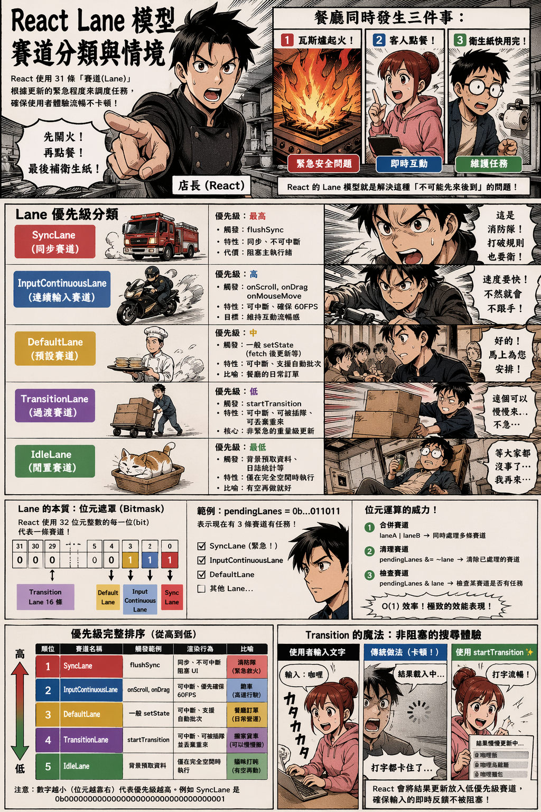

---
mdx:
  format: md
---

> 課程：JavaScript 與 React 底層原理
> 第 15 堂：Lane 模型基礎

# 49 Lane 的分類與情境

想像一下你正在一間繁忙的餐廳內。現在同時發生了三件事：第一，某桌客人的瓦斯爐突然冒出火花（緊急安全問題）；第二，一位客人正向你點餐（即時互動）；第三，洗手間的衛生紙快用完了（維護任務）。

作為店長，你不可能按照「先來後到」的順序去處理。你一定會先衝過去關掉瓦斯，然後記錄客人的點餐，最後在空閒時去補衛生紙。

在 React 的世界裡，這就是 **Lane 模型** 要解決的問題。在上一部分，我們學習了 Lane 在底層是如何透過 32 位元的「位元遮罩（Bitmask）」來高效存取的；現在，我們要進入 React 的調度辦公室，看看 React 究竟定義了哪些「賽道（Lanes）」，以及它如何根據現實開發場景，決定誰該跑在快車道，誰又該在慢車道等待。

## 為什麼不能只有「高、中、低」三種優先級？

在進入具體的分類之前，我們先思考一個問題：為什麼 React 不簡單地定義 `High`、`Medium`、`Low` 三個級別就好？

這涉及到 React 18 的核心目標：**併發渲染（Concurrent Rendering）**。在複雜的應用中，我們可能同時有多個「非緊急更新」在進行。例如，使用者正在輸入搜尋關鍵字（緊急），同時分頁清單正在載入（非緊急 A），且背景還在預取下一頁的資料（非緊急 B）。

如果只有三種優先級，非緊急 A 與 B 會被揉雜在一起。但透過 Lane 模型（31 條賽道），React 可以：

1. **精準分離：** 讓「搜尋」完全不被「載入」阻塞。
2. **批次處理（Batching）：** 透過位元運算，React 可以瞬間決定「現在我要同時處理賽道 1、2、3 的任務」，這在舊有的優先級系統中是很難優雅實現的。
3. **更細粒度的控制：** 每一條賽道都可以獨立被暫停、恢復或丟棄。

接下來，我們就由高至低，逐一拆解 React 內部的核心賽道分類。

## SyncLane：打破規則的消防隊員

**SyncLane** 是 React 中優先級最高的賽道。它對應的是「同步且不可中斷」的更新。

### 觸發情境

在 React 18 之後，絕大多數的 `setState` 都會被自動批次處理（Automatic Batching），這意味著它們通常不會落在 `SyncLane`。但在以下場景，你會看到它的身影：

- `**flushSync**`** 呼叫：** 當你明確使用 `flushSync(() => setState(...))` 時，React 會被迫將這個更新放入 `SyncLane`。這通常用於需要「立即」讀取更新後 DOM 的極少數場景。
- **非 React 管理的邊界情況：** 雖然 React 18 盡力批次處理所有事件，但在某些過渡期的原生事件處理器中，若 React 判斷必須立即同步以維持 UI 完整性，也可能動用此賽道。

### 設計代價

`SyncLane` 的代價是昂貴的。它會**阻塞主執行緒**，就像消防車出動時所有車輛必須停下。一旦進入 `SyncLane`，Fiber 架構的「可中斷性」就會失效，React 會一次執行到底直到渲染完成。因此，過度使用 `flushSync` 會讓你的應用重回 React 15 那種卡頓的舊時代。

## InputContinuousLane：流暢互動的關鍵

當使用者在畫面上拖曳一個方塊，或是快速捲動列表時，React 該如何反應？這就是 **InputContinuousLane（連續輸入賽道）** 的職責。

### 連續事件 vs 離散事件

React 將使用者互動分為兩類：

1. **離散事件（Discrete Events）：** 如 `click`、`keydown`、`touchstart`。這些事件有明確的開始與結束，優先級非常高。
2. **連續事件（Continuous Events）：** 如 `scroll`、`drag`、`mousemove`、`wheel`。

### 為什麼它排在第二？

連續事件的特點是「高頻率發生」。如果你在 `onMouseMove` 裡更新狀態，React 會將其標記為 `InputContinuousLane`。
它的優先級低於「點擊」，但高於「一般更新」。原因很直覺：如果拖曳方塊的反應比一般的資料載入還慢，使用者會感覺到明顯的「殘影」或「不跟手」。React 必須確保這些與視覺流暢度直接相關的更新，能優先於資料處理。

## DefaultLane：日常開發的「麵包與奶油」

這是你最常遇到的賽道。當你在點擊事件中呼叫 `useState` 的 setter，且沒有任何特殊標記時，這個更新通常就會落在 **DefaultLane**。

### 特性

- **預設行為：** 大多數透過 `fetch` 拿回資料後的 `setState` 都在這裡。
- **批次更新：** `DefaultLane` 完美支援 React 18 的自動批次更新。如果在同一個微任務（Microtask）中有多次 `DefaultLane` 的更新，React 會將它們合併成一次渲染。

這就像是餐廳裡的一般訂單。它們很重要，需要按順序處理，但如果現在有人點餐（點擊事件）或是廚房起火（同步更新），這些一般訂單可以稍微等幾毫秒。

## TransitionLane：Concurrent React 的重頭戲

這是 React 18 最引以為傲的設計。**Transition（過渡）** 是指那些「不影響即時反饋」的重量級 UI 變更。

### 什麼是 Transition？

想像一個搜尋功能：

1. 使用者在 `input` 輸入文字。
2. `input` 的數值要立即跳動（緊急）。
3. 下方的搜尋結果清單要更新（非緊急，可能很耗時）。

如果你把兩者都放在 `DefaultLane`，搜尋結果的計算會卡住 `input` 的顯示，讓使用者覺得打字很卡。

### startTransition 的魔力

當你使用 `startTransition(() => { setResults(data); })` 時，React 會將這個更新分配到 **TransitionLane**。

- **複數賽道：** 實際上，React 定義了多個 `TransitionLanes`（通常有 16 條）。這允許不同的 Transition 任務並行存在而不互相阻塞。
- **可被插隊：** `TransitionLane` 的優先級極低。如果 React 正在渲染搜尋結果，而使用者又打了一個字，React 會毫不猶豫地**丟棄**當下進行到一半的渲染，優先處理新的輸入，處理完後再重新開始搜尋結果的渲染。

這就是為什麼 `Transition` 能解決大型 React 應用卡頓的關鍵：它承認有些更新就是不急，可以「慢慢來」，甚至「重做也沒關係」。

## IdleLane：極致的閒置利用

最後是 **IdleLane**。這是給那些「如果現在沒事做，就順便做一下」的任務。

### 應用場景

- **預取資料（Pre-fetching）：** 當使用者停留在某個頁面，你可以偷偷啟動一個 Idle 優先級的更新，去快取下一頁的內容。
- **日誌統計（Analytics）：** 傳送一些不影響使用者感知的追蹤數據。

`IdleLane` 只有在 Call Stack 完全清空，且沒有任何更高等級的 Lane 在排隊時，才會被執行。

---

## 優先級圖譜：從高到底的完整排序

為了讓你更有體感，我們將這些賽道排列如下：

| 賽道名稱 | 優先級 | 觸發範例 | 渲染行為 |
| --- | --- | --- | --- |
| **SyncLane** | 最高 (1) | `flushSync` | 同步、不可中斷、阻塞 UI |
| **InputContinuousLane** | 高 (2) | `onScroll`, `onDrag` | 可中斷、優先確保 60FPS |
| **DefaultLane** | 中 (3) | 一般 `setState` | 可中斷、支援自動批次 |
| **TransitionLane** | 低 (4) | `startTransition` | 可中斷、可被高等級插隊並丟棄重來 |
| **IdleLane** | 最低 (5) | 背景預取資料 | 僅在完全空閒時執行 |

> **注意：** 在 React 源碼中，數字越小（位元越靠右）代表優先級越高。例如 `SyncLane` 是 `0b0000000000000000000000000000001`。

---

## 深入思考：為什麼要分這麼細？

你可能會問：「既然有了優先級排序，為什麼不直接用 1 到 5 的數字就好？為什麼要用到 31 個位元的 Bitmask？」

這回到了我們上一部分提到的**位元運算優勢**。

### 1. 賽道的「組合」能力

在 React 的調度循環中，經常需要詢問：「現在有哪些賽道是有任務的？」
如果用陣列存儲，你需要遍歷；但用 Lane，React 只需要檢查一個變數 `pendingLanes`。
如果 `pendingLanes` 的值是 `0b...0110`，React 瞬間就知道：賽道 2（InputContinuous）和賽道 3（Default）都有工作要做。

### 2. 賽道的「清理」與「合併」

當 React 完成了一次渲染，它需要清除剛才處理掉的優先級。這只需要一個位元運算：
`pendingLanes &= ~lastProcessedLanes;`
這種 O(1) 的效率，在每秒鐘可能發生數十次更新的複雜 UI 中，能節省寶貴的 CPU 時間。

### 3. 多重過渡（Multiple Transitions）

Transition 賽道之所以有 16 條，是因為 React 希望能**區分不同的 Transition**。
如果你同時啟動了「切換分頁」和「更新側邊欄」兩個 Transition，React 可以將它們放在不同的 `TransitionLane`。如果「切換分頁」被取消了，React 只需要清除對應的那一個位元，而不需要影響另一個正在進行的 Transition。

## 從底層邏輯看 React 的進化

理解了 Lane 的分類，你就會發現 React 的演進史其實就是一部「如何更聰明分配時間」的歷史。

- **React 15（Stack Reconciler）：** 只有一條賽道，所有更新都是 `SyncLane`。
- **React 16/17（初期 Fiber）：** 引入了 `ExpirationTime`，開始有了「高、低」優先級的概念，但難以處理多個異步任務重疊的情況。
- **React 18（Concurrent Fiber）：** 引入 Lane 模型。不再只是「誰先過期」，而是「這件事屬於哪個類別」。

這讓 React 轉向了**宣告式調度（Declarative Scheduling）**。身為開發者，你不再需要手動計算什麼時候該更新，你只需要告訴 React：「這是一個 Transition（過渡）」，React 就會自動將它放入正確的賽道，並與其他數十個賽道協作。

## 總結與銜接

在本部分中，我們將抽象的位元（Bits）轉化為了具體的開發場景：

- **SyncLane** 是為了應對極少數必須同步的緊急狀況。
- **InputContinuousLane** 負責確保動畫與滾動的滑順感。
- **DefaultLane** 處理絕大多數日常的業務邏輯。
- **TransitionLane** 則是併發模式的核心，讓耗時更新不再阻塞使用者操作。
- **IdleLane** 則壓榨出最後一點效能，用於非必要任務。

掌握了「賽道分類」後，你已經理解了 React 內部的「決策邏輯」。但決策之後還需要執行——React 到底是怎麼在瀏覽器的每一幀之間，「跑跑停停」地處理這些賽道的任務呢？

這就是我們下一堂課的主題：**Scheduler（調度器）的運作機制**。我們將深入探討 React 如何利用 `MessageChannel` 模擬出一個比 `setTimeout` 更強大的排程系統，來實踐我們今天聊到的這些優先級。

但在那之前，讓我們先透過一個簡單的回顧，確認你已經完全掌握了 Lane 模型的核心概念。加油，你離 React 底層大師又更近一步了！

## 核心知識點回顧

- **Lane 的本質：** 它是對更新任務的「分類」與「標籤」，讓 React 能區分緊急程度。
- **位元遮罩（Bitmask）：** 使用 32 位元整數是為了極致的效能，以及能同時表示多個賽道（併發）的能力。
- **優先級權衡：** React 優先保證使用者即時互動（點擊、輸入、滾動），而後才是資料渲染與背景任務。
- **Transition 的重要性：** 透過將耗時任務標記為低優先級，React 實現了 UI 的「非阻塞」更新，這是 Concurrent Mode 的靈魂。
  
