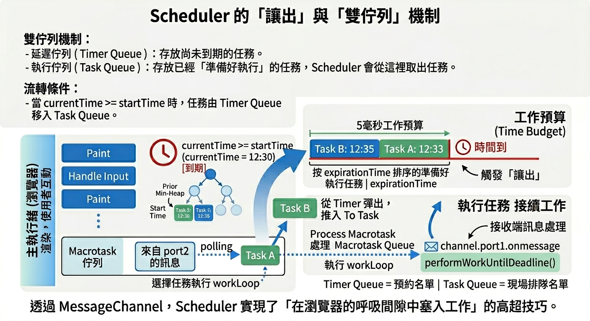
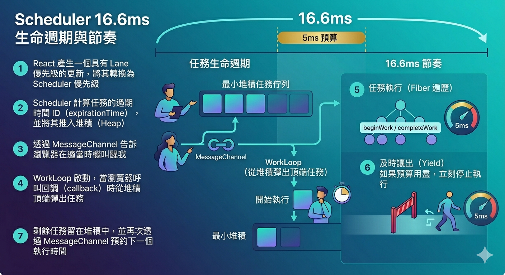

---
mdx:
  format: md
---

> 課程：JavaScript 與 React 底層原理
> 第 16 堂：Lane 模型收尾

# 50 Scheduler 任務排程

在上一節中，我們深入探討了 **Lane 模型**，了解到 React 如何利用 32 位元的位元遮罩（Bitmask）來精細地定義更新的「優先程度」。然而，光有優先級標籤是不夠的。想像一下，如果一個急診室（React）標記了十位病人的嚴重程度（Lanes），但卻沒有一個專門的調度員（Scheduler）來安排哪位護理師在什麼時間點去處理哪位病人，那麼整間醫院依然會陷入混亂。

React Scheduler 就是那個手持碼表與排程表的「調度總管」。它不關心什麼是 Virtual DOM，也不關心什麼是 Hooks，它唯一關心的只有一件事：**在正確的時間點，執行正確的任務，並且絕對不能讓瀏覽器感到「卡頓」。**

## 任務調度員的定位：為什麼要獨立出來？

在深入技術細節前，我們必須先釐清一個關鍵架構：**Scheduler 是一個獨立的套件（**`**scheduler**`** package）**。

雖然我們通常將其視為 React 的一部分，但 React 團隊刻意將其設計成與框架解耦。理論上，你可以把 Scheduler 拿去用在任何需要任務優先級調度的 JavaScript 專案中。這種設計反映了 React 的分工哲學：

1. **React 核心（Reconciler）**：負責定義「做什麼」（Diffing、Update）。它會將任務標記上 **Lane**，這代表了業務邏輯上的優先級。
2. **Scheduler**：負責決定「何時做」。它接收 React 交辦的任務，根據 **Expiration Time（到期時間）** 將其排入排程，並決定何時該把主執行緒（Main Thread）還給瀏覽器。

### Lane 與 Scheduler 的分工與映射

你可能會問：「既然已經有了 Lane，為什麼還需要 Scheduler 的優先級？」

這是因為 Lane 是為了 React 內部的 **Concurrent Mode（併發模式）** 設計的，它能表達「多個更新是否屬於同一個批次」。而 Scheduler 需要的是更通用的時間管理概念。當 React 準備好一個更新任務後，它會將內部的 Lane 轉換（映射）為 Scheduler 的五個優先級之一，然後交給 Scheduler 去排隊：

- **ImmediatePriority**：立即執行（例如：由 `flushSync` 觸發的更新）。
- **UserBlockingPriority**：使用者互動（例如：點擊事件、輸入）。
- **NormalPriority**：一般更新（例如：網路請求回傳後的資料渲染）。
- **LowPriority**：低優先級（例如：日誌記錄）。
- **IdlePriority**：閒置時執行。

這種映射關係，確保了 React 的業務邏輯能與底層的時間調度完美銜接。

## 核心資料結構：為什麼選擇最小堆積 (Min-Heap)？

在 Scheduler 內部，所有的任務都不是排在一個簡單的「陣列」或「佇列」中。如果我們使用普通的陣列，每次要找出「下一個最緊急的任務」時，我們都必須遍歷整個陣列（時間複雜度 $O(n)$），這在任務眾多時會產生明顯的效能開銷。

為了實現最高效率的提取，Scheduler 使用了 **最小堆積（Min-Heap）** 這種資料結構。

### 什麼是 Min-Heap？

Min-Heap 是一種完全二元樹（Complete Binary Tree），它滿足一個特性：**父節點的值永遠小於或等於其子節點的值**。這意味著，整棵樹的「根節點」永遠是值最小的那一個。

在 Scheduler 的語境下，這個「值」就是任務的 **Expiration Time（到期時間）**。到期時間越早，代表任務越緊急，越應該排在前面。

- **取出最緊急任務（Peek/Pop）**：時間複雜度 $O(1)$ 或 $O(\log n)$。
- **插入新任務（Push）**：時間複雜度 $O(\log n)$。

這種資料結構讓 Scheduler 即使面對成千上萬個待處理任務，也能在毫秒間決定接下來該執行誰。

## Expiration Time：計算任務的「生存期限」

Scheduler 如何判斷一個任務有多緊急？答案就在 **Expiration Time（到期時間）** 的計算公式中。

每一個任務在建立時，都會根據其優先級被分配一個 `timeout`。計算邏輯大致如下（虛擬碼）：

```javascript
// 不同優先級對應的 Timeout 常數
const IMMEDIATE_PRIORITY_TIMEOUT = -1;
const USER_BLOCKING_PRIORITY_TIMEOUT = 250;
const NORMAL_PRIORITY_TIMEOUT = 5000;
const LOW_PRIORITY_TIMEOUT = 10000;
const IDLE_PRIORITY_TIMEOUT = 1073741823; // 很大的數

function scheduleCallback(priorityLevel, callback) {
  var currentTime = getCurrentTime(); // 當前效能計時器的時間
  var startTime = currentTime;        // 預設立即開始

  // 計算到期時間
  var timeout;
  switch (priorityLevel) {
    case ImmediatePriority:
      timeout = IMMEDIATE_PRIORITY_TIMEOUT;
      break;
    case UserBlockingPriority:
      timeout = USER_BLOCKING_PRIORITY_TIMEOUT;
      break;
    // ...以此類推
  }

  var expirationTime = startTime + timeout;

  var newTask = {
    id: taskIdCounter++,
    callback,
    priorityLevel,
    startTime,
    expirationTime,
    sortIndex: -1, // 在 Heap 中的排序依據
  };

  // ... 將任務推入 Heap
}
```

### 這裡隱藏了兩個關鍵設計：

1. **為什麼 **`**ImmediatePriority**`** 的 timeout 是 -1？**
這意味著它的 `expirationTime`（`currentTime - 1`）會比當前時間還要早。對於 Scheduler 來說，任何「已經到期」的任務都具有最高的執行迫切性。
2. **飢餓問題（Starvation）與強制同步執行**：
這是一個非常重要的機制。在 Concurrent Mode 中，低優先級任務（如 `TransitionLane`）可能會不斷被高優先級任務（如使用者輸入）「插隊」。
**但是，低優先級任務不能永遠不執行。** 當 `currentTime` 超過了任務的 `expirationTime` 時，該任務就會被視為 **「過期（Overdue）」**。一旦過期，Scheduler 就會提升其優先級，甚至在某些情況下強迫 React 同步執行完這個任務，以保證最終的一致性與反應靈敏。這就是為什麼你的後台資料加載再慢，最終也一定會顯示出來的原因。

## 5ms 時間切片與 MessageChannel 的妙用

回憶一下我們在 Topic 4 學習過的 **Event Loop**。JavaScript 是單執行緒的，如果一個渲染任務執行太久（例如超過 16.6ms），瀏覽器就沒時間進行繪製（Paint）與處理使用者輸入，進而導致掉幀。

Scheduler 為了避免這種情況，實施了 **時間切片（Time Slicing）**。

### 5ms 的「停看聽」預算

在執行任務的 `workLoop` 中，Scheduler 每處理完一個小的工作單元（Fiber 節點），就會檢查一次時間。React 預設給予 Scheduler 的時間切片約為 **5ms**。

這是一個經驗數值：它足夠短，短到不會讓使用者感覺到輸入延遲；它也足夠長，長到足以讓 JavaScript 引擎執行相當數量的運算。如果 5ms 到了，但任務還沒做完，Scheduler 就會執行「暫停」，將控制權還給瀏覽器。

### 為什麼選擇 MessageChannel 而非 setTimeout(0)？

當 Scheduler 決定「暫停並讓出控制權」後，它需要一個機制在「瀏覽器處理完雜事後，儘快通知我回來繼續工作」。這本質上需要發起一個 **Macrotask（巨任務）**。

你可能會首先想到 `setTimeout(fn, 0)`。但在實作 Scheduler 時，React 團隊避開了它，轉而選擇了 `MessageChannel`。

這是因為瀏覽器有一個為了節能而設計的限制：**當 **`**setTimeout**`** 被巢狀調用（Nested call）超過 5 次時，瀏覽器會強制加上至少 4ms 的延遲。**

對於需要極高性能的 React 渲染來說，每一幀只有 16.6ms。如果每切片一次都要被「課稅」4ms，那效能損耗將高達 25%。這對於追求流暢度的併發模式來說是不可接受的。

`**MessageChannel**`** 的優勢：**

- 它屬於 Macrotask，會在目前同步程式碼執行完、微任務（Microtask）佇列清空後，以及瀏覽器嘗試渲染前執行（視情況而定）。
- **它沒有 4ms 的巢狀延遲限制。** 它能以接近 0ms 的延遲觸發回調，極大地提高了調度的精準度。

### 虛擬碼：Scheduler 的「讓出」邏輯

```javascript
const channel = new MessageChannel();
const port = channel.port2;

// 當 5ms 預算用完時呼叫
function yieldToMain() {
  // 發送訊息給自己，排入 Macrotask 佇列
  port.postMessage(null);
}

// 接收到訊息，回來繼續工作
channel.port1.onmessage = function() {
  performWorkUntilDeadline();
};
```

透過 `MessageChannel`，Scheduler 實現了「在瀏覽器的呼吸間隙中塞入工作」的高超技巧。



## 雙佇列機制：延遲佇列 (Timer Queue) vs 執行佇列 (Task Queue)

並非所有的任務都是「現在就想執行」。有些任務帶有 `delay` 參數（例如：在某個時間點後才需要處理的低優先級更新）。為了管理這些任務，Scheduler 內部維護了兩個 Min-Heap：

1. **Task Queue（執行佇列）**：
  - 存放已經「準備好執行」的任務。
- 排序依據：`expirationTime`。
- Scheduler 會從這裡取出任務進行 `workLoop`。
2. **Timer Queue（延遲佇列）**：
  - 存放「時間還沒到」的任務（帶有 `delay`）。
- 排序依據：`startTime`（即 `currentTime + delay`）。

### 任務的流轉過程

當 `startTime` 最小的延遲任務終於「到點」了（即 `currentTime >= startTime`），Scheduler 就會將它從 `Timer Queue` 中彈出，推入 `Task Queue` 中等待執行。

這就像是餐廳的訂位系統：

- **Timer Queue** 是預約名單（按預約時間排序）。
- **Task Queue** 是現場排隊名單（按緊急程度或到期時間排序）。
- 當預約時間到了，客人就從預約名單轉移到現場排隊名單。

這種設計讓 Scheduler 能夠在不阻塞主執行緒的情況下，精確地管理大量具有不同時間特性的非同步任務。

## 總結：Scheduler 如何在 16.6ms 內舞動？

讓我們把所有零件組合起來，看看一個任務的生命週期：

1. **任務進場**：React 產生一個更新，透過映射將 Lane 轉為 Scheduler 優先級，呼叫 `scheduleCallback`。
2. **計算期限**：Scheduler 根據優先級算出身分證（`expirationTime`），並將其推入 **Min-Heap (Task Queue)**。
3. **發起請求**：Scheduler 透過 `**MessageChannel**` 告訴瀏覽器：「我這有活要幹，你忙完這陣子記得叫我。」
4. **開始工作 (WorkLoop)**：當瀏覽器執行到 `MessageChannel` 的回調時，Scheduler 啟動 `workLoop`，從 Heap 頂端取出最緊急的任務。
5. **執行與檢查**：執行任務中的 Fiber 遍歷（`beginWork` / `completeWork`）。每執行完一個節點，檢查一次時間。
6. **及時讓出**：如果 **5ms** 預算耗盡，立刻停止。
7. **恢復現場**：Scheduler 將尚未完成的任務留在 Heap 中，再次透過 `MessageChannel` 預約下一次的執行時間。

這種「跑跑停停、精確計算、不佔用額外秒數」的機制，就是 React 18 能夠在背景執行複雜計算，卻能同時讓你的 Input 輸入框保持極速反應的秘密。




## 從調度走向流暢：邁向 startTransition

理解了 Scheduler 的精密排程後，你就能理解為什麼低優先級任務可以被「慢慢處理」。在下一部分中，我們將學習 `startTransition`。

`startTransition` 的本質，其實就是告訴 React：「請把這個更新標記為 `TransitionLane`（低優先級）。」接著，React 會告訴 Scheduler：「這個任務的 `timeout` 是 10 秒（`LowPriority`）。」

於是，Scheduler 就會氣定神閒地將它排在所有使用者互動任務之後，只有在 CPU 真正空閒的時候，才撥出那寶貴的 5ms 來推動它。這正是 Concurrent Mode 優雅處理重型渲染的核心手段。

---

## 關鍵要點總結

- **獨立性**：Scheduler 是獨立套件，負責「時間管理」，與 React Reconciler 的「邏輯管理」分離。
- **Min-Heap**：使用最小堆積資料結構，以 $O(1)$ 的效率獲取下一個最到期的任務。
- **Expiration Time**：優先級越高，`timeout` 越短。過期（Overdue）任務會被強制執行以防「飢餓」。
- **MessageChannel**：避開 `setTimeout` 的 4ms 延遲稅，實現精準的高頻率任務切換。
- **時間切片**：預設 5ms 的工作預算，確保主執行緒每隔一段時間就能回到瀏覽器手中，處理繪製與輸入。
