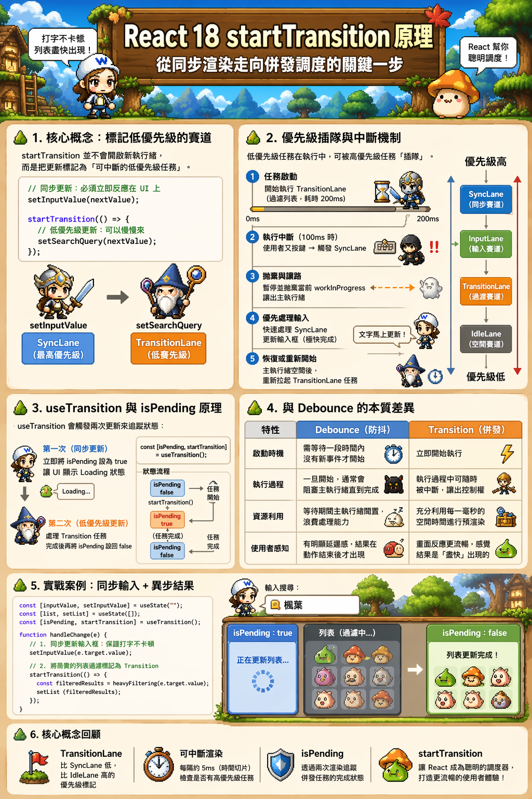
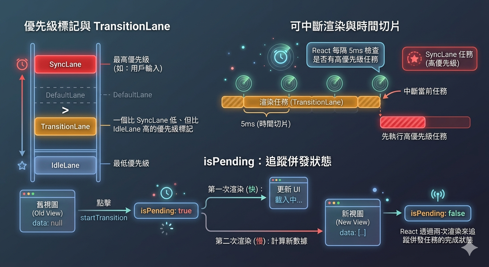

---
mdx:
  format: md
---

> 課程：JavaScript 與 React 底層原理
> 第 16 堂：Lane 模型收尾

# 51 startTransition 原理

想像你正在開發一個複雜的儀表板。當使用者在搜尋框輸入文字時，畫面下方需要即時過濾並渲染出五千筆資料的圖表。在 React 18 以前，你可能會發現搜尋框變得非常卡頓，因為 JavaScript 執行緒正忙著計算那五千筆資料，根本沒空理會使用者的下一個按鍵動作。

你可能會嘗試用 `setTimeout` 或 `debounce`（防抖）來延遲渲染，但這真的解決問題了嗎？為什麼有時候畫面還是會「凍結」一下？React 18 引入的 `startTransition` 究竟與我們用了十年的 `setTimeout` 有什麼本質上的不同？這背後隱藏了 React 從「同步渲染」轉向「併發調度」的最關鍵邏輯。

## Transition 的本質：標記低優先級的賽道

在深入程式碼之前，我們必須先釐清一個常見的誤解：`startTransition` 並不會像 `Web Worker` 那樣開啟另一個執行緒來運算，也不會像 `setTimeout` 那樣單純地把任務丟到未來的巨任務佇列（Macrotask Queue）。

它的本質是：**語義化地將某些狀態更新標記為「可中斷的低優先級任務」**。

### 從 Lane 模型看 Transition

在上一部分我們學習了 **Lane（賽道）模型**。React 18 內部定義了多種賽道，而 `startTransition` 的核心作用就是將其包裹的 `setState` 標記為 **TransitionLane**。

當你呼叫以下程式碼時：

```javascript
// 同步更新：必須立即反應在 UI 上
setInputValue(nextValue); 

startTransition(() => {
  // 低優先級更新：可以慢慢來
  setSearchQuery(nextValue); 
});
```

React 內部會執行以下邏輯：

1. **切換上下文**：進入一個特殊的執行環境，將當前的「更新優先級」調降為 `Transition`。
2. **收集更新**：在回調函數執行期間，所有觸發的 `setState` 都會被打上 `TransitionLane` 的標籤。
3. **恢復上下文**：回調結束後，恢復原本的優先級。

這意味著，`setInputValue` 會走 `SyncLane`（最高優先級），而 `setSearchQuery` 則會排入 `TransitionLane`。這兩者的差異，決定了 React 在面對主執行緒資源競爭時的調度策略。

### 為什麼不是非同步執行？

許多人以為 `startTransition` 的回調是異步的。事實上，**它是同步執行的**。React 需要立即執行這個回調，以便知道哪些狀態更新應該被歸類為 Transition。如果你在 `startTransition` 裡面寫了一個 `setTimeout`，裡面的 `setState` 反而會失去 Transition 的標籤，因為當 `setTimeout` 執行時，React 早已離開了 Transition 的上下文環境。

## 優先級插隊與中斷機制

理解了 Lane 的標記後，我們就能看見 `startTransition` 真正的威力：**可中斷性 (Interruptibility)**。這是連結我們之前學過的 Fiber 與 Scheduler 知識的終極應用。

### 場景回放：當高優先級任務「插隊」

假設使用者正在搜尋，而 `setSearchQuery` 觸發了一個耗時 200ms 的渲染任務：

1. **任務啟動**：Scheduler 收到一個 `TransitionLane` 任務。由於主執行緒目前空閒，React 開始在內存中的 `workInProgress` 樹上進行計算。
2. **執行中斷**：計算到 100ms 時，使用者又按下了鍵盤。瀏覽器產生了一個輸入事件，React 偵測到一個 `SyncLane`（同步賽道）的更新請求。
3. **拋棄與讓路**：由於 `SyncLane` 的優先級遠高於 `TransitionLane`，Scheduler 會立即讓出主執行緒。React 會**暫停（甚至丟棄）**當前進行到一半的 `workInProgress` 樹計算。
4. **優先處理輸入**：React 迅速處理 `setInputValue`，完成一次極短的同步渲染，搜尋框裡的文字瞬間更新，使用者感覺不到任何延遲。
5. **恢復或重新開始**：當 `SyncLane` 任務完成且主執行緒再次空閒，Scheduler 會重新拉起剛才被中斷的 `TransitionLane` 任務。

### 如何保留狀態並重新開始？

你可能會問：「中斷後，剛才算到一半的東西會不見嗎？」

這就是 **Fiber 雙緩衝架構** 的功勞。React 所有的計算都是在 `workInProgress` 樹上進行的，而畫面上顯示的是 `current` 樹。當中斷發生時，React 只需要停止對 `workInProgress` 的遍歷即可。

如果中斷是因為使用者輸入了新的字元（導致狀態改變），那麼剛才算到一半的結果就已經「過時」了。React 會直接**丟棄**這棵算到一半的樹，並基於最新的狀態重新開始一次全新的 `beginWork`。這種「計算可拋棄」的特性，是保持 UI 最終一致性的關鍵。

## useTransition 與 isPending 的運作原理

當我們使用 `useTransition` Hook 時，它會回傳一個陣列：`[isPending, startTransition]`。這個 `isPending` 是如何精準捕捉「後台正在忙碌」的狀態呢？

```javascript
const [isPending, startTransition] = useTransition();
```

這背後涉及了 React 的 **「雙重渲染」** 策略。當你呼叫 `startTransition` 時，React 實際上觸發了兩次更新：

1. **第一次（同步更新）**：React 會立即將 `isPending` 設為 `true`。這是一個高優先級的同步更新，目的是為了讓 UI 能立刻顯示 Loading 狀態（例如讓轉圈圈出現）。
2. **第二次（低優先級更新）**：React 開始處理你在回調函數中定義的實際 `setState`。這部分是 `TransitionLane`，它是可中斷的。當這部分計算完成並 commit 到 DOM 之後，React 會再發起一次更新，將 `isPending` 設回 `false`。

### 預測與發現

**問題**：如果你在一個元件裡同時呼叫 `setCount(c => c + 1)` 和 `startTransition(() => setCount(c => c + 1))`，最後畫面會跳 1 還是跳 2？

**答案**：最後會跳 2，但中間會經歷兩次渲染。第一次渲染時，畫面上會看到 count 增加 1（同步部分），隨後 React 會在後台繼續計算第二次增加（Transition 部分），最後再次更新畫面。這證明了 Transition 任務是與同步任務完全解耦且具備先後順序的。

## 與 Debounce 的本質差異

在 React 18 之前，我們處理昂貴渲染的標準做法是 **Debounce (防抖)** 或 **Throttle (節流)**。但 Transition 與它們有著哲學上的根本差異。

| 特性 | Debounce (防抖) | Transition (併發) |
| --- | --- | --- |
| **啟動時機** | 必須等待一段時間（如 300ms）內沒有新事件才開始。 | **立即開始** 執行。 |
| **執行過程** | 一旦開始，通常會阻塞主執行緒直到完成（同步執行）。 | 執行過程中 **可隨時被中斷**，讓出控制權。 |
| **資源利用** | 在等待的 300ms 內，主執行緒是閒置的，浪費了處理能力。 | 充分利用每一毫秒的空閒時間進行預渲染。 |
| **使用者感知** | 會有明顯的「延遲感」，結果總是在動作結束後才出現。 | 畫面反應更流暢，感覺結果是「盡快」出現的。 |

### 案例對比

想像一個「搜尋過濾列表」：

- **使用 Debounce**：你打了三個字，程式等待 300ms。這期間 CPU 什麼都沒做。300ms 後，程式一口氣花 100ms 渲染列表，畫面凍結。
- **使用 Transition**：你打第一個字，React 立即開始預渲染列表。當你打第二個字時，React 中斷當前渲染，優先更新搜尋框，然後繼續渲染列表。

**Transition 讓 React 從「被動等待」轉變為「主動調度」。** 它不再是為了避開卡頓而推遲工作，而是學會了在不卡頓的前提下，利用碎裂的時間片完成工作。

## UX 實踐：同步輸入與異步結果

在現代 Web 開發中，良好的 UX 遵循一個原則：**對使用者的輸入給予即時回饋，對昂貴的運算則展現進度。**

這就是所謂的「同步輸入 + 異步結果」模式。讓我們看一個實戰範例：

```javascript
function SearchApp() {
  const [inputValue, setInputValue] = useState("");
  const [list, setList] = useState([]);
  const [isPending, startTransition] = useTransition();

  const handleChange = (e) => {
    // 1. 同步更新輸入框：保證打字不卡頓
    setInputValue(e.target.value);

    // 2. 將昂貴的列表過濾標記為 Transition
    startTransition(() => {
      // 假設這是從幾萬筆資料過濾，非常耗時
      const filteredResults = heavyFiltering(e.target.value);
      setList(filteredResults);
    });
  };

  return (
    <div>
      <input value={inputValue} onChange={handleChange} />
      
      {/* 透過 isPending 讓使用者知道後台在忙，而不是畫面凍結 */}
      {isPending && <p>正在更新列表...</p>}
      
      <div style={{ opacity: isPending ? 0.5 : 1 }}>
        <ExpensiveList data={list} />
      </div>
    </div>
  );
}
```

### 為什麼這能解決 UI 凍結？

在上述程式碼中，`setInputValue` 確保了 `<input />` 的文字始終與使用者的擊鍵同步。而 `ExpensiveList` 的渲染被封裝在 `startTransition` 中。如果 `ExpensiveList` 渲染到一半時使用者繼續打字，React 會毫不猶豫地放棄舊的過濾任務，轉而處理新的擊鍵。

這種設計模式解決了傳統 React 應用中常見的 **「畫面閃爍」** 與 **「輸入延遲」** 問題。

### 必須遵守的守則：Transition 必須是純的

這裡有一個重要的技術細節：由於 Transition 任務可能被多次「中斷」與「重啟」，這意味著你的渲染函數（Function Component 本體）可能會被執行多次。

因此，**Transition 包裹的更新內容必須是「純函數式的」**。你絕對不能在 `startTransition` 的回調中進行 API 請求、修改全域變數或執行任何副作用。它的作用僅限於「觸發狀態更新」。

## 從調度走向併發的關鍵一步

`startTransition` 的出現，標誌著我們不再把 React 看作一個單純的「渲染庫」，而是一個具備「作業系統特質」的任務調度器。它利用了我們在 Topic 8 學到的 Fiber 鏈表結構與 Topic 9 學到的 Lane 優先級，實踐了真正的 **協作式多工 (Cooperative Multitasking)**。

透過將更新分類，React 能夠在有限的硬體資源下，優先保證與使用者互動最密切的任務執行。這正是 React 18 併發模式 (Concurrent Mode) 的核心靈魂。

### 核心概念回顧與連接

- **TransitionLane**：一個比 SyncLane 低、但比 IdleLane 高的優先級標記。
- **可中斷渲染**：React 在執行低優先級任務時，每隔 5ms（時間切片）會檢查是否有高優先級任務。
- **isPending**：React 透過兩次渲染來追蹤併發任務的完成狀態。
  
  

在理解了 Transition 如何優化單一元件的互動體驗後，你可能會好奇：如果整個應用程式有多個部分都在同時更新，React 又是如何從宏觀角度管理這一切的？這就是我們下一部分要探討的主題：**Concurrent Mode 全景**。我們將整合 Fiber、Lane 與 Scheduler，看看 React 如何構建出一套完整且聰明的調度機制。
