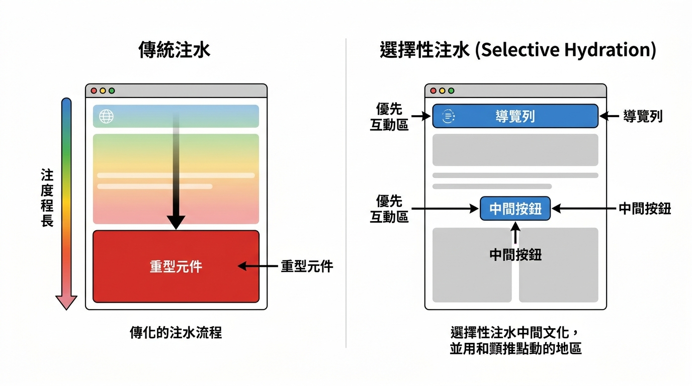
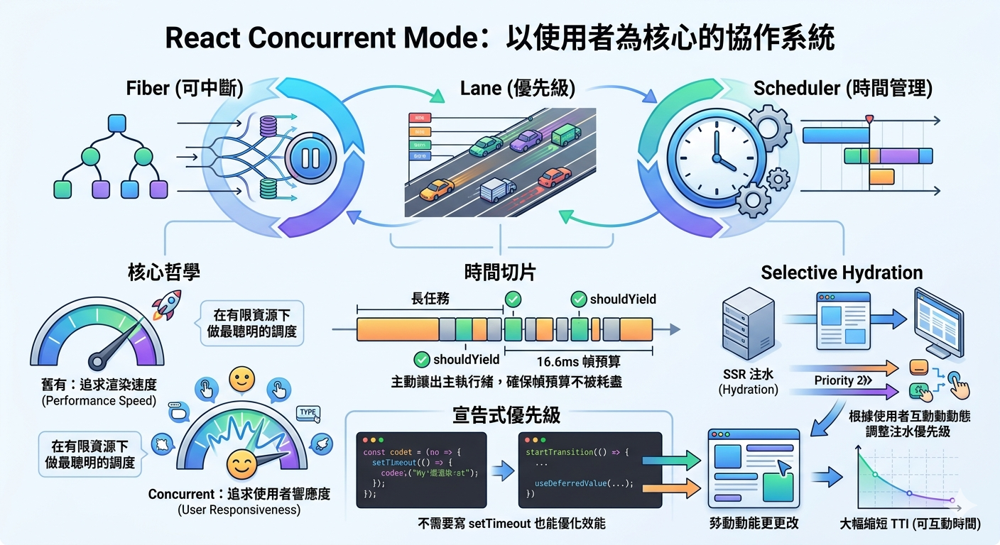

---
mdx:
  format: md
---

> 課程：JavaScript 與 React 底層原理
> 第 16 堂：Lane 模型收尾

# 52 Concurrent Mode 全景

如果你曾經在極度緩慢的網路環境下打開一個複雜的網頁，你可能遇過這種情況：頁面雖然出現了，但你點擊按鈕沒反應，捲動頁面也卡頓，直到幾秒鐘後，所有的操作才像「補課」一樣突然全部噴發。這就是傳統前端框架的痛點——「阻塞」。

在學習了 Fiber、Lane 和 Scheduler 之後，你可能會問：這堆複雜的位元運算、鏈結串列和時間切片，最後到底是為了拼湊成什麼？

答案就是 **Concurrent Mode（併發模式）**。它不是 React 18 的某一個「功能」，而是 React 整個架構進化後的「終極狀態」。這一章，我們要把之前學到的零散零件組裝起來，看看這台高性能引擎是如何運作的。

## 併發模式的核心定義：三位一體的協作

很多開發者會誤以為 Concurrent Mode 就是 `startTransition` 或 `Suspense`。但實際上，這些只是你買車時看到的「儀表板按鈕」。真正讓車子跑起來的，是引擎內部的三個核心系統協作：

1. **Fiber (架構層)：** 解決「能不能中斷」的問題。透過將樹狀結構線性化為鏈結串列，Fiber 讓 React 擁有了將渲染工作拆分成「小任務」的能力，就像是可以隨時暫停並保存進度的書籤。
2. **Lane (決策層)：** 解決「誰先中斷誰」的問題。透過 31 條賽道（Bitmask），React 幫每個更新貼上了標籤。它告訴 React：這個使用者輸入（SyncLane）比那個背景資料載入（TransitionLane）重要得多。
3. **Scheduler (執行層)：** 解決「何時執行、執行多久」的問題。它是 React 的調度總管，負責監控瀏覽器的每一幀（Frame），確保 React 只在主執行緒空閒時工作的「時間管理大師」。

這三者的關係可以想像成一個高效的**急診室系統**：

- **Fiber** 是病床和病歷（資料結構），讓醫生可以處理到一半先去處理別人。
- **Lane** 是檢傷分類（優先級），決定誰該先進手術室。
- **Scheduler** 是醫院的排班表和時鐘，確保醫生不會過勞（阻塞主執行緒），並在有空檔時安排巡房。

**Concurrent Mode 就是這三者完美配合產生的「整體能力」。** 沒有 Fiber，優先級再高也無法插隊；沒有 Lane，Scheduler 就不知道該先排哪個任務。

## 時間切片與可中斷渲染：作業系統式的多工

在 Topic 8 中，我們提到過 React 16 以前的渲染是「同步火車」，一旦發車就必須開到終點。而在 Concurrent Mode 下，渲染變成了「區間車」。

### 為什麼「聰明的暫停」比「跑得快」重要？

想像你在執行一個需要渲染 10,000 個節點的超長任務。即便你的 JavaScript 引擎跑得再快，只要這個任務佔用了主執行緒超過 16.6ms（也就是 60fps 的極限），瀏覽器就沒空去處理使用者的點擊或動畫。

React 的 Concurrent Mode 引入了 **Time Slicing（時間切片）**。它會不斷地問 Scheduler：「我還有時間嗎？」
如果 Scheduler 說：「沒時間了，主執行緒該還給瀏覽器去畫畫面了。」
React 就會執行 `shouldYield()`，停下手中的 WorkInProgress 樹計算，把控制權交出去。

這就像現代作業系統（Windows 或 macOS）的設計。你不會因為 Word 正在存檔，就導致滑鼠游標動不了。作業系統透過極短的時間切片（毫秒級），在多個程式之間切換。React 18 讓前端框架第一次擁有了這種「作業系統級別」的調度能力。

### 預測：如果高優先級任務插隊，舊任務會被丟棄嗎？

這是一個關鍵問題。當一個低優先級的渲染（例如過濾 5000 筆資料）進行到一半時，使用者突然輸入了一個字（高優先級）。
React 會：

1. **立即暫停** 當前的低優先級渲染。
2. **切換** 到高優先級任務，建立新的 WorkInProgress 樹。
3. **完成** 高優先級任務並 Commit 到真實 DOM。
4. **重新啟動**（或恢復）低優先級任務。

這裡的「聰明」之處在於，如果高優先級的更新導致之前的低優先級計算結果「失效」了（例如搜尋條件全變了），React 會直接丟棄之前的進度，重新計算。這種「可丟棄性」是 Concurrent Mode 保持 UI 一致性的絕招。

## Selective Hydration：SSR 場景下的「外科手術」

如果你處理過服務器端渲染（SSR），你一定知道那個尷尬的「乾涸期」。
傳統 SSR 的流程是：

1. **下載 HTML**（看得到內容，但不能動）。
2. **下載所有 JS 檔案**。
3. **執行 Hydrate**（注水，將 JS 事件掛載到 DOM 上）。

在傳統模式下，Hydrate 是「全有或全無」的。你必須等整頁的 JS 都跑完，按鈕才能按。如果頁面底部有一個超大的「相關評論」元件卡住了 Hydrate，頁面頂部的導覽列也會跟著不能用。

### 併發能力在 SSR 中的應用

React 18 透過 Concurrent Mode 實作了 **Selective Hydration（選擇性注水）**。它改變了遊戲規則：

- **優先權轉移：** React 不再按照 DOM 順序死板地進行 Hydrate。如果你在 JS 還沒跑完時，點擊了頁面上的某個按鈕，React 會偵測到這個「互動事件」，並給予該區域極高的 Lane 優先級。
- **插隊執行：** React 會暫停其他部分的注水工作，優先集中資源處理你點擊的那個區塊。
- **結果：** 雖然整份 JS 還沒下載完，但你點擊的那個元件卻「奇蹟般地」先活過來了。

這就是併發模式的威力：它能根據使用者的行為，動態地調整「哪些部分應該先變成熟」。

> *傳統注水必須等待全局完成，而選擇性注水能讓 React 根據使用者互動點，優先對特定元件進行注水。*

## Concurrent Features 的定位：宣告式的優先級 API

在 React 18 之前，我們要處理效能問題，通常要自己寫 `debounce` 或 `throttle`。但這些方法都很粗糙，因為它們是基於「時間延遲」，而不是基於「瀏覽器忙不忙」。

現在，React 給了我們一套基於併發能力的 API：

### 1. startTransition 與 useTransition

這是在 Topic 9.5 中深入探討的。它們的本質是：**手動將某個更新降級為低優先級（TransitionLane）。**

- **用法：** 當你有一件「不那麼緊急」的事情（例如更換主題顏色、過濾長列表）時使用。
- **底層：** 它告訴 React：「這件事慢慢來沒關係，如果使用者突然點了別的東西，請先去處理使用者的點擊。」

### 2. useDeferredValue

它跟 `startTransition` 很像，但它是針對「值」的。

- **場景：** 當你接收到一個頻繁變化的 Props（例如搜尋關鍵字），但你想延遲「根據這個值產生的渲染」時。
- **原理：** React 會先用舊值渲染緊急的輸入框更新，然後在後台（低優先級賽道）偷偷用新值準備那張沉重的圖表。

### 3. Suspense

在 Concurrent Mode 下，`Suspense` 不只是顯示一個 Loading 轉圈圈。它與優先級調度緊密結合：

- 當資料還沒準備好時，React 會「掛起」當前 Fiber 的渲染，轉而去執行其他更有意義的任務，而不是卡在那裡等。

這些 Feature 就像是給開發者的「操縱桿」，讓你不需要寫複雜的計時器，就能精確控制應用程式的響應節奏。

## 設計哲學：從「渲染一切」到「優先渲染重要的東西」

學習到這裡，你應該能感受到 React 哲學的巨大轉變。

在過去，React 的目標是 **「儘快把所有東西畫出來」**。
在現在（React 18+），React 的目標是 **「始終保持對使用者的響應」**。

這種轉變承認了一個現實：計算資源和主執行緒時間是有限的。一個聰明的框架不應該盲目地追求運算速度，而應該追求**調度的藝術**。

### 為什麼這對你很重要？

身為開發者，理解這套全景圖能幫你解決許多「玄學」問題：

- 為什麼我的 `useEffect` 沒按順序執行？（因為併發模式下任務可能被中斷或重啟）
- 為什麼明明資料更新了，畫面卻卡了一下才跳出來？（可能你沒用 `startTransition`，導致高優先級任務阻塞了渲染）
- 為什麼 `ref` 在某些併發情境下會拿到 `null`？（因為 Render Phase 可中斷，`ref` 的賦值是在 Commit Phase 才保證穩定的）

掌握了 Concurrent Mode 的全景，你就擁有了診斷複雜 React 應用效能問題的「X 光眼」。

## 總結與銜接

Topic 9 到這裡正式完整收尾了。我們從最底層的位元遮罩（Bitmask）開始，一路看到了 Scheduler 的任務排程，最後組裝成了 Concurrent Mode 這張大拼圖。

你已經理解了 React 是如何「跑跑停停」、如何「區分輕重緩急」以及如何「利用微小間隙」來維持流暢度的。

### 銜接 Topic 10：從架構走向實踐

雖然我們已經了解了 Fiber 樹的遍歷（Topic 8）和優先級的調度（Topic 9），但還有一個核心問題沒解決：**狀態（State）到底存在哪裡？**

在 JS 底層中，我們學過閉包（Closure）可以保存環境。在 React 中，Hooks（如 `useState`）就是利用閉包和 Fiber 節點上的特定結構來保存資料的。

當 React 在併發模式下「跑跑停停」時，它是如何確保 `const [count, setCount] = useState(0)` 每次都能拿到正確的值？為什麼 Hooks 絕對不能寫在 `if` 判斷式裡？

在接下來的 **Topic 10：Hooks 底層實作** 中，我們將拆解 Fiber 節點內部的 `memoizedState` 欄位，看 React 是如何用一個「鏈結串列」來管理你所有的 Hooks，並讓它們在複雜的併發調度中依然保持秩序。

## 重點回顧

- **Concurrent Mode 是一個協作系統**：由 Fiber (可中斷)、Lane (優先級) 與 Scheduler (時間管理) 共同組成。
- **時間切片 (Time Slicing)**：利用 `shouldYield` 主動讓出主執行緒，確保 16.6ms 的幀預算不被長任務耗盡。
- **Selective Hydration**：SSR 的進化版，根據使用者互動動態調整注水優先級，大幅縮短 TTI (可互動時間)。
- **宣告式優先級**：`startTransition` 和 `useDeferredValue` 讓我們不需要寫 `setTimeout` 也能優化效能。
- **核心哲學**：React 從追求「渲染速度」轉向追求「使用者響應度」，在有限資源下做最聰明的調度。
  

---

**下一步預覽**：我們即將開啟 Hooks 的神秘黑盒。在下一課「10.1 Hooks 鏈結串列結構」中，我們將親眼見證 Hooks 是如何像火車車廂一樣，一節一節地掛載在 Fiber 節點上。我們不只是學習怎麼用 Hooks，而是要學會 React 是怎麼「實作」Hooks 的。
