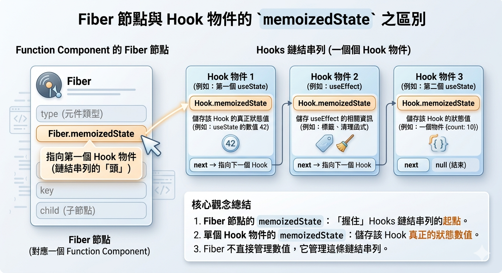
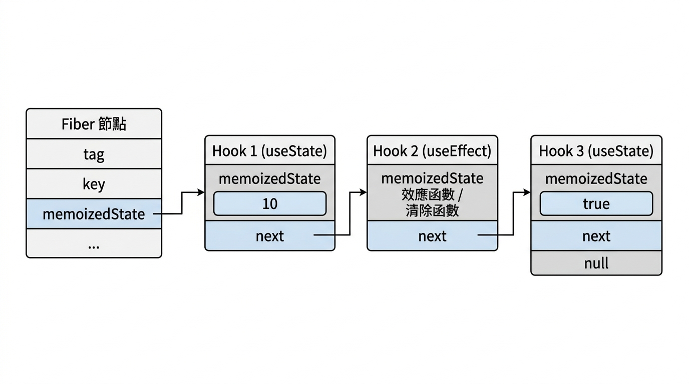

---
mdx:
  format: md
---

> 課程：JavaScript 與 React 底層原理
> 第 17 堂：Hooks 底層實作基礎

# 53 Hooks 鏈結串列

自從 React 16.8 推出 Hooks 以來，你可能已經聽過無數次這條「黃金律法」：**絕對不要在迴圈、條件式或巢狀函數中呼叫 Hooks**。當時你或許覺得這只是 React 開發團隊為了簡化內部邏輯而強加給開發者的限制，甚至覺得這帶點「魔法」的味道。

但現在，我們已經深入研究過 Fiber 架構、執行環境（EC）以及閉包（Closure），是時候揭開這層面紗了。你會發現，Hooks 的呼叫規則並非憑空而來的約束，而是 React 為了在「無狀態」的函數元件中實現「狀態持久化」，所選擇的資料結構下的**必然結果**。

為什麼 React 知道 `useState` 回傳的應該是「那個」變數？為什麼它不會把你的 `count` 和 `name` 搞混？答案就藏在 Fiber 節點裡的一條「鏈結串列（Linked List）」中。

## Fiber 節點上的隱藏倉庫：memoizedState

在 Topic 8 中，我們討論過 Fiber 節點是 React 的工作單元，它儲存了元件的所有資訊。對於函數元件（Function Component）來說，所有的狀態與副作用，其實都掛載在 Fiber 節點的一個欄位上，這個欄位叫做 `memoizedState`。

### 從類別到函數的演變

在早期的 Class Component 中，`this.state` 通常就是一個單純的 JavaScript 物件（Plain Object）。但在 Function Component 中，事情變得複雜了。因為一個元件可以呼叫多次 `useState`、多次 `useEffect`，React 必須找個地方把它們全部存起來。

這裡有個容易混淆的地方：**Fiber 節點的 **`**memoizedState**`** 與單個 Hook 物件的 **`**memoizedState**`** 意義不同。**

- **Fiber.memoizedState**：在 Function Component 中，它**指向**的是該元件「第一個 Hook」物件。它就像是這條鏈結串列的「頭（Head）」。
- **Hook.memoizedState**：這是單個 Hook 物件內部的欄位，用來**儲存**該 Hook 真正的狀態值（例如 `useState` 的那個數值，或是 `useEffect` 的標籤）。

簡單來說，Fiber 節點並不直接管理你的狀態數值，它只負責「握住」Hooks 鏈結串列的起點。



## 解剖單個 Hook 物件的結構

當你在程式碼中寫下 `const [count, setCount] = useState(0)` 時，React 底層到底建立了什麼？它並不是只存了一個數字 `0`，而是建立了一個擁有特定格式的 JavaScript 物件。

在 React 原始碼中，一個標準的 Hook 物件結構大致如下：

```javascript
{
  memoizedState: any,  // 該 Hook 目前記憶的狀態值（useState 存值，useEffect 存 Effect 物件）
  baseState: any,      // 基礎狀態（用於優先級跳過時的計算）
  baseQueue: Update,   // 基礎更新佇列
  queue: UpdateQueue,  // 待執行的更新佇列
  next: Hook | null    // 指向下一個 Hook 的指針（關鍵！）
}
```

這裡最核心的欄位是 `next`。

### 為什麼是鏈結串列（Linked List）？

你可能會問：「為什麼不乾脆用一個 Map 或是 Array 來存就好？」

1. **Map 的缺點**：如果你想用 Map，你就必須為每個 Hook 提供一個唯一的 Key。這會增加開發者的負擔（想像一下每個 `useState` 都要多傳一個字串 Key）。
2. **Array 的缺點**：陣列雖然可以，但鏈結串列在 React 的 Fiber 遍歷模型（WorkLoop）中更具優勢。React 可以在遍歷 Fiber 樹的同時，順手沿著鏈結串列往下走，不需要預先分配固定大小的記憶體。

這條由 `next` 串起來的鏈條，就是 React 實作 Hooks 的物理基礎。



> *Fiber 節點透過 memoizedState 欄位作為入口，連接起一串由 next 指針組成的 Hook 物件。這條序列的順序與你在程式碼中呼叫 Hooks 的順序完全一致。*

## Mount 與 Update 的運作機制

React 處理 Hooks 的邏輯，在初次渲染（Mount）與後續更新（Update）時是完全分開的。這就是為什麼你在追蹤 React 原始碼時，會看到 `mountState` 與 `updateState` 兩種不同的函數。

### 1. Mount 階段：建立鏈條

當元件第一次執行時，每當遇到一個 Hook 指令，React 都會執行以下步驟：

1. 建立一個全新的 Hook 物件。
2. 將它掛載到當前 Fiber 的鏈結串列末尾。
3. 移動一個名為 `workInProgressHook` 的內部指針，指向剛建立的這個新 Hook。

當函數執行完畢，這條鏈條就完美地記錄了所有 Hooks 的初始狀態與順序。

### 2. Update 階段：復位與查找

當你呼叫 `setCount` 導致元件重新渲染時，元件函數會再次從頭執行一遍。這時，React 進入了 Update 模式：

1. React 並不建立新 Hook，而是將 `workInProgressHook` 指針重新指向 Fiber 節點上的 `memoizedState`（即鏈結串列的頭）。
2. 每當程式碼執行到一行 Hook 呼叫（如 `useState`），React 就會從當前指針所在的 Hook 物件中取出資料，然後**將指針移動到 **`**next**`** 所指的下一個位置**。

**這裡沒有任何標籤，沒有任何 Key。React 唯一依賴的，就是呼叫的「順序」。**

## 致命的錯位：為什麼不能在條件式中呼叫？

理解了「順序即一切」的設計後，我們現在可以透過一個具體的場景，來推演如果違反規則會發生什麼事。

假設我們有一個元件，內部呼叫了三個 Hooks：

1. `useState('Aria')` (Hook #1)
2. `if (loading) { useEffect(...) }` (Hook #2)
3. `useState(25)` (Hook #3)

### 預期中的鏈結串列

在 Mount 階段，假設 `loading` 為 `true`，鏈條長這樣：

- **Hook 1**: `memoizedState: 'Aria'`, `next` -> Hook 2
- **Hook 2**: `memoizedState: [Effect Object]`, `next` -> Hook 3
- **Hook 3**: `memoizedState: 25`, `next` -> `null`

### 災難發生的 Update 階段

現在，資料載入完成了，`loading` 變成了 `false`。元件觸發重新渲染，函數重新執行：

1. **執行 Hook 1**：React 從鏈條頭部拿到資料 `'Aria'`。一切正常。指針移動到 Hook 2。
2. **跳過 Hook 2**：因為 `loading` 是 `false`，所以 `if` 區塊內的 `useEffect` **完全沒有被執行**。
3. **執行 Hook 3**：程式碼執行到 `useState(25)`。

**重點來了！** 對於 React 來說，這是函數執行過程中的「第二次」Hook 呼叫。它並不知道你跳過了中間那個 Hook。它會直接去問目前的指針：「嘿，給我下一個 Hook 的資料」。

**指針現在指在哪裡？指在原本的 Hook 2（那個 Effect）上！**

結果：

- 你的 `useState(25)` 拿到的竟然是原本 `useEffect` 的資料結構。
- React 嘗試解析這個資料，但發現格式完全不對，這會導致元件噴錯（例如：`Rendered more hooks than during the previous render`）。
- 即便沒噴錯，後續所有的 Hooks 都會往前「遞補」一格，導致資料完全錯亂。原本存名字的地方變成了存年齡，原本存 Effect 的地方變成了存狀態。

這就是為什麼 Hook 規則如此嚴格的原因：**React 內部的「指針位移」必須與你的「原始碼呼叫順序」精確同步。**

## 為什麼 React 不用 JS 的變數名來追蹤？

你可能會產生一個很自然的疑問：「JavaScript 難道不能自動辨識變數名稱嗎？」

不幸的是，答案是否定的。在 JavaScript 的函數執行環境（EC）中，函數內部的變數在每次執行時都是全新的。React 作為一個外部框架，它無法「鑽進」你的函數去掃描變數名稱 `count` 或 `name`。

從 JS 的視角來看，這只是一個普通的函數被呼叫了兩次。除非我們使用類別（Class）並透過 `this` 來儲存狀態，否則函數內部沒有任何持久化的機制。

React 採用的「鏈結串列 + 穩定順序」方案，實際上是利用了**閉包（Closure）與外部狀態儲存（Fiber）**的巧妙結合：

1. **外部儲存**：狀態存在函數之外的 Fiber 物件上。
2. **順序對應**：透過函數執行的序列性，確保每次呼叫都能找回上次存放在對應位置的資料。

這種設計極其高效，它讓 React 能夠在不需要繁瑣配置的情況下，賦予函數式元件強大的狀態管理能力。

## 總結：規則即設計

當我們談論 Hooks 的規則時，不應該把它看作是 React 的「缺點」，而應該看作是這種優雅設計的「操作說明」。

- **Hook 是 Fiber 上的一條線性的鏈結串列。**
- **React 透過「呼叫順序」來尋找對應的狀態物件。**
- **條件式呼叫會導致指針與邏輯順序脫節，引發資料錯位。**

理解了這層物理結構，你就具備了診斷各種複雜 Hook bug 的能力。你會知道，當 React 報錯說「Hook 數量不匹配」時，背後其實是那條鏈結串列在痛苦地吶喊。


---

## 穩定順序的代價與回報

雖然穩定順序的要求看似嚴苛，但它換來的是極其簡潔的 API。我們不需要手動管理 Key，不需要擔心命名衝突，只需要像寫普通 JS 一樣宣告變數即可。這種「約定優於配置」的哲學，正是 Hooks 成功的關鍵。

在掌握了這條鏈結串列的全局視野後，你可能會好奇：既然 Hook 只是鏈條上的一個點，那具體的 `useState` 又是如何處理那些非同步更新和批次合併的呢？

接下來，我們將深入 `useState` 的內部，看看 `mountState` 與 `updateState` 是如何運作的，以及那個神秘的 `dispatch` 函數是如何透過閉包（Closure）精準地抓到它所屬的 Fiber 節點。我們下一節見。
