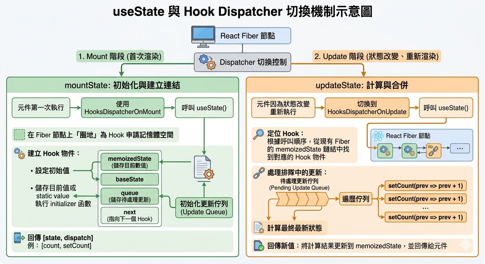
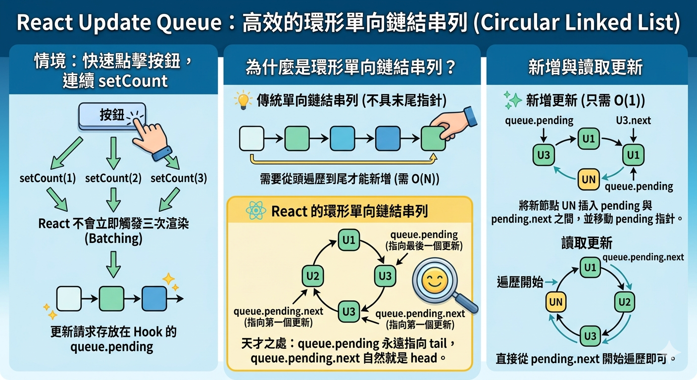
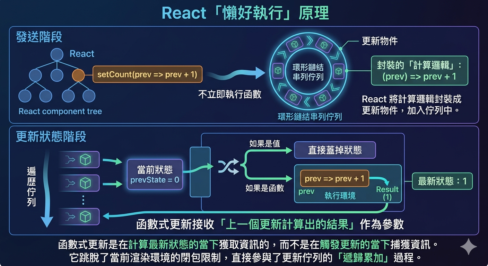
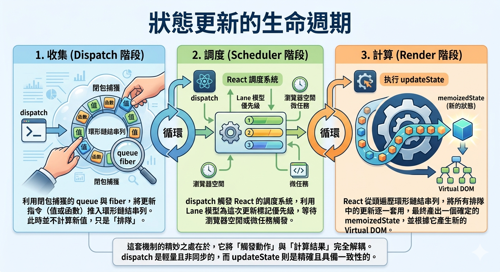

---
mdx:
  format: md
---

> 課程：JavaScript 與 React 底層原理
> 第 17 堂：Hooks 底層實作基礎

# 54 useState 底層剖析

你有沒有想過，當你在 React 元件中呼叫 `const [count, setCount] = useState(0)` 時，這個 `setCount` 到底是什麼？它只是一個簡單的函數，但在呼叫它時，它既不需要傳入元件的 ID，也不需要告訴 React 它是針對哪一個 `useState` 進行操作。React 卻能精確地知道該讓哪一個元件重新渲染，並且把 `count` 的值更新到正確的位置。

這背後並不是魔法，而是我們在 Topic 2 深入探討過的 **閉包（Closure）** 機制，結合了我們在 Topic 8 學習到的 **Fiber 架構**。這一章我們將拆解 `useState` 的內部運作，看看 React 如何在「掛載」與「更新」之間切換身份，以及它如何利用「環形鏈結串列」來管理你的每一次點擊。

## mountState 與 updateState：雙重人格的 Dispatcher

在 React 的源碼中，`useState` 並不是一個單一的函數。React 會根據目前 Fiber 節點的狀態，動態地切換 `useState` 的實作。這種設計模式被稱為「Dispatcher」。

當一個元件第一次執行（Mount 階段）時，React 會使用 `HooksDispatcherOnMount`；而當元件因為狀態改變而重新執行（Update 階段）時，則會切換到 `HooksDispatcherOnUpdate`。這就是為什麼同樣呼叫 `useState`，行為卻截然不同的原因。

### mountState：初始化與建立連結

當元件首次渲染，執行到 `mountState` 時，React 的核心任務是「圈地」——在 Fiber 節點上為這個 Hook 申請一塊記憶體空間。

1. **建立 Hook 物件**：React 會建立一個 Hook 物件，包含 `memoizedState`（儲存目前的數值）、`baseState`、`queue`（儲存待處理的更新）以及 `next`（指向下一個 Hook）。
2. **設定初始值**：如果你傳入的是一個值，它會直接存入 `memoizedState`；如果你傳入的是一個 initializer 函數（例如 `useState(() => compute())`），React 會在此時執行它並取得結果。
3. **初始化更新佇列（Update Queue）**：這是一個極其重要的結構。它會建立一個 `queue` 物件，專門用來存放未來呼叫 `setCount` 時產生的更新指令。
4. 回傳 [state, dispatch]：最後，它會回傳目前的狀態值，以及一個被我們稱為 `dispatch` 的函數（即 `setCount`）。

### updateState：計算與合併

到了 Update 階段，React 不再需要建立新的 Hook 物件，而是從現有的 Fiber 鏈結串列中「讀取」之前存好的 Hook。

1. **定位 Hook**：根據呼叫順序，從 Fiber 的 `memoizedState` 鏈結中找到對應的 Hook 物件。
2. **處理排隊中的更新**：如果使用者在兩次渲染之間多次呼叫了 `setCount`，這些更新會排在 `queue` 裡。`updateState` 的工作就是遍歷這個佇列，計算出最終的最新狀態。
3. **回傳新值**：將計算後的結果更新到 `memoizedState`，並再次回傳給元件。



## dispatch 函數：閉包捕獲的藝術

現在我們來到最關鍵的問題：**為什麼 **`**setCount**`** 不需要參數就能找到正確的 Fiber？**

這就是 **閉包（Closure）** 的經典應用。當 `mountState` 在建立 `dispatch` 函數（其內部實作為 `dispatchSetState`）時，它並不是隨便建立一個函數就丟出來。

在 React 渲染元件時，全局會有一個變數叫作 `currentlyRenderingFiber`，指向目前正在處理的那個 Fiber 節點。當 `mountState` 執行時，它會做類似這樣的事情（簡化邏輯）：

```javascript
function mountState(initialState) {
  const hook = mountWorkInProgressHook(); // 建立 Hook 物件
  const fiber = currentlyRenderingFiber;  // 記住目前的 Fiber 節點
  const queue = hook.queue;               // 記住這個 Hook 專屬的佇列

  // 透過閉包，dispatch 永遠記住了它所屬的 fiber 與 queue
  const dispatch = (action) => {
    return dispatchSetState(fiber, queue, action);
  };

  return [hook.memoizedState, dispatch];
}
```

這就是為什麼你可以把 `setCount` 傳給子元件、傳給 `setTimeout` 或是非同步請求，而它依然能運作。即使 `mountState` 的執行環境早就銷毀了，`dispatch` 函數就像一個帶著「環境背包」的小孩，背包裡裝著對該 **Fiber 節點** 與 **更新佇列（Queue）** 的引用。

當你呼叫 `setCount(1)` 時，`dispatch` 會從背包裡掏出 `fiber` 指針，告訴 React：「嘿！這個 Fiber 節點有更新了，請幫它排入調度。」這解釋了為什麼 `useState` 的回傳值中，`dispatch` 的參考在多次渲染之間是**穩定不變**的——因為它是第一次 Mount 時就建立好的閉包函數。

## Update Queue：高效的環形鏈結串列

當你快速點擊按鈕，連續執行了三次 `setCount` 時，React 並不會立即觸發三次渲染（記得我們學過的 Batching 嗎？）。React 會將這些更新請求存放在 Hook 的 `queue.pending` 之中。

令人驚訝的是，React 使用了 **環形單向鏈結串列（Circular Linked List）** 來儲存這些更新物件。

### 為什麼是環形？

在一般的鏈結串列中，如果你想在末尾新增節點，你需要從頭遍歷到尾，或者額外維護一個 `tail` 指針。但 React 的天才之處在於，`queue.pending` 永遠指向 **最後一個加入的更新（tail）**。

因為是環形的，`queue.pending.next` 自然就是 **第一個更新（head）**。

- **新增更新時**：只需 $O(1)$ 的時間，將新節點插入 `pending` 與 `pending.next` 之間，並移動 `pending` 指針。
- **讀取更新時**：直接從 `pending.next` 開始遍歷即可。



### 遍歷與計算

當下一次渲染（Update 階段）啟動時，`updateState` 會來到這個環形鏈結串列面前。它會從 `head` 開始，一個接一個地執行裡面的動作：

1. 第一個更新：`+ 1`
2. 第二個更新：`+ 1`
3. 第三個更新：`+ 1`

最終計算出結果為 `3`，然後將這個值存入 Hook 的 `memoizedState`。這就是 React 處理多重狀態更新的底層邏輯：**收集更新 -> 斷開環形鏈結 -> 順序執行 -> 得到最終態**。

## 函數式更新：解決 Stale Closure 的最後一哩路

在 Topic 2 中我們學過，閉包可能會捕獲到「過時的值」（Stale Closure）。考慮以下情境：

```javascript
const [count, setCount] = useState(0);

const handleClick = () => {
  setTimeout(() => {
    // 這裡的 count 捕獲的是 handleClick 建立時的 0
    setCount(count + 1); 
  }, 3000);
};
```

如果你在三秒內瘋狂點擊，結果依然會是 `1`。因為每次 `setCount` 拿到的 `count` 都是那個「快照」裡的 `0`。

為了克服這一點，React 提供了 **函數式更新（Functional Update）**：`setCount(prev => prev + 1)`。為什麼這能解決問題？

### 底層原理：延遲執行

當你傳入一個函數給 `setCount` 時，React 的 `dispatch` 階段並不會執行它。它只是把這個「計算邏輯」封裝成一個更新物件，丟進那個環形鏈結串列裡。

在 `updateState` 階段遍歷佇列時，React 會檢查：

- 如果更新物件是一個 **值**：直接蓋掉之前的狀態。
- 如果更新物件是一個 **函數**：React 會把「上一個更新計算出的結果」作為參數 `prev` 傳入這個函數。

這意味著，函數式更新是在 **計算最新狀態的當下** 獲取資訊的，而不是在 **觸發更新的當下** 捕獲資訊。它跳脫了當前渲染環境的閉包限制，直接參與了更新佇列的「遞歸累加」過程。這就是為什麼它總能拿到最即時的狀態。



---

## 狀態更新的生命週期

理解了上述原理後，我們可以將 `useState` 的運作本質總結為三個階段的循環：

1. **收集（Dispatch 階段）**：
利用閉包捕獲的 `queue` 與 `fiber`，將更新指令（值或函數）推入環形鏈結串列。此時並不計算新值，只是「排隊」。
2. **調度（Scheduler 階段）**：
`dispatch` 觸發 React 的調度系統，利用我們學過的 Lane 模型為這次更新標記優先級，等待瀏覽器空閒或微任務觸發。
3. **計算（Render 階段）**：
執行 `updateState`。React 從頭遍歷環形鏈結串列，將所有排隊中的更新逐一套用，最終產出一個確定的 `memoizedState`，並根據它產生新的 Virtual DOM。

這套機制的精妙之處在於，它將「觸發動作」與「計算結果」完全解耦。`dispatch` 是輕量且非同步的，而 `updateState` 則是精確且具備一致性的。



這套「收集與合併」的邏輯不僅適用於 `useState`，實際上它也是 React 所有副作用管理的縮影。在下一部分中，我們將會看到 `useEffect` 是如何利用類似的標記與佇列機制，在 DOM 更新完成後的 Commit Phase，優雅地安排那些非同步的副作用。
