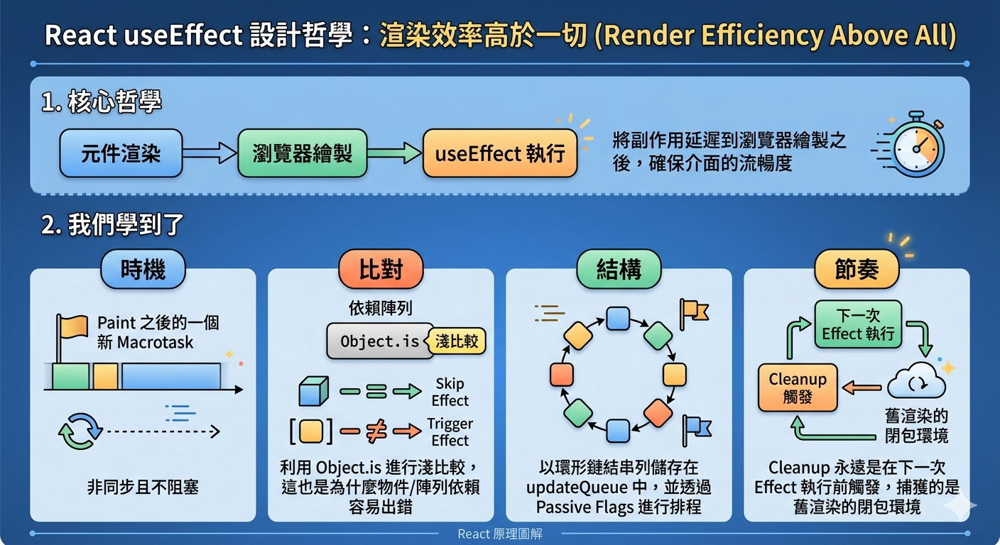
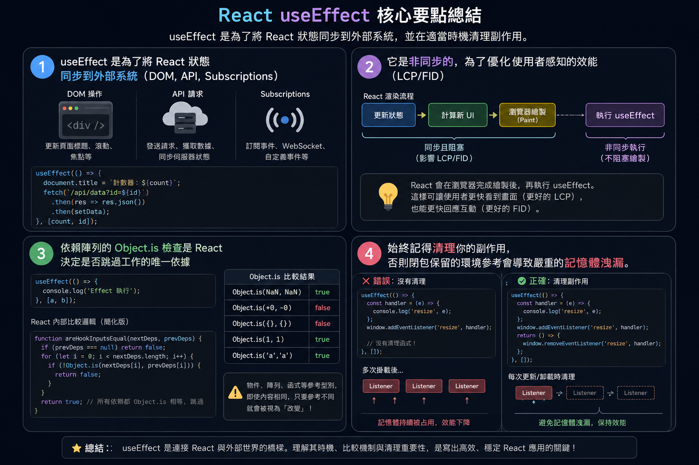

---
mdx:
  format: md
---

> 課程：JavaScript 與 React 底層原理
> 第 17 堂：Hooks 底層實作基礎

# 55 useEffect 執行時機

在之前的章節中，我們深入探討了 `useState` 如何處理狀態以及 Fiber 如何建立鏈結串列。但身為 React 開發者，你一定最常與 `useEffect` 打交道。許多人會把 `useEffect` 類比為類別元件（Class Component）的生命週期函數，例如 `componentDidMount` 或 `componentDidUpdate`。

然而，這種類比其實是一個陷阱。在 Fiber 架構下，`useEffect` 的運作邏輯與傳統生命週期有著本質上的不同。它不是在「某個時刻」被呼叫的掛鉤，而是一種**「將副作用同步到渲染結果」**的機制。今天我們就要拆解這個機制，看看它在 React 的渲染流水線中到底排在哪個位置。

## 既然畫面已經畫好了，為什麼還要執行？

想像一個場景：你正在開發一個聊天軟體，當使用者進入對話框時，你需要建立一個 WebSocket 連線。

如果你在元件主體內直接建立連線，這會發生什麼事？根據我們在 Topic 1 學過的「執行環境（EC）」，每次元件渲染（執行函數）時，連線都會被重新建立一次，這顯然是災難。於是你將它放入 `useEffect`。

**現在請你預測一下：**
當 React 執行完你的元件函數，並把新的 DOM 結構交給瀏覽器繪製（Paint）出現在螢幕上時，`useEffect` 裡面的代碼已經執行了嗎？還是正在執行中？

答案是：**還沒執行。** 

在絕大多數情況下，當使用者看到螢幕上出現更新後的文字或按鈕時，你的 `useEffect` 甚至還沒開始跑。這聽起來可能有點違背直覺，但這正是 React 效能優異的核心秘密。

## 非同步執行的真相：與渲染流水線的博弈

要理解 `useEffect` 的執行時機，我們必須回到 Topic 8 提到的 **Commit Phase**。

在 React 的 Fiber 架構中，渲染流程被嚴格區分為 Render Phase 與 Commit Phase。當 Commit Phase 完成後，React 會將變更套用到真實 DOM 上。隨後，瀏覽器會接手進行 Layout（佈局）與 Paint（繪製）。

### 為什麼要等 Paint 之後？

在類別元件時代，`componentDidMount` 是**同步**執行的。這意味著在瀏覽器畫出東西之前，JavaScript 引擎會卡在生命週期函數裡。如果你的副作用裡面包含耗時的計算或是大量的 DOM 讀取，使用者就會感受到明顯的掉幀（Jank）。

React 團隊意識到：**絕大多數的副作用（如數據抓取、訂閱、日誌記錄）其實都不需要阻塞瀏覽器的渲染。**

因此，`useEffect` 被設計為 **非同步執行** 的「被動副作用（Passive Effects）」。它的執行流程如下：

1. **Render Phase**：React 決定哪些地方需要更新。
2. **Commit Phase**：React 更新真實 DOM 節點。
3. **瀏覽器 Paint**：使用者在螢幕上看到新畫面。
4. **開啟一個新的巨任務（Macrotask）**：React 透過 `Scheduler` 排程，在瀏覽器渲染後的空檔，執行 `useEffect` 裡的回調函數。

這連結到了我們在 Topic 4 學過的 **Event Loop**。`useEffect` 的執行並非微任務（Microtask），而是一個新的巨任務。這確保了瀏覽器有足夠的優先權去處理動畫與使用者輸入，而不會被你的副作用卡住。

> **對於好奇的你：** React 內部是利用 `MessageChannel` 或 `requestIdleCallback` 的概念來安排這個任務的。這讓 `useEffect` 既能快速執行，又具備「可中斷性」，不會奪走瀏覽器的渲染主導權。

## 依賴陣列：為什麼 React 知道你有變動？

`useEffect` 的第二個參數是依賴陣列（Dependency Array）。我們都知道，如果依賴沒變，Effect 就不會跑。但 React 底層是如何判斷「變了」？

### [Object.is](http://Object.is) 的精確比對

React 並不是使用簡單的 `==` 或 `===`，而是使用 ES6 的 `Object.is()` 進行**淺比較（Shallow Comparison）**。

你可能會問：`===` 不是已經很夠用了嗎？為什麼要特地用 `Object.is`？
這涉及到了 JavaScript 的兩個邊界案例：`NaN` 與 `-0`。

- 在 `===` 中，`NaN === NaN` 是 `false`。
- 在 `===` 中，`0 === -0` 是 `true`。

然而在 React 的邏輯中，如果兩次渲染的狀態都是 `NaN`，我們通常認為狀態「沒有改變」；同樣地，`0` 與 `-0` 在某些數學運算中具有不同意義。`Object.is` 能正確處理這些情況（`Object.is(NaN, NaN)` 為 `true`）。

### 參考型別的陷阱：為什麼我的 Effect 一直跑？

這是初學者最常遇到的問題：

```javascript
useEffect(() => {
  console.log("執行了！");
}, [{ name: "Aria" }]); // 每次渲染都傳入一個新的物件字面量
```

根據我們在 Topic 5 學過的「展開運算子與不可變性」，每次元件 re-render 時，`{ name: "Aria" }` 都會在記憶體中產生一個**全新的地址**。

對於 `Object.is` 來說，兩個記憶體地址不同的物件永遠是不相等的。這就是為什麼如果你在依賴陣列中放入在元件內部定義的物件或陣列，`useEffect` 就會像瘋了一樣在每次渲染後執行。

**解決方案預告：** 我們之後會學到 `useMemo` 與 `useCallback`，它們的本質就是為了「跨渲染保留同一個記憶體地址」，進而讓 `useEffect` 的依賴比對能真正生效。

## 深入 Fiber：Effect 的儲存結構與 Flags

在 Topic 10.1 我們學過，Hooks 儲存在 Fiber 的 `memoizedState` 鏈結串列中。但 `useEffect` 有點特別，它不僅僅是一個狀態，它還會在 Fiber 節點上留下「標記」。

### Passive 標籤與 updateQueue

當 React 執行你的元件函數時（Render Phase），它會依序執行每一個 `useEffect`。

1. **比較依賴**：React 會取出上一次渲染存放在 Hook 物件中的 `deps`，與這一次傳入的 `deps` 進行 `Object.is` 比對。
2. **打上標籤**：如果發現依賴變了，或者這是第一次掛載（Mount），React 會給這個 Fiber 節點打上一個名為 `Passive`（被動副作用）的 **Effect Tag (Flags)**。
3. **推入佇列**：這個 Effect 會被封裝成一個物件，推入該 Fiber 的 `updateQueue` 中。

一個 Effect 物件的底層結構大致如下：

- `tag`：標記這是哪種 Effect（是 `useEffect` 還是 `useLayoutEffect`）。
- `create`：你寫的那個回調函數。
- `destroy`：你回傳的那個 Cleanup 函數。
- `deps`：當前的依賴陣列。
- `next`：指向下一個 Effect，形成一個**環形鏈結串列**。

在 Commit Phase 的最後，React 會掃描整個 Fiber 樹，找出所有帶有 `Passive` 標籤的節點，並把它們的 `updateQueue` 收集起來。等到瀏覽器畫完畫面，React 就會開始循環遍歷這個清單，執行裡面的 `create` 函數。

## 清理函數 (Cleanup) 的精確節奏

這是 `useEffect` 中最容易被誤解的部分。很多人認為 Cleanup 函數只會在元件卸載（Unmount）時執行。

**實際上，Cleanup 的執行頻率遠比你想的高。**

### 順序：先拆舊的，再蓋新的

如果你的 `useEffect` 有依賴陣列，且依賴項發生了變化，React 的執行順序是這樣的：

1. **渲染（Render）** N 次。
2. **瀏覽器繪製（Paint）**。
3. $執行第 N-1 次渲染的 Cleanup 函數。$
4. **執行第 N 次渲染的 Create 函數**。

為什麼要這樣設計？我們用「訂閱好友狀態」作為範例：

- 渲染 1：訂閱使用者 A。
- 渲染 2：Props 改變，需要訂閱使用者 B。
- **步驟 1**：React 必須先取消訂閱 A（執行渲染 1 的 Cleanup）。
- **步驟 2**：React 再開始訂閱 B（執行渲染 2 的 Create）。

<u>這種「先清理、後執行」的機制，確保了應用程式不會產生記憶體洩漏（Memory Leak），也避免了不同渲染之間的副作用互相干擾。</u>這也再次體現了 Topic 2 提到的 **Closure（閉包）**：Cleanup 函數捕獲的是「它被定義時」的那個執行環境（EC）中的變數值。

## 依賴陣列的三種情境底層邏輯

我們來總結一下依賴陣列的不同寫法，在 React 底層分別代表什麼意思：

### 1. 省略依賴陣列（No Array）

```javascript
useEffect(() => { ... });
```

- **底層行為**：React 在每次渲染時都會為該 Fiber 打上 `Passive` 標籤。
- **後果**：每次 Paint 之後都會執行。這通常是效能殺手，除非你真的需要每一幀都同步某些數據。

### 2. 空依賴陣列（Empty Array `[]`）

```javascript
useEffect(() => { ... }, []);
```

- **底層行為**：React 只在 Mount 階段（第一次渲染）比對發現沒有舊依賴，於是打上標籤。在後續更新中，`[]` 永遠等於 `[]`（React 內部會直接跳過比對），因此標籤不會再被貼上。
- **後果**：`create` 只在掛載後執行一次；`destroy` (Cleanup) 只在卸載時執行一次。這非常適合初始化 API 請求或全域事件監聽。

### 3. 有值的陣列（With Deps `[propA, stateB]`）

```javascript
useEffect(() => { ... }, [a, b]);
```

- **底層行為**：React 執行 `Object.is(oldA, newA)` 與 `Object.is(oldB, newB)`。只要其中一個為 `false`，就打上標籤。
- **後果**：精確控制同步時機。這實踐了「宣告式同步」的思想——我不是在描述什麼時候執行，而是在描述「這個 Effect 應該與哪些資料保持同步」。

## 總結與銜接

`useEffect` 的設計哲學反映了 React 16 之後的一個重大轉變：**渲染效率高於一切**。透過將副作用延遲到瀏覽器繪製之後，React 確保了介面的流暢度。

我們學到了：

- **時機**：它是 Paint 之後的一個新 Macrotask，非同步且不阻塞。
- **比對**：利用 `Object.is` 進行淺比較，這也是為什麼物件/陣列依賴容易出錯。
- **結構**：它以環形鏈結串列儲存在 `updateQueue` 中，並透過 `Passive` Flags 進行排程。
- **節奏**：Cleanup 永遠是在下一次 Effect 執行前觸發，捕獲的是舊渲染的閉包環境。



然而，這種「延遲執行」有時也會帶來問題。如果你需要在副作用中「操作 DOM 並且希望使用者不要看到閃爍」（例如根據元素的寬度自動調整字體大小），`useEffect` 就太慢了，因為它執行時使用者已經看到「錯誤的大小」了。

下一部分，我們將探討 `useEffect` 的孿生兄弟：`useLayoutEffect`。它將打破非同步的規則，在瀏覽器繪製之前「插隊」執行。我們來看看它與 `useEffect` 在底層執行環境中有什麼關鍵差異。

### 關鍵要點回顧

- `useEffect` 是為了將 React 狀態同步到外部系統（DOM, API, Subscriptions）。
- 它是非同步的，為了優化使用者感知的效能（LCP/FID）。
- 依賴陣列的 `Object.is` 檢查是 React 決定是否跳過工作的唯一依據。
- 始終記得清理你的副作用，否則閉包保留的環境參考會導致嚴重的記憶體洩漏。


