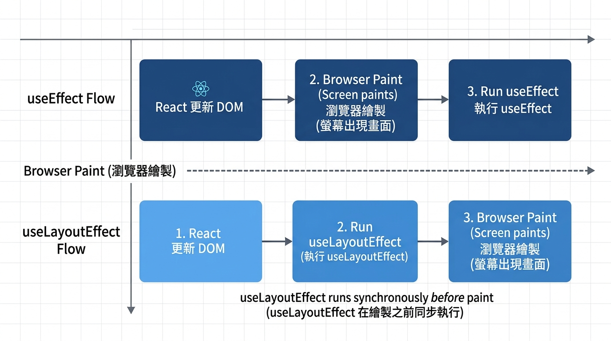

---
mdx:
  format: md
---

> 課程：JavaScript 與 React 底層原理
> 第 18 堂：Hooks 核心實作深探

# 56 useLayoutEffect 時機

想像一下，你正在開發一個精美的 UI 元件——一個會根據按鈕位置自動彈出的工具提示（Tooltip）。你寫好了邏輯：點擊按鈕，計算按鈕的座標，然後把 Tooltip 放上去。但當你滿懷期待地打開瀏覽器測試時，卻發現了一個令人生厭的現象：Tooltip 會先在畫面的某個角落（可能是左上角 `0,0`）閃現一下，然後才「跳」到正確的位置。

這種「視覺閃爍」（Flicker）是許多 React 開發者的噩夢。你可能會想：「我明明已經在 `useEffect` 裡更新狀態了，為什麼使用者還是看到了中間過程？」

這個問題的答案，藏在 React 的渲染流水線與瀏覽器繪製（Paint）的細微時差中。今天我們要探討的 `useLayoutEffect`，就是 React 專門為了解決這類「需要與瀏覽器繪製賽跑」的場景而設計的秘密武器。

## 渲染流水線的回頭看：從 Commit 到 Paint

在深入 `useLayoutEffect` 之前，我們必須先串聯起之前學過的知識。在 **Topic 8** 中，我們了解到 React 的渲染分為 **Render Phase**（計算差異）與 **Commit Phase**（操作 DOM）。而在 **Topic 4**，我們學習了 Event Loop 與瀏覽器的渲染時機。

這兩者是如何結合的？請看下面這個簡化的時間軸：

1. **Render Phase**: React 執行你的元件函數，算出 Virtual DOM。
2. **Commit Phase**: React 把變更套用到真實的 DOM 上。此時，DOM 已經改變了，但瀏覽器**還沒**把它畫到螢幕上。
3. **Browser Paint**: 瀏覽器取得最新的 DOM 狀態，計算佈局，然後正式繪圖。
4. **useEffect 執行**: 這是關鍵！誠如我們在 **Topic 10.3** 所學，`useEffect` 是在瀏覽器完成繪圖（Paint）後，以一個「非同步」的方式執行的。

這意味著，如果你在 `useEffect` 中讀取 DOM 尺寸並修改狀態，流程會變成這樣：
**DOM 變更 -> 瀏覽器繪圖（顯示舊位置或初始狀態）-> 執行 useEffect -> 更新狀態 -> 重新渲染 -> 再次繪圖。**

使用者那雙敏銳的眼睛，捕捉到了兩次繪圖之間的空隙，這就是「閃爍」的由來。



> *useLayoutEffect 與 useEffect 在瀏覽器繪製過程中的執行時機對比*

## 核心機制：HookLayout 與 HookPassive 標籤

為什麼 React 能精準控制這兩個 Hook 的執行時機？這要回到 Fiber 節點的內部結構。

雖然 `useEffect` 和 `useLayoutEffect` 在 Fiber 的 `memoizedState` 鏈結串列中儲存的資料結構幾乎一模一樣（都包含 `create`, `destroy`, `deps` 等欄位），但 React 會為它們打上不同的 **flags**（標籤）：

- **HookPassive**** (useEffect)**: 這個標籤告訴 React：「這個副作用不急，等瀏覽器忙完繪圖，有空再執行。」它會被排入一個非同步任務佇列。
- **HookLayout**** (useLayoutEffect)**: 這個標籤則像是一道急件指令：「這個副作用非常重要，在瀏覽器把畫面畫出來之前，**必須同步**執行完畢。」

當 React 進入 Commit Phase 的 **Layout 子階段**時，它會遍歷 Effect 鏈結串列，一旦發現帶有 `HookLayout` 標籤的 Hook，就會立即停下來執行它。

### 同步的代價：阻塞主執行緒

這裡的「同步」是指它會阻塞（Block）瀏覽器的渲染流程。這就像是在後台佈置舞台：

- **useEffect**: 戲演完了，大家在喝咖啡時，工作人員進來換下一場的佈景。
- **useLayoutEffect**: 戲剛演完，幕布還沒拉開前，工作人員衝上去把佈景換掉，觀眾必須等佈景換好後，幕布才會拉開。

如果你的 `useLayoutEffect` 裡面執行了非常耗時的運算（例如一個執行 1 秒鐘的 `while` 迴圈），瀏覽器就會卡在那裡 1 秒鐘，使用者會感覺網頁完全失去響應。

## 實戰場景：測量 DOM 尺寸並同步更新

讓我們透過一個經典的 Tooltip 案例來看看這兩者的差異。假設我們有一個按鈕，點擊後要在按鈕上方顯示一個提示框。

### 場景 1：使用 useEffect（會閃爍）

```javascript
import React, { useState, useRef, useEffect } from 'react';

const TooltipButton = () => {
  const [show, setShow] = useState(false);
  const [top, setTop] = useState(0);
  const buttonRef = useRef(null);
  const tooltipRef = useRef(null);

  useEffect(() => {
    if (show && buttonRef.current && tooltipRef.current) {
      // 這裡是在瀏覽器繪製後才執行
      const rect = buttonRef.current.getBoundingClientRect();
      // 假設我們要放在按鈕上方 30px
      setTop(rect.top - 30); 
    }
  }, [show]);

  return (
    <div style={{ padding: '100px' }}>
      <button ref={buttonRef} onClick={() => setShow(!show)}>
        點擊我
      </button>
      {show && (
        <div 
          ref={tooltipRef} 
          style={{ position: 'fixed', top: `${top}px`, background: 'black', color: 'white' }}
        >
          我是提示框！
        </div>
      )}
    </div>
  );
};
```

**發生了什麼事？**

1. 使用者點擊按鈕，`show` 變為 `true`。
2. React 渲染出 Tooltip，但此時 `top` 初始值是 `0`。
3. **瀏覽器 Paint**: 畫面上在左上角 `0,0` 出現了一個黑色的提示框（哪怕只有 16 毫秒）。
4. **useEffect 執行**: 測量按鈕位置，呼叫 `setTop`。
5. **再次渲染**: React 更新 Tooltip 位置。
6. **再次 Paint**: 提示框「跳」到了正確位置。

### 場景 2：使用 useLayoutEffect（平滑無感）

我們只需要把 `useEffect` 換成 `useLayoutEffect`：

```javascript
import { useLayoutEffect } from 'react';

// ... 其他代碼相同

useLayoutEffect(() => {
  if (show && buttonRef.current && tooltipRef.current) {
    const rect = buttonRef.current.getBoundingClientRect();
    // 這裡是在「繪製前」同步執行的
    setTop(rect.top - 30);
    // 即使這裡再次調用 setTop，React 也會合併這次更新
    // 確保最後只會有一次 Paint
  }
}, [show]);
```

**現在的流程變成了：**

1. 使用者點擊，`show` 變為 `true`。
2. React 渲染出 Tooltip，DOM 已建立但螢幕還沒顯示。
3. **useLayoutEffect 同步執行**: 測量按鈕，立即呼叫 `setTop`。
4. **React 發現狀態更新**: 它不會交還控制權給瀏覽器，而是立即接著處理這次更新。
5. **瀏覽器 Paint**: 瀏覽器拿到的是最終正確位置的 DOM。使用者看到的畫面是從無到有，且位置直接就是正確的。

**沒有閃爍，完美。**

## 警示：為什麼你（幾乎）不需要用它？

既然 `useLayoutEffect` 能解決閃爍問題，為什麼不乾脆全部都用它？這裡有三個非常關鍵的原因：

### 1. 效能是第一考量

React 的設計哲學是「盡可能不阻塞 UI」。`useEffect` 的非同步特性讓瀏覽器能優先處理動畫、滾動和輸入，維持頁面的流暢度。如果你過度使用 `useLayoutEffect`，你的應用程式會變得「笨重」，因為每一幀渲染都要等待你的 JS 代碼跑完。

**原則：只有當你需要讀取 DOM 並立即調整 UI 以避免視覺閃爍時，才考慮使用它。**

### 2. SSR（伺服器端渲染）的警告

如果你在 Next.js 或 Gatsby 這種環境下工作，你會發現 `useLayoutEffect` 會報錯。
原因是：`useLayoutEffect` 的目的是「在 DOM 變更後同步執行」，但伺服器端（Node.js）根本沒有 DOM，也沒有「繪製」這個動作。這會導致伺服器生成的 HTML 與客戶端初次渲染的結果不一致（Hydration Mismatch）。

如果你真的必須在 SSR 應用中使用，通常的做法是判斷是否在瀏覽器端：

```javascript
const useIsomorphicLayoutEffect = typeof window !== 'undefined' ? useLayoutEffect : useEffect;
```

### 3. 阻塞渲染的死穴

在併發模式（Concurrent Mode）下，React 試圖將長任務切片（Time Slicing）。但 `useLayoutEffect` 是屬於「強同步」任務，它會強迫 React 退出併發模式的優勢，退回到舊有的同步模式。這對於高效能的複雜應用來說，是一個退步。

## 深度對比：useEffect vs useLayoutEffect

讓我們用一個表格來總結兩者的關鍵差異：

| 特性 | useEffect | useLayoutEffect |
| --- | --- | --- |
| **執行時機** | 瀏覽器繪製（Paint）**之後** | 瀏覽器繪製（Paint）**之前** |
| **同步/非同步** | 非同步（Macrotask/微任務後續排程） | 同步（阻塞主執行緒） |
| **對效能影響** | 小，不會阻塞 UI 響應 | 大，若代碼耗時會導致卡頓 |
| **主要用途** | 資料獲取、訂閱、日誌、不影響佈局的副作用 | DOM 測量、同步 UI 調整、避免閃爍 |
| **內部標籤** | `HookPassive` | `HookLayout` |
| **SSR 支持** | 良好 | 會拋出警告 |

### 預告：useRef 的關鍵角色

在剛剛的範例中，你有沒有注意到我們頻繁使用了 `buttonRef` 和 `tooltipRef`？
在處理 DOM 測量的場景時，`useLayoutEffect` 幾乎總是和 `useRef` 成對出現。因為要「測量」，你就必須拿到真實的 DOM 節點參考。

這引出了一個有趣的問題：為什麼我們不把 DOM 節點存進 `useState`？為什麼 `ref.current` 的改變不會觸發重新渲染？在下一個部分中，我們將深入探討 `useRef` 的本質——它不僅僅是一個獲取 DOM 的工具，更是 React 中唯一能跨越渲染週期、且不會觸發重新渲染的「穩定容器」。

## 總結與銜接

理解 `useLayoutEffect` 的關鍵在於明白 **「DOM 的變更」不等於「畫面的呈現」**。React 在兩者之間插入了一個同步的執行窗口，讓你有機會在使用者察覺之前，完成最後的 UI 修飾。

記得我們在上一堂課討論過 Event Loop 嗎？`useEffect` 就像是排在隊伍後方的 `setTimeout` 或 `MessageChannel` 任務，而 `useLayoutEffect` 則是渲染流水線中不可分割的一部分。

掌握了這個時機點，你就能寫出更細膩、更具專業感的 UI。接下來，讓我們把目光移向那個與 `useLayoutEffect` 緊密配合的 Hook：**useRef**。它在 Fiber 的鏈結串列中又是如何存在的呢？我們接著看。
