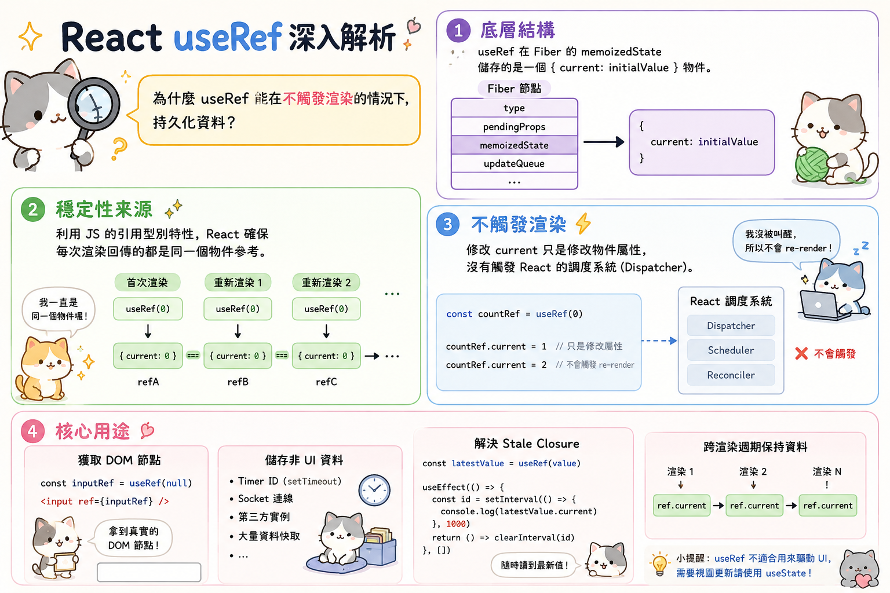

---
mdx:
  format: md
---

> 課程：JavaScript 與 React 底層原理
> 第 18 堂：Hooks 核心實作深探

# 57 useRef 的本質

在上一部分我們討論 `useLayoutEffect` 時，提到了一個關鍵的應用場景：測量 DOM 節點的尺寸。當時我們很自然地使用了 `ref` 來獲取真實的 DOM 元素。但你有沒有想過，為什麼在一個強調「不可變性（Immutability）」和「純函數渲染」的 React 世界裡，會存在一個像 `useRef` 這樣允許我們「直接修改」且「跨渲染持久化」的 Hook？

如果說 `useState` 是 React 的核心狀態管理，那麼 `useRef` 就像是 React 留給開發者的一個「秘密置物櫃」——它不受渲染流水的限制，卻能精確地在多次渲染之間為你保留那份不變的參考。

## 一個關於「變與不變」的謎題

在深入底層源碼之前，我們先看一個有趣的現象。假設你正在開發一個計時器元件，你需要儲存 `setInterval` 回傳的 ID，以便在之後清除它。

預測一下，下面這兩種寫法有什麼差異？

```javascript
// 方案 A：使用 useState
const [timerId, setTimerId] = useState(null);

// 方案 B：使用 useRef
const timerRef = useRef(null);
```

如果你使用 `useState` 來存儲 `timerId`，每次你呼叫 `setTimerId` 時，React 都會認為「狀態改變了」，進而觸發一次完整的元件 re-render。但問題是：`timerId` 的改變需要反映在 UI 上嗎？通常不需要。這就是效能浪費的開始。

更糟糕的是，如果你在渲染過程中（Render Phase）依賴這個不斷變動的 `timerId`，可能會陷入無窮迴圈或邏輯混亂。這引出了一個核心問題：**我們需要一種方式，既能像變數一樣隨時修改，又能像狀態一樣在元件重新執行時不被重置，且修改它時「不要」驚動 React 的渲染引擎。**

這就是 `useRef` 誕生的理由。

## 從 Fiber 結構拆解 useRef

要理解 `useRef` 的本質，我們必須回到 Topic 10.1 提到的 Hook 鏈結串列結構。

當我們在元件中呼叫 `const myRef = useRef(initialValue)` 時，在 Fiber 節點的 `memoizedState` 鏈結串列中，React 實際上為這個 Hook 儲存了什麼？

### 1. 記憶體中的穩定容器

在 Fiber 節點中，`useRef` 對應的 Hook 物件內部儲存的是一個普通的 JavaScript 物件：

```javascript
// React 底層大約是這樣儲存 useRef 的
{
  memoizedState: {
    current: initialValue
  },
  next: // 指向下一位 Hook
}
```

這是一個極為關鍵的設計。React 並不是直接儲存你傳入的 `initialValue`，而是將它包裝在一個擁有 `current` 屬性的**物件**中。

### 2. 為什麼是物件？

回憶一下 JavaScript 的基礎：**物件是引用型別（Reference Type）**。
當 React 在掛載（Mount）階段建立這個 `{ current: ... }` 物件後，在後續所有的更新（Update）階段，React 回傳給你的永遠是**同一個物件的記憶體位址**。

這就是為什麼 `useRef` 具有「穩定性」：

- **跨渲染持久化**：不論元件重新渲染（執行）了多少次，`myRef` 永遠指向當初建立的那個物件。
- **可變性**：你可以隨意修改 `myRef.current = newValue`，而不會改變 `myRef` 物件自身的參考位址。

### 3. 為什麼修改 ref.current 不會觸發 re-render？

這是面試中最常被問到的問題之一。答案藏在 `useState` 與 `useRef` 的實作差異中：

- **useState**：當你呼叫 `setCount` 時，底層會觸發 `dispatchAction`。這個動作會建立一個「更新（Update）」，將其排入 Fiber 的更新佇列，並告訴 Scheduler：「嘿，這棵樹有變動，請安排時間重新渲染。」
- **useRef**：它沒有 `dispatch` 函數。當你執行 `myRef.current = 100` 時，你只是在修改一個普通 JS 物件的屬性。React 引擎完全沒有參與這個過程，它既不知道你改了，也不關心你改了什麼。

**結論：**`**useRef**`** 是一個「脫離了 React 響應式系統」的純 JavaScript 變數，只是它被掛載在 Fiber 節點上，所以不會隨著函數重新執行而消失****。**

## useRef 的雙重身份

在實務開發中，我們通常將 `useRef` 視為兩種完全不同的工具。

### 第一身份：DOM 元素的「掛鉤」

這是最常見的用法。當你在 JSX 中寫下 `<div ref={myRef} />` 時，React 會在 Commit Phase 的 Mutation 階段，自動將真實的 DOM 節點賦值給 `myRef.current`。

這與我們在 `useLayoutEffect` 中提到的邏輯完美契合：

1. **Render Phase**：React 看到你有一個 `ref` 標記。
2. **Commit Phase (Mutation)**：React 建立或更新 DOM，並將其地址填入 `ref.current`。
3. **Commit Phase (Layout)**：`useLayoutEffect` 執行。此時 `ref.current` 已經拿到了最新的 DOM 節點，你可以安全地進行 `getBoundingClientRect()` 等尺寸測量。

### 第二身份：穩定參考的「避風港」

除了 DOM，`useRef` 更是處理非同步邏輯和解決 **Stale Closure（過時閉包）** 的神兵利器。

想像一下，如果你有一個計時器，在 5 秒後要讀取當前的 `count` 狀態：

```javascript
const [count, setCount] = useState(0);
const countRef = useRef(0);

useEffect(() => {
  countRef.current = count; // 每次 count 變動，同步更新 ref
}, [count]);

const handleAlert = () => {
  setTimeout(() => {
    // 透過閉包捕獲的 count 可能是舊的
    console.log("State count:", count); 
    // 透過 ref 永遠能拿到最新的值
    console.log("Ref count:", countRef.current);
  }, 5000);
};
```

因為 `countRef.current` 指向的是一個穩定的物件屬性，即便 `setTimeout` 的回調函數是一個過時的閉包，它依然可以透過「參考位址」去讀取到置物櫃裡最新的內容。這就是我們常說的：**用 **`**useRef**`** 來規避閉包陷阱**。

## 實戰範例：計時器 ID 的正確處理方式

讓我們用一個具體的範例來對比 `useState` 與 `useRef` 處理「非 UI 相關資料」的差異。

### 錯誤示範：使用 useState 存儲計時器 ID

```javascript
function StopWatch() {
  const [count, setCount] = useState(0);
  const [timerId, setTimerId] = useState(null); // ❌ 這裡不該用 state

  const start = () => {
    const id = setInterval(() => {
      setCount(c => c + 1);
    }, 1000);
    setTimerId(id); // 觸發一次不必要的 re-render
  };

  const stop = () => {
    clearInterval(timerId);
    setTimerId(null); // 又觸發一次不必要的 re-render
  };

  return (
    <div>
      <h1>{count}</h1>
      <button onClick={start}>Start</button>
      <button onClick={stop}>Stop</button>
    </div>
  );
}
```

在這個案例中，`timerId` 的變動對使用者來說是不可見的，但我們卻強迫 React 重新計算整棵元件樹。如果元件很複雜，這會造成明顯的效能抖動。

### 正確示範：使用 useRef

```javascript
function StopWatch() {
  const [count, setCount] = useState(0);
  const timerRef = useRef(null); // ✅ 穩定的置物櫃

  const start = () => {
    if (timerRef.current) return; // 防止重複開啟
    timerRef.current = setInterval(() => {
      setCount(c => c + 1);
    }, 1000);
    // 修改 timerRef.current 不會觸發重新渲染
  };

  const stop = () => {
    clearInterval(timerRef.current);
    timerRef.current = null;
    // 修改 timerRef.current 不會觸發重新渲染
  };

  return (
    <div>
      <h1>{count}</h1>
      <button onClick={start}>Start</button>
      <button onClick={stop}>Stop</button>
    </div>
  );
}
```

使用 `useRef` 後，元件只會在 `count` 改變時才重新渲染。`timerRef` 就像一個安靜的後台管理員，在多次渲染之間默默守護著那個計時器 ID。

## 使用 useRef 的禁忌

雖然 `useRef` 很強大，但它也有「生存守則」。最重要的一條是：**不要在渲染函數（Render Phase）中讀取或寫入 **`**ref.current**`**。**

```javascript
function BadComponent() {
  const myRef = useRef(0);
  
  // ❌ 這是危險的行為
  myRef.current = myRef.current + 1; 

  return <div>{myRef.current}</div>;
}
```

為什麼？因為 React 的 Concurrent Mode（併發模式）可能會多次呼叫你的元件函數來進行計算，甚至在中途放棄渲染。如果在 Render Phase 修改 `ref`，會導致渲染結果不可預測（非純函數），違反了 React 的設計原則。

**正確的做法是：****永遠在 **`**useEffect**`**、**`**useLayoutEffect**`** 或事件處理函數（Event Handlers）中操作 **`**ref**`**。**

## 穩定容器與記憶化

總結來說，`useRef` 的本質就是一個**跨渲染週期的穩定物件參考**。它在 Fiber 節點中以 `{ current: value }` 的形式存在，由於 JavaScript 的引用特性，讓我們能在不觸發 UI 更新的情況下，保留和修改資料。

它是我們與真實 DOM 溝通的橋樑，也是我們對抗過時閉包的護盾。

### 銜接下文：從「手動穩定」到「自動記憶」

`useRef` 讓我們「手動」建立了一個穩定的置物櫃。但有時候，我們需要的不是一個存放資料的櫃子，而是一段**不需要重複計算的邏輯**，或是一個**只有在依賴變動時才更新的函數參考**。

接下來，我們將探討 `useMemo` 與 `useCallback`。這兩者同樣是為了「穩定性」而生，但它們與 `useRef` 的主動儲存邏輯不同——它們是透過「依賴檢查」來實現自動化的記憶化（Memoization）。讓我們看看 React 是如何在底層追蹤這些數值的變動。

## 知識重點總結

- **底層結構**：`useRef` 在 Fiber 的 `memoizedState` 儲存的是一個 `{ current: initialValue }` 物件。
- **穩定性來源**：利用 JS 的引用型別特性，React 確保每次渲染回傳的都是同一個物件參考。
- **不觸發渲染**：修改 `current` 只是修改物件屬性，沒有觸發 React 的調度系統（Dispatcher）。
- **核心用途**：獲取 DOM 節點、儲存非 UI 資料（Timer ID、Socket 等）、解決 Stale Closure。


