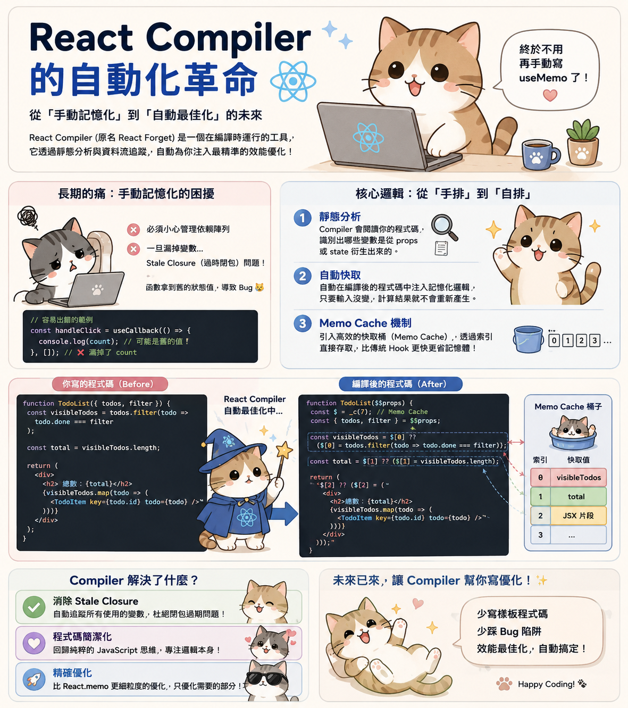

---
mdx:
  format: md
---

> 課程：JavaScript 與 React 底層原理
> 第 18 堂：Hooks 核心實作深探

# 58 useMemo 與 useCallback

想像你正在經營一家咖啡廳，每當一位客人點了「特調拿鐵」，你都要從頭開始：磨豆、萃取濃縮、打奶泡、拉花。如果這位客人每隔五分鐘就回來點一模一樣的東西，而你的店規規定「每次點餐都必須從磨豆開始重新做一遍」，即使拿鐵的味道完全沒變，這顯然非常耗時且浪費資源。

在 React 的世界裡，元件的「重新渲染（Re-render）」就像是這位回頭客。預設情況下，當元件重新執行時，內部定義的所有變數會被重新賦值，所有函數會被重新建立。這引發了一個關鍵問題：我們有沒有辦法把上次做好的「拿鐵」存起來，只要口味沒變，就直接拿給客人？這就是 `**useMemo**`** 與 **`**useCallback**`** 存在的意義——「記憶化（Memoization）」**。


## 記憶化的底層儲存：Fiber 上的二元組

要理解 `useMemo` 與 `useCallback` 的運作，我們必須回到 Fiber 節點的 `memoizedState` 鏈結串列。

回想一下我們在 `useState` 學到的知識：每個 Hook 都按順序存在一條鏈結串列上。對於 `useMemo` 而言，它在 Fiber 節點中儲存的資料結構並不是單一個值，而是一個包含兩個元素的「二元組（Tuple）」：**`[value, deps]`**。

- **`value`**：緩存的值（對於 `useMemo`）或函數實體（對於 `useCallback`）。
- **`deps`**：呼叫 Hook 時傳入的依賴陣列。

### Mount 階段：建立緩存

當元件第一次渲染（Mount）時，React 執行 `mountMemo` 或 `mountCallback`。

- **`useMemo`**：執行你傳入的 `nextCreate` 函數，獲取回傳值，並將 `[回傳值, deps]` 存入 Hook 對象。
- `**useCallback**`**：**不執行你傳入的函數，而是直接將「該函數本身」與 `deps` 組成 `[函數實體, deps]` 存入。

### Update 階段：決定是否更新

當元件更新時，React 會執行 `updateMemo` 或 `updateCallback`。這時發生的事情非常關鍵：

1. React 從目前的 Hook 中取出舊的依賴陣列 `prevDeps`。
2. 將它與新傳入的 `nextDeps` 進行比較。
3. 比較的方式是使用 `**Object.is**` 進行「淺比較（Shallow Comparison）」。
4. 如果 `nextDeps` 中的每一個元素都與 `prevDeps` 相同，React 就會直接回傳上次存好的 `value` 或 `函數`。
5. 如果有任何一個元素變了，React 就會重新執行函數（`useMemo`）或捕獲新的函數實體（`useCallback`），並更新緩存。

## useCallback 是 useMemo 的語法糖嗎？

從底層實作來看，答案是肯定的。

在 React 原始碼中，`useCallback(fn, deps)` 實質上等同於 `useMemo(() => fn, deps)`。兩者的唯一區別在於：

- `useMemo` 緩存的是 **「函數執行的結果」**。它期待你傳入一個會回傳值的函數。
- `useCallback` 緩存的是 **「函數實體本身」**。它讓你避免在每次渲染時都產生一個新的匿名函數參考。

為什麼這很重要？因為在 JavaScript 中，`() => {} === () => {}` 的結果是 `false`。即使兩個函數的邏輯一模一樣，只要它們是在不同次渲染中建立的，它們的記憶體位址（Reference）就不同。如果這個函數被作為 Prop 傳遞給子元件，而子元件使用了 `React.memo` 進行優化，子元件會因為「Props 變了（參考不同）」而被迫重新渲染，導致優化失效。

## 正確使用時機：不要為了優化而優化

很多開發者會習慣性地給所有函數包上 `useCallback`，給所有計算包上 `useMemo`。這其實是一種「過早優化」。

### 1. 昂貴的計算 (Expensive Calculations)

如果一個計算需要處理數萬條數據，或者涉及複雜的遞迴，使用 `useMemo` 是合理的。這能確保只有在輸入參數改變時，才重新啟動那台耗電的「計算引擎」。

```javascript
const sortedData = useMemo(() => {
  // 假設這是一個極其耗時的排序演算法
  return performSuperHeavySort(data);
}, [data]);
```

### 2. 穩定參考 (Stable References)

這是 `useCallback` 最常見的戰場。當你的函數會被傳入一個經過 `React.memo` 優化的子元件時，你必須確保函數的參考是穩定的。

```javascript
const Child = React.memo(({ onClick }) => {
  console.log("子元件渲染了");
  return <button onClick={onClick}>點我</button>;
});

const Parent = () => {
  const [count, setCount] = useState(0);

  // 如果不包 useCallback，每次 Parent 渲染，Child 都會跟著 re-render
  const handleClick = useCallback(() => {
    console.log("Clicked!");
  }, []);

  return (
    <>
      <button onClick={() => setCount(count + 1)}>增加計數</button>
      <Child onClick={handleClick} />
    </>
  );
};
```

### 隱藏成本：記憶化不是免費的

記住，`useMemo` 與 `useCallback` 本身也是有成本的：

- **呼叫成本**：每次渲染都要呼叫 Hook 函數。
- **比較成本**：React 必須遍歷依賴陣列，對每一項進行 `Object.is` 比較。
- **記憶體成本**：React 需要額外的空間來儲存這些二元組。

如果你的計算只是簡單的數值加減，或者子元件本身就沒有優化，那麼加上這些 Hook 反而會讓程式碼變得更慢且更難閱讀。

## 未來展望：React Compiler 的自動化革命

長期以來，「手動記憶化」一直是 React 開發者的心頭大恨。我們必須小心翼翼地管理依賴陣列，一旦漏掉一個變數，就會引發著名的 **Stale Closure（過時閉包）** 問題——函數拿到了舊的狀態值，導致 Bug。

為了解決這個痛點，React 團隊推出了 **React Compiler**（原名 React Forget）。

### 核心邏輯：從「手排」到「自排」

React Compiler 是一個在**編譯時（Build-time）**運行的工具（通常作為 Babel 或 Next.js 的插件）。它不再依賴開發者手動判斷哪裡需要 `useMemo`，而是透過靜態分析與資料流追蹤，自動達成效能優化。

1. **靜態分析**：Compiler 會閱讀你的程式碼，識別出哪些變數是從 `props` 或 `state` 衍生出來的。
2. **自動快取**：它會自動在編譯後的程式碼中注入記憶化邏輯。這意味著即使你沒寫 `useMemo`，React Compiler 也會確保只要輸入沒變，計算結果就不會重新產生。
3. **Memo Cache 機制**：Compiler 引入了一種比傳統 Hook 更高效的快取方式。它不再使用鏈結串列來存取依賴，而是利用一個全域或元件級別的「快取桶（Memo Cache）」，透過索引直接存取。

### Compiler 解決了什麼？

- **消除 Stale Closure**：因為 Compiler 是自動追蹤所有使用的變數，它不會像人類一樣漏掉依賴陣列中的成員，從根本上杜絕了閉包過期的問題。
- **程式碼簡潔化**：開發者可以回到純粹的 JavaScript 思維，不再需要為了效能而在程式碼中塞滿 `useCallback`。
- **精確優化**：Compiler 能夠實現比 `React.memo` 更細粒度的優化。它可以只對 JSX 中的某個特定片段進行記憶化，而不是整個元件。

目前的開發趨勢是：在 Compiler 完全成熟之前，我們仍需熟練掌握 `useMemo` 與 `useCallback` 的原理；但未來，我們將能把這些繁瑣的「手動標記」工作交給編譯器，回歸「宣告式 UI」的初衷。



## 穩定參考與資料流的交匯

透過本節的學習，我們理解了 `useMemo` 與 `useCallback` 並非魔法，而是 React 利用 Fiber 的持久化儲存空間對計算結果與函數參考進行的「快照維護」。它們利用 `Object.is` 這一把簡單的尺，在每次渲染中衡量「變動」的代價與「存儲」的收益。

掌握了這些記憶化 Hook 後，我們已經基本拼湊出了 Hooks 系統的核心版圖：從 `useState` 的狀態持久化，到 `useEffect` 的副作用調度，再到 `useRef` 的穩定容器，以及現在的參考穩定化。這些 Hook 共同解決了函數元件在「無狀態環境」中如何維持連貫行為的難題。

接下來，我們將進入 Topic 10 的綜合回顧，系統性地梳理這些 Hook 之間的互動關係，以及它們是如何透過「順序」與「閉包」這兩大 JavaScript 特性，支撐起整個 React 應用的邏輯骨架。
