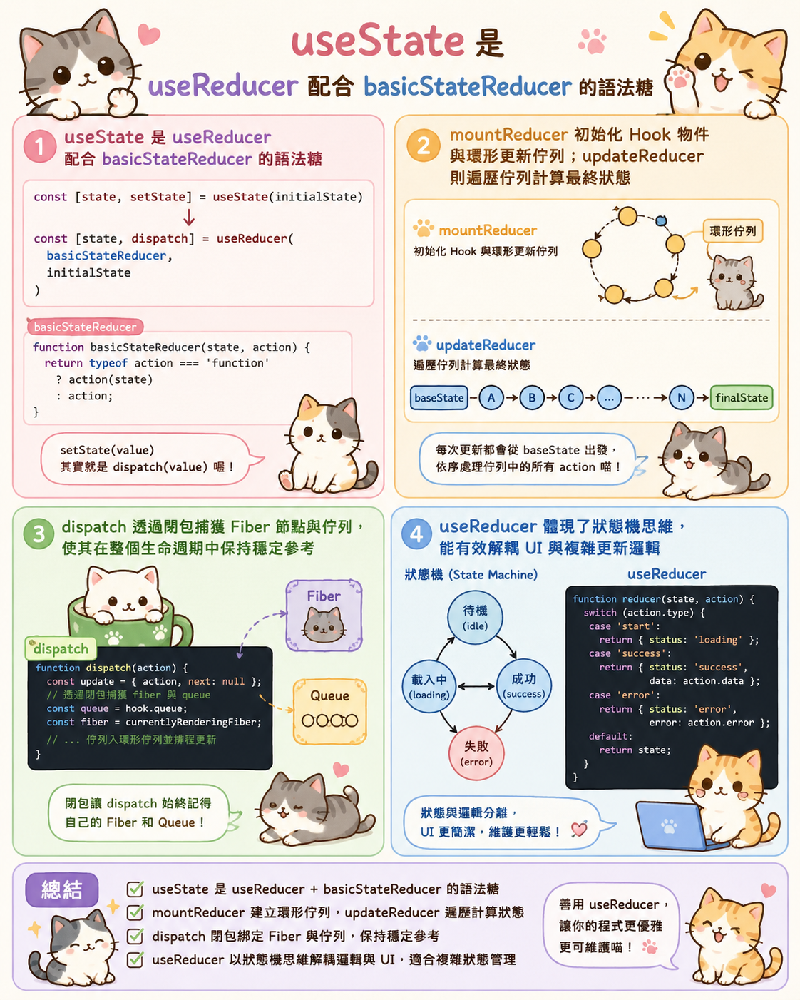

---
mdx:
  format: md
---

> 課程：JavaScript 與 React 底層原理
> 第 19 堂：Hooks 底層收尾

# 59 useReducer 底層邏輯

你知道在 React 的源碼世界裡，我們最常用的 `useState` 其實只是一個「冒牌貨」嗎？或者更精確地說，`**useState**`** 本質上只是 **`**useReducer**`** 的一個特例，是一個被簡化後的「語法糖」**。

當我們在組件中呼叫 `useState` 時，React 底層實際上是去呼叫了一個預設好的 reducer。這意味著，如果你能徹底理解 `useReducer` 的運作機制，你也就同時掌握了 React 所有狀態管理的核心秘密。

## useState 的真面目：底層的「特例」

在 React 的 `ReactFiberHooks.js` 源碼中，你會發現一個非常有趣的現象：`useState` 的實作幾乎完全依賴於 `useReducer` 的邏輯。

為了讓開發者能以更直覺的方式管理簡單狀態，React 定義了一個內部的函數叫做 `basicStateReducer`。它的邏輯極其簡單：

```javascript
function basicStateReducer(state, action) {
  return typeof action === 'function' ? action(state) : action;
}
```

這段程式碼解釋了為什麼 `setCount` 既可以接收一個直接的值（如 `setCount(1)`），也可以接收一個更新函數（如 `setCount(prev => prev + 1)`）。

當你呼叫 `useState(initialState)` 時，React 在底層執行的是：

```javascript
// 偽代碼演示
function useState(initialState) {
  return useReducer(basicStateReducer, initialState);
}
```

這就是為什麼我們說 `useState` 是 `useReducer` 的語法糖。`useReducer` 才是那個掌握著「如何根據動作（Action）計算新狀態（State）」核心權力的王者。

## 核心機制：mountReducer 與 updateReducer

在 Topic 10.1 中我們學過，Hooks 是以鏈結串列（Linked List）的形式儲存在 Fiber 節點的 `memoizedState` 欄位中。對於 `useReducer` 來說，它在組件的不同生命週期階段（掛載與更新）會有不同的實作函數。

### 掛載階段：mountReducer

當組件第一次渲染時，React 會執行 `mountReducer`。這個階段的任務是「初始化」。

1. **建立 Hook 物件**：在 Fiber 的 Hooks 鏈結串列中新增一個節點。
2. **初始化狀態**：將傳入的 `initialArg`（配合 `init` 函數，如果有的話）計算出初始狀態，並存入 `hook.memoizedState` 與 `hook.baseState`。
3. **建立更新佇列（Queue）**：這是一個極其重要的結構。`hook.queue` 負責儲存所有尚未處理的 `dispatch` 動作。為了優化效能，這個佇列採用的是 **環形鏈結串列（Circular Linked List）** 結構。
4. **綁定 dispatch**：建立一個名為 `dispatch` 的函數，並將其回傳給開發者。

### 更新階段：updateReducer

當你呼叫 `dispatch(action)` 觸發重新渲染後，React 會執行 `updateReducer`。這是「計算」發生的時刻。

想像一下，你連續呼叫了三次 `dispatch`。這些 action 並不會立即改變狀態，而是被排入剛才提到的環形鏈結串列中。在 `updateReducer` 執行時，React 會：

1. **獲取佇列**：找到該 Hook 對應的 `queue.pending`。
2. **遍歷計算**：從第一個 action 開始，依序呼叫你定義的 `reducer(currentState, action)`。
3. **狀態演進**：
  - State A + Action 1 -> State B
- State B + Action 2 -> State C
- State C + Action 3 -> Final State
4. **更新 Fiber**：將最終計算出的 `Final State` 存回 `hook.memoizedState`。

這就是為什麼 `useReducer` 能夠穩定處理複雜邏輯的原因——它保證了更新的「順序性」與「完整性」。

## dispatch 函數與閉包的穩定性

你是否注意到，無論組件重新渲染多少次，`useReducer` 回傳的 `dispatch` 函數參考永遠是不變的？這不是巧合，而是 React 刻意為之的設計。

回憶一下 Topic 2 關於 **閉包（Closure）** 的討論。當 `mountReducer` 建立 `dispatch` 函數時，這個函數透過閉包「捕獲」了當前的 `fiber` 節點和該 Hook 的 `queue`。

```javascript
// 簡化版的 dispatch 實作
function dispatchAction(fiber, queue, action) {
  // 1. 建立一個 update 物件
  const update = { action, next: null };
  
  // 2. 將 update 加入環形鏈結串列 (queue)
  // ... 這裡涉及環形鏈結串列的插入邏輯 ...

  // 3. 觸發 Fiber 調度，告知 React 需要重新渲染
  scheduleUpdateOnFiber(fiber);
}
```

因為 `dispatch` 內部持有的是對 `queue` 物件的引用（Reference），而這個 `queue` 物件在組件的整個生命週期中是同一個實體，所以 `dispatch` 函數不需要在每次渲染時重新建立。

這帶來了兩個巨大的好處：

1. **效能優化**：你可以放心地將 `dispatch` 傳給子組件，而不用擔心觸發不必要的 re-render（配合 `React.memo` 時特別有用）。
2. **擺脫過時閉包（Stale Closure）**：由於 `dispatch` 是將 action 推入佇列，而不是直接讀取當前的 state 變數，它完美避開了異步操作中常見的舊值問題。

## 從「數據驅動」轉向「意圖驅動」：狀態機思維

為什麼我們不永遠使用 `useState`？當組件變得複雜時，`useState` 會暴露出它的侷限性。

### 痛點：分散的邏輯與 UI 耦合

假設你在開發一個複雜的檔案上傳組件，狀態包括：`isIdle`、`isUploading`、`progress`、`error`、`success`。

使用 `useState` 時，你的代碼可能會長這樣：

```javascript
const uploadFile = async () => {
  setLoading(true);
  setError(null);
  try {
    const res = await api.upload();
    setSuccess(true);
    setProgress(100);
  } catch (e) {
    setError(e.message);
  } finally {
    setLoading(false);
  }
};
```

這裡的問題在於：**「如何更新狀態」的邏輯散落在各個事件處理函數中**。UI 邏輯與狀態變更邏輯高度耦合，且容易出現非法的狀態組合（例如：同時 `loading` 為 true 且 `success` 為 true）。

### 解法：useReducer 與狀態機

`useReducer` 引入了 **狀態機（State Machine）** 的思維。它將更新邏輯抽離到組件外部的 `reducer` 函數中。

- **Action (意圖)**：描述發生了什麼（例如：`{ type: 'UPLOAD_START' }`）。
- **Reducer (地圖)**：定義了從舊狀態到新狀態的唯一路徑。

```javascript
function uploadReducer(state, action) {
  switch (action.type) {
    case 'UPLOAD_START':
      return { ...initialState, status: 'uploading' };
    case 'UPLOAD_SUCCESS':
      return { ...state, status: 'success', progress: 100 };
    case 'UPLOAD_ERROR':
      return { ...state, status: 'error', error: action.payload };
    default:
      return state;
  }
}
```

在組件中，你只需要：

```javascript
dispatch({ type: 'UPLOAD_START' });
```

這種模式實現了 **邏輯與 UI 的徹底解耦**。組件不再關心狀態具體是怎麼變的，它只負責發送（dispatch）一個「意圖」，而 reducer 則像是一個純粹的數學函數，確保狀態的轉變是可預測且可測試的。

## 總結：useState 與 useReducer 的選型指南

在深入底層後，我們可以總結出一套清晰的決策框架：

1. **使用 **`**useState**`** 的場景**：
  - 狀態是獨立的（例如：一個開關、一個輸入框的字串）。
- 狀態更新邏輯非常簡單，不涉及多個狀態的聯動。
- 不需要將更新邏輯傳遞到深層子組件。
2. **使用 **`**useReducer**`** 的場景**：
  - **多個相關聯的狀態**：當改變 A 必須同時改變 B 時，Reducer 能保證原子性更新。
- **複雜的更新邏輯**：當狀態的下一個值取決於前一個值，且邏輯包含多個判斷分支時。
- **優化深層傳遞**：當你需要向下傳遞更新函數時，傳遞 `dispatch` 比傳遞多個 `setSates` 更簡潔且參考更穩定。
- **可測試性需求**：Reducer 是純函數，可以在完全不依賴 React 的環境下進行單元測試。

透過 `useReducer`，我們實際上是在利用 JavaScript 的閉包與鏈結串列，構建出一套強大的、聲明式的狀態管理系統。

## 邏輯封裝與進階抽象

掌握了 `useReducer` 的底層邏輯與狀態機思維後，你可能會發現：雖然 `useReducer` 很好用，但如果每個組件都要寫一遍 `reducer` 和 `dispatch`，代碼依然會顯得有些冗長。

這引發了一個更深層的思考：我們能不能將這些「狀態 + 副作用 + 邏輯」進一步打包，變成一個可以跨組件複用的工具？這就是 React Hooks 真正的威力所在。

在下一個單元中，我們將學習如何利用今天掌握的 Hooks 底層原理，親手設計並實作「自訂 Hook（Custom Hook）」。我們將看到如何將複雜的邏輯從 UI 元件中抽離出來，實現真正的「邏輯樂高」。

### 重點回顧

- `useState` 是 `useReducer` 配合 `basicStateReducer` 的語法糖。
- `mountReducer` 初始化 Hook 物件與環形更新佇列；`updateReducer` 則遍歷佇列計算最終狀態。
- `dispatch` 透過閉包捕獲 Fiber 節點與佇列，使其在整個生命週期中保持穩定參考。
- `useReducer` 體現了狀態機思維，能有效解耦 UI 與複雜更新邏輯。
  
