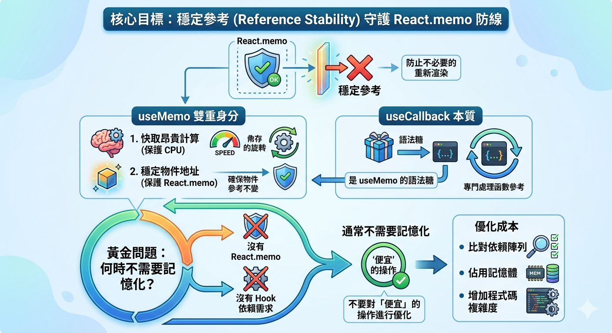

---
mdx:
  format: md
---

> 課程：JavaScript 與 React 底層原理
> 第 20 堂：React 效能優化原理

# 63 useMemo 與 useCallback 策略

在上一部分中，我們看到了 `React.memo` 作為效能守門員的強大威力，但也揭露了它的致命弱點：**參考不穩定性（Reference Instability）**。當我們傳遞物件、陣列或函數作為 Props 時，JavaScript 的參考類型特性會導致守門員認為「資料變了」，進而放行不必要的重新渲染。

這引出了一個核心問題：如果 `React.memo` 是防禦盾牌，那麼我們需要什麼樣的「穩定劑」來確保這些盾牌不會因為虛假的訊號而失效？這就是 `useMemo` 與 `useCallback` 登場的時刻。

## 優化悖論：為什麼不全部包裹起來？

在深入語法之前，請先思考一個問題：既然 `useMemo` 和 `useCallback` 可以穩定參考、快取計算結果，那為什麼 React 不預設幫我們把所有的變數和函數都包起來？

如果你現在的直覺是「一定有代價」，那你已經具備了效能優化的正確直覺。效能優化從來不是免費的午餐，它是一場關於**記憶體換時間**、**比對開銷換渲染開銷**的權衡博弈。我們這一章的使命，就是建立一套理性的決策框架，讓你精準判斷何時該出手，何時該放手。

---

## useMemo：穩定地址與昂貴計算

`useMemo` 的核心使命只有兩個：**快取耗時的計算結果**，以及**維持參考類型的位址穩定**。

### 1. 穩定參考：防止 React.memo 失效

這是 `useMemo` 在日常開發中最頻繁的使用場景。想像你有一個子元件 `Chart`，它被 `React.memo` 包裹以避免重複渲染。

```javascript
// 父元件
const Dashboard = ({ data }) => {
  // ❌ 錯誤：每次 Dashboard 渲染，options 都是一個全新的物件位址
  const options = { color: 'blue', thickness: 2 };

  return <Chart options={options} />;
};

const Chart = React.memo(({ options }) => {
  console.log("Chart 渲染了");
  return <div>圖表內容</div>;
});
```

在上面的例子中，即便 `data` 沒變，只要 `Dashboard` 因為其他原因重新渲染，`options` 就會被重新分配記憶體位址。`Chart` 的 `React.memo` 執行 `Object.is(oldOptions, newOptions)` 時會回傳 `false`，導致優化完全失效。

**解決方案：使用 useMemo 穩定位址**

```javascript
const Dashboard = ({ data }) => {
  // ✅ 正確：只要依賴陣列為空，options 的引用地址在多次渲染間保持不變
  const options = useMemo(() => ({ 
    color: 'blue', 
    thickness: 2 
  }), []);

  return <Chart options={options} />;
};
```

現在，`options` 的地址被鎖定在 Fiber 節點的 `memoizedState` 中。除非依賴項改變，否則它永遠指向同一個記憶體位置，`React.memo` 終於能發揮它的防禦作用。

### 2. 快取昂貴計算（Expensive Calculation）

另一種場景是為了避免在每次渲染時都執行沉重的邏輯。

**什麼是真正的「昂貴」？**
在現代瀏覽器中，處理 100 筆資料的 `filter` 或 `map` 幾乎是瞬間完成的（通常小於 0.1ms）。這種情況下使用 `useMemo` 其實是**負優化**。

一般來說，當你的計算符合以下特徵時，才考慮使用 `useMemo`：

- 處理的資料量級在 **1000 筆以上**。
- 涉及複雜的遞迴、大數運算或頻繁的字串處理。
- 計算耗時超過 **1ms**（你可以使用 `performance.now()` 來測量）。

```javascript
const HighCostComponent = ({ list, query }) => {
  // 假設 list 有 5000 筆資料
  const filteredList = useMemo(() => {
    console.time("filter");
    const result = list.filter(item => item.name.includes(query));
    console.timeEnd("filter");
    return result;
  }, [list, query]); // 僅在資料來源或關鍵字變動時重新計算

  return <List items={filteredList} />;
};
```

---

## useCallback：函數的記憶體鎖定

`useCallback` 本質上就是 `useMemo` 的語法糖。如果你去看 React 原始碼，你會發現：
`useCallback(fn, deps)` 其實等同於 `useMemo(() => fn, deps)`。

它專門用於**快取函數實體**。

### 為什麼函數需要快取？

在 JavaScript 中，每次定義一個箭頭函數 `const handleClick = () => {}`，都會在堆疊（Heap）中建立一個新的函數物件。

這對 `React.memo` 來說是災難性的。

```javascript
const Parent = () => {
  const [count, setCount] = useState(0);

  // ❌ 每次 Parent 渲染，此函數都會重新建立
  const handleItemClick = (id) => {
    console.log("Clicked", id);
  };

  return (
    <div>
      <button onClick={() => setCount(c => c + 1)}>增加計數</button>
      <BigListOnItemClick={handleItemClick} />
    </div>
  );
};

const BigList = React.memo(({ onItemClick }) => {
  // ... 渲染一千個項目
});
```

每當你點擊「增加計數」，`Parent` 重新渲染，`handleItemClick` 產生新地址，導致 `BigList` 無條件重新渲染。這就是典型的「優化洩漏」。

**解決方案：**

```javascript
const handleItemClick = useCallback((id) => {
  console.log("Clicked", id);
}, []); // 依賴為空，函數參考永不改變
```

### 常見誤區：給 native element 加上 useCallback

很多開發者會寫出這樣的程式碼：

```javascript
const handleClick = useCallback(() => { ... }, []);
return <button onClick={handleClick}>點我</button>;
```

**這完全沒有意義。** 原生的 HTML 標籤如 `<button>`、`<div>` 並不具備 `React.memo` 的特性。無論你傳入的 `onClick` 是不是同一個地址，React 內部處理 DOM 事件的方式並不會因此變得更快。這樣做反而增加了 `useCallback` 的維護成本。

---

## 依賴陣列（Dependency Array）的運作真相

正如我們在 Topic 10 討論過的，`useMemo` 與 `useCallback` 依賴於 `Object.is` 的淺比較。

當 React 執行到 `useMemo` 時，它會：

1. 取出上一次渲染存放在 Fiber 節點中的「舊依賴陣列」。
2. 遍歷目前的「新依賴陣列」。
3. 對每一項執行 `Object.is(old, new)`。
4. 只要有一項不同，就重新執行工廠函數；如果全部相同，則直接從記憶體抓回上一次的值。

**這意味著：如果你的依賴陣列中放了一個不穩定的物件，你的記憶化會徹底失效。**

```javascript
const config = { id: 1 }; // ❌ 在元件內定義，每次都是新的
const data = useMemo(() => fetchData(config), [config]); 
// 這裡的 useMemo 每次都會重新執行，因為 config 每次都不一樣！
```

---

## 決策框架：這是一次「正優化」還是「負優化」？

我們如何決定是否要包裹 `useMemo` 或 `useCallback`？請遵循這套「黃金問題」決策路徑：

### 問題 1：這個參考（物件/函數）是否會作為 Props 傳遞給被 React.memo 包裹的子元件？

- **Yes** → 必須包裹，否則子元件的 `memo` 會失效。
- **No** → 進入問題 2。

### 問題 2：這個參考是否會作為另一個 Hook（如 useEffect, useMemo）的依賴項？

- **Yes** → 建議包裹，以防止下游 Hook 產生不必要的連鎖反應。
- **No** → 進入問題 3。

### 問題 3：這段計算邏輯是否真的「昂貴」（>1ms 或 大量資料處理）？

- **Yes** → 應該包裹，保護 CPU。
- **No** → **不要包裹**。

### 為什麼「不要包裹」也是一種選擇？

每一次呼叫 `useMemo` 或 `useCallback` 都伴隨著額外的成本：

1. **記憶體成本**：React 必須在 Fiber 節點中額外開闢空間儲存這個值和它的依賴陣列。
2. **CPU 成本**：每次渲染都要執行依賴陣列的迴圈比對。
3. **心智負擔**：開發者需要正確管理依賴陣列，一旦漏寫（Stale Closure），就會產生難以追蹤的 Bug。

**結論：對於簡單的 **`**1 + 1**`** 或過濾 10 筆資料的行為，執行 **`**useMemo**`** 比對依賴項的開銷，可能比直接重新計算還要大。**

---

## 實踐：量化與診斷

我們來做一個思考實驗。假設有一個列表，裡面有 500 個項目，每個項目都有一個「刪除」按鈕。

```javascript
const List = ({ items, onDelete }) => {
  return (
    <div>
      {items.map(item => (
        <Item key={item.id} data={item} onDelete={onDelete} />
      ))}
    </div>
  );
};

const Item = React.memo(({ data, onDelete }) => {
  console.log(`渲染項目 ${data.id}`);
  return <button onClick={() => onDelete(data.id)}>刪除</button>;
});
```

如果你在父元件中這樣寫：

```javascript
const Parent = () => {
  const [items, setItems] = useState([...]);
  
  // ❌ 每次 Parent 渲染（例如新增一個項目時），所有的 500 個 Item 都會跟著重新渲染
  // 因為 onDelete 每次都是新的
  const handleDelete = (id) => {
    setItems(prev => prev.filter(i => i.id !== id));
  };

  return <List items={items} onDelete={handleDelete} />;
}
```

在這種情況下，`500` 個元件的無意義渲染是非常昂貴的，因為這涉及到大量的虛擬 DOM 建立與 Diffing。這裡 `useCallback` 就是絕對的**正優化**。

但如果列表只有 3 個項目呢？即便不包裹 `useCallback`，多出的 3 次微小渲染對使用者來說完全無感，反而程式碼更簡潔、出錯機率更低。

---

## 建立穩定參考的終極思維

當我們在討論 `useMemo` 與 `useCallback` 時，我們其實是在討論如何**在函數式元件的「瞬時性」中尋找「永恆」**。

- **JavaScript 閉包（Closure）**：讓函數記住過去的變數。
- **Fiber memoizedState**：讓 React 記住過去的參考。

這兩者的結合，讓我們既能享受「UI = f(state)」的簡潔，又能手動微調效能的死角。

### 承上啟下

掌握了這兩個 Hook 如何穩定參考後，我們就拿到了打開下一個大門的鑰匙。在 React 中，有一個地方比 Props 傳遞更容易引發效能災難，那就是 **Context API**。當 Context 的 `value` 發生變動時，所有訂閱該 Context 的元件都會被強制重新渲染。

在下一部分中，我們將探討如何利用 `useMemo` 鎖定 Context 的值，以及如何透過「讀寫分離」的策略，徹底解決 Context 的效能陷阱。

## 關鍵要點與總結

- **核心目標**：穩定參考（Reference Stability）是為了守護 `React.memo` 的防線。
- **useMemo 雙重身分**：快取昂貴計算（保護 CPU）與穩定物件地址（保護 `React.memo`）。
- **useCallback 本質**：是 `useMemo` 的語法糖，專門處理函數參考。
- **黃金問題**：如果沒有 `React.memo` 或是另一個 Hook 的依賴需求，通常不需要記憶化。
- **優化成本**：比對依賴陣列、佔用記憶體、增加程式碼複雜度。不要對「便宜」的操作進行優化。
  
