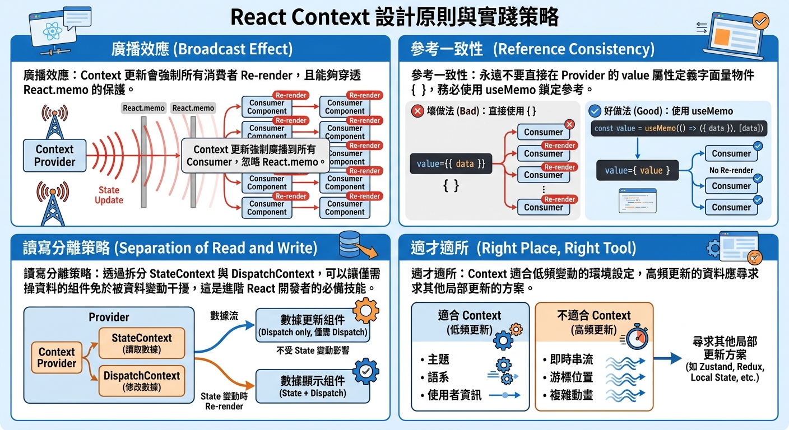

---
mdx:
  format: md
---

> 課程：JavaScript 與 React 底層原理
> 第 20 堂：React 效能優化原理

# 64 Context 效能陷阱

在學習 React 的過程中，我們通常會經歷三個階段：第一階段是為了傳遞資料而痛苦地進行 Prop Drilling（層層傳遞）；第二階段是發現了 Context API，像是發現了新大陸一樣把所有全域狀態都往裡面塞；第三階段則是發現當應用程式變大時，Context 竟然變成了效能殺手。

你可能已經知道 Context 是為了解決組件間「跨級傳遞」資料的便利工具，但你有沒有想過，為什麼 React 官方文檔和許多資深開發者會警告「不要過度使用 Context」？這不僅是因為它會讓組件變得難以測試或複用，更核心的原因在於它潛藏的 **全量渲染（Total Re-render）** 風險。

當我們在使用 `useMemo` 和 `useCallback` 努力穩定子組件的效能時，一個設計不當的 Context 就像是木馬屠城，會從內部直接瓦解你所有的優化努力。

## Context 的廣播機制：便利背後的代價

要理解 Context 的效能陷阱，我們必須先看清它的底層運作邏輯。Context 並不像普通的 Props 那樣遵循「父傳子」的線性路徑，它更像是一個 **廣播電台（Broadcast System）**。

### 訂閱者模式

當你使用 `useContext(MyContext)` 時，該組件就成為了這個 Context 的「訂閱者」。React 內部會維護一個清單，記錄哪些組件依賴於這個 Provider 的 `value`。

這聽起來很高效，但問題在於 React 的更新策略：**一旦 Provider 的 **`**value**`** 發生變化（透過 **`**Object.is**`** 檢測），所有訂閱了該 Context 的組件都必須強制重新渲染。**

### 繞過優化的「特權」

這是最致命的一點：**Context 的更新會繞過 **`**React.memo**`**。**

想像一下，你有一個被 `React.memo` 保護得很好的組件 `SlowComponent`。正常情況下，只要它的 Props 沒變，父組件重新渲染時它會保持靜止。然而，如果 `SlowComponent` 內部調用了 `useContext(MyContext)`，那麼只要 Context 的 `value` 一變，`SlowComponent` 就會無視 `React.memo` 的攔截，強行進入 Re-render 流程。

這就是為什麼 Context 被稱為「隱形依賴」——它打破了組件間明確的資料邊界，讓優化變得難以預測。

---

## 陷阱的成因：物件參考的「背叛」

在之前的課程中，我們學過 JavaScript 的參考類型（Reference Type）特性。在 Context 的場景下，這個特性最常引發非預期的效能災難。

### 典型的錯誤示範

考慮以下這個看似無害的 `AppProvider`：

```javascript
const AppContext = createContext();

const AppProvider = ({ children }) => {
  const [user, setUser] = useState({ name: 'Aria', role: 'Admin' });
  const [theme, setTheme] = useState('dark');

  // 陷阱所在：每次 AppProvider 重新渲染，這對物件實體都是新的
  const contextValue = {
    user,
    theme,
    updateTheme: () => setTheme(prev => prev === 'light' ? 'dark' : 'light')
  };

  return (
    <AppContext.Provider value={contextValue}>
      {children}
    </AppContext.Provider>
  );
};
```

### 發生了什麼事？

當 `AppProvider` 因為任何原因（例如父組件更新或內部的其他 State 變動）重新渲染時，`contextValue` 會被重新賦值為一個新的物件 `{}`。

雖然 `user` 的內容沒變、`theme` 的字串也沒變，但對 React 來說，`contextValue` 的 **記憶體位址（Reference）** 已經改變了。

結果就是：

1. **所有** 訂閱了 `AppContext` 的 Consumer 組件（不論是只用到 `user` 還是只用到 `updateTheme`）都會被強制重新渲染。
2. 即使這些組件被 `React.memo` 包裹也無濟於事。
3. 如果你的應用程式頂層有幾十個組件都在監聽這個 Context，這就是一次昂貴的集體重繪。

---

## 解決方案 A：使用 useMemo 鎖定 Context Value

既然問題出在「物件參考每次都不同」，最直覺的解法就是利用我們已經學過的 `useMemo` 來穩定這個參考。

這是優化 Context 效能的第一道防線。我們應該確保只有在 **真正的資料** 變動時，`value` 的參考才隨之改變。

### 優化後的代碼

```javascript
const AppProvider = ({ children }) => {
  const [user, setUser] = useState({ name: 'Aria', role: 'Admin' });
  const [theme, setTheme] = useState('dark');

  // 只有當 user 或 theme 真正改變時，contextValue 的參考才會更新
  const contextValue = useMemo(() => ({
    user,
    theme,
    // 注意：這裡的 function 也要確保穩定，或者直接使用 setState
    setTheme 
  }), [user, theme]);

  return (
    <AppContext.Provider value={contextValue}>
      {children}
    </AppContext.Provider>
  );
};
```

### 為什麼這樣有效？

現在，如果 `AppProvider` 的父組件觸發了 Re-render，由於 `user` 和 `theme` 的數值沒有變化，`useMemo` 會回傳 **同一個物件參考**。React 檢查到 `Provider` 的 `value` 沒變，就不會去通知那些訂閱者，從而保住了整棵組件樹的寧靜。

**進階思考：** 如果 `contextValue` 裡包含一個處理函數，記得也要用 `useCallback` 封裝，或者確保它不依賴於會頻繁變動的變數。

---

## 解決方案 B：讀寫分離（Split Context）

雖然 `useMemo` 能解決物件參考的問題，但它無法解決「部分訂閱」的問題。

想像一個情境：你的 Context 裡有 `data` 和 `dispatch`（更新函數）。

- 組件 A 只負責顯示 `data`。
- 組件 B 只負責調用 `dispatch`（例如一個「重新整理」按鈕）。

在單一 Context 的架構下，當 `data` 更新時，**組件 B 也會跟著重新渲染**。這顯然是不合理的，因為按鈕組件根本不關心資料長什麼樣子，它只需要那個穩定的函數。

這就是業界推崇的標準模式：**將 State 與 Dispatch 拆分成兩個 Context。**

### 實作模式：State/Dispatch 分離

```javascript
const StateContext = createContext();
const DispatchContext = createContext();

const UserProvider = ({ children }) => {
  const [user, setUser] = useState({ name: 'Aria' });

  // setUser 本身就是穩定的，不需要額外優化
  // 但我們把「資料」與「動作」分開廣播
  return (
    <StateContext.Provider value={user}>
      <DispatchContext.Provider value={setUser}>
        {children}
      </DispatchContext.Provider>
    </StateContext.Provider>
  );
};

// 使用時：
const UserDisplay = () => {
  const user = useContext(StateContext); // 只訂閱資料
  return <div>{user.name}</div>;
};

const UpdateButton = () => {
  const setUser = useContext(DispatchContext); // 只訂閱更新函數
  // 當 user 更新時，這個組件「不會」重新渲染！
  return <button onClick={() => setUser({ name: 'Bob' })}>Change Name</button>;
};
```

### 這種架構的威力

這種「讀寫分離」的設計完全切斷了不必要的渲染鏈結：

1. **更新函數是永恆的**：React 保證 `useState` 的 setter 或 `useReducer` 的 `dispatch` 在組件生命週期中參考不變。因此，訂閱 `DispatchContext` 的組件永遠不會因為資料變化而重繪。
2. **精確打擊**：只有真正需要展示資料的組件才會被納入渲染範圍。

這在開發複雜的大型應用（如編輯器、後台管理系統）時，是維持流暢度的關鍵技術。

---

## 使用建議與邊界：Context 不是萬能靈丹

學會了優化技巧後，我們更要學會「何時不該使用 Context」。很多效能問題的源頭，其實是選錯了狀態管理工具。

### 什麼資料「不適合」放進 Context？

核心原則是：**高頻更新（High-frequency Updates）的資料。**

- **滑鼠座標 / 滾動位置**：每一秒鐘可能更新 60 次，放進 Context 會導致整棵樹瘋狂閃爍。
- **正在輸入的 Input 內容**：使用者每打一個字就觸發一次全域廣播，會造成明顯的輸入延遲（Input Lag）。
- **動畫數值**：這些應該留在組件內部狀態，或使用專門處理動畫的 Library（如 Framer Motion）。

對於這些資料，直接操作 DOM、使用 `useRef` 或者採用基於「原子化訂閱」的狀態管理庫（如 Zustand, Jotai, Recoil）會是更明智的選擇。

### 推薦 Context 使用場景

Context 的強項在於 **低頻更新、全域共享** 的偏好設定：

- **主題切換（Theme）**：使用者通常幾小時才切換一次。
- **使用者資訊（User Session）**：登入後就不太變動。
- **國際化語系（i18n）**：切換語言是低頻操作。
- **配置資訊（Config）**：如 API Endpoint、權限清單。

當資料變動的頻率很低時，Context 帶來的開發便利性遠大於那微乎其微的效能損耗。

---

## 重點回顧與連結

## 核心總結

在這部分中，我們深入探討了 Context API 容易被忽視的效能隱患，並學習了如何透過架構設計來化解風險：

- **廣播效應**：Context 更新會強制所有消費者 Re-render，且能夠穿透 `React.memo` 的保護。
- **參考一致性**：永遠不要直接在 Provider 的 `value` 屬性定義字面量物件 `{}`，務必使用 `useMemo` 鎖定參考。
- **讀寫分離策略**：透過拆分 `StateContext` 與 `DispatchContext`，可以讓僅需操作資料的組件免於被資料變動干擾，這是進階 React 開發者的必備技能。
- **適才適所**：Context 適合低頻變動的環境設定，高頻更新的資料應尋求其他局部更新的方案。
  

至此，我們已經完整覆蓋了 React 效能優化的三大戰場：**Re-render 的觸發源、React.memo 的攔截機制、以及 Context 的廣播管理**。你現在應該有能力像一位外科醫生一樣，精準地診斷並修復組件樹中的冗餘計算。

本堂課的教學內容到此告一段落。接下來，我們將進入複習階段，整合這一堂課學到的所有優化策略。

在下一堂課中，我們將探討最後兩個效能專題：如何處理大數據量渲染的 **列表虛擬化（Virtualization）**，以及如何操作 **React DevTools Profiler** 這台「效能 X 光機」，透過解讀火焰圖（Flame Graph）來定位真正的效能瓶頸。
