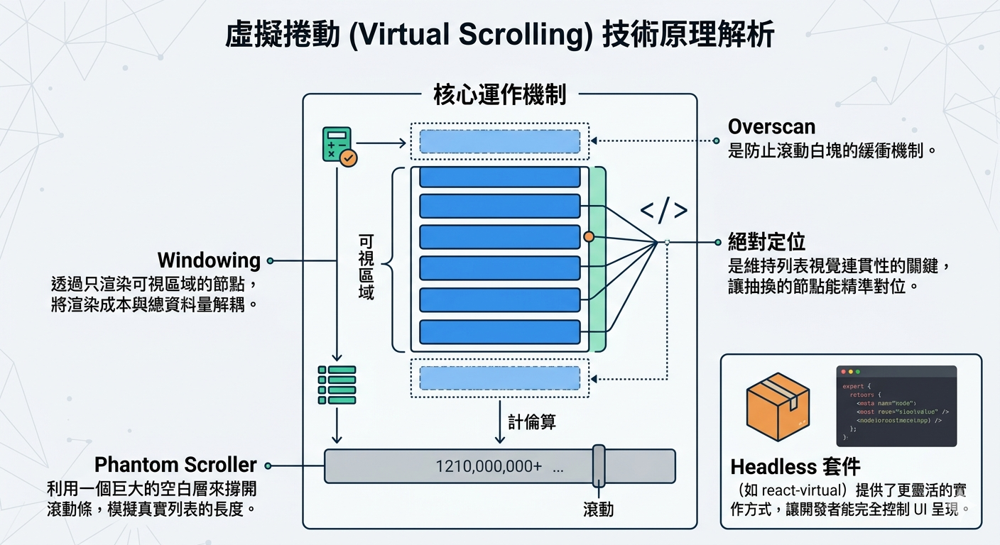

---
mdx:
  format: md
---

> 課程：JavaScript 與 React 底層原理
> 第 21 堂：效能優化收尾

# 66 虛擬化的運作原理

當你在開發一個像 Facebook 動態牆或 Slack 訊息列表的應用時，你可能會面臨一個挑戰：如果有 10,000 筆資料需要呈現，直接把 10,000 個 DOM 節點塞進頁面，瀏覽器會發生什麼事？

即便我們在上一節學會了如何透過 `React.memo` 避免元件內部的重複渲染，但當這些節點「初次掛載」或「調整佈局」時，瀏覽器的 Layout 和 Paint 引擎依然必須處理這龐大的節點量。結果通常是：頁面滾動卡頓、記憶體飆升，甚至直接當機。

有沒有一種方法，能讓我們在處理「無限資料」時，依然保持像處理「十筆資料」一樣的流暢度？這就是我們今天要探討的核心技術：**列表虛擬化（List Virtualization）**，也常被稱為 **Windowing**。

## 什麼是 Windowing：小窗戶觀看世界

想像你正在讀一張長達 10 公尺的古代捲軸。你的眼睛（視覺區域）一次只能看到捲軸中的一小段。雖然整張捲軸有 10 公尺長，但你並不需要把整張紙全部鋪在地上才能閱讀，你只需要攤開你「正在看」的那一小部分即可。

這就是 **Windowing** 的核心比喻。

在傳統的列表渲染中，如果資料有 10,000 筆，我們會建立 10,000 個 DOM 節點。這是一種 $O(n)$ 的渲染壓力，當 $n$ 增加，效能就會線性下降。而在虛擬化技術中，我們只渲染「可視區域（Viewport）」內的節點，加上少量的「緩衝區（Overscan）」。

無論你的資料庫裡有 100 筆、1,000 筆還是 1,000,000 筆資料，瀏覽器中實際存在的 DOM 節點數量永遠固定在 20 個左右（取決於視窗大小）。這成功地將渲染複雜度從 $O(n)$ 降到了 $O(1)$。

## 虛擬化列表的底層實作機制

要實作一個虛擬化列表，不能只是簡單地隱藏 `display: none` 元素，因為隱藏的元素依然存在於 DOM 樹中。真正的虛擬化是「動態地銷毀與建立」節點，並透過精密的座標計算，讓使用者感覺列表依然是一個完整的長條。

一個標準的虛擬化實作通常由三個層級組成：

### 1. 外層容器 (Outer Container / Viewport)

這是使用者真正看到的那個框框。

- **物理特性**：它必須有一個固定的高度（例如 `height: 500px`）或佔滿剩餘空間。
- **關鍵屬性**：設置 `overflow: auto` 或 `overflow-y: scroll`。
- **職責**：它負責產生滾動條，並監聽 `onScroll` 事件，獲取當前的 `scrollTop`（滾動距離）。

### 2. 內層支撐層 (Inner Area / Phantom Scroller)

這是虛擬化技術中最強大的「騙術」。

- **物理特性**：它是一個沒有任何內容、完全透明的 `<div>`。
- **高度計算**：它的高度被手動設定為 `總筆數 × 每項高度`。
- **職責**：它的唯一目的是「騙過」瀏覽器的滾動條機制。如果我們有 1,000 筆每項 50px 的資料，這個層的高度就是 50,000px。這樣外層容器就會出現一個正確長度的滾動條，讓使用者可以正常拖動，感受到資料的總量。

### 3. 可視元素層 (Item Layer)

這是真正存放 React 元件的地方。

- **物理特性**：這個層通常會採用 `position: absolute`。
- **職責**：當滾動事件觸發時，系統會計算出目前應該顯示哪幾筆資料，並將其定位到正確的座標。

### 座標計算公式

為了確保效能，虛擬化列表必須精確計算出目前該渲染的資料索引（Index）。讓我們假設：

- `itemHeight` (每項高度): 50px
- `viewportHeight` (視窗高度): 500px
- `scrollTop` (目前滾動距離): 1000px

我們可以得出以下關鍵數據：

1. **起始索引 (StartIndex)**：`Math.floor(scrollTop / itemHeight)` = `1000 / 50` = 第 20 筆。
2. **可見數量 (VisibleCount)**：`Math.ceil(viewportHeight / itemHeight)` = `500 / 50` = 10 筆。
3. **結束索引 (EndIndex)**：`StartIndex + VisibleCount` = 30 筆。

因此，React 只需要渲染第 20 筆到第 30 筆的資料。

## 絕對定位與 Offset 的必要性

你可能會問：為什麼這些節點需要使用 `position: absolute`？

如果我們只渲染第 20 筆到第 30 筆資料，且不進行定位，這 10 個節點會自動堆疊在列表的最頂端。當使用者往下捲動時，這些節點會直接消失在視窗上方。

為了維持「長列表」的幻覺，我們必須根據資料的索引，手動計算每個節點的偏移量：

```javascript
// 第 i 筆資料的 top 座標
const top = i * itemHeight;
```

當第 20 筆資料被渲染時，它的 CSS 會被設定為 `position: absolute; top: 1000px;`。這樣一來，它就會精準地出現在使用者滾動到的那個位置，看起來就像它一直待在那裡等著被看見一樣。

## 緩衝區（Overscan）的藝術

如果我們只嚴格渲染可視區域內的 10 筆資料，當使用者快速滾動時，瀏覽器可能來不及執行 JavaScript 並渲染新節點，這會導致頁面出現短暫的「白塊」。

為了解決這個問題，所有的虛擬化套件都會實作 **Overscan**。

- **概念**：在可視區域的上方和下方，額外多渲染 3 到 5 個節點。
- **效果**：當使用者開始滾動，還沒進入可視區域的節點已經預先掛載好了。這為 React 爭取了毫秒級的緩衝時間，確保滾動體驗絲滑順暢。

## 技術挑戰：固定高度 vs 動態高度

虛擬化列表最簡單的情況是「固定高度（Fixed Height）」，因為所有的數學計算（StartIndex, Top 座標）都是簡單的乘除法。

然而，現實世界往往更複雜。例如：每則留言的字數不同，導致每個列表項的高度不同。這帶來了巨大的技術挑戰：

1. **無法精確預估總高度**：如果不知道每項的高度，內層支撐層（Phantom Scroller）的高度就無法計算，滾動條會忽長忽短。
2. **無法 O(1) 定位**：要找出第 1000 筆資料的 `top` 座標，你必須知道前 999 筆的高度總和。

**目前的解決方案：**

- **預估高度（Estimated Height）**：先給一個猜測值（例如 100px），在節點真正掛載後，再透過偵測真實 DOM 高度來修正計算。
- **高度快取（Size Caching）**：一旦測量過某個索引的高度，就將其存入快取中，避免重複計算。

這也是為什麼在實作虛擬化列表時，如果你能給予固定的 `itemSize`，效能會比動態高度好上許多。

## 主流套件對比：react-window vs react-virtual

當我們理解了底層原理後，在實戰中通常會選擇成熟的套件。目前市場上有兩大主流選擇：

### 1. react-window

這是由 `react-virtualized` 的作者 Brian Vaughn 開發的「輕量化、現代化」版本。

- **優點**：體積非常小、API 簡單直覺、效能極佳。
- **設計**：它是「組件式（Component-based）」的。你直接使用 `<FixedSizeList>` 這種元件。
- **適用場景**：大多數標準的長列表需求。

### 2. react-virtual (TanStack Virtual)

這是由著名的 TanStack 團隊（React Query 的作者）開發的最新一代工具。

- **優點**：**Headless 架構**。它不提供任何 UI 元件，只提供一個 Hook（`useVirtualizer`）。它只負責計算數字（座標、索引），剩下的 DOM 結構、CSS 樣式完全由你決定。
- **靈活性**：它支持跨框架（Vue, Svelte 都能用），且處理「動態高度」的能力目前被認為是最優雅的。
- **適用場景**：高度客製化的 UI 需求，或需要處理極端複雜的動態高度列表。

## 何時該使用虛擬化？

雖然虛擬化很強大，但它並不是免費的午餐。它引入了額外的計算開銷和開發複雜度。以下是建議的使用時機：

- **當列表超過 100 筆資料**：且每一項的 DOM 結構相對複雜時。
- **當列表長度不確定（如 Infinite Scroll）**：隨著使用者往下滑，節點會無限增加。
- **需要極致的首屏速度**：即便有 1000 筆資料，透過虛擬化，初次渲染只需處理 10 筆。

**如果不值得引入虛擬化的情況：**

- 資料量只有 20-30 筆。
- 列表項目非常簡單（只有一行文字）。
- 需要強大的 SEO（搜尋引擎爬蟲可能無法觸發滾動來抓取所有虛擬化後的內容）。

## 總結與連結

我們在上一部分分析了「為什麼大量節點會讓瀏覽器變慢」（Layout & Paint 的代價），而這一部分我們掌握了「如何讓它變快」的終極大招：**虛擬化**。透過將 $O(n)$ 轉化為 $O(1)$，我們徹底解決了前端渲染大量資料的物理限制。

但請記住，效能優化不應該是憑感覺的。我們實作了虛擬化之後，如何科學地證明它確實減輕了主執行緒的負擔？又或者，如果虛擬化之後還是卡頓，問題出在哪裡？

在下一個部分，我們將學習如何使用 **React DevTools Profiler**。這將是你的診斷儀表板，讓我們能看透每一毫秒的渲染細節，找出那些隱藏在程式碼深處的效能殺手。

## 核心知識點回顧

- **Windowing** 透過只渲染可視區域的節點，將渲染成本與總資料量解耦。
- **Phantom Scroller** 利用一個巨大的空白層來撐開滾動條，模擬真實列表的長度。
- **絕對定位** 是維持列表視覺連貫性的關鍵，讓抽換的節點能精準對位。
- **Overscan** 是防止滾動白塊的緩衝機制。
- **Headless 套件**（如 react-virtual）提供了更靈活的實作方式，讓開發者能完全控制 UI 呈現。


