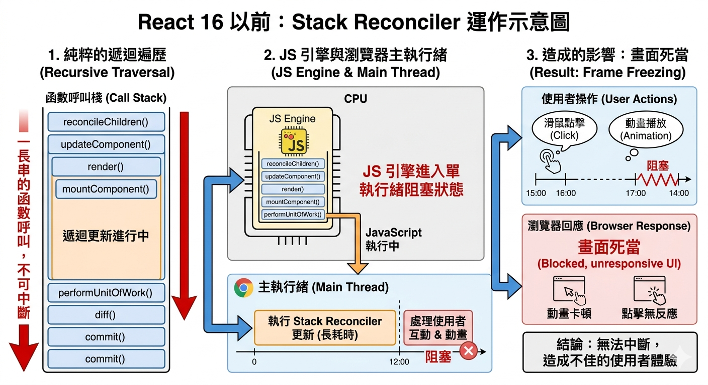

---
mdx:
  format: md
---

> 課程：JavaScript 與 React 底層原理
> 第 22 堂：JS 與 React 整合視角

# 68 JS → React 設計對照

學習到這裡，你可能已經發現，React 並不是憑空發明的奇異魔法，它更像是一場對於 JavaScript 底層特性的大規模、高精密度的實驗。

我們在前面十一個章節中，分別探討了 JS 的閉包、原型鏈、非同步機制、執行模型，以及 React 的 Fiber、Hooks 與優先級調度。現在，是時候將這些看似分散的拼圖拼湊起來了。如果你曾經好奇「為什麼 React 要這樣設計？」，答案往往不在 React 的文檔裡，而是在 JS 引擎的運行規則中。

本章節將作為整門課程的「大會師」，我們將系統性地對應 JS 原理與 React 設計決策，建立起一套完整的知識地圖。

’

### 為什麼 React 需要閉包？

在 Hooks 出現之前，函數元件（Functional Component）被稱為「無狀態元件」（Stateless Component）。這非常符合 JS 函數的本質：執行完畢，彈出 Call Stack，內部的變數隨之消失。

但 React 希望函數元件也能擁有狀態。這產生了一個矛盾：**如何在一個會不斷重新執行的函數中，保留上一次執行時的資料？**

React 的設計者選擇了閉包。當你在元件中呼叫 `useState` 時：

1. **持久化儲存**：React 並非把狀態存在你的函數裡，而是存在該元件對應的 **Fiber 節點**（位於 Heap 記憶體中）的 `memoizedState` 欄位裡。
2. **閉包連結**：`useState` 回傳的 `dispatch` 函數（即 setter）是一個閉包。它在建立時就「捕獲」了對應 Fiber 節點的參考。
3. **穩定參考**：這解釋了為什麼 `setState` 在多次渲染中參考位址保持不變。即使元件函數一遍又一遍地重新執行，這個 `dispatch` 函數依然指著同一個 Fiber 上的更新佇列（Update Queue）。

**思考一下：** 如果沒有閉包，我們每次渲染都得手動傳遞狀態物件，或是依賴全域變數，這將會導致嚴重的命名衝突與狀態管理混亂。Hooks 的優雅，本質上是 JS 閉包對「環境持久化」能力的極致應用。

## Event Loop → useEffect & Scheduler：時間管理的大師

在 Topic 4 中，我們拆解了 **Event Loop**，理解了 Macrotask（巨任務）與 Microtask（微任務）的差異。這套機制直接決定了 React 是如何安排「渲染」與「副作用」的優先順序。

### useEffect 為什麼是非同步的？

你是否想過，為什麼 `useEffect` 的回調函數不會在渲染過程中立即執行，而是要等到「瀏覽器繪製（Paint）之後」？

這正是為了遵循 Event Loop 的優化原則。React 將 `useEffect` 的執行排入了一個新的 **Macrotask** 中。這樣做的目的非常明確：**優先讓瀏覽器完成 UI 渲染**。如果 `useEffect` 是同步執行的，那麼裡面耗時的 API 請求或 DOM 操作就會阻塞主執行緒，導致使用者看到的畫面卡頓（Jank）。

### Scheduler 與 MessageChannel 的精妙搭配

我們在 Topic 9 學習 Fiber 調度時提到，React Scheduler 為了實作「時間切片（Time Slicing）」，必須能夠在每 5ms 左右主動讓出主執行緒。

React 為什麼不選用 `setTimeout(fn, 0)`？因為根據 HTML 規範，嵌套超過 5 層的 `setTimeout` 會有強制 4ms 的延遲，這對於追求 16.6ms 幀預算的 UI 框架來說太過奢侈。

因此，React 選擇了 **`MessageChannel`**。

- `MessageChannel` 屬於 Macrotask。
- 它沒有 `setTimeout` 的最小延遲限制。
- React 藉此在每一輪 Macrotask 結束後，迅速發起下一個任務，實現了「跑跑停停」但又極其高效的非同步調度。

這一切的底層邏輯，都建立在你對 JS 非同步執行模型的深刻理解之上。

## Scope Chain → Rendering Snapshot：捕捉瞬間的環境背包

在 Topic 1 和 Topic 2 中，我們學習了 **詞法作用域（Lexical Scope）** 與 **作用域鏈（Scope Chain）**。這解釋了 React 最核心的直覺之一：**每一次渲染都是一份獨立的快照（Snapshot）**。

### 為什麼這會發生？

當 React 元件重新渲染時，它本質上是**重新呼叫了一次函數**。

1. 每次呼叫都會建立一個新的**函數執行環境（Function EC）**。
2. 根據詞法作用域規則，函數內部的變數（包括 Props 和透過 `useState` 取得的 State）會被鎖定在當次執行環境中。

如果你在 `useEffect` 裡寫了一個 `setTimeout` 預計在 3 秒後印出 `count`，即使這 3 秒內你瘋狂點擊按鈕把 `count` 從 1 變成 10，3 秒後印出的依然會是 1。

**原因很簡單：** 那個 `setTimeout` 的回調函數是一個閉包，它背著的是當初 count 為 1 時的「環境背包」。它存取的是當次執行環境的作用域鏈。這不是 React 的 bug，這是 JavaScript 詞法作用域的必然結果。

理解了這一點，你就能明白為什麼我們需要 `useRef`。`useRef` 是為了在「快照式」的函數世界中，開闢一個「跨渲染」的穩定空間，讓我們能抓到最新（Current）的值。

## Immutability → State Updates：對參考型別的尊重

在 Topic 5 和 Topic 6 中，我們討論了 **不可變性（Immutability）** 以及 **參考型別（Reference Type）** 在 JS 記憶體中的行為。

### React 為什麼強迫我們寫 `[...list]`？

在原生 JS 中，直接修改物件屬性（Mutation）是最直觀的操作。但在 React 中，這會導致元件不更新。底層原因在於 React 的效能優化機制：**淺比較（Shallow Comparison）**。

1. [**Object.is**](http://Object.is)：React 在判斷狀態是否改變時，使用的是 JS 的 `Object.is`。
2. **記憶體位址**：對於物件或陣列，`Object.is` 比較的是記憶體位址（Pointer）。
3. **失效的訊號**：如果你直接執行 `list.push(item)`，雖然內容變了，但 `list` 指向的位址沒變。對 React 而言，它會認為「資料沒變，不需要重新渲染」。

因此，React 要求我們每次更新狀態都必須回傳一個**全新的物件**（Spread Operator 的價值所在）。這不僅是為了資料可追溯性，更是為了符合 JS 引擎比較物件的高效方式。

## Fiber → Heap-based Stack：將 Call Stack 搬進 Heap

這是全課程最進階的對照。在 Topic 1 中我們學習了 **Call Stack**，它是一個「先進後出」的結構。在 Topic 8 中我們拆解了 **Fiber**。

### 舊架構的死穴：同步遞迴

React 16 以前的 Stack Reconciler 使用的是純粹的遞迴遍歷。當 React 開始更新時，JS 引擎會進入一長串的函數呼叫棧。問題在於：**Call Stack 是不可中斷的**。只要遞迴沒結束，瀏覽器就無法處理使用者的點擊或動畫，造成畫面死當。

### Fiber 的救贖：虛擬堆疊幀

Fiber 架構的偉大之處在於：它將原本存在於 Call Stack 裡的執行狀態（誰是我的父節點？我處理到哪了？有哪些變數？），手動實作成一個 JavaScript 物件，並存放在 **Heap（堆積）** 記憶體中。

- **鏈結串列（Linked List）取代遞迴**：Fiber 節點透過 `child`、`sibling`、`return` 串連。
- **可中斷性**：因為執行狀態是存放在 Heap 裡的物件（Object），React 可以隨時中斷更新，把主執行緒還給瀏覽器，過一會兒再回來，透過 `workInProgress` 指針重新找到剛才處理到一半的節點。

這本質上是 React **在 Heap 裡手動實作了一個可以隨時暫停與恢復的「虛擬 Call Stack」**。沒有對 JS 記憶體模型（Stack vs Heap）的認知，就很難體會 Fiber 架構解決同步阻塞問題的精妙之處。

## 總結知識地圖

當你把這些底層連結建立起來後，React 的許多開發規範就不再是「教條」，而是「理所當然」：

- 為什麼 Hooks 不能寫在 `if` 裡？因為 **鏈結串列** 依賴穩定的順序。
- 為什麼需要 `useCallback`？因為每次渲染都是新的 **EC**，導致函數參考位址改變。
- 為什麼 `useEffect` 會拿到舊值？因為 **作用域鏈** 捕獲了當下的快照。

### 從原理看見 React 的設計哲學

React 的成功，在於它沒有試圖對抗 JavaScript 的特性（例如 this 的混亂），而是利用了 JS 最強大的一面（閉包、一等公民函數、動態物件）來建構聲明式的 UI 模型。

掌握了這些對照關係，你不僅是一個會寫 React 的工程師，更是一個深刻理解 JavaScript 運行機制的專家。這份洞察力，將是你與一般開發者拉開差距的關鍵。

## 銜接下一個部分

在建立了這份全局的知識對照表後，我們接下來要進入實戰演練。在下一個部分 **「面試底層問題精析（12.2）」** 中，我們將模擬技術面試的真實場景。看看面試官如何將這些 JS 原理包裝成棘手的問題，而你該如何運用本章建立的邏輯框架，給出一個讓專家也點頭稱讚的專業回答。

---

## 知識對照表快速回顧

| JS 底層原理 | React 設計決策 / 特性 | 核心價值 |
| --- | --- | --- |
| **Closure (閉包)** | Hooks (useState, dispatch) | 讓函數元件擁有持久化、私有的狀態空間 |
| **Event Loop (事件循環)** | useEffect, Scheduler | 分離渲染與副作用，實作非阻塞的 UI 更新 |
| **Scope Chain (作用域鏈)** | Rendering Snapshot (快照) | 確保 UI 狀態的一致性與預測性 |
| **Reference Type (參考型別)** | Immutability (不可變性原則) | 透過高效的淺比較偵測資料變動 |
| **Heap Memory (堆積記憶體)** | Fiber 架構 (Linked List) | 將同步遞迴轉化為可中斷、可恢復的工作單元 |
