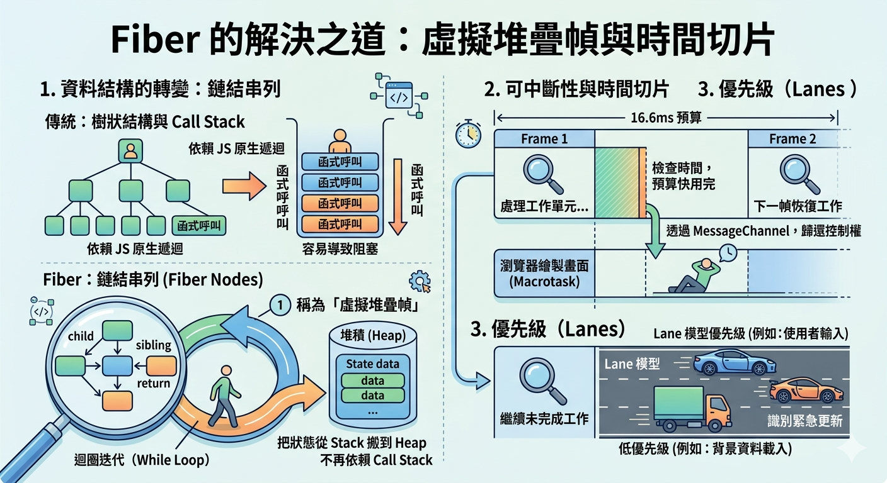

---
mdx:
  format: md
---

> 課程：JavaScript 與 React 底層原理
> 第 22 堂：JS 與 React 整合視角

# 69 面試底層問題精析

想像你正坐在一家頂尖科技公司的面試小間裡。面試官看著你的履歷，點了點頭，拋出了一個看似簡單卻深不見底的問題：「大家都說 React 很快，但你能不能從底層原理告訴我，React 16 之後的 Fiber 架構到底解決了什麼痛點？它跟之前的 Stack Reconciler 差別在哪？」

如果你只回答「它變快了」或是「它優化了效能」，那麼你與其他候選人並沒有區別。真正的專家會從 JavaScript 的執行模型（Call Stack）出發，談到主執行緒的阻塞，再延伸至 Fiber 如何將「遞迴」轉化為「鏈結串列」來實現可中斷的渲染。這正是我們在這一章節要磨練的——將你之前學到的所有 JS 原理，轉化為具備邏輯層次感、專業術語精準的面試回答範本。

## Fiber 與 Stack Reconciler 的核心差異

這幾乎是所有資深前端面試的必考題。要回答好這題，必須掌握「現象 -> 瓶頸 -> 解決方案」的邏輯。

### 舊架構的瓶頸：同步且不可中斷

在 React 16 以前（Stack Reconciler），React 更新 UI 的方式是透過「同步遞迴」。當狀態改變時，React 會從根節點開始遍歷整個 Virtual DOM 樹，計算出需要變更的部分。

這會產生一個巨大的問題：**JavaScript 的 Call Stack 是單執行緒且同步的**。一旦遞迴遍歷開始，它就會佔據主執行緒（Main Thread），直到整棵樹比對完成。如果你的組件樹非常龐大，這個過程可能會耗時 50ms、100ms 甚至更久。

根據我們在 Topic 4 學過的 Event Loop 機制，瀏覽器每一秒需要更新畫面 60 次（16.6ms 一幀）來保持流暢。如果 JS 執行時間過長，瀏覽器就沒辦法處理使用者輸入、沒辦法執行動畫，這就是所謂的「Jank」（卡頓）。

### Fiber 的解決之道：虛擬堆疊幀與時間切片

Fiber 重新設計了這個過程。它將「渲染工作」拆解成無數個微小的「工作單元（Work Unit）」。

1. **資料結構的轉變**：React 將樹狀結構改造成了「鏈結串列（Linked List）」。如我們在 Topic 8 所見，每個 Fiber 節點都有 `child`、`sibling` 和 `return` 指針。這讓 React 遍歷時不再依賴 JS 原生的 Call Stack 遞迴，而是用迴圈（While Loop）來迭代。我們稱 Fiber 為「虛擬堆疊幀（Virtual Stack Frame）」，因為它<u>把原本存在 Stack 裡的狀態搬到了 Heap（堆積）裡</u>。
2. **可中斷性（Interruptibility）**：既然是迴圈，React 就可以在每個節點處理完後，檢查一下時間。如果 16.6ms 的預算快用完了，React 會透過 `MessageChannel` 發起一個巨任務（Macrotask），將控制權還給瀏覽器去繪製畫面，並在下一幀空閒時從上次中斷的地方恢復工作。
3. **優先級（Lanes）**：Fiber 架構引入了 Lane 模型。它能識別哪些更新是緊急的（如使用者輸入），哪些可以慢一點（如背景資料載入）。



**面試官點評**：這是一個「專家級」的回覆。你不僅提到了 Fiber，還連結了 JS 的 Call Stack 限制，並準確使用了「時間切片（Time Slicing）」與「虛擬堆疊幀」等核心術語。

## 為什麼 Hooks 不能在條件式中呼叫

這是另一個考察你是否真正理解 Hooks 物理本質的問題。

### Hooks 的鏈結串列本質

回憶 Topic 10 的內容。在 React 底層，一個組件的所有 Hooks 並不是儲存在一個以「變數名」為 Key 的 Map 裡。相反地，它們被儲存在該 Fiber 節點的 `memoizedState` 欄位中，並以一個**單向鏈結串列（Singly Linked List）**的形式存在。

當你呼叫 `useState` 或 `useEffect` 時，React 內部有一個指標（指針）在移動。

- **初次渲染（Mount）**：React 依序建立 Hook 物件並串起來。
- **後續更新（Update）**：React 再次執行你的函數元件，並依序從鏈結串列中取出對應的 Hook 狀態。

### 順序錯位的災難

如果你在條件式（`if`）裡呼叫 Hook，問題就來了。假設你有三個 Hook：`A`, `B`, `C`。在第一次渲染時，順序是 `A -> B -> C`。

如果在第二次渲染時，因為某個條件，`A` 被跳過了，React 執行的第一個 Hook 依然是程式碼中的第一個（原本的 `B`）。但 React 的內部指針會指向鏈結串列的第一個位置（原本存 `A` 的地方）。

這會導致：

1. **資料類型不匹配**：原本 `B` 預期拿到一個數字，結果拿到了 `A` 的字串。
2. **狀態污染**：你的程式邏輯會徹底崩潰，因為 Hook 拿到的「環境背包」是別人的。

**回答框架**：
「React Hooks 的設計依賴於**穩定的呼叫順序**。在底層，Hooks 是以鏈結串列的形式儲存在 Fiber 節點上。React 在更新階段並不具備識別 Hook 變數名的能力，它完全依賴呼叫順序來從鏈結串列中還原狀態。一旦在條件式、迴圈中呼叫，會導致鏈結串列的讀取位置與原始碼邏輯錯位，進而引發嚴重的狀態錯誤。」

## useEffect 依賴陣列的運作機制

面試官可能會問：「為什麼我在 useEffect 裡傳入一個物件作為依賴，它每次都會執行？」

### 淺比較的真相：[Object.is](http://Object.is)

在 Topic 10 中我們學到，React 在處理依賴陣列（Dependency Array）時，使用的是 `Object.is` 演算法進行「淺比較（Shallow Comparison）」。

對於原始型別（Primitive Types），如字串、數字、布林值，`Object.is` 的表現非常直覺。但對於**參考型別（Reference Types）**，如物件、陣列或函數，它比較的是**記憶體位址（Reference）**。

### 參考型別的陷阱

連結到 Topic 1 與 Topic 5 的知識：每次 React 元件重新渲染時，元件函數都會重新執行。

```javascript
function MyComponent() {
  // 每次渲染，這行代碼都會在堆積（Heap）中建立一個全新的物件，位址都不同
  const options = { color: 'blue' }; 

  useEffect(() => {
    console.log('執行副作用');
  }, [options]); // 每次比較，options 的位址都跟上次不同，導致 useEffect 永遠執行
}
```

這就是為什麼在面試中，你需要強調：

1. **依賴項必須具備穩定性**。
2. 如果是元件內定義的物件，必須使用 `useMemo` 或 `useCallback` 進行包裹，或是將物件移出元件外部。
3. 如果物件只是為了取值，應該直接將該值的原始型別放入依賴陣列。

## React 的 Batching 底層機制

「為什麼我連續呼叫三次 `setCount(count + 1)`，結果只加了 1？React 是怎麼做到把多次更新合併的？」

### 微任務（Microtask）與 Event Loop

在 React 18 之前，批次更新（Batching）主要發生在 React 自己的合成事件處理器中。但 React 18 引入了「自動批次更新（Automatic Batching）」。

這背後的 JS 原理正是我們在 Topic 4 詳解過的 **Microtask（微任務）**。

當你呼叫 `setState` 時，React 並不會立即觸發 Reconciliation（協調）流程。相反地，它會將這個更新任務排入一個佇列（Update Queue）中。React 會利用微任務機制，在當前所有同步程式碼執行完畢後、瀏覽器準備繪製之前，一次性清空這個佇列，並計算出最終的狀態。

這就像是你去超市買東西，你不會拿一個蘋果就去結帳一次，而是把所有東西放進購物車（Queue），最後推到收銀台（Microtask 執行時機）一次結清。

**關鍵術語補充**：

- **同步更新（Sync Update）**：在舊版或 `flushSync` 中，更新是立即的。
- **非同步批次（Asynchronous Batching）**：React 18 的預設行為，利用微任務確保效能。

## Virtual DOM 的真正價值

如果你回答「Virtual DOM 的價值在於它比真實 DOM 快」，面試官可能會微微皺眉。因為直接操作 DOM（如果操作得當）永遠比透過一個抽象層快。

### 戰略價值的層次

要給出一個具有說服力的答案，你需要從以下三個維度出發：

1. **宣告式 UI 與效能下限（Performance Floor）**：
在命令式（Imperative）開發時代（如 jQuery），如果開發者不夠細心，很容易寫出導致大量 Reflow（重排）的低效代碼。Virtual DOM 透過 Diffing 演算法，保證了即使開發者不進行手動優化，React 也能提供一個「足夠好」的效能下限。它負責把複雜的 UI 變更轉化為最小的 DOM 操作集合。
2. **跨平台抽象（Cross-platform Abstraction）**：
這是最重要的價值。Virtual DOM 將「UI 描述」與「渲染實作」解耦。Virtual DOM 本質上只是一個普通的 JS 物件（Plain Object）。這份物件可以渲染到瀏覽器（ReactDOM），也可以渲染到手機原生元件（React Native）、甚至渲染到硬體（React Hardware）。
3. **開發者體驗（Developer Experience）**：
它實現了「UI = f(state)」的函數式思維。開發者只需要關注狀態的變化，而不需要關心「如何從狀態 A 過渡到狀態 B」。這種心智負擔的減輕，才是 React 能夠風靡全球的核心理由。

### 總結回答範本

「Virtual DOM 的真正價值不在於追求絕對速度的極限，而在於它提供了一個**跨平台的抽象層**，並透過 Diffing 演算法為開發者提供了穩定的**效能下限**，同時讓**宣告式開發**成為可能，極大地提升了開發大型應用的維護效率。」

## 知識總結與銜接

在這個部分，我們將前面學過的 JS 底層原理整合成了面試中的強力武器。你學會了：

- 用 **Call Stack** 解釋為什麼需要 **Fiber**。
- 用 **Linked List** 解釋 **Hooks 呼叫規則**。
- 用 [**Object.is**](http://Object.is) 解釋 **useEffect 依賴陷阱**。
- 用 **Microtask** 解釋 **Batching** 的執行時機。
- 用 **抽象層與宣告式思維** 重新定義 **Virtual DOM**。

掌握了這些「為什麼」，你就不再只是在使用工具，而是在駕馭工具。

然而，即便理解了這些，有一個魔王級的問題依然困擾著無數 React 開發者：**Stale Closure（過時的閉包）**。為什麼明明 `state` 更新了，我在 `useEffect` 裡拿到的卻還是舊值？為什麼我的 `setTimeout` 總是抓到初始狀態？

在下一個部分，我們將深入剖析這個讓所有開發者頭痛的閉包陷阱，並給出從原理到實戰的終極解決方案。

## 關鍵要點與橋接

### 本章核心回顧

- **Fiber 架構**：解決了 Stack Reconciler 的同步阻塞問題，核心在於將遞迴轉化為可中斷的鏈結串列迭代，並利用時間切片（Time Slicing）確保主執行緒的響應度。
- **Hooks 規則**：底層是依賴穩定順序的鏈結串列結構，任何條件分支都會破壞 Hook 狀態與組件的對應關係。
- **Batching 機制**：利用 JavaScript 的微任務（Microtask）特點，合併多次更新以減少渲染次數，這是 React 18 提升效能的關鍵。
- **Virtual DOM**：核心價值在於跨平台能力與效能下限的保證，而非純粹的執行速度。

### 銜接下一個主題

在掌握了這些宏觀的底層設計後，我們必須面對開發中最常見的「微觀」 Bug：Stale Closure。下一部分我們將探討當 React 的渲染快照（Snapshot）機制遇到 JavaScript 的閉包捕獲時，會產生什麼樣的衝突，以及如何利用 `useRef` 與正確的依賴設計來化解危機。
