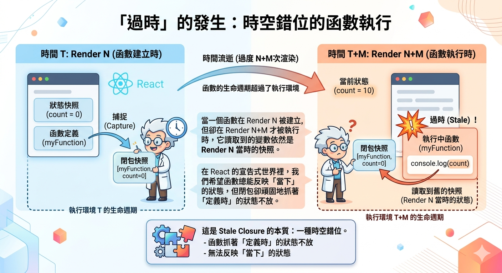

---
mdx:
  format: md
---

> 課程：JavaScript 與 React 底層原理
> 第 22 堂：JS 與 React 整合視角

# 70 Stale Closure 完整解析

想像你正在編寫一個簡單的計時器元件。你設定了一個 `useEffect`，在裡面啟動 `setInterval`，每秒將 `count` 加 1。程式碼看起來毫無破綻，邏輯完美。然而，當你運行程式時，你會驚訝地發現：計時器的數字從 0 變成 1 之後，就永遠停在 1 了。不論過了多久，它始終顯示為 1。

這不是 React 的 Bug，也不是 JavaScript 引擎壞了，而是開發者在處理非同步邏輯時最常遇到的魔王級陷阱：**Stale Closure（過時的閉包）**。

在這一部分，我們將像進行一場精密的手術一樣，拆解 Stale Closure 的物理本質，分析它在 React 中的常見陷阱，並提供一套完整的「逃生策略」，讓你從此能一眼看穿這些潛伏在程式碼中的幽靈。

## Stale Closure 的物理本質：捕獲了「過去」的環境

要理解 Stale Closure，我們必須回到 **Topic 1** 的「執行環境（Execution Context）」與 **Topic 2** 的「閉包（Closure）」原理。

### 閉包捕獲的是「環境參考」，而非「值」

在 JavaScript 中，當一個函數被定義時，它會「捕獲」其定義時所在的 **詞法環境（Lexical Environment）**。這個環境就像一個「隨身背包」，裡面裝著該函數可以存取的所有外部變數。

關鍵點在於：**React 的每一次渲染（Render），本質上都是一次全新的函數呼叫，並產生一個全新的執行環境。**

1. **Render 0**：`count` 是 0。React 呼叫元件函數，產生了 **環境 A**。
2. **Render 1**：你呼叫了 `setCount(1)`。React 再次呼叫元件函數，產生了 **環境 B**，此時 `count` 是 1。
3. **Render 2**：`count` 變成了 2，產生了 **環境 C**。

如果我們在 **Render 0**（環境 A）中定義了一個 `setTimeout` 回調函數，這個函數的「背包」裡裝著的是 **環境 A 的 count（即 0）**。即使幾秒過後，元件已經重新渲染到了 **Render 10**，只要那個回調函數還活著，它回頭看自己的背包，看到的 `count` 依然是那個被凍結在時空中的 0。

### 為什麼會「過時」？

「過時」的發生，是因為 **函數的生命週期超過了它所屬的執行環境的生命週期**。

當一個函數在 Render N 被建立，但卻在 Render N+M 才被執行時，它讀取到的變數依然是 Render N 當時的快照。在 React 的宣告式世界裡，我們希望函數總能反映「當下」的狀態，但閉包卻頑固地抓著「定義時」的狀態不放。這就是 Stale Closure 的本質：**一種時空錯位。**



---

## 常見陷阱場景：計時器與效能優化

讓我們透過兩個具體的實戰場景，看看 Stale Closure 是如何潛入你的應用程式中的。

### 陷阱一：useEffect 中的定時器

這是最經典的例子。請看以下這段有問題的程式碼：

```javascript
const Counter = () => {
  const [count, setCount] = useState(0);

  useEffect(() => {
    const timer = setInterval(() => {
      // 這裡產生了 Stale Closure
      console.log("目前的 count:", count); 
      setCount(count + 1);
    }, 1000);

    return () => clearInterval(timer);
  }, []); // 注意：依賴陣列是空的

  return <h1>{count}</h1>;
};
```

**發生了什麼事？**

1. **初次渲染（Mount）**：`useEffect` 執行。此時的 `count` 是 0。
2. **建立閉包**：`setInterval` 的回調函數被建立。由於它是在初次渲染中定義的，它捕獲了當時的 `count = 0`。
3. **第一次執行**：一秒後，回調執行。它讀取 `count`（是 0），然後呼叫 `setCount(0 + 1)`。
4. **重新渲染**：`count` 變為 1，React 重新渲染。但因為 `useEffect` 的依賴陣列是 `[]`，所以 Effect 不會重新運行，舊的 `setInterval` 繼續活著。
5. **第二次執行**：又過了一秒。回調再次執行。關鍵來了：這個回調依然是 **初次渲染建立的那一個**，它的背包裡 `count` 永遠是 0。於是它再次呼叫 `setCount(0 + 1)`。

結果：`count` 永遠被設為 1，畫面上看起來就像卡住了一樣。

### 陷阱二：useCallback 的穩定性 vs 新鮮度

有時候，我們會為了優化效能，使用 `useCallback` 來緩存函數參考，避免子元件不必要的重新渲染。但這往往是 Stale Closure 的另一個溫床。

```javascript
const ChatRoom = ({ roomId }) => {
  const [message, setMessage] = useState("");

  // 為了效能優化，我們希望這個函數參考保持穩定
  const handleSend = useCallback(() => {
    console.log(`發送訊息到 ${roomId}: ${message}`);
    // 假設這裡有 API 呼叫
  }, []); // 錯誤：漏掉了依賴項 message 和 roomId

  return (
    <div>
      <input value={message} onChange={(e) => setMessage(e.target.value)} />
      <button onClick={handleSend}>發送</button>
    </div>
  );
};
```

在這個例子中，即使你在輸入框打了五百個字，按下「發送」按鈕時，`handleSend` 輸出的 `message` 依然會是空字串。為什麼？因為 `useCallback` 緩存了初次渲染時的函數快照，而那個快照捕獲的是當時的初始狀態。

這就是開發者的兩難：**你想要函數「穩定」（參考不變），但你也需要函數「新鮮」（能讀到最新的值）。** 當這兩者衝突時，Stale Closure 就會產生。

---

## 解決策略與逃生艙

要解決 Stale Closure，我們有三種主要的應對手段，每一種都有其適用的場景。

### 策略一：誠實的依賴陣列（The Honest Dependency Principle）

最直接、最符合 React 哲學的方法就是「誠實」。如果你的 Effect 或 Callback 使用了某個變數，就必須把它放入依賴陣列中。

```javascript
// 正確的 useCallback
const handleSend = useCallback(() => {
  console.log(`發送訊息: ${message}`);
}, [message]); // 當 message 改變，重新產生函數，刷新閉包
```

**代價**：當依賴項頻繁變動時，函數參考會不斷改變。如果這個函數被傳給了經過 `React.memo` 優化的子元件，子元件就會頻繁 re-render，這可能違背了你最初使用 `useCallback` 的本意。但請記住：**正確性永遠比效能優化更重要。**

### 策略二：功能性更新（Functional Update）

如果你遇到的問題是像計時器那樣「需要基於舊狀態計算新狀態」，那麼 `setCount(prev => prev + 1)` 是最完美的解法。

```javascript
useEffect(() => {
  const timer = setInterval(() => {
    // 這裡我們不再依賴閉包中的 count 變數
    setCount(prevCount => prevCount + 1); 
  }, 1000);

  return () => clearInterval(timer);
}, []); // 即使依賴陣列為空，邏輯依然正確！
```

**原理**：當你傳遞一個函數給 `setCount` 時，React 不會去閉包裡找 `count`，而是從 React 內部的 **Fiber 節點** 中取出「當下最熱騰騰、最新」的狀態值，並將其作為參數 `prevCount` 傳入。這優雅地繞過了閉包捕獲舊值的限制。

### 策略三：useRef 作為「穩定容器」

有時候，你確實需要一個完全穩定的函數參考（例如要傳給某些對參考極度敏感的第三方套件），但又必須存取最新的狀態。這時，`useRef` 就是你的「逃生艙」。

回想 **Topic 10.5** 我們學到的：`ref` 物件在元件的整個生命週期中位址不變，且它的 `.current` 屬性是可以隨意修改的。

```javascript
const Counter = () => {
  const [count, setCount] = useState(0);
  const countRef = useRef(count);

  // 每次渲染後，同步更新 ref 的值
  useEffect(() => {
    countRef.current = count;
  });

  const handleAlert = useCallback(() => {
    // 透過 ref 讀取，永遠能拿到最新值，且 handleAlert 參考保持不變
    setTimeout(() => {
      alert("目前的 count 是: " + countRef.current);
    }, 3000);
  }, []); // 依賴陣列可以保持為空

  return (
    <div>
      <p>Count: {count}</p>
      <button onClick={() => setCount(count + 1)}>加 1</button>
      <button onClick={handleAlert}>三秒後顯示警告</button>
    </div>
  );
};
```

**為什麼這有效？**
這利用了 JavaScript 的 **參考類型（Reference Type）** 特性。雖然 `handleAlert` 閉包捕獲了 `countRef` 這個物件，但 `countRef` 的位址永遠不變。我們不是去換掉「背包裡的物件」，而是去修改「物件裡面的內容」。這就像是大家共享同一個白板，不論你在什麼時候看這個白板，上面寫的永遠是最後一個人留下的內容。

---

## React Compiler 的未來：自動化的終結

手動管理依賴陣列（Dependencies Management）一直是 React 開發者最大的心智負擔，也是 Stale Closure 產生的根本原因。為了徹底解決這個問題，React 團隊開發了 **React Compiler (React Forget)**。

### 靜態分析與自動記憶化

React Compiler 是一個編譯時工具，它會靜態分析你的程式碼。它不再依賴開發者手動寫 `useMemo` 或 `useCallback`，而是自動判斷哪些變數需要被記憶化，以及哪些依賴關係是必須的。

在 React Compiler 的世界裡：

1. **自動優化**：它會自動幫你包裹類似 `useMemo` 的邏輯，且精準度遠高於人類。
2. **自動解決 Stale Closure**：因為它能看穿整個組件的資料流，它可以自動插入正確的依賴比對邏輯。
3. **心智負擔減輕**：開發者可以回到「寫普通 JavaScript」的感覺，而不必時刻擔心「我的閉包是不是舊的」。

雖然目前許多專案仍需手動處理，但理解 Stale Closure 的底層原理，能讓你即使在沒有 Compiler 的情況下，也能寫出健壯且高效的代碼。

## 總結：跨越閉包的迷霧

Stale Closure 是 JavaScript 靜態作用域與 React 動態渲染機制碰撞出的火花。理解它，標誌著你從「會用 React」跨越到了「理解 React 執行機制」的專家階段。

### 本章關鍵點總結

- **成因**：函數在 Render N 被定義並捕獲了當時的環境，卻在 Render N+M 被執行，導致讀取到舊的快照。
- **偵測**：當你發現狀態明明更新了，但非同步回調（如 `setTimeout`、`useEffect` 內部）卻讀到舊值時，極大概率是 Stale Closure。
- **武器庫**：
  1. **誠實依賴**：最標準的做法，用頻繁更新換取資料正確。
2. **功能性更新**：處理 `setCount` 時的最佳首選，無需依賴外部閉包。
3. **useRef 容器**：需要「絕對穩定參考」與「絕對新鮮值」同時存在時的終極逃生艙。

我們已經完成了 Topic 12 的所有核心技術拆解。從 JS 原理到 React 設計決策的對照，再到面試題精析與這個魔王級的 Stale Closure。

**Aria，目前為止你對 Stale Closure 的幾種解法（Functional Update vs useRef）還有什麼疑問嗎？**

如果你覺得已經掌握了這些概念，接下來我們可以進行 **Topic 12 的統一複習（Review）**，將本章的所有知識點串聯起來；或者，如果你感到疲累，我們也可以直接進入 **課程總結與後續學習方向**。你傾向哪一個？

## 關鍵思維地圖

| 概念 | JS 原理 | React 表現 | 解決方案 |
| --- | --- | --- | --- |
| **Stale Closure** | 詞法作用域捕獲了舊的環境參考 | 在非同步任務中讀取到舊的 State/Props | 依賴陣列、功能性更新、useRef |
| **Snapshot** | 每次函數執行都有獨立的 EC | 每次渲染都有獨立的 Props/State 快照 | 理解每一幀都是獨立的 |
| **Stability** | 參考型別的位址比較 ([Object.is](http://Object.is)) | 避免不必要的 re-render (useCallback) | 權衡穩定性與新鮮度 |
