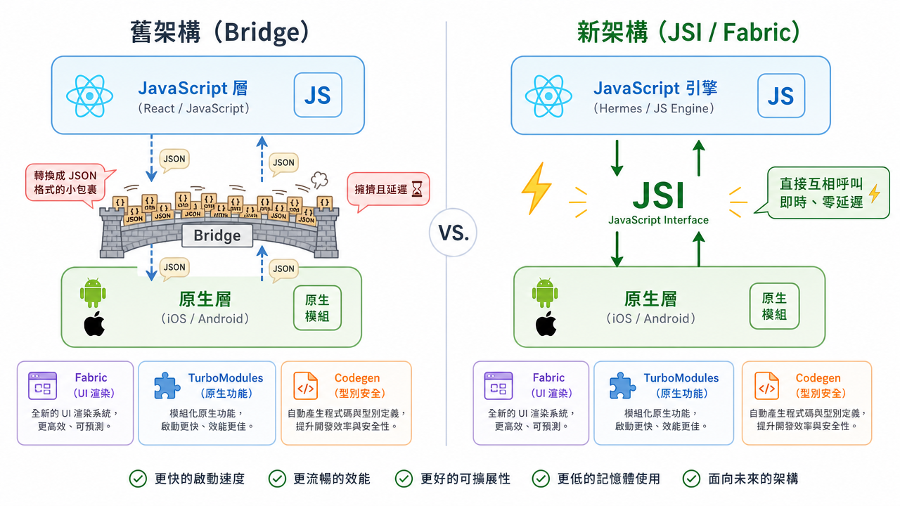

---
mdx:
  format: md
---

> 課程：RN 跨平台開發基礎
> 第 1 堂：RN 是什麼，怎麼運作的

# Bridge、JSI 與架構演進

在上一節中，我們建立了一個核心認知：在 React Native (RN) 的世界裡，JavaScript 是負責思考的「指揮官」，而 iOS 和 Android 的原生層（Native Side）則是負責幹活的「執行部隊」。

但這裡有一個非常關鍵的問題：指揮官住在「JavaScript 島」，執行部隊住在「原生島」。這兩座島之間隔著一片大海，指揮官的指令——例如「在螢幕中間畫一個紅色的正方形」或是「當使用者點擊按鈕時，跳出一個視窗」——到底是怎麼傳達到對岸的？

如果你曾經覺得你的 APP 在處理大量數據（例如快速捲動長列表）時有點卡頓，或是發現某些複雜動畫在 RN 上的表現不如原生 APP，答案通常就藏在這兩座島嶼之間的「交通方式」裡。

## 舊時代的唯一航道：Bridge（橋接器）

在 React Native 誕生後的很長一段時間裡，兩座島嶼之間只有一條唯一的交通工具：**Bridge**。

我們可以把 Bridge 想像成兩國外交官之間的「電子郵件往來」。

### 1. 核心特性：非同步與序列化

當 JavaScript 指揮官想要做任何事時，它不能直接對原生層下令。它必須遵循以下流程：

1. **序列化 (Serialization)**：JS 指揮官把指令寫成一封信，並且為了確保對岸看得懂，必須把指令轉換成一種通用的格式——也就是 **JSON** 字串。
2. **傳輸 (Transfer)**：這封 JSON 信件被丟上 Bridge 這條航道。
3. **反序列化 (Deserialization)**：原生層收到信後，把 JSON 字串拆開，解讀成自己能理解的指令，然後才開始執行。

這個過程有兩個致命的關鍵字：**「非同步 (Asynchronous)」**與**「序列化 (Serialized)」**。

- **非同步**：就像發電子郵件，你寄出去後，不能立刻知道對方收到了沒，你得等對方回信。這意味著 JS 層和原生層是各自獨立運行的，它們無法即時同步狀態。
- **序列化**：每一次溝通都要把資料轉成 JSON 再轉回來。如果只傳一個「Hello」，這沒什麼問題；但如果你要傳的是一張圖片的原始數據，或是每秒 60 次的觸控座標，這封信就會變得非常沉重。

### 2. 為什麼 Bridge 會塞車？

想像一下，當你在手機螢幕上快速滑動一個有幾千筆資料的列表（像是你的內容類 APP 中的新聞列表）時，會發生什麼事：

1. 原生層偵測到你的手指滑動了 1 像素，發信給 JS：「欸，使用者滑了 1 像素，要顯示什麼？」
2. JS 收到信，計算一下，回信給原生：「畫出第 10 筆資料。」
3. 原生收到信，畫出來。
4. 下一毫秒，手指又滑了 1 像素，整個流程再跑一遍。

當這種高頻率的溝通發生時，Bridge 這條航道就會開始塞車。信件堆積如山，原生層在等 JS 的回信，而 JS 還在忙著把資料轉成 JSON。結果就是：使用者感覺到畫面跟不上手指，或者出現短暫的白屏。這就是為什麼早期的 React Native APP 雖然能跑，但在極限性能挑戰下，總會有一種「隔了一層紗」的遲滯感。

---

## 革命性的通話方式：JSI (JavaScript Interface)

為了解決 Bridge 的瓶頸，React Native 團隊在「新架構 (New Architecture)」中引入了一個徹底改變遊戲規則的技術：**JSI**。

如果 Bridge 是發電子郵件，那麼 JSI 就是**「直接通話」**，甚至更進一步，讓兩邊共享同一個大腦。

### 從「發郵件」到「直接持有引用」

JSI 的全稱是 JavaScript Interface。它不再是一個「通訊協議」，而是一個「介面」。

技術上來說，JSI 允許 JavaScript 引擎直接呼叫 C++ 編寫的原生方法。這聽起來很技術，但對開發者的意義在於：**JavaScript 指揮官現在可以直接「看見」並「操作」原生島上的物件，而不需要透過 JSON 轉譯。**

你可以想像 JS 指揮官現在有了一雙魔手，可以跨海直接撥動原生層的開關。這種轉變帶來了幾個巨大的優點：

1. **同步呼叫 (Synchronous Execution)**：JS 現在可以問原生層：「嘿，現在這個視窗的寬度是多少？」原生層可以「立刻」回答，而不是等非同步回傳。這對於需要精準計時的動畫來說是救命恩人。
2. **零序列化成本**：資料不再需要轉成 JSON 字串。JS 可以直接持有對 C++ 物件的引用（Host Objects）。這大幅減輕了 CPU 的負擔。
3. **效能飛躍**：因為溝通成本幾乎歸零，RN 的性能理論上可以無限接近純原生開發。

---

## 新架構的三大支柱：Fabric, TurboModules 與 Codegen

有了 JSI 這個強大的基礎，React Native 的新架構建立了三根支柱，這也是你在閱讀最新的 RN 文件或 AI 生成的優化建議時，最常聽到的詞彙。

### 1. Fabric：新一代渲染系統

Fabric 是針對「UI 渲染」的優化。
在舊架構中，UI 的更新是「非同步」的。這會導致一個問題：當畫面非常複雜時，JS 指揮官可能還在計算 UI 怎麼擺，但原生層已經把畫面畫出來了，結果造成畫面閃爍或排版跳動。

Fabric 利用了 JSI 的特性，讓 UI 更新可以變成「同步」的。它支持**優先級渲染**，也就是說，像「使用者輸入」這種極需反應的操作，可以優先於「背景圖片加載」。這讓 RN APP 的觸控反應變得極致流暢。

### 2. TurboModules：按需加載的原生模組

在舊架構中，你的 APP 啟動時，所有的原生模組（藍牙、相機、地理位置等）不論有沒有用到，都必須在初始化時全部加載進來。這就像你出一趟遠門，不管用不用得到，把家裡所有的行李箱都塞進後車廂，導致車子啟動很慢。

TurboModules 改變了這一點。透過 JSI，原生模組可以變成**「懶加載 (Lazy Loading)」**。只有當你的程式碼真的寫到 `Camera.takePhoto()` 時，相機模組才會被加載進記憶體。這大幅縮短了 APP 的啟動時間。

### 3. Codegen：通訊的防錯契約

當兩座島嶼溝通變得如此頻繁且直接時，最怕的就是「雞同鴨講」。例如 JS 以為會拿到一個數字，結果原生層給了一個字串，這會導致 APP 直接崩潰。

Codegen 是一個自動化工具，它會根據你定義的型別（通常是用 TypeScript），自動生成 JS 與原生層之間的「通訊契約」。它確保了兩邊在編譯階段就達成共識，避免了運行時因為資料格式不對而產生的 bug。

---

## 這對你有什麼實際意義？

身為已經有兩款 APP 上架的開發者，你可能會想：**「既然我用 AI (vibe coding) 幫我寫程式，我為什麼需要知道這些硬核的底層架構？」**

理解這層關係，能讓你從「碰運氣修 bug」轉變為「有邏輯的診斷」。

### 1. 判斷性能瓶頸的眼光

當你發現 APP 某個地方變慢時，你可以開始思考：

- **是「邏輯太重」嗎？**（JS 指揮官腦袋打結，算太久）
- **還是「通訊開銷太重」？**（你在 Bridge 上傳了太大的資料，或是高頻率地在觸發不必要的溝通）

例如，如果你在一個 `onScroll` 事件裡放了非常複雜的 `setState` 邏輯，在舊架構下，這會導致 Bridge 瞬間癱瘓。如果你知道這一點，你就會懂得尋找更優的解決方案（例如使用 `Reanimated` 庫，它就是直接利用了 JSI 的力量，讓動畫邏輯直接跑在 UI 線程上）。

### 2. 為什麼新功能在某些版本不能用？

[有時候你會發現某些第三方套件（例如新的影音播放器）要求必須開啟 ](https://app.heptabase.com/aed2d564-e8e0-4308-a2af-1455849a1bf4/card/df8d0171-83a0-4a49-ac8d-42871e1668ad)[**New Architecture**](https://app.heptabase.com/aed2d564-e8e0-4308-a2af-1455849a1bf4/card/df8d0171-83a0-4a49-ac8d-42871e1668ad)[。如果你不理解什麼是 Fabric 或 TurboModules，你可能就會在設定文件前一頭霧水。現在你知道，這代表該套件為了追求極致性能，捨棄了舊的 Bridge 模式，改用更直接的 JSI 通訊。](https://app.heptabase.com/aed2d564-e8e0-4308-a2af-1455849a1bf4/card/df8d0171-83a0-4a49-ac8d-42871e1668ad)

### 3. 未來的保險

目前 React Native 正處於從舊架構全面轉移到新架構的過渡期。雖然現在很多 APP 仍跑在 Bridge 模式下（而且運作良好），但新架構是未來的標準。理解這個演進，能讓你在未來升級 RN 版本或選擇新的技術組件時，具備判斷「這項技術是否過時」的能力。

### 預測與觀察：你的 APP 跑在哪個架構上？

現在你可以回頭看看你的專案。如果你使用的是較新版本的 Expo (SDK 50 以上)，它其實已經在底層為新架構做好了準備。

你可以試著問自己：當你在處理你的媒體 APP 中的「進度條」或「音量調整」時，那種反應是即時的嗎？如果不是，這可能就是通訊延遲在作怪。在後續的效能優化章節中，我們會教你如何利用這些架構知識，寫出「不塞車」的程式碼。

> *這張圖展示了從「非同步的 Bridge 橋接」到「同步的 JSI 直接通訊」的演進，這是 React Native 效能提升的核心關鍵。*

## 核心觀念筆記

- **Bridge (舊架構)**：非同步、需要 JSON 序列化。溝通成本高，是性能瓶頸的主要來源。
- **JSI (新架構核心)**：同步、直接引用、零序列化。讓 JS 效能得以發揮，溝通幾乎無延遲。
- **Fabric**：讓 UI 渲染更流暢，支持同步與優先級控制。
- **TurboModules**：原生模組按需加載，優化啟動速度。
- **實戰啟示**：遇到複雜動畫或大量數據處理時，應優先考慮利用新架構能力的工具（如 Reanimated）。

從這裡開始，你已經不再只是一個「會寫會動的程式碼」的開發者，而是一個「理解能量守恆」的架構觀察者。下一節，我們將回到最基礎的工具箱，看看 RN 提供的那些核心元件，與你熟悉的網頁 HTML 元素之間，究竟存在著什麼樣的映射與陷阱。

## 準備進入核心元件與工具鏈

我們已經理解了 RN 的「靈魂（React 邏輯）」與「神經系統（Bridge/JSI）」。接下來，我們要來看看它的「骨架」。

在下一節中，我們將探討 Topic 1 的最後兩個關鍵點：

1. **RN 核心元件 vs HTML 元素**：為什麼 `
` 變成了 `<View>`？為什麼 `<Text>` 元件在 RN 裡是不可或缺的，而不能隨便打文字？
2. **Expo 與 CLI 的恩怨情仇**：你會知道你目前使用的工具鏈帶給你什麼樣的保護，以及它的界線在哪裡。
