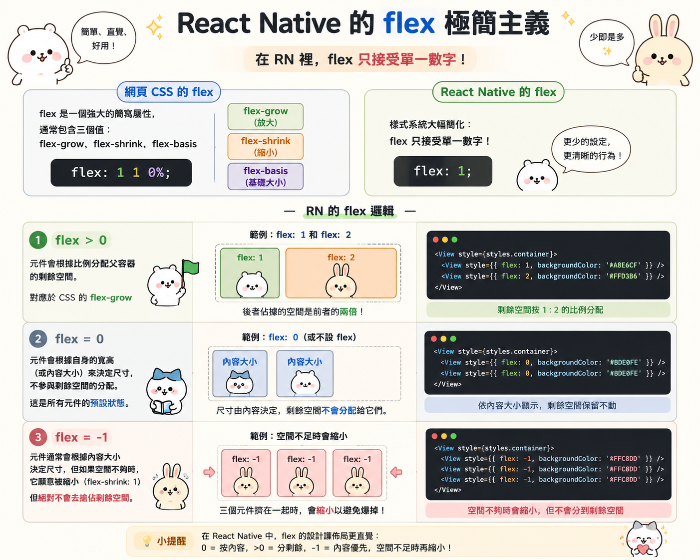

---
mdx:
  format: md
---

> 課程：RN 跨平台開發基礎
> 第 3 堂：樣式與佈局基礎

# Flexbox 核心差異

你在寫網頁 CSS 時，可能已經對 Flexbox 駕輕就熟。然而，當你滿懷信心在 React Native (RN) 寫下第一行排版樣式時，往往會發現畫面跟你想像的完全不同。按鈕莫名其妙佔滿整個寬度、文字沒有垂直居中，甚至有些在網頁上運作正常的屬性在 RN 裡直接報錯。

為什麼 React Native 選擇「不完全相容」網頁的 CSS 標準？這並非疏忽，而是為了適應行動裝置的特性以及提升排版引擎（Yoga）的效能。在這一部分，我們將深入剖析 RN Flexbox 與網頁端 CSS 的五個關鍵行為差異，幫助你建立正確的「行動端排版直覺」。

## flexDirection：從水平到垂直的 90 度轉向

這可能是網頁開發者進入 RN 遇到的第一個「下馬威」。在網頁 CSS 中，當你宣告 `display: flex` 時，子元素預設會水平排列（`flex-direction: row`）。但在 React Native 中，所有的 `View` 元件預設就是 `display: flex`，且其 `flexDirection` 預設是 `column`。

### 為什麼是 Column？

這背後反映了行動裝置與桌面網頁的本質差異。

- **網頁端：** 起源於橫向的寬螢幕，早期的排版邏輯（如內聯元素 `span`）就是水平流動。
- **行動端：** 手機螢幕是窄長型的，使用者的操作習慣是從上而下的「捲動列表」。將預設值設為 `column`，可以讓你直接像堆積木一樣把元件往下排，這符合 90% 以上的手機介面邏輯。

### 觀察行為差異

| 特性 | 網頁 CSS Flexbox | React Native Flexbox |
| --- | --- | --- |
| **預設排列方向** | `row` (水平) | `column` (垂直) |
| **主軸 (Main Axis)** | 水平方向 | 垂直方向 |
| **交錯軸 (Cross Axis)** | 垂直方向 | 水平方向 |

**預測練習：**
如果你在 RN 裡寫了三個 `View`，每個寬高都是 50，且沒有設定任何容器樣式，它們會長怎樣？

- **預測：** 它們會像階梯一樣橫著排嗎？
- **揭曉：** 不，它們會乖乖地垂直排成一列。如果你想要它們橫向排列，你**必須**明確寫上 `flexDirection: 'row'`。

---

## alignItems：預設的「伸展」魔法

另一個讓初學者困惑的地方是：為什麼我的子元件在沒有設定寬度的情況下，會自動撐滿整個螢幕寬度？

在網頁 CSS 中，`align-items` 的預設值是 `stretch`。React Native 繼承了這個預設值，但在 `flexDirection: 'column'` 的環境下，這會產生非常顯著的影響。

### 當 stretch 遇上 column

當父容器是垂直排列（`column`）時，交錯軸（Cross Axis）就是「水平方向」。此時 `alignItems: 'stretch'` 會強制讓所有沒有設定寬度的子元件，在水平方向上「拉伸」到與父容器一樣寬。

這就是為什麼你在一個 `View` 裡面放一個 `Text`，即使文字內容只有兩個字，那個 `Text` 元件（或是如果你給它背景顏色）實際上是橫跨整個螢幕的。

### 效能與簡約的考量

RN 選擇 `stretch` 作為預設，是為了減少開發者手動計算尺寸的負擔。例如，在製作一個設定頁面時，你通常希望所有的選單列都自動撐滿寬度。

**開發者陷阱：**
如果你發現 `justifyContent: 'center'` 沒反應，或是元件位置跑掉，通常是因為 `alignItems: 'stretch'` 正在暗中作祟，把元件拉得跟父容器一樣大，導致它「沒地方可以置中」了。這時，嘗試將 `alignItems` 改為 `center` 或 `flex-start`，通常能立刻看到變化。

---

## flex 屬性的「極簡主義」

在網頁 CSS 中，`flex` 是一個強大的簡寫屬性，通常包含三個值：`flex-grow`、`flex-shrink` 和 `flex-basis`（例如 `flex: 1 1 0%`）。

但在 React Native 中，樣式系統被大幅度簡化了。`flex` 屬性在 RN 裡**只接受單一數字**。

### RN 的 flex 邏輯

- **當 flex > 0：** 元件會根據比例分配父容器的剩餘空間。例如，兩個子元件分別設定 `flex: 1` 和 `flex: 2`，後者佔據的空間會是前者的兩倍。這對應於 CSS 的 `flex-grow`。
- **當 flex = 0：** 元件會根據其自身的寬高（或內容大小）來決定尺寸，不參與剩餘空間的分配。這是所有元件的預設狀態。
- **當 flex = -1：** 這是一個比較少見的用法。在 RN 中，`flex: -1` 表示元件通常會根據內容大小決定尺寸，但如果空間不夠時，它**願意被縮小**（對應於 `flex-shrink: 1`），但它絕對不會去搶佔剩餘空間。
  

### 為什麼不支援複雜簡寫？

React Native 的排版引擎 Yoga 追求的是「可預測性」和「跨平台一致性」。CSS 的 `flex-basis` 結合不同的 `box-sizing` 模型（如 `content-box` vs `border-box`）在不同瀏覽器上偶爾會有微小差異。RN 透過簡化屬性，確保了 iOS 和 Android 算出來的佈局結果能完全一致，同時也降低了 Bridge 傳輸樣式資料的複雜度。

---

## 絕對定位（Absolute Positioning）：不再需要「相對」的父輩

這是網頁開發者最容易感到「幸福」的差異之一，但也可能導致邏輯混亂。

在網頁 CSS 中，如果你要讓一個元素 `position: absolute`，你必須確保它的某一個祖先元素擁有 `position: relative`（或其他非 static 的定位），否則它會一路向上找到 `body`。

**在 React Native 中，規則變簡單了：**
所有的絕對定位元件，**預設就是相對於其直接父元素（Immediate Parent）**。

### 這個設計的妙處

你不需要再為了定位一個小圖示而刻意去給父元件加上 `position: 'relative'`。在 RN 中，所有的 `View` 預設都是 `relative` 的（雖然底層實作略有不同，但行為上可以這樣理解）。只要你設定 `position: 'absolute'`，它的 `top: 0, left: 0` 就會準確地對齊父元件的左上角。

### 注意事項

雖然不再需要尋找「最近的相對定位祖先」，但這也意味著如果你想讓一個元件相對於「爺爺輩」定位，你不能直接跳過父親。這強制開發者必須更有條理地規劃元件的層級結構。

---

## 樣式不繼承：RN 裡沒有「瀑布」

CSS 的全稱是 **Cascading** Style Sheets（層疊樣式表），其中的「層疊」包含了一個核心概念：繼承。例如，你在 `body` 設定了 `font-family` 或 `color`，全網頁的文字都會自動套用。

**在 React Native 中，除了唯一的例外，樣式是絕對不繼承的。**

如果你在一個 `View` 上設定了 `fontSize: 20` 或 `color: 'red'`，這對該 `View` 內部的 `Text` 元件**完全沒有任何影響**。這就是為什麼初學者常問：「為什麼我設定了父容器的字體，裡面文字還是預設大小？」

### 唯一的例外：巢狀 Text

RN 中唯一支援樣式繼承的場景是 `**Text**`** 元件內嵌 **`**Text**`** 元件**：

```javascript
<Text style={{ color: 'blue', fontWeight: 'bold' }}>
  我是藍色加粗
  <Text style={{ color: 'red' }}>
    我是紅色加粗（我繼承了加粗，但覆蓋了顏色）
  </Text>
</Text>
```

### 為什麼要取消繼承？

1. **效能：** 在原生層，計算樣式繼承路徑是非常耗時的。RN 為了極速渲染，選擇了最簡單的樣式應用模型。
2. **可預測性：** 當你看到一個元件時，你只需要看它自身的 `style` 屬性就能確定它的外觀，不需要去追溯它的祖先樹。這非常符合現代「元件化」開發的思維。

---

## Overflow 行為：iOS 與 Android 的隱形戰場

最後一個需要特別注意的點是 `overflow`。雖然在網頁上 `overflow: hidden` 非常直覺，但在 RN 跨平台開發中，它是個著名的坑。

### 平台行為差異

- **iOS：** 預設情況下，`View` 是不裁剪子元素的（`overflow: visible`）。即使子元件超出了父容器的邊界，它依然會顯示出來。這對於製作「超出邊框的裝飾圖示」或「陰影」非常方便。
- **Android：** 行為比較複雜。在某些版本和特定元件（如 `View`）上，它會嘗試遵循樣式，但歷史上 Android 對於超出邊界的渲染支援較差，有時會直接裁剪掉。

### 陰影的困境

這也延伸出了陰影問題。在 iOS 上，你可以輕易地透過 `shadowColor` 產生陰影；但在 Android 上，RN 必須使用 `elevation`（利用 Android 原生的仰角系統）來產生陰影。

如果你在 iOS 的父容器設定了 `overflow: 'hidden'`，你會發現你的陰影消失了——因為陰影本質上是「超出容器邊界」的渲染。這是在做 UI 完美還原時必須考慮的平台差異。


---

## 重點總結：RN vs Web 樣式對照表

讓我們用一張表快速複習剛才提到的核心差異：

| 功能 | 網頁端 (Web) | React Native (RN) |
| --- | --- | --- |
| **預設佈局** | `display: block` (一般) | `display: flex` (預設且強制) |
| **flexDirection** | 預設 `row` | 預設 `column` |
| **alignItems** | 預設 `stretch` | 預設 `stretch` |
| **flex 屬性** | `flex: 1 1 0%` (多參數) | `flex: 1` (僅限單一數字) |
| **絕對定位** | 相對於最近的 `relative` 祖先 | 總是相對於直接父元素 |
| **樣式繼承** | 大部分文字樣式會自動向下繼承 | 基本上不繼承（除了內嵌 `Text`） |
| **單位** | `px`, `em`, `rem`, `%`, `vh` | 無單位（dp/pt），僅支援部分 `%` |

## 💡 銜接下一個概念：尺寸與單位

現在你已經理解了 Flexbox 如何在空間中放置元件，但你有沒有注意到，我們在設定尺寸時從來不寫單位？在 RN 裡，我們寫 `width: 100` 而不是 `width: 100px`。

這個「100」在 iPhone 15 Pro 上和在台幣三千元的 Android 手機上，代表的意思是一樣的嗎？如果手機旋轉了，這個數字會自動變嗎？

下一部分，我們將深入探討 **React Native 的尺寸單位系統**。我們將拆解 dp、pt 與 px 的愛恨情仇，並學習如何使用 `Dimensions` API 與 `useWindowDimensions` Hook 來確保你的 APP 在不同螢幕尺寸下都能展現完美的比例。
