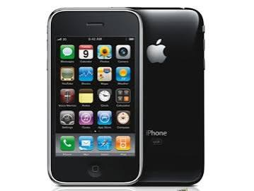
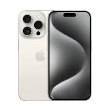
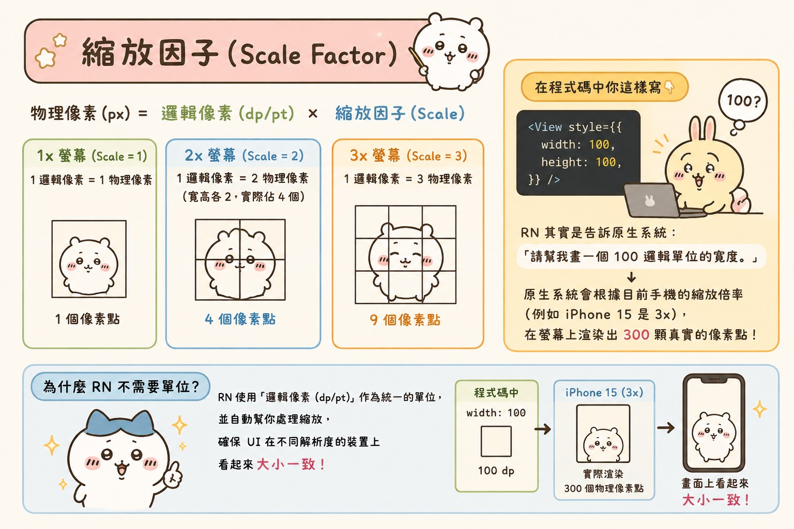

---
mdx:
  format: md
---

> 課程：RN 跨平台開發基礎
> 第 3 堂：樣式與佈局基礎

# 尺寸單位系統

如果你有網頁開發背景，切換到 React Native (RN) 時最先感到的困惑通常是：樣式裡的單位去哪了？在 CSS 中，我們習慣寫 `width: 200px`、`padding: 1.5rem` 或 `font-size: 14pt`。但在 RN 中，當你寫下 `width: 100` 時，後端沒有任何單位後綴。

這絕對不是因為 RN 偷懶，而是因為行動裝置的螢幕生態與網頁截然不同。在網頁端，一個 `px`（像素）在不同顯示器上的物理大小差異極大；但在手機上，我們追求的是「視覺一致性」——無論這支手機是 4 吋還是 6.7 吋，是平價機還是頂規旗艦機，開發者都希望一個按鈕在視覺上的物理大小是接近的。

這節課我們將拆解 RN 尺寸單位的底層邏輯，並學會如何精準控制跨裝置的佈局。

## 為什麼沒有單位？理解邏輯像素與物理像素

在 React Native 的樣式中，所有數值（寬度、高度、邊距、字型大小）都是**無單位**的純數字。

當你寫 `width: 100` 時，這個「100」代表的是**邏輯像素**（Density-independent Pixels，簡稱 **dp** 或 **dip**，在 iOS 上則稱為 **points**）。

### 為什麼不直接用物理像素 (px)？

想像一下，如果我們直接使用物理像素來設計 UI：



1. **低解析度手機（如早期的 iPhone 3GS）**：螢幕寬度約 320 像素。一個 160 像素寬的按鈕會佔掉螢幕的一半。
  
2. **高解析度手機（如 iPhone 15 Pro）**：同樣的物理尺寸下，螢幕寬度可能超過 1100 像素。如果按鈕還是 160 像素，它在視覺上會變得極小，小到手指根本按不到。

為了克服這個問題，行動作業系統（iOS 和 Android）引入了「邏輯單位」的概念。系統會根據螢幕的**像素密度 (Pixel Density)**，自動將你的邏輯單位轉換為實際的物理像素。

### 縮放因子 (Scale Factor)

這中間的轉換公式非常簡單：

> **物理像素 (px) = 邏輯像素 (dp/pt) × 縮放因子 (Scale)**

- **1x 螢幕 (Scale = 1)**：1 邏輯像素 = 1 物理像素。
- **2x 螢幕 (Retina, Scale = 2)**：1 邏輯像素 = 2 物理像素（寬高各 2，實際上佔用了 4 個物理像素點）。
- **3x 螢幕 (Scale = 3)**：1 邏輯像素 = 3 物理像素。

當你在程式碼寫 `width: 100` 時，RN 其實是告訴原生系統：「請幫我畫一個 100 邏輯單位的寬度。」原生系統會根據目前手機的縮放倍率（例如 iPhone 15 是 3x），在螢幕上渲染出 300 顆真實的像素點。

**這就是為什麼 RN 不需要單位的原因：它預設就幫你處理好了跨裝置的縮放，確保 UI 在不同解析度下看起來大小一致。**



---

## 深入 PixelRatio：什麼時候需要管真實像素？

雖然 90% 的開發情境下你只需要關心邏輯單位，但在某些特定場景，你必須知道「真實像素」是多少。這時候 `PixelRatio` API 就派上用場了。

### 1. 載入正確解析度的網路圖片

這是在內容/媒體類 APP 中最常見的效能優化點。假設你的 APP 要顯示一張頭像，在 UI 上設定的大小是 `60x60`。

- 如果是 **2x 螢幕**，你需要下載一張 `120x120` 像素的圖片才能達到最清晰的效果。
- 如果是 **3x 螢幕**，則需要 `180x180`。

如果你統一載入 3x 的大圖，雖然清晰，但在 1x 或 2x 的舊手機上會浪費頻寬和記憶體；如果你載入 1x 的小圖，在高解析度手機上看起來就會很模糊。利用 `PixelRatio.get()`，你可以根據倍率向後端請求合適的圖片尺寸。

### 2. 繪製「極細」的線

在設計稿中，有時會出現「0.5 像素」的邊框（Hairline）。在 2x 螢幕上，0.5 邏輯像素剛好等於 1 物理像素；但在 1x 螢幕上，0.5 是畫不出來的，系統可能會透過反鋸齒處理成模糊的 1 像素。

RN 提供了一個常數：`StyleSheet.hairlineWidth`。它能確保在任何螢幕上都畫出「當前設備所能呈現的最細線條」。

```javascript
const styles = StyleSheet.create({
  separator: {
    borderBottomWidth: StyleSheet.hairlineWidth, // 自動對應到 1 物理像素
    borderColor: '#ccc',
  }
});
```

### 3. PixelRatio 的常用方法

- `PixelRatio.get()`：回傳設備的縮放倍率（1, 2, 3 或 Android 特有的 3.5 等）。
- `PixelRatio.getPixelSizeForLayoutSize(100)`：將 100 邏輯像素轉換為當前設備的物理像素。
- `PixelRatio.roundToNearestPixel(8.4)`：將數值四捨五入到最接近的物理像素整數，防止因為浮點數計算導致的渲染裂縫。

---

## 獲取螢幕尺寸：Dimensions vs useWindowDimensions

當我們需要根據螢幕大小動態調整 UI 時（例如：一張圖片要佔滿全螢幕寬度，或是在平板上顯示三欄式佈局），我們需要獲取螢幕的具體尺寸。

### Dimensions API (靜態讀取)

這是 RN 早期提供的 API。

```javascript
import { Dimensions } from 'react-native';

const { width, height } = Dimensions.get('window');
```

**警告：** `Dimensions.get()` 是靜態的。它在 APP 啟動時獲取數值。如果使用者在 APP 運行中**旋轉螢幕**，或是開啟了 **iPad 的分割畫面 (Split View)**，這個數值不會自動更新。你的 layout 就會壞掉。

雖然你可以透過 `Dimensions.addEventListener` 來手動監聽變化，但這寫法非常繁瑣且容易出錯。

### useWindowDimensions Hook (響應式推薦)

對於函數式元件，`useWindowDimensions` 是現在的首選方案。它不僅寫法簡單，最重要的是它是**響應式**的——當螢幕尺寸變化時，它會觸發元件重新渲染。

```javascript
import { useWindowDimensions, View, Text } from 'react-native';

const MyComponent = () => {
  const { width, height, scale, fontScale } = useWindowDimensions();

  return (
    <View style={{ width: width * 0.8, height: 100, backgroundColor: 'blue' }}>
      <Text>螢幕寬度：{width}</Text>
    </View>
  );
};
```

### 「Window」 vs 「Screen」 的區別

在呼叫 API 時，你會看到這兩個選項：

- **Window**：指的是應用的**可視區域**。在 Android 上，這通常會扣除導覽列（底部三個按鈕那欄）和狀態列。在 iPad 分屏模式下，這指的是你的 APP 佔用的那一半空間。
- **Screen**：指的是整個**物理螢幕**的尺寸，不論你的 APP 實際佔用了多少。

**絕大多數情況下，你應該使用 **`**window**`**。** 因為我們關心的是「我的 APP 還有多少空間可以畫」，而不是這塊面板物理上有多大。

---

## 實踐場景：媒體類 APP 的封面圖佈局

讓我們把這些知識應用到你正在開發的內容/媒體 APP 中。假設你要實作一個資訊流列表，每張卡片的封面圖需要「佔滿螢幕寬度」且「維持 16:9 的比例」。

### 錯誤的做法：手動計算

如果你用 `useWindowDimensions` 拿到寬度再除以 16 乘 9 算出高度，然後寫死在樣式裡：

```javascript
const { width } = useWindowDimensions();
const imageWidth = width;
const imageHeight = (width * 9) / 16;

return <Image style={{ width: imageWidth, height: imageHeight }} />;
```

這雖然能動，但有幾個問題：

1. 每次螢幕旋轉都會重新計算，增加 JS Thread 負擔。
2. 忽略了卡片可能有的外邊距 (Margin)。

### 更好的做法：結合 Flexbox 與 aspectRatio

還記得上一節學到的 Flexbox 嗎？在 RN 中，`aspectRatio` 屬性非常強大。

```javascript
// 即使我們不知道具體寬度（例如受父層 padding 影響）
// 只要寬度被確定了（透過 flex: 1 或 width: '100%'）
// aspectRatio 會自動幫你算出高度
<Image 
  source={{ uri: '...' }} 
  style={{ 
    width: '100%', 
    aspectRatio: 16 / 9,
    borderRadius: 8 
  }} 
/>
```

這種做法更符合「聲明式」的邏輯：你告訴系統圖片的比例，剩下的交給渲染引擎去處理，而不是自己拿著計算機算。

### 何時該用百分比 (%)？

RN 的樣式支援百分比字串，如 `width: '50%'`。

- **優點**：簡單直覺，隨父容器變化。
- **缺點**：百分比是相對於**父容器**的。如果父容器本身寬度不固定（例如是一個 `flexDirection: 'row'` 且沒有固定寬度的 View），百分比可能會失效。

在 RN 中，我們通常優先使用 `flex` 來分配比例，只有在需要精確對應視窗比例（例如「此元件必須佔螢幕 1/3 高」）時，才會考慮 `useWindowDimensions` 結合百分比計算。

---

## 總結：給 Web 開發者的建議

1. **放棄 rem/em 的思維**：RN 裡沒有根字體大小的概念。如果你需要統一縮放字體，通常是透過自定義的主題物件（Theme Object）來達成。
2. **不要怕寫死數字**：在 Web 裡寫 `width: 200px` 是大忌，但在 RN 裡寫 `width: 200` 是很正常的。因為這個 200 是邏輯單位，它在不同手機上的視覺比例會自動對齊。
3. **優先使用 Flexbox 和 aspectRatio**：能用佈局規則解決的，就不要用 JS 計算。
4. **動態佈局靠 Hook**：需要監控螢幕變化（如旋轉）時，一律使用 `useWindowDimensions`。

---

## 銜接與預告

現在你已經理解了 React Native 的「度量衡」——知道如何定義大小、知道 100 到底代表什麼、也知道如何獲取目前螢幕的空間。這解決了「靜態」的尺寸問題。

然而，當你的 APP 在 6 吋手機上看來完美，換到 11 吋的 iPad 上時，原本「佔滿寬度」的圖片可能會變得巨大且突兀，或者文字排版變得鬆散。

在下一部分中，我們將學習如何利用今天掌握的 Flexbox 與尺寸單位，構建一套完整的**響應式佈局 (Responsive Design) 策略**。我們將探討如何設計斷點（Breakpoints）、如何實作手機與平板的條件判斷，讓你的 APP 在任何螢幕比例下都能提供高品質的視覺體驗。
