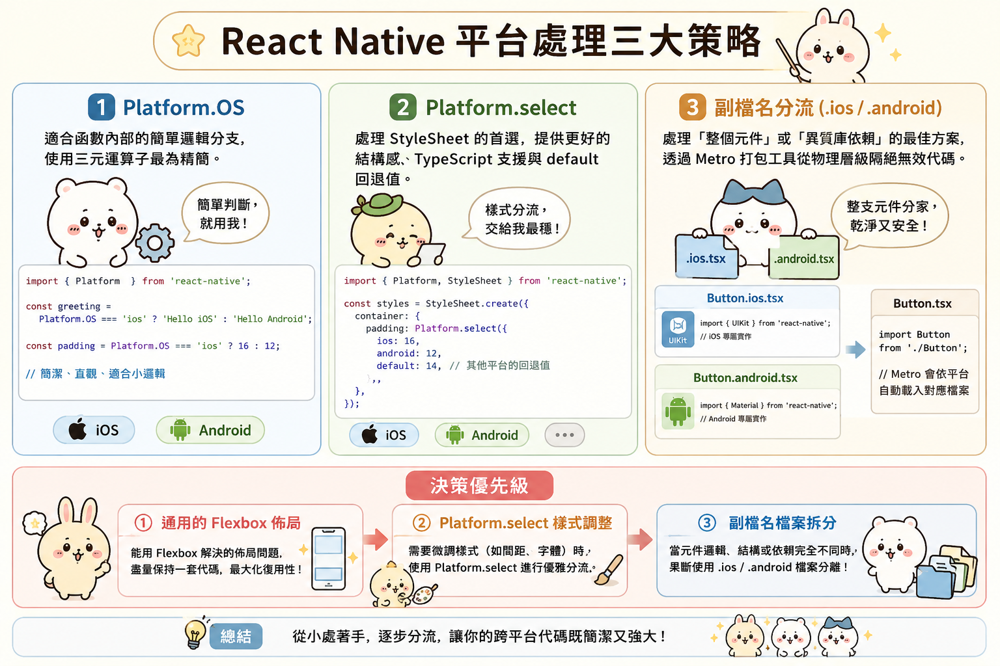

---
mdx:
  format: md
---

> 課程：RN 跨平台開發基礎
> 第 4 堂：樣式的跨平台收尾

# Platform 條件樣式

想像你正在開發一個播放器的控制列。在 iOS 上，你希望按鈕帶有一點模糊透明感，並且位於螢幕最底部；但在 Android 上，你需要符合 Material Design 的規範，按鈕要有明顯的陰影，且因為導覽列的關係，底部需要留出不同的間距。

如果我們在程式碼中寫滿了 `if (isIOS) { ... } else { ... }`，你的邏輯很快就會變成一團亂麻，難以閱讀也難以維護。React Native 提供的 `Platform` 模組與打包工具的特性，就是為了優雅地解決這個問題。這不只是關於「判斷」，更是關於如何「架構」你的跨平台程式碼。

## Platform.OS：最直接的判斷工具

最基礎的工具是 `Platform.OS`。它是一個簡單的字串，值只會是 `'ios'` 或 `'android'`（在某些環境下也可能是 `'web'` 或 `'macos'`）。

當你需要執行一些微小的邏輯切換，或者是在一段函數中做簡單的條件判斷時，這是最直覺的選擇。

```tsx
import { Platform, StyleSheet } from 'react-native';

const headerHeight = Platform.OS === 'ios' ? 44 : 56;

const handlePress = () => {
  if (Platform.OS === 'android') {
    // Android 特有的震動回饋或 API 呼叫
    console.log('Running on Android');
  }
};
```

### 深入底層：Platform.Version

除了判斷系統，有時候你還需要判斷「系統版本」。例如，Android 在 API 33 (Android 13) 之後對媒體權限有了大幅度的改動，或者是 iOS 在特定版本後才支援某些視覺效果。

- **iOS**：`Platform.Version` 會回傳一個字串（例如 `"17.2"`）。通常我們會配合 `parseInt` 來轉換。
- **Android**：`Platform.Version` 會回傳一個數字（即 API Level，例如 `33`）。

這在處理「漸進式增強」時非常有用：如果使用者的系統版本太舊，我們就回退到較基礎的實作，而不是直接報錯。

---

## Platform.select：結構化的平台分流

當你需要針對不同平台提供一組完全不同的物件（例如樣式表或配置項）時，`Platform.OS` 的 `if/else` 就顯得力不從心。這時 `Platform.select` 就是你的救星。

`Platform.select` 接受一個物件，其 key 為平台名稱，value 為你想要在該平台執行的內容。

### 為什麼選用 Platform.select？

1. **程式碼更具可讀性**：它強迫你將不同平台的邏輯「成對」擺放，一目了然。
2. **型別安全 (TypeScript)**：在 TS 中，`Platform.select` 能根據你傳入的物件自動推導回傳型別。
3. **預設值支援**：你可以使用 `default` key 來處理未明確定義的平台，這在未來擴展到 Web 或其他平台時非常有用。

讓我們看一個實戰中的樣式應用：

```tsx
const styles = StyleSheet.create({
  container: {
    flex: 1,
    // 針對不同平台提供不同的間距與背景色
    ...Platform.select({
      ios: {
        backgroundColor: '#F3F3F3',
        paddingTop: 20,
      },
      android: {
        backgroundColor: '#FFFFFF',
        paddingTop: 10,
      },
      default: {
        backgroundColor: 'gray',
      }
    }),
  },
  text: {
    // 你甚至可以在單一屬性上使用它
    fontSize: Platform.select({ ios: 16, android: 14 }),
    fontFamily: Platform.select({ ios: 'Helvetica', android: 'Roboto' }),
  }
});
```

這裡有一個值得注意的細節：`Platform.select` 的運作時機。它是在 **Runtime (執行期)** 決定要回傳哪一部分。雖然這對效能影響微乎其微，但這意味著所有的程式碼分支都會被打包進你的 JS Bundle 中。如果你的兩個平台邏輯差異巨大，甚至需要引用不同的第三方函式庫，那麼將兩份邏輯都塞進同一個檔案就不太明智了。

---

## 副檔名分流：打包層級的終極方案

如果你的某個元件（例如 `VideoPlayer`）在 iOS 上使用 `expo-av`，但在 Android 上因為特定需求必須使用原生封裝的 `ExoPlayer`，這時 `Platform.select` 會讓檔案變得異常臃腫且難以維護。

這就是 **platform-specific 副檔名** 大顯身手的時候。React Native 的打包工具 **Metro** 有一個非常強大的特性：它能根據副檔名自動過濾檔案。

你可以建立兩個檔案：

- `MyComponent.ios.tsx`
- `MyComponent.android.tsx`

然後在其他檔案中，你只需要像平常一樣匯入：

```tsx
import MyComponent from './MyComponent';
```

### Metro 是如何運作的？

當 Metro 打包 iOS 版本時，它會優先尋找帶有 `.ios.tsx` 的檔案。如果找到了，它就完全忽略 `.android.tsx`，甚至連預設的 `MyComponent.tsx` 都會被跳過。

這種方式有三大優勢：

1. **Bundle 瘦身**：只有當前平台需要的程式碼會被打包進去。Android 的程式碼絕對不會出現在 iOS 的 Bundle 中。
2. **避免編譯錯誤**：如果你在 `.ios.tsx` 中匯入了一個僅支援 iOS 的原生模組，這段程式碼在 Android 打包時根本不會被讀取，從而避免了「找不到模組」或「呼叫未定義函數」的編譯錯誤。
3. **徹底解耦**：兩個平台的實作可以完全不同，只要它們對外暴露的 `Props` 介面一致即可。

### 什麼時候該拆檔案？

通常我們會針對以下情境進行檔案拆分：

- **複雜的 UI 元件**：例如客製化的地圖介面、相機介面。
- **原生 API 橋接**：當你需要直接與 iOS 的 Objective-C/Swift 或 Android 的 Java/Kotlin 溝通時。
- **導覽邏輯**：如果 iOS 習慣用 Tab 導覽而 Android 習慣用側邊欄，拆分 `MainNavigation.ios.tsx` 是很專業的做法。

---

## 決策框架：我該選哪一種？

身為開發者，最困難的不是學會工具，而是決定何時用哪個工具。你可以參考以下這個決策邏輯：

| 使用場景 | 推薦工具 | 原因 |
| --- | --- | --- |
| **微小的樣式差異** (如：一個顏色、一點 padding) | **Platform.OS** (三元運算子) | 快速、簡潔，不破壞程式碼流暢性。 |
| **結構化的樣式定義** (如：StyleSheet 中的大塊差異) | **Platform.select** | 語法結構清晰，對 TypeScript 友善，易於維護。 |
| **完全不同的邏輯流程** (如：處理權限、不同庫的呼叫) | **Platform-specific 副檔名** | 避免平台專屬的邏輯互相干擾，程式碼更乾淨。 |
| **整個元件的 UI 架構不同** (如：iOS 用模態視窗，Android 用新頁面) | **Platform-specific 副檔名** | 將複雜度隔離開來，避免單一檔案過長。 |

### 實戰陷阱：不要過度判斷

新手最常犯的錯誤是：**過度使用平台判斷來修補佈局問題**。

例如，你發現一個元件在 Android 上偏了 5 像素，於是你寫了 `marginTop: Platform.OS === 'android' ? 5 : 0`。但這通常是因為你忽略了 Flexbox 的某些預設行為，或者是沒有處理好 `StatusBar` 的高度。

**正確的心態應該是：**
優先尋找跨平台通用的佈局解法。只有當「作業系統的設計哲學」或「原生組件行為」真的不同時（例如 iOS 沒有 Android 的返回鍵、iOS 的陰影模型完全不同），才動用 `Platform` 工具。

---

## 隱藏的進階技巧：Platform.isPad 與 Platform.isTV

在處理內容/媒體類 APP 時，你可能會遇到平板或電視裝置。`Platform` 模組還提供了幾個實用的布林值：

- `Platform.isPad` (僅限 iOS)：協助你判斷是否為 iPad。這對於媒體類 APP 決定要顯示「單欄列表」還是「雙欄網格」至關重要。
- `Platform.isTV`：當你希望 APP 也能在 Apple TV 或 Android TV 上運作時使用。

這些屬性能讓你不需要寫複雜的螢幕寬度判斷，就能快速辨識裝置類型。

```tsx
import { Platform } from 'react-native';

const numColumns = Platform.isPad ? 3 : 1;
```

雖然 `isPad` 很有用，但請記住，隨著現代手機螢幕越來越大（甚至有摺疊機），我們在 Topic 2.4 學到的 `useWindowDimensions` 結合斷點（Breakpoints）通常是處理佈局更靈活的做法。而 `Platform.isPad` 則是用來處理「真的只有 iPad 才有的功能」（例如支援 Apple Pencil 的特定筆觸）。

## 總結與銜接

理解了 `Platform` 的三套招式後，你現在已經具備了「因地制宜」的能力。你可以讓你的 APP 在 iOS 上展現出果粉熟悉的流暢優雅，同時在 Android 上保留極致的 Material 回饋。

然而，掌握了工具並不代表能避開所有坑。在下一部分中，我們將進入最令開發者頭痛的「跨平台視覺陷阱」。即便你正確地寫了 `Platform.select`，為什麼同樣的 `shadow` 設定在 Android 上完全消失？為什麼同樣的 `lineHeight` 會讓 Android 的文字被切掉，而 iOS 卻正常？我們將深入底層渲染機制，拆解這些常見的不一致性。

## 關鍵要點與後續重點

### 核心觀念

- **Platform.OS** 適合函數內部的簡單邏輯分支，使用三元運算子最為精簡。
- **Platform.select** 是處理 `StyleSheet` 的首選，它提供了更好的結構感與 TypeScript 支援，並能設定 `default` 回退值。
- **副檔名分流 (.ios / .android)** 是處理「整個元件」或「異質庫依賴」的最佳方案，它透過 Metro 打包工具從物理層級隔絕了無效代碼。
- **決策優先級**：通用的 Flexbox 佈局 > `Platform.select` 樣式調整 > 副檔名檔案拆分。
  

在接下來的部分，我們將探討這些工具無法直接解決的問題：那些隱藏在底層渲染引擎（Core Graphics vs Skia/Canvas）之下的視覺不一致性，並學習如何為你的 APP 打造一套真正穩定的視覺基礎設施。
