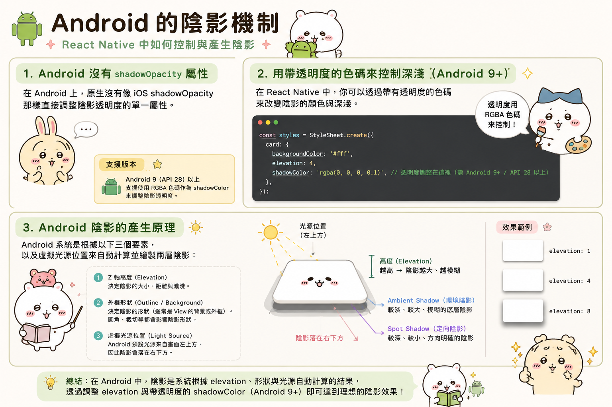
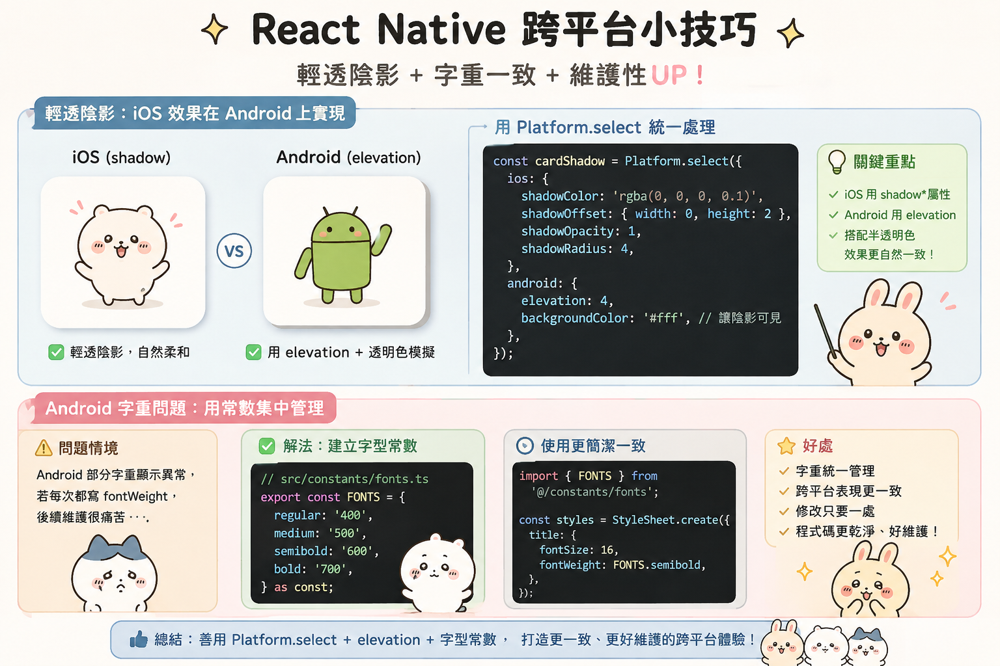
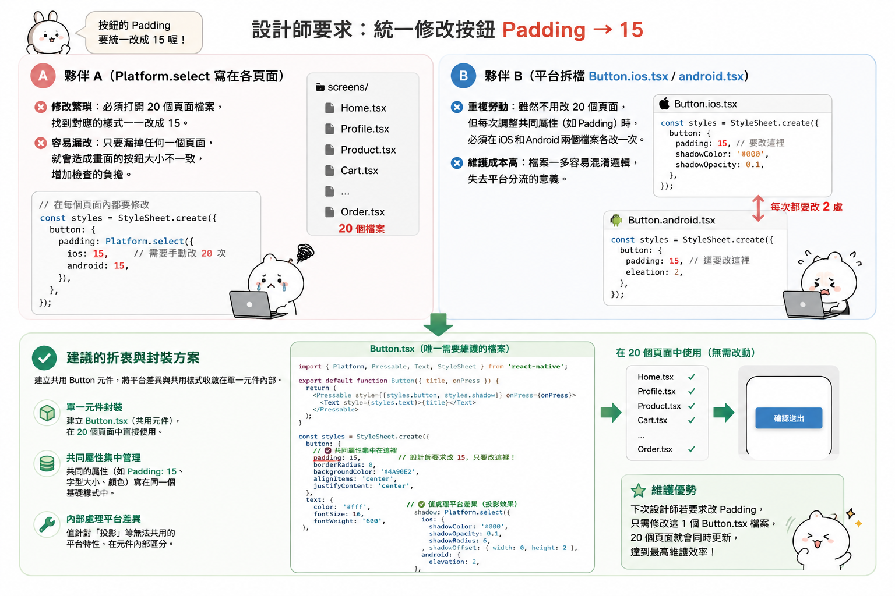

---
mdx:
  format: md
---

> 課程：RN 跨平台開發基礎
> 第 4 堂：樣式的跨平台收尾

# 樣式封裝與複用

想像一下這個情境：你的 APP 已經進入封測階段，設計師突然決定為了提升品牌專業感，要把原本所有的「天空藍」主色改成「深寶石藍」，並且將所有內文的字級從 14px 調大到 15px。

如果你當初開發時是採用「哪裡需要，就在哪裡定義 `StyleSheet`」的模式，現在你可能要打開幾十個檔案，一個一個搜尋並取代顏色色碼與數字。更糟的是，有些地方你可能手抖寫成了 `blue` 而不是十六進位碼，搜尋也搜不到。這種「散落樣式」的開發方式，就是典型的「技術債」，它會在你想要快速迭代或進行視覺優化時，成為最大的阻礙。

在 React Native 的世界裡，要從「能動就好」進階到「專業開發」，我們必須學會如何將零散的樣式邏輯系統化。這不只是為了好看，更是為了維護性與跨平台的一致性。

## 散落樣式的維護地獄

在剛開始學習 React Native 時，我們很習慣在每個頁面檔案的底部寫下這段程式碼：

```javascript
const styles = StyleSheet.create({
  container: {
    flex: 1,
    backgroundColor: '#FFFFFF',
    padding: 16,
  },
  title: {
    fontSize: 18,
    fontWeight: 'bold',
    color: '#333333',
  },
});
```

這在小型專案中看起來沒問題，但當你的專案成長到擁有數十個頁面（例如內容與媒體類 APP 常見的：首頁、分類頁、播放頁、個人中心、設定頁等）時，你會發現以下問題：

1. **不一致的視覺**：首頁的標題是 18px，個人中心卻是 17px。雖然肉眼很難一眼看出，但整體的「專業感」就會在這些細微的不一致中流失。
2. **重慶森林式的重複**：每個頁面都在寫 `backgroundColor: '#FFFFFF'`。如果哪天要支援「深色模式（Dark Mode）」，你將面臨一場災難。
3. **隱藏的平台邏輯**：我們在上一部分學到 iOS 陰影與 Android `elevation` 的差異。如果你每次寫 Card 組件都要重新寫一遍那堆 Platform 判斷邏輯，出錯機率會大幅提升。

## 第一步：建立主題 Token (Theme Tokens)

要解決樣式散落的問題，第一步就是將「數值」與「邏輯」分離。我們不應該在組件裡直接寫 `#3498db`，而應該寫 `theme.colors.primary`。

建議在專案中建立一個 `src/theme` 資料夾，並建立一個 `index.ts`（或 `theme.ts`）：

```javascript
// src/theme/theme.ts

export const theme = {
  colors: {
    primary: '#1A73E8',
    secondary: '#5F6368',
    background: '#FFFFFF',
    surface: '#F8F9FA',
    text: '#202124',
    error: '#D93025',
    border: '#DADCEE',
  },
  spacing: {
    xs: 4,
    sm: 8,
    md: 16,
    lg: 24,
    xl: 32,
  },
  borderRadius: {
    sm: 4,
    md: 8,
    lg: 12,
    round: 999,
  },
  // 也可以定義常用的文字樣式預設值
  typography: {
    h1: {
      fontSize: 24,
      fontWeight: '700',
    },
    body: {
      fontSize: 16,
      fontWeight: '400',
    },
  },
};
```

使用 Token 的好處在於：**這是一份「單一事實來源」（Single Source of Truth）**。當品牌色改變時，你只需要改這一個檔案。此外，這也為未來實作「深色模式」打下了基礎——你只需要準備兩套 theme 物件，根據系統狀態切換即可。

## 第二步：元件封裝策略

有了 Token 之後，下一步就是將樣式封裝進元件裡。**「元件化」不僅是為了複用邏輯，更是為了隱藏樣式的複雜度。**

### 案例：封裝基礎文字元件 `AppText`

在網頁端，我們可以透過 CSS 全域設定 `font-family`。但在 React Native，樣式是不會繼承的（除了巢狀的 `Text` 元件）。這意味著如果你想全站使用某種自定義字型，或者想統一處理 Android 的行高問題，你得在每個 `Text` 標籤都重複寫一次樣式。

更好的做法是封裝一個自己的 `AppText`：

```tsx
import React from 'react';
import { Text, TextProps, StyleSheet, Platform } from 'react-native';
import { theme } from '../theme/theme';

interface AppTextProps extends TextProps {
  variant?: 'h1' | 'body' | 'caption';
  color?: string;
}

export const AppText = ({ 
  style, 
  variant = 'body', 
  color = theme.colors.text, 
  ...props 
}: AppTextProps) => {
  
  return (
    <Text 
      style={[
        styles.base,
        styles[variant],
        { color },
        style // 允許外部傳入樣式覆蓋
      ]} 
      {...props} 
    />
  );
};

const styles = StyleSheet.create({
  base: {
    // 在這裡處理跨平台字型細節
    ...Platform.select({
      ios: { fontFamily: 'System' },
      android: { 
        fontFamily: 'Roboto',
        // 解決 Android 預設內距導致文字不置中的問題
        includeFontPadding: false, 
      },
    }),
    textAlignVertical: 'center',
  },
  h1: theme.typography.h1,
  body: theme.typography.body,
  caption: {
    fontSize: 12,
    color: theme.colors.secondary,
  },
});
```

**封裝後的優勢：**

- **隱藏平台差異**：開發者不需要知道 Android 的 `includeFontPadding` 怎麼設定，直接用 `AppText` 就自動修正了。
- **預設語意化**：使用 `<AppText variant="h1">` 比 `<Text style={{ fontSize: 24, fontWeight: 'bold' }}>` 更有意義且易讀。
- **全局調整**：想改全站字型？改 `AppText.tsx` 一個地方就好。

### 樣式合併與覆蓋：`StyleSheet.flatten` 的妙用

在封裝元件時，我們經常會遇到「預設樣式」與「外部傳入樣式」合併的需求。React Native 的 `style` prop 接受陣列，這在大多數情況下很好用：

```tsx
<View style={[styles.default, props.style]} />
```

但有時候我們需要在 JS 層對最終的樣式進行邏輯判斷（例如根據寬度動態調整高度）。這時我們可以使用 `StyleSheet.flatten`：

```tsx
const combinedStyle = StyleSheet.flatten([styles.default, props.style]);

// 現在 combinedStyle 是一個普通的 JS 物件，不再是 StyleSheet ID 或陣列
if (combinedStyle.width > 300) {
  // 執行特定邏輯
}
```

這在開發高度自定義的媒體元件時非常實用。

## 實作範例：內容類 APP 的 `MediaCard` 元件

對於內容/媒體類 APP，卡片（Card）是最常用的 UI 單元。讓我們實作一個封裝良好的 `MediaCard`，它整合了陰影、邊框、間距以及剛剛建立的 `AppText`。

```tsx
import React from 'react';
import { View, Image, StyleSheet, Pressable, Platform } from 'react-native';
import { theme } from '../theme/theme';
import { AppText } from './AppText';

interface MediaCardProps {
  title: string;
  thumbnail: string;
  onPress?: () => void;
}

export const MediaCard = ({ title, thumbnail, onPress }: MediaCardProps) => {
  return (
    <Pressable 
      onPress={onPress}
      style={({ pressed }) => [
        styles.container,
        pressed && styles.pressed // 封裝觸控回饋
      ]}
    >
      <Image source={{ uri: thumbnail }} style={styles.image} />
      <View style={styles.content}>
        <AppText variant="body" numberOfLines={2}>{title}</AppText>
      </View>
    </Pressable>
  );
};

const styles = StyleSheet.create({
  container: {
    backgroundColor: theme.colors.background,
    borderRadius: theme.borderRadius.md,
    marginVertical: theme.spacing.sm,
    // 跨平台陰影封裝
    ...Platform.select({
      ios: {
        shadowColor: '#000',
        shadowOffset: { width: 0, height: 2 },
        shadowOpacity: 0.1,
        shadowRadius: 4,
      },
      android: {
        elevation: 3,
      },
    }),
    overflow: 'hidden', // 確保圖片不會超出圓角
  },
  pressed: {
    opacity: 0.8,
    transform: [{ scale: 0.98 }], // 輕微縮放感
  },
  image: {
    width: '100%',
    aspectRatio: 16 / 9, // 使用前一節學到的比例屬性
    backgroundColor: theme.colors.surface,
  },
  content: {
    padding: theme.spacing.md,
  },
});
```

### 為什麼這樣封裝更好？

1. **邏輯自洽**：點擊時的縮放動畫（`transform`）、陰影的跨平台處理、圓角截斷（`overflow: 'hidden'`），這些容易遺漏的細節都被鎖在元件內部。
2. **呼叫端極簡**：在業務頁面中，你只需要傳入 `title` 和 `thumbnail`。你不必關心這個卡片在 Android 上是不是會有奇怪的陰影，或者在不同螢幕寬度下圖片會不會變形。
3. **效能優化**：透過 `StyleSheet.create` 定義靜態樣式，確保樣式 ID 被原生層快取，減少資料傳輸負擔。

## 樣式設計系統的演進

雖然這門課建議從手寫封裝開始以建立底層認知，但當專案規模變得巨大時，你可能會考慮以下進階策略：

- **Styled Components (CSS-in-JS)**：如果你非常習慣網頁開發，這能讓你寫出更接近 CSS 的語法，但要注意它在 React Native 上會有輕微的運行效能開銷。
- **Tailwind CSS (NativeWind)**：目前在 React Native 社群非常流行，透過 Utility Classes 快速建構 UI。
- **UI 框架 (如 React Native Paper, Tamagui)**：直接使用現成的元件庫。但即便使用元件庫，理解我們剛才講的「Token 化」與「跨平台樣式隱藏」原理，依然是你自定義這些框架時不可或缺的能力。
  
  
  

### 總結與下一主題的連結

我們已經走過了 Topic 2 的樣式核心：從 `StyleSheet` 的底層優化、Flexbox 的行動端思維、尺寸單位的跨平台換算，到這一節的「樣式封裝」。現在，你已經具備了建構「單一畫面」所需的所有視覺工具。

但一個 APP 不會只有一個畫面。如何從首頁點擊這個 `MediaCard` 後，順暢地導向播放頁？導向時如何傳遞資料？為什麼有時候點擊返回鍵，APP 會直接結束而不是回到上一頁？

這就是我們在下一個主題 **Topic 3: Navigation 架構** 要深入探討的核心。我們將學習如何把這些精緻的元件串聯成一個有靈魂、有流動感的完整 APP 體驗。

---

## 建立可維護的樣式架構

透過將樣式數值抽象化為主題 Token，並將平台差異與基礎視覺邏輯封裝進專屬組件（如 `AppText`、`AppButton`），我們不僅解決了樣式散落導致的維護債，更確保了全專案視覺的一致性。這種「隱藏複雜度、暴露語意」的封裝思路，是從初級開發者轉向資深架構師的關鍵一步。接下來，我們將學習如何將這些獨立的視覺頁面，透過 Navigation 架構串聯成完整的動態應用。
