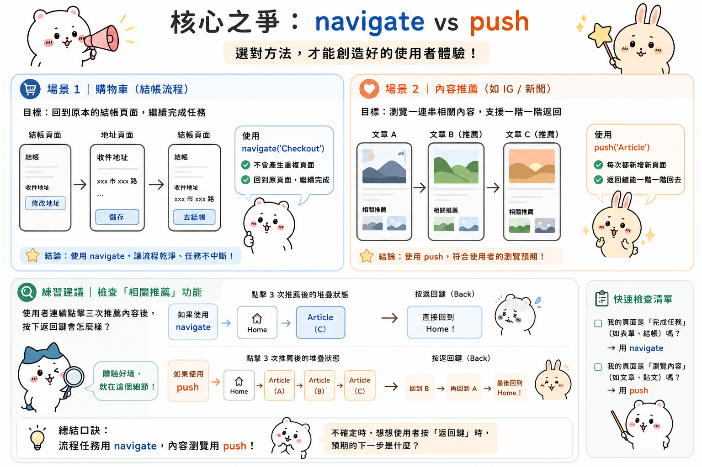

---
mdx:
  format: md
---

> 課程：RN 跨平台開發基礎
> 第 5 堂：Navigation 架構入門

# Stack Navigator 解析

想像你在使用一個新聞 APP。你從「首頁」點進一則關於「火星探測」的新聞，讀到一半，看到下方有個相關推薦：「 NASA 的下一代太空衣」。點進去後，你又在裡面看到一個連結回到了「火星探測」。

這時候，如果你按下手機的「返回鍵」，你預期會看到什麼？是回到「太空衣」那一篇？還是直接回到「首頁」？

這個看似簡單的直覺問題，背後其實涉及到 Stack Navigator（堆疊導覽器）最核心的邏輯：你的 APP 是如何管理「頁面堆疊」的？在 React Navigation 中，導覽不只是換個畫面，而是一場對「導覽狀態機（Navigation State Machine）」的精密操作。這一部分，我們將拆解這個堆疊的內部構造，並釐清那些讓你困惑已久的 Action 指令。

## 導覽狀態的骨架：Navigation State 物件

在上一部分我們提到，React Navigation 在 JS 層模擬了原生的導覽行為。這個「模擬」的結晶，就是一個名為 **Navigation State** 的 JavaScript 物件。

當你遇到導覽邏輯不符合預期時，最有效的除錯方式就是去觀察這個物件。雖然在 Expo 或一般的開發流程中你不會頻繁地手動修改它，但理解它的結構是掌握所有 Action 的前提。一個典型的 Stack State 看起來像這樣：

```json
{
  "index": 1,
  "routes": [
    { "key": "home-123", "name": "Home" },
    { 
      "key": "details-456", 
      "name": "Details", 
      "params": { "articleId": "mars-2024" } 
    }
  ]
}
```

### 關鍵欄位解析

1. `**routes**`** (陣列)**：
這是你的「堆疊本體」。它是一個陣列，存放著目前堆疊中所有存活的頁面資訊。
  - 每個物件代表一個 Screen。
- `**name**` 是你在 Navigator 中定義的名稱（如 `Details`）。
- `**key**` 是 React Navigation 自動生成的唯一識別碼。這點非常重要——即使是同一個 `name` 的頁面，只要 `key` 不同，它們在堆疊中就是兩個獨立的實體，擁有各自的 state。
- `**params**` 則是你在跳轉時傳遞的參數。
2. `**index**`** (數字)**：
這是堆疊的「指標」。它告訴系統：**「目前陣列中的哪一個頁面是正在被使用者看到的？」** 在 Stack Navigator 中，這個數字通常等於 `routes.length - 1`，意即最頂層的那一個。

當你執行跳轉動作時，本質上就是在對這個 `routes` 陣列進行 `push`、`pop` 或 `splice` 的操作。

## 核心之爭：navigate vs push

這是所有 React Native 初學者最容易混淆的地方。如果你在程式碼中把 `navigation.navigate('Details')` 全部改成 `navigation.push('Details')`，你的 APP 大部分時間看起來是一樣的，但在某些特定場景下，會產生完全不同的使用者體驗。

### 預測與發現：如果目標頁面已經存在？

假設你目前的堆疊是：`[Home, NewsList, NewsDetail]`。
現在你在 `NewsDetail` 頁面中點擊了另一個推薦連結，目標依然是 `NewsDetail`。

- **使用 **`**navigate('NewsDetail')**`** 的行為：**
React Navigation 會先掃描 `routes` 陣列。
它發現：「嘿，`NewsDetail` 已經在堆疊裡了！」
於是，它**不會**疊上新頁面，而是直接把現有的 `NewsDetail` 帶到最前面（如果中間有其他頁面，則會把中間的全部丟棄）。在上述例子中，因為你就在該頁面，它可能只是更新 params，什麼都不會發生。
- **使用 **`**push('NewsDetail')**`** 的行為：**
它完全不管陣列裡有什麼。
它會直接生成一個新的物件，賦予一個全新的 `key`，然後塞進 `routes` 陣列。
結果堆疊變成：`[Home, NewsList, NewsDetail (Key A), NewsDetail (Key B)]`。

### 實戰場景：內容類 APP 的「相關推薦」

在 Aria 你目前開發的媒體類 APP 中，這是一個非常具體的決策點。

如果你在做的是 **「購物車」**：
當使用者在結帳頁面點擊「修改地址」，跳轉到地址頁面，修改完後又點擊「去結帳」。這時你應該使用 `navigate('Checkout')`。因為你不希望堆疊裡出現兩個結帳頁面，你只是想「回去」完成任務。

如果你在做的是 **「內容推薦（如 IG 貼文或新聞）」**：
使用者從「文章 A」點進「推薦文章 B」，再從「文章 B」點進「推薦文章 C」。這時你必須使用 **`push`**。為什麼？因為使用者預期的是按下返回鍵時，能從 C 回到 B，再從 B 回到 A。如果用 `navigate`，堆疊可能永遠只有一層，使用者一按返回就直接退回首頁了，這會讓他們感到非常挫折。



> **練習建議：** Aria，請去檢查你現有 APP 裡的「相關推薦」功能。如果使用者連續點擊三次推薦內容，按下返回鍵是直接回到首頁，還是能一階一階退回？如果是前者，你可能需要將 `navigate` 改為 `push`。

---

## 常用導覽動作（Actions）的語義解析

除了「進入」頁面，我們還需要精細控制「如何離開」或「如何重組」堆疊。

### 1. 移出堆疊：pop 與 goBack

- **`goBack()`**：這是一個通用的指令。它告訴系統：「回到上一個狀態」。在大部分情況下，它等於把堆疊最頂層的頁面拿掉。
- **`pop(n)`**：這是 Stack Navigator 專屬的。你可以指定要往回跳幾層。例如 `pop(3)` 會一次撤銷頂部的三個頁面。這在完成一個長流程（如：註冊步驟 1 -> 2 -> 3 -> 完成）後直接跳回某處非常有用。

### 2. 直達起點：popToTop

當你的堆疊已經深達五、六層，而使用者點擊了導覽列的「首頁」圖示，你應該使用 `popToTop()`。
它會保留 `routes[0]`（通常是 Home），並將陣列中其餘的所有頁面一次清空。這比連續呼叫 `goBack()` 效能更好，且動畫更流暢（通常只會有一個轉場動畫）。

### 3. 偷天換日：replace

`replace('NewScreen')` 是非常有用的工具。它的邏輯是：**「把目前最頂層的頁面拔掉，並在同一個位置塞入新頁面。」**

- **場景 A：登入流程**
使用者在 `Login` 頁面點擊登入成功後，你不希望他按返回鍵又看到登入框。這時使用 `replace('Dashboard')`，堆疊會從 `[Home, Login]` 變成 `[Home, Dashboard]`。
- **場景 B：過渡動畫**
當你在顯示一個「處理中（Processing）」的 Loading 頁面，處理完後要顯示「成功結果」。使用 `replace` 可以確保使用者無法「回到」那個已經結束的 Loading 狀態。

---

## 核武級指令：reset 的威力與危險

在導覽的世界裡，`reset` 是最強大的指令，因為它能**完全重寫**整個導覽狀態物件。

當你呼叫 `navigation.reset(...)` 時，你不是在堆疊上增加或減少頁面，而是直接把舊的 `routes` 陣列丟進碎紙機，並換成你定義的新陣列。

### 為什麼我們需要 reset？

最經典的例子是 **「登出（Logout）」**。

設想 Aria 的 APP 有一個複雜的結構：`[Home, Profile, Settings, PrivacySettings]`。
使用者在 `PrivacySettings` 頁面點擊「登出」。如果你只是簡單地 `navigate('Login')`，堆疊會變成 `[Home, Profile, Settings, PrivacySettings, Login]`。
這會產生嚴重的安全性問題：使用者在 Login 頁面按下 Android 的實體返回鍵，或者手勢向後滑，竟然能直接「看見」剛剛登出的隱私設定頁面！雖然資料可能因為 Token 清除而讀不到，但這在 UX 上是巨大的瑕疵。

**正確的做法是使用 **`**reset**`**：**

```javascript
navigation.reset({
  index: 0,
  routes: [{ name: 'Login' }],
});
```

這段程式碼的意思是：

1. 把現有的堆疊全部清空。
2. 建立一個新的堆疊，裡面只有一個 `Login` 頁面。
3. 將目前的指標 `index` 指向第 0 個位置。

這時，APP 的導覽歷史被徹底洗乾淨了。使用者按下返回鍵，APP 會直接結束或沒反應，絕對不會回到任何需要權限的頁面。

### reset 的另一個妙用：深度跳轉

有時候你希望使用者點開推播通知後，不只是看到「文章頁」，還希望他按返回時能回到「特定分類頁」而不是首頁。你可以透過 `reset` 預先構造好這個堆疊：

```javascript
navigation.reset({
  index: 1,
  routes: [
    { name: 'Home' },
    { name: 'Category', params: { type: 'Science' } },
    { name: 'Article', params: { id: 'mars-2024' } },
  ],
});
```

這樣一來，當使用者看到文章時，他的「身後」已經排好了 `Category` 和 `Home`，提供了非常完整且流暢的導覽體驗。


---

## 實戰連結：檢視 Aria 的現有專案

Aria，現在請你打開你正在開發的那兩款 APP 的程式碼，找找看 `navigation.navigate` 出現的地方，並思考以下三個問題：

1. **有沒有「堆疊無限增長」的風險？**
在內容推薦頁面，如果你一直用 `push`，使用者可能會連點 20 次，導致堆疊內存佔用過高。雖然現代手機效能很好，但這是不健康的。是否需要在某些點使用 `replace`？
2. **返回路徑是否直覺？**
在某些表單填寫流程（例如發布新動態），當發布成功跳轉回動態列表時，你使用的是 `navigate` 還是 `reset`？確保使用者不會返回到那個已經提交過的空白表單。
3. **登出邏輯是否安全？**
檢查你的登出按鈕，確保它是用 `reset` 清空狀態，而不是單純的跳轉。

掌握了 Stack 的「狀態」與「動作」，你就已經拿到了控制 APP 骨架的遙控器。你會發現，許多莫名其妙的頁面閃退或行為異常，其實都只是因為堆疊結構不如你所想。

## 通往複雜架構的橋樑

理解了單一 Stack Navigator 的運作邏輯後，你可能會問：**「但我的 APP 同時有底部標籤（Tab）和側邊選單（Drawer），那該怎麼辦？」**

這就是我們下一部分要探討的主題：**嵌套導覽（Nesting Navigators）**。

在真實的內容類 APP 中，我們很少只用一個巨大的 Stack 解決所有問題。通常我們會把一個 Stack 塞進一個 Tab 裡，或者讓整個 Tab 系統成為一個更大 Stack 的其中一員。這種「俄羅斯娃娃」式的結構雖然強大，但也帶來了許多陷阱：例如，為什麼我在 A 頁面呼叫 `navigation.openDrawer()` 卻沒反應？為什麼我的 Header 標題出現了兩層？

在下一個章節中，我們將學習如何優雅地拆解並組合這些不同的導覽器，讓你的 APP 架構既清晰又具備擴展性。
