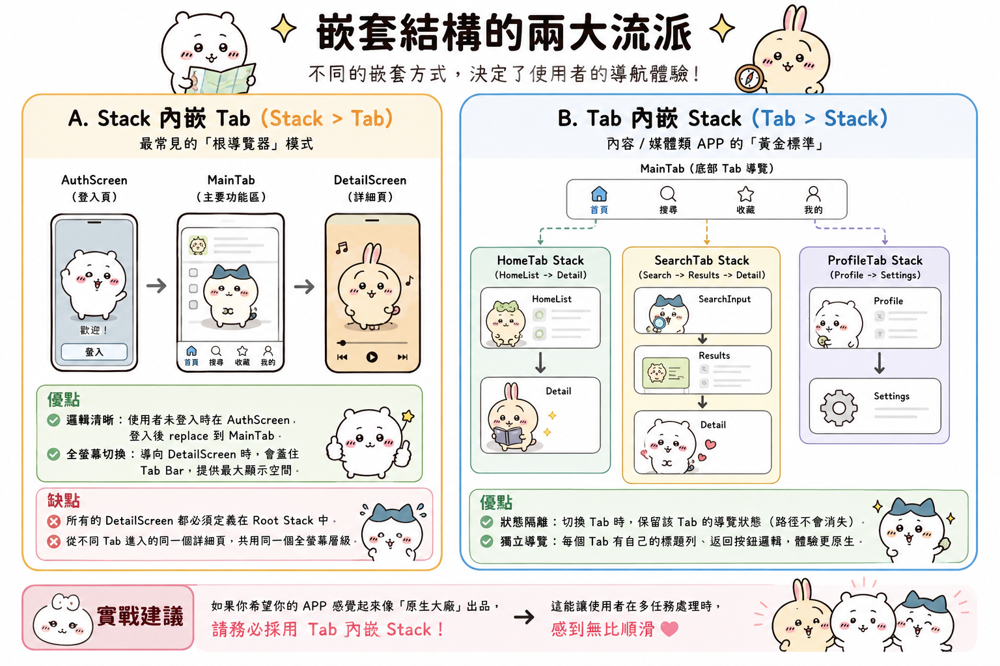

---
mdx:
  format: md
---

> 課程：RN 跨平台開發基礎
> 第 5 堂：Navigation 架構入門

# Tab 與 Drawer 嵌套

想像你在使用一個高品質的媒體 APP（例如 Spotify 或 Netflix）。你在「搜尋」分頁找到了一位藝術家，點進去看了他的專輯列表，接著又點進了其中一張專輯。這時，你突然想切換到「個人資料」分頁檢查帳戶設定。完成後，當你點回「搜尋」分頁時，你預期看到的是什麼？

是一個乾淨、重置後的搜尋框，還是剛才那張專輯的詳細頁面？

大多數使用者期望的是「後者」。這種「保留探索進度」的體驗，背後涉及了複雜的導覽器嵌套（Nesting）邏輯。如果導覽架構設計得不好，使用者在切換 Tab 時就會像在玩一場「進度消失」的惡夢，或者更糟——畫面上出現兩個重疊的標題列（Header），讓 APP 看起來像是一個廉價的網頁套殼。

在理解了 Stack Navigator 的線性堆疊後，這一部分我們將挑戰多維度的導覽架構：如何優雅地組合 Tab、Drawer 與 Stack，並避開那些讓開發者頭痛的嵌套陷阱。

## 設計語義：Tab 與 Drawer 的靈魂差異

在動手寫程式碼之前，我們必須先釐清「為什麼」要用這兩種導覽器。在 React Native 中，導覽器不只是 UI 元件，它們定義了 APP 的 **「空間模型」**。

### Tab Navigator：平行且持久的功能空間

Tab（通常是 Bottom Tab）代表的是 APP 的 **核心功能分區**。

- **平行性**：首頁、搜尋、收藏、個人資料，這些功能在邏輯上是平行的，沒有先後順序。
- **持久性**：使用者預期切換 Tab 時，原本分頁的狀態（捲動位置、輸入一半的文字、導覽層級）應該被保留。
- **設計語義**：它是 APP 的「一等公民」。如果你發現你的 Tab 超過 5 個，那通常意味著資訊架構需要簡化，或者某些功能應該被移入更深層的選單。

### Drawer Navigator：側邊的「工具箱」

Drawer（側邊抽屜）通常用於存放 **次要或全域性質** 的功能。

- **節省空間**：它隱藏在螢幕邊緣，不會像 Bottom Tab 那樣佔據寶貴的垂直空間。
- **全域性**：它適合放「設定」、「登出」、「切換帳號」或「幫助中心」。
- **設計語義**：它像是一個隨叫隨到的工具箱，不屬於核心導覽流程的一部分，但隨時可以從任何地方滑出來。

**預測問題**：如果你在開發一個內容類 APP，要把「分類列表」放在 Tab 還是 Drawer？
**揭曉答案**：如果分類是使用者探索內容的主要入口（例如新聞 APP 的運動、娛樂、政治），應放在 Tab 或頂部 Scrollable Tab；如果分類多達 20 個且使用者不常切換，Drawer 或是專門的「全類別頁面」會是更好的選擇。

---

## 嵌套結構的兩大流派

嵌套（Nesting）是指將一個導覽器作為另一個導覽器的「Screen」來使用。雖然聽起來簡單，但不同的層級關係會徹底改變使用者的導航感受。

### 常見結構 A：Stack 內嵌 Tab (Stack > Tab)

這是最常見的「根導覽器」模式。你的最外層是一個 Stack Navigator，它管理著 APP 的大狀態：

1. **Root Stack**
  - **AuthScreen** (登入頁)
- **MainTab** (主要功能區，這是一個 TabNavigator)
- **DetailScreen** (詳細頁，例如播放器或文章內文)

**優點：** 

- 邏輯清晰：使用者未登入時在 AuthScreen，登入後 `replace` 到 MainTab。
- 全螢幕切換：當你導向 DetailScreen 時，它會「蓋住」底部的 Tab Bar，這在播放影片或閱讀長文時非常重要，因為你需要最大的顯示空間。

**缺點：**

- 所有的 DetailScreen 都必須定義在 Root Stack 中。如果你從首頁點進文章，再從個人資料點進同一個文章，它們都共用同一個全螢幕的 Stack 層級。

### 常見結構 B：Tab 內嵌 Stack (Tab > Stack)

這對於 **內容/媒體類 APP** 來說是「黃金標準」。

1. **MainTab**
  - **HomeTab** (一個 StackNavigator: HomeList -> Detail)
- **SearchTab** (一個 StackNavigator: SearchInput -> Results -> Detail)
- **ProfileTab** (一個 StackNavigator: Profile -> Settings)

**優點：**

- **狀態隔離**：使用者在 SearchTab 點進了三層深的路徑，切換回 HomeTab 看了幾眼，再切換回 SearchTab 時，剛才的三層路徑依然存在。
- **獨立導覽**：每個 Tab 都有自己的標題列、自己的返回按鈕邏輯。

**實戰建議**：如果你希望你的 APP 感覺起來像「原生大廠」出品，請務必採用 **Tab 內嵌 Stack**。這能讓使用者在多任務處理時感到無比順滑。



---

## 避雷指南：嵌套結構中的常見陷阱

當導覽器一層套一層時，React Navigation 的行為會開始變得「有趣」（也就是容易產生 bug）。以下是三個你一定會遇到的問題。

### 1. Header 重疊問題：為什麼會有兩個標題列？

這是初學者最常崩潰的地方。當你把一個 Stack 放在另一個 Stack（或內建 Header 的 Tab）裡面時，你會發現螢幕頂部出現了兩個 Header。

**原因**：父導覽器和子導覽器都認為自己有責任顯示標題。

**解決方案**：
你必須有意識地關閉其中一個。通常我們會在「父層」關閉 Header，讓「子層」自己決定要顯示什麼。

```tsx
// 在父層 Stack 關閉 Header
<Stack.Navigator>
  <Stack.Screen 
    name="MainTab" 
    component={MainTabNavigator} 
    options={{ headerShown: false }} // 關鍵：把父層的頭藏起來
  />
  <Stack.Screen name="ExternalDetail" component={DetailScreen} />
</Stack.Navigator>
```

這樣一來，當使用者進入 `MainTab` 時，看到的會是 Tab 內部各個 Screen 自己定義的 Header。

### 2. Navigation Prop 的作用域與「冒泡」機制

這是一個深度概念：**導覽指令會向上冒泡（Bubble up）。**

想像一下，你的結構是 `Drawer > Tab > Stack > ScreenA`。在 `ScreenA` 中，你寫了這行程式碼：

```tsx
navigation.openDrawer();
```

問題來了：`ScreenA` 所屬的導覽器是 Stack，而 Stack Navigator 並沒有 `openDrawer` 這個方法。為什麼這行程式碼通常能跑得通？

因為 React Navigation 會進行「責任鏈」式的搜索：

1. `ScreenA` 問自己的 Stack：你有 `openDrawer` 嗎？
2. Stack 說：我沒有，但我問問我的爸爸 (Tab)。
3. Tab 說：我也沒有，但我問問我的爸爸 (Drawer)。
4. Drawer 說：我有！我來執行這個操作。

**潛在問題**：如果你的嵌套太深，或者你在同一個層級有多個同名的 Screen，這種冒泡機制可能會導致導向錯誤的頁面。
**對策**：儘量保持嵌套層級在 3 層以內。如果超過 3 層，請檢討你的資訊架構是否過於複雜。

### 3. 返回行為（Back Behavior）

在嵌套導覽中，按下手機的硬體返回鍵（Android）或手勢返回，預設會發生什麼？

預設情況下，React Navigation 會優先處理 **「當前最深處導覽器」** 的返回動作。如果最深處的 Stack 已經退回到第一頁了，它才會把控制權交給父層。

如果你在 Tab 之間切換，想要控制按下返回鍵是「回到上一個分頁」還是「直接退出 APP」，你可以調整 `Tab.Navigator` 的 `backBehavior` 屬性：

- `initialRoute`（預設）：回到設定的第一個 Tab。
- `order`：按 Tab 定義的順序反向跳轉。
- `history`：回到上一個瀏覽的 Tab。
- `none`：直接讓系統處理（通常是退出）。

對於內容類 APP，通常建議維持 `initialRoute` 或 `none`，以符合使用者的心智模型。

---

## 實戰案例：媒體類 APP 的架構佈局

假設你正在為 Aria 的音樂 APP 設計架構。我們希望有底部 Tab，但點擊歌曲進入「播放頁」時，播放器要能全螢幕蓋住 Tab Bar。

我們應該這樣設計：

### 第一層：Root Stack (Native Stack)

負責「全螢幕」的切換。

- `MainTabs` (Screen): 包含底部導覽。
- `FullPlayer` (Screen): 播放器頁面，設定為 `presentation: 'modal'` 增加質感。

### 第二層：MainTabs (Bottom Tab)

負責核心分區。

- `HomeStack` (Screen)
- `LibraryStack` (Screen)

### 第三層：各個子 Stack

負責各分區的探索。

- `HomeStack`: 包含 `HomeFeed` -> `AlbumDetail` -> `ArtistProfile`。

這樣設計的好處是：

1. 當使用者在 `ArtistProfile` 點擊播放，彈出的 `FullPlayer` 是 Root Stack 的一部分，它會蓋住底部的 Tab Bar，給予沈浸式體驗。
2. 當使用者關閉 `FullPlayer`，他依然在 `ArtistProfile` 頁面，且 `HomeStack` 的導覽歷史完全被保留。

---

## 總結導覽架構的思維框架

理解導覽架構不是為了背誦 API 參數，而是為了建立正確的「空間地圖」。

- **由外而內設計**：先決定哪些頁面需要全螢幕（放在 Root Stack），哪些需要持久存在（放在 Tab）。
- **權利下放**：透過 `headerShown: false` 讓深層導覽器掌握自己的 UI 表現，避免雙 Header 的尷尬。
- **狀態為王**：內容類 APP 應優先選擇「Tab 內嵌 Stack」，這對提升使用者留存率和降低挫折感有巨大幫助。

到目前為止，我們已經從導覽的設計哲學（3.1），聊到 Stack 的操作細節（3.2），最後完成了多維度的嵌套架構（3.3）。這構成了 React Navigation 的骨幹知識。

## 學習回顧

恭喜你！你已經完成了這門課關於導覽架構核心概念的學習。我們從「導覽堆疊」的本質出發，深入探討了 Stack 的操作語義，最後學習了如何透過嵌套來打造複雜但流暢的 APP 體驗。

在進入下一個主題之前，我們安排了一個 **Review 階段**。這個階段非常關鍵，它不是為了考試，而是透過「主動回想」來強化你的大腦神經連結。這能幫你把這些抽象的導覽邏輯，轉化為直覺的開發本能。

請準備好，我們將透過幾個核心問題，一起梳理這堂課的重點。

## Bridge

在接下來的 Review 階段，我們將重點複習 Stack 操作的細節差異（例如 `push` 與 `navigate` 的本質區別），以及在嵌套架構中如何正確處理 Header 與返回行為。這將確保你之後在面對複雜的 APP 需求時，能第一時間判斷出最優的導覽結構。

準備好後，請進入最後一部分的練習。
