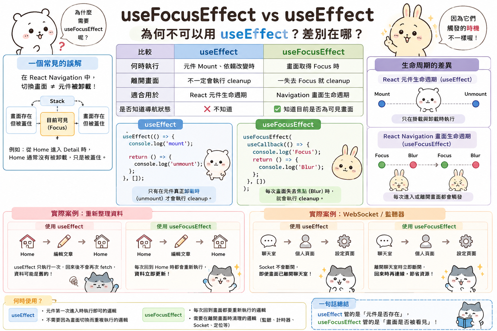

---
mdx:
  format: md
---

> 課程：RN 跨平台開發基礎
> 第 6 堂：Navigation 機制深探

# Screen Lifecycle 深入

想像你正在開發一款類似 YouTube 的影音 APP。使用者在首頁點擊了一段充滿動感的音樂影片，進入了播放頁面。影片開始播放，音樂震耳欲聾。接著，使用者想看看這位創作者的其他作品，於是點擊了「作者頭像」跳轉到個人檔案頁面。

就在這時，怪事發生了：雖然螢幕上已經顯示了個人檔案，但背景依然傳來剛才那段影片的音樂聲。使用者感到困惑，甚至有些惱火，因為他們找不到地方關閉聲音，除非按回上一頁，或者乾脆殺掉整個 APP。

身為開發者，你檢查了程式碼，發現你在播放器元件裡寫了 `useEffect` 的 Cleanup function（回傳函數）來暫停影片。在網頁版 React 中，這套邏輯運作得完美無缺，因為離開頁面意味著元件會被「卸載」（Unmount）。但在 React Native 的導覽世界裡，規則完全不同。

這就是我們今天要探討的核心：**Screen Lifecycle（頁面生命週期）**。理解它，是從「能寫出會跑的 APP」晉升為「能掌控使用者體驗的專業開發者」的必經之路。

## 堆疊的代價：為什麼頁面「沒死」？

在之前的課程中，我們討論過 **Stack Navigator** 的運作原理就像一疊照片。當你從頁面 A `navigate` 到頁面 B 時，React Navigation 只是把頁面 B 「疊」在頁面 A 之上。

### 網頁 vs. 行動端的思維斷層

在傳統的 Web 開發中，路由（Routing）通常是「排他性」的。當你從 `/home` 跳轉到 `/profile`，`Home` 元件會被銷毀，其對應的 DOM 元素會從瀏覽器中移除。

但在行動端，為了追求極致的流暢感，我們不能隨意銷毀頁面。想像一下，如果使用者每按一次「返回鍵」，APP 都要重新抓取資料、重新渲染佈局、重新加載圖片，那種卡頓感會讓 APP 看起來非常廉價。

因此，在 Stack Navigator 中：

1. **導覽到新頁面時**：舊頁面依然留在記憶體中，它只是被蓋住了。
2. **返回舊頁面時**：舊頁面會直接顯現，因為它從未消失。

這就導致了一個關鍵現象：**一個元件「在螢幕上看不見」，並不代表它已經「卸載（Unmount）」了。** 它可能只是失去了焦點（Blur）。如果你只依賴 `useEffect` 的掛載與卸載邏輯，你的媒體播放、定時器、或者是昂貴的 API 輪詢監聽，都會在後台偷偷消耗資源，甚至造成邏輯錯誤。

---

## 核心事件：Focus 與 Blur

為了處理這種「頁面還在，但看不見」的情況，React Navigation 引入了兩個核心狀態：**Focus（獲得焦點）** 與 **Blur（失去焦點）**。

### 1. Focus（獲得焦點）

當頁面進入螢幕視野，且成為堆疊最頂層的那張「照片」時，它就處於 Focus 狀態。這是你應該觸發「開始播放影片」、「重啟動畫」或「刷新即時資訊」的時機。

### 2. Blur（失去焦點）

當使用者點擊跳轉到下一個頁面，或是切換到了另一個 Tab 時，目前的頁面就會觸發 Blur。注意，這時元件**並沒有被銷毀**，它只是退居幕後。這是你應該「暫停影片」、「停止感應器監聽」或「暫停追蹤 GPS 定位」的黃金時間。

### 預測：如果使用者切換 Tab，生命週期會如何變化？

假設你有一個底部導覽（Tab Navigator），裡面有「首頁」和「設定」兩個分頁。

- 當 APP 剛啟動在「首頁」時：首頁是 Mounted + Focused。
- 當使用者點擊「設定」時：
  - 「首頁」會觸發 Blur，但它依然是 Mounted。
- 「設定」會觸發 Mounted + Focused。
- 當使用者再點回「首頁」時：
  - 「首頁」會觸發 Focus。**注意：它不會再次 Mounted，因為它一直都在。**

這就是為什麼很多初學者會發現，在 Tab 之間切換時，`useEffect(() => { ... }, [])` 裡的 API 請求只會執行第一次。

---

## 關鍵工具：useFocusEffect

既然 `useEffect` 沒辦法完全勝任導覽場景下的資源管理，我們需要一個更專門的 Hook：`useFocusEffect`。

`useFocusEffect` 的行為模式與 `useEffect` 非常相似，但它的觸發機制是基於「焦點」而非「掛載」。

### 基本語法與常見陷阱

在使用 `useFocusEffect` 時，有一個極其重要（但也常被忽略）的要求：你必須將邏輯包裹在 `useCallback` 中。

```tsx
import { useCallback } from 'react';
import { useFocusEffect } from '@react-navigation/native';

function ProfileScreen() {
  useFocusEffect(
    useCallback(() => {
      // 這裡的程式碼會在頁面「獲得焦點」時執行
      console.log('頁面目前可見');

      return () => {
        // 這裡的 Cleanup function 會在頁面「失去焦點」或「卸載」時執行
        console.log('頁面目前隱藏或已離開');
      };
    }, []) // 依賴項陣列，通常建議保持空陣列或正確列出依賴
  );

  return <View>...</View>;
}
```

**為什麼一定要用 **`**useCallback**`**？**
這是因為 `useFocusEffect` 在內部的運作邏輯比較敏感。如果你不使用 `useCallback` 記憶住這個函數，每次 `ProfileScreen` 重新渲染時，都會產生一個新的函數實例。這會導致 `useFocusEffect` 認為邏輯變了，進而頻繁地執行 Cleanup 和 Setup，造成嚴重的效能問題甚至是無窮迴圈。



---

## 實戰案例：媒體播放器的正確實作

回到我們最初的挑戰：如何確保影片在離開頁面時暫停，回來時恢復？

在內容類 APP 中，這是一個非常典型的場景。我們不希望使用者離開播放頁後，流量和電池還在被後台播放消耗。

### 實作邏輯拆解

1. **狀態管理**：我們需要一個狀態（例如 `shouldPlay`）來控制播放器。
2. **進入頁面**：在 `useFocusEffect` 的 Setup 部分，將播放狀態設為 `true`。
3. **離開頁面**：在 Cleanup 部分，將播放狀態設為 `false`。

```tsx
import React, { useState, useCallback } from 'react';
import { Video } from 'expo-av'; // 以 Expo 媒體庫為例
import { useFocusEffect } from '@react-navigation/native';

export function VideoPlayerScreen() {
  const [isPlaying, setIsPlaying] = useState(false);

  useFocusEffect(
    useCallback(() => {
      // 1. 當使用者進入此頁面或從下一頁返回時，開始播放
      setIsPlaying(true);

      return () => {
        // 2. 當使用者導航到新頁面、切換 Tab 或按下返回鍵時，暫停播放
        setIsPlaying(false);
      };
    }, [])
  );

  return (
    <Video
      source={{ uri: 'https://example.com/video.mp4' }}
      shouldPlay={isPlaying} // 透過狀態控制播放
      style={{ width: 300, height: 200 }}
      useNativeControls
    />
  );
}
```

### 為什麼這比 `useEffect` 好？

- **場景 A：點擊「下一部影片」**
使用 `navigate('VideoPlayer', { id: nextId })`。舊頁面會觸發 `useFocusEffect` 的 Cleanup（暫停播放），新頁面會掛載並開始播放。
- **場景 B：切換到底部 Tab 的「搜尋」**
播放頁面不卸載，但觸發 Blur，Cleanup 執行，影片停止。
- **場景 C：從「搜尋」切換回「播放頁」**
播放頁面不需重新掛載，直接觸發 Focus，Setup 執行，影片恢復播放。

---

## 進階技巧：isFocused 與手動監聽

雖然 `useFocusEffect` 涵蓋了 90% 的需求，但有時候我們需要更精細的控制。

### 1. useIsFocused Hook

有時候你不需要執行 Side Effect（副作用），只需要在渲染時知道「現在頁面是不是被看見」。例如，你可能想在頁面被蓋住時，暫時停止某個動畫元件的渲染以節省效能。

```tsx
import { useIsFocused } from '@react-navigation/native';

function MyComponent() {
  const isFocused = useIsFocused();
  
  // 只有在被看見時才渲染複雜的高耗能動畫
  return isFocused ? <ComplexAnimation /> : <SimplePlaceholder />;
}
```

`useIsFocused` 會回傳一個布林值，並且在焦點切換時自動觸發 re-render。

### 2. 手動監聽導覽事件

在某些極端的情況下（例如你需要與第三方非 React 的原生套件整合），你可能需要手動監聽導覽事件。你可以透過 `navigation.addListener` 來實作：

```tsx
useEffect(() => {
  const unsubscribe = navigation.addListener('focus', () => {
    // 頁面獲得焦點
  });

  return unsubscribe;
}, [navigation]);
```

常見的事件包括：

- `focus`: 進入頁面。
- `blur`: 離開頁面。
- `beforeRemove`: **這是一個非常強大的事件**。它可以用來攔截使用者的返回動作。例如：當使用者編輯到一半按返回時，跳出「確定要放棄編輯嗎？」的彈窗。

---

## 效能與細節提醒

在使用 Screen Lifecycle 時，有幾個資深開發者會留意的細節：

1. **AppState 的差異**：
注意，`useFocusEffect` 只能偵測「APP 內部的導覽切換」。如果使用者直接按 Home 鍵回到手機桌面，或者下拉通知中心，APP 整體進入後台，`useFocusEffect` 是**不會**觸發的。在這種情況下，你需要配合 React Native 的 `AppState` API 來處理。
2. **過度更新的風險**：
不要在 `useFocusEffect` 裡面放太沉重的邏輯。因為導覽切換通常伴隨著動畫，如果你的 `useFocusEffect` 同時觸發了大量的狀態更新或複雜計算，可能會導致頁面切換動畫產生掉幀（Jank）。
3. **Tab 的延遲加載（Lazy Loading）**：
大多數 Tab Navigator 預設是 Lazy 的，也就是只有在第一次點擊該 Tab 時才會 Mounted。但一旦 Mounted，它就會一直存活。這強化了理解 `focus/blur` 的重要性，因為你不能指望透過重新掛載來刷新狀態。

## 總結與連接

我們從「影片為何關不掉」的懸案出發，揭開了 React Native 導覽堆疊的神祕面紗。頁面生命週期不再只是單純的「出生 (Mount)」與「死亡 (Unmount)」，而是一場關於「舞台中心 (Focus)」與「後台 (Blur)」的動態調度。

掌握了 `useFocusEffect`，你就擁有了控制資源啟動與停止的開關，這對於維持媒體類 APP 的效能與使用者體驗至關重要。

既然我們已經知道如何掌控頁面「什麼時候」該做什麼，下一個問題就是：**這些頁面之間該如何溝通？**

在下一部分，我們將深入探討 **跨 Navigator 的資料傳遞**。當你從列表頁跳轉到詳情頁，或是從深層的 Stack 傳回資料給首頁時，該如何設計你的資料流？我們將拆解 `navigation.params` 的局限性，並討論什麼時候該放手讓全域狀態管理（如 Context 或 Zustand）接管。這將幫助你構建出邏輯清晰、不混亂的 APP 骨架。
