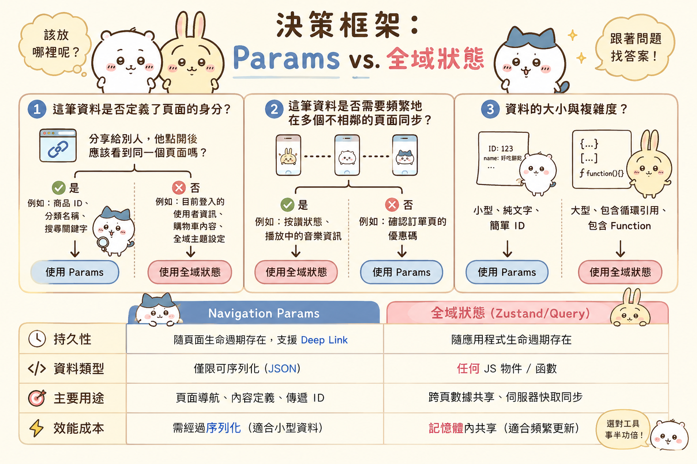

---
mdx:
  format: md
---

> 課程：RN 跨平台開發基礎
> 第 6 堂：Navigation 機制深探

# 跨 Navigator 資料傳遞

如果你曾在開發網頁時使用過 URL query string（例如 `?id=123&sort=desc`），你一定直覺地知道：URL 應該盡量保持簡潔。但在 React Native 的世界裡，因為我們不總是在網頁瀏覽器中看到網址列，開發者很容易把 `navigation.navigate` 當成一個「大容量貨櫃」，恨不得把整個 API 回傳的 JSON 物件、甚至是帶有複雜 method 的類別實例（Class Instance）全部塞進去傳給下一頁。

你可能遇過這種情況：在列表頁點擊一則貼文，把整則貼文的物件傳給詳情頁。使用者在詳情頁按了讚，回到列表頁後，發現列表上的按讚數竟然沒更新！或者更糟的是，當你試圖實作「點擊推播通知直接跳轉到該頁面」時，APP 卻因為缺少了預期的「大物件」而直接崩潰。

這就是因為我們混淆了「導覽參數（Params）」與「應用程式狀態（State）」的職責。

## 基礎：如何在頁面間「傳話」？

在 React Navigation 中，頁面間的通訊主要透過 `navigation.navigate` 或是 `navigation.push` 的第二個參數來達成。這在語法上非常簡單：

```tsx
// 在來源頁面（例如 PostList.tsx）
navigation.navigate('PostDetail', {
  postId: 'post_888',
  source: 'home_feed'
});
```

而在目標頁面中，我們可以透過 `route` 這個 prop 或是 `useRoute` hook 來接收這些資料：

```tsx
// 在目標頁面（例如 PostDetail.tsx）
function PostDetailScreen({ route }) {
  const { postId, source } = route.params;
  
  // 使用 postId 去 fetch 資料或顯示 UI
  return <Text>Post ID: {postId}</Text>;
}
```

這套機制看起來完美無缺，直到你的應用程式開始變大，或者你開始處理複雜的互動流程。

## 第一條核心準則：Params 必須是「可序列化」的

這是 React Navigation 官方一再強調、但開發者最常忽略的原則：**傳遞的 Params 必須是可序列化的 (Serializable)**。

所謂「可序列化」，簡單來說就是這個資料可以被轉化為 JSON 字串（透過 `JSON.stringify()`），並且在之後能被完美還原（透過 `JSON.parse()`）。

### 為什麼非要可序列化不可？

你可能會問：「如果不序列化，我的程式碼明明跑得動，為什麼不能傳 Function 或 Class 實例？」這背後有三個底層原因：

1. **Deep Linking (深層連結) 的基礎**：
想像一下，如果使用者點擊一個連結 `myapp://posts/123` 打開 APP。這時候 React Navigation 需要根據這個 URL 重建導覽堆疊。URL 只能攜帶字串資料，如果你的詳情頁強烈依賴一個「從上一頁傳過來的 Function」，那麼當使用者從 Deep Link 進來時，這個 Function 是不存在的，你的頁面就會直接報錯。
2. **State Persistence (狀態持久化)**：
在開發階段，如果你開啟了快速刷新（Fast Refresh），或者在生產環境中你想要實作「APP 閃退後自動恢復到上次頁面」的功能，React Navigation 需要將目前的導覽狀態儲存在磁碟上。只有可序列化的資料才能被儲存。
3. **通訊開銷與記憶體管理**：
回憶我們在 Topic 1.3 提到的 Bridge 結構。雖然新架構 JSI 改善了通訊效率，但頻繁傳遞超大型物件仍然會造成 JS Thread 的壓力。更重要的是，如果你傳遞的是一個 Class 實例，它可能持有對前一個頁面元件的引用，這會導致垃圾回收（Garbage Collection）無法正常運作，進而引發記憶體洩漏。

**絕對不要傳入 Params 的東西：**

- **Callback Functions**：例如 `onSuccess: () => { ... }`。
- **Class Instances**：例如 `new UserEntity()`。
- **大型資料集**：例如整本書的內文或包含 500 個項目的陣列。

## 常見的反模式：傳遞完整物件 (The "Fat Params" Trap)

在開發內容類 APP 時，最誘人的做法就是「省一次 API 呼叫」。

**反模式範例：**

```tsx
// PostList.tsx
const handlePress = (item) => {
  // ❌ 錯誤示範：把整個 API 回傳的物件傳過去
  navigation.navigate('PostDetail', { post: item }); 
};
```

這種做法看起來很聰明：詳情頁一打開就有資料，不需要顯示 loading，也不需要再次呼叫 API。但這會帶來兩個嚴重的副作用：

### 1. 資料不一致的夢魘

假設使用者從「首頁列表」進入「貼文詳情」。在詳情頁，他點擊了追蹤作者。此時，詳情頁的 UI 更新了。
但如果使用者退回首頁，首頁列表中的那個 `item` 物件仍然是舊的（因為它是當初透過 params 傳遞的一份快照）。這會導致同一個作者在 APP 的不同頁面顯示不同的追蹤狀態，讓使用者感到混惑。

### 2. 舊資料的「幽靈回聲」

如果你的 APP 支援推播。使用者收到「你的貼文有新留言」的通知。當他點擊通知進入詳情頁時，你的導覽邏輯可能沒有「完整的 post 物件」可以傳遞。如果你的詳情頁程式碼寫死了一定要從 `route.params.post.title` 拿資料，那麼從推播進入時，頁面就會直接崩潰。

## 實戰建議：只傳遞「ID」

對於內容／媒體類 APP，最佳實踐是：**只傳遞最小限度的識別碼（ID）**。

```tsx
// ✅ 正確示範：只傳 ID
navigation.navigate('PostDetail', { postId: 'post_888' });
```

在 `PostDetail` 頁面中，你應該根據這個 `postId` 重新獲取資料。這聽起來好像多了一次 API 呼叫，但實際上：

- **使用快取工具**：如果你使用了 **TanStack Query (React Query)** 或 **SWR**，這第二次呼叫通常會直接命中記憶體快取，幾乎是瞬發的，完全不會有性能問題。
- **確保資料最新**：詳情頁拿到的永遠是最新的、從伺服器端同步回來的資料。
- **架構統一**：無論是從列表點入、從搜尋進入、還是從推播進入，詳情頁的邏輯完全一致。

## 如何「回傳」資料給上一頁？

有時候，我們需要從子頁面傳回一些資訊給父頁面。例如：在「個人檔案編輯」頁改了名字，回到「個人中心」頁要看到更新。

雖然我們可以使用全域狀態，但 React Navigation 提供了一個更輕量的方法：**再次呼叫 `navigate`**。

React Navigation 的 `navigate` 動作非常聰明。如果你呼叫一個已經在堆疊中的頁面，它不會重複開啟新頁面，而是會「跳回」該頁面，並更新該頁面的 params。

```tsx
// 在「編輯名稱」頁面
function EditNameScreen({ navigation }) {
  const handleSave = () => {
    // 跳回 Profile 頁面，並帶上新的資料
    navigation.navigate({
      name: 'Profile',
      params: { updatedName: 'Aria' },
      merge: true, // 確保資料與現有 params 合併而非覆蓋
    });
  };
}
```

在 `Profile` 頁面中，你可以利用 `useEffect` 監聽 params 的變化：

```tsx
useEffect(() => {
  if (route.params?.updatedName) {
    // 處理更新邏輯，例如同步到本地狀態
    console.log('名字更新為：', route.params.updatedName);
  }
}, [route.params?.updatedName]);
```

## 決策框架：Params vs. 全域狀態

身為開發者，你經常面臨這個抉擇：這筆資料該放在 Params 傳遞，還是放在 Zustand / Context / TanStack Query 裡？

你可以用以下三個問題來判斷：

### 1. 這筆資料是否定義了頁面的身分？

如果我把這個資料分享給別人，他點開後應該看到同一個頁面嗎？

- **是**（例如：商品 ID、分類名稱、搜尋關鍵字）→ **使用 Params**。這就像是網頁的 URL。
- **否**（例如：目前登入的使用者資訊、購物車內容、全域主題設定）→ **使用全域狀態**。

### 2. 這筆資料是否需要頻繁地在多個不相鄰的頁面同步？

- **是**（例如：按讚狀態、播放中的音樂資訊）→ **使用全域狀態**。透過 Params 在深層嵌套的 Navigator 中傳來傳去是維護上的災難。
- **否**（例如：確認訂單頁的優惠碼）→ **使用 Params**。

### 3. 資料的大小與複雜度？

- **小型、純文字、簡單 ID** → **使用 Params**。
- **大型、包含循環引用、包含 Function** → **使用全域狀態**。

| 特性 | Navigation Params | 全域狀態 (Zustand/Query) |
| --- | --- | --- |
| **持久性** | 隨頁面生命週期存在，支援 Deep Link | 隨應用程式生命週期存在 |
| **資料類型** | 僅限可序列化 (JSON) | 任何 JS 物件/函數 |
| **主要用途** | 頁面導航、內容定義、傳遞 ID | 跨頁數據共享、伺服器快取同步 |
| **效能成本** | 需經過序列化（適合小型資料） | 記憶體內共享（適合頻繁更新） |



## 總結與下個階段

在 React Native 中，處理 Navigator 資料傳遞時，請記住「**Params 是 URL 的分身**」。它們應該保持輕量、純粹，並且只包含足以讓頁面「找回自己」的資訊（通常就是個 ID）。

將 Params 設計得簡潔、可序列化，不僅是為了避免 Bug，更是為了讓你的 APP 具備**外部觸發（External Trigger）**的能力。

這正好連結到了我們下一個重要的話題：**Deep Linking (深層連結)**。正是因為 Params 是可序列化的，我們才能把一個像是 `https://myapp.com/post/888` 的網址，精準地對應到 APP 內部的導覽行為。在下一部分，我們將深入探討如何設定這些路徑，以及如何處理推播通知帶來的跳頁挑戰。

### 本部分重點回顧

- **序列化是鐵律**：不要在 Params 傳遞 Function 或 Class。
- **傳 ID 不傳物件**：避免資料不一致，並確保頁面在任何入口進入時都能運作。
- **返回傳參**：善用 `navigation.navigate` 回跳機制來回傳簡單結果。
- **定位職責**：Params 負責導覽與定位，全域狀態負責資料的同步與持有。

---

## 關鍵思維

下一個主題我們將探討 **Deep Linking 與推播跳頁**。你會發現，如果你在這一章節堅持了「Params 只傳 ID」的原則，那麼實作 Deep Linking 將會變得異常簡單，因為 URL 本質上就是一串可序列化的 ID 組合。我們將學習如何將這些 URL 解析為 React Navigation 的狀態，並解決 APP 在啟動瞬間處理跳轉的各種競態問題。
