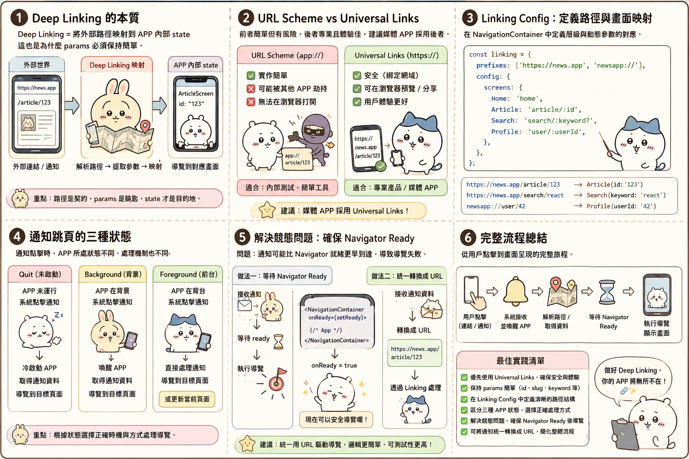

---
mdx:
  format: md
---

> 課程：RN 跨平台開發基礎
> 第 6 堂：Navigation 機制深探

# Deep Linking 與推播跳頁

想像一下，你的使用者在通訊軟體上收到朋友分享的一部精彩影片連結，或者收到一張「你追蹤的創作者上傳了新影片」的推播通知。當他點擊這個連結或通知時，他期待的絕不是僅僅「打開 APP」，而是直接進入「該部影片的播放頁面」。

這種從 APP 外部直接導向內部特定頁面的技術，就是 **Deep Linking（深層連結）**。

在上一節中，我們討論了 `params` 的序列化限制。你當時可能在想：為什麼 React Navigation 堅持 params 必須是能被轉成 JSON 的簡單物件？答案就在這一節：因為 Deep Linking 本質上就是將一段「字串路徑」轉換成 APP 的「導覽狀態」。如果你的 params 太複雜（例如包含一個 Function 或一個巨大的 Class 實體），URL 字串根本無法表達這些資訊。

本節我們將深入探討如何將外部的 URL 與推播通知，與你的 Navigation 架構完美整合。

## 外部世界的橋樑：URL Scheme 與 Universal Links

要讓作業系統（iOS / Android）知道某個連結應該由你的 APP 開啟，有兩種主要的實現方式。理解這兩者的差異，是你設計導覽架構的第一步。

### 1. URL Scheme (自定義協定)

這是一種傳統的方法，格式通常像這樣：`myapp://video/123`。

- **優點：** 設定極其簡單，只需要在 `Info.plist` (iOS) 或 `AndroidManifest.xml` (Android) 註冊一個字串即可。
- **缺點：** 缺乏唯一性。如果另一個 APP 也註冊了 `myapp://`，系統會發生衝突，甚至可能出現讓使用者「選擇要用哪個 APP 開啟」的尷尬視窗。此外，如果使用者沒安裝 APP，點擊這種連結通常會直接無效（報錯）。

### 2. Universal Links (iOS) / App Links (Android)

這是現代行動開發的標準做法，使用的是標準的 HTTPS 連結：`https://www.myapp.com/video/123`。

- **優點：** 
  - **安全性與唯一性：** 需要在你的網域伺服器放置驗證檔案（如 `apple-app-site-association`），證明你擁有該網域，別人無法冒用。
- **無縫銜接：** 如果使用者安裝了 APP，點擊連結會直接跳轉進入 APP；如果沒安裝，它就是一個正常的網頁，可以導向 App Store 或網頁版內容。
- **缺點：** 設定繁瑣，需要同時處理前端配置、原生端設定以及伺服器端的驗證檔案。

對於內容與媒體類 APP，**Universal Links 是必經之路**，因為它能確保分享連結在各個平台（社群媒體、瀏覽器）上都能有最好的體驗。

## React Navigation 的 Linking 配置

React Navigation 提供了一個強大的 `linking` 配置物件，讓我們能用「宣告式」的方式定義 URL 與頁面的映射關係。

### 配置 prefixes 與 config

在 `NavigationContainer` 上，我們可以傳入一個 `linking` 屬性。

```tsx
const linking = {
  // 定義 APP 支援哪些開頭的連結
  prefixes: ['https://myapp.com', 'myapp://'],
  
  // 定義路徑如何對應到 Screen
  config: {
    screens: {
      MainStack: {
        screens: {
          Home: 'home',
          VideoDetail: {
            path: 'video/:videoId', // :videoId 會自動轉為 params
            parse: {
              videoId: (id) => `${id}`, // 確保轉為字串
            },
          },
        },
      },
      Settings: 'settings',
    },
  },
};

// ... 在 App.tsx 中
<NavigationContainer linking={linking}>
  {/* Navigator 結構 */}
</NavigationContainer>
```

這裡有幾個關鍵點：

1. **層級對應：** 你的 `config` 結構必須與你的 Navigator 嵌套結構一致。如果 `VideoDetail` 是在 `MainStack` 裡面，你的 config 也要這樣巢狀定義。
2. **動態參數：** 使用 `:paramName` 的語法。當使用者訪問 `myapp://video/abc` 時，`VideoDetail` 頁面就會收到 `route.params.videoId` 為 `'abc'`。
3. **解析與轉換：** 誠如前一節所述，URL 傳進來的一定是字串。如果你的頁面需要數字型 ID，可以在 `parse` 函數中進行轉換。

**思考一下：** 如果你沒設定 `linking`，APP 收到外部連結時會發生什麼事？系統通常只會冷漠地幫你「啟動 APP」，然後停在首頁，這對 UX 來說是一大打擊。

## 推播通知的跳頁挑戰

推播通知（Push Notification）本質上與 Deep Linking 不同，它不是來自 URL，而是來自系統的一個資料封包（Payload）。然而，在導覽層面，它們的目標是一致的：**根據一段標識符（Identifier）跳到特定頁面。**

推播通知最麻煩的地方在於「APP 當下的狀態」。

### 三種狀態下的行為差異

1. **Quit (已關閉 / 冷啟動)：**
使用者點擊通知，APP 從零開始啟動。這時候你的 JS 引擎還在載入，Navigator 根本還沒 Mount。
  - **處理方式：** 透過 `getInitialNotification` (在 `react-native-notifications` 或 `expo-notifications` 中) 獲取啟動 APP 的那個通知。
2. **Background (背景執行)：**
APP 還在記憶體中，但使用者正在看別的畫面。點擊通知會將 APP 喚起。
  - **處理方式：** 監聽「通知點擊事件」。
3. **Foreground (前景執行)：**
使用者正在使用你的 APP。此時點擊通知，系統通常不會彈出上方的橫幅（Banner），你必須自己決定要不要跳轉。
  - **處理方式：** 監聽「收到通知事件」，通常會彈出一個自定義的 UI 詢問使用者：「發現新影片，是否前往觀看？」

### 實作中的競態問題 (Race Condition)

這是開發者最常踩的坑：當 APP 從 Quit 狀態啟動時，你偵測到了推播通知，程式碼裡面寫了 `navigation.navigate('VideoDetail')`。但此時 **Root Navigator 尚未準備好**，結果就是這行指令石沈大海，使用者依然停在首頁。

**解決策略：預存目標路徑**
一種常見的做法是建立一個「導覽服務層（Navigation Service）」，或者利用 `NavigationContainer` 的 `onReady` callback。

1. 當通知進來時，如果 Navigator 沒準備好，先把目標（例如 `videoId`）存進一個變數或全域狀態中。
2. 當 `NavigationContainer` 觸發 `onReady` 時，檢查是否有「待處理的導覽目標」。
3. 如果有，立即執行跳轉。

## 整合思路：統一路徑處理中心

為了不讓程式碼變得混亂（一下處理 URL，一下處理 Notification Payload），最好的做法是將**推播通知轉化為 Deep Link 格式**。

想像你的推播 Payload 長這樣：

```json
{
  "data": {
    "type": "NEW_VIDEO",
    "id": "123"
  }
}
```

在你的通知處理邏輯中，不要直接呼叫導覽指令，而是把它轉換成一個 URL 字串：`myapp://video/123`。然後，將這個字串丟給 React Navigation 的 `linking` 機制處理。

這樣做的好處是：

- **邏輯收攏：** 你只需要維護一份 `linking config`。無論是點連結還是點通知，最終進入頁面的邏輯是一模一樣的。
- **易於測試：** 你可以透過終端機指令（如 `npx uri-scheme open myapp://video/123 --ios`）來測試所有的跳頁邏輯，而不需要每次都發送真正的推播。

## 為什麼媒體類 APP 必須重視這一環？

對於內容導向的 APP（如你正在開發的項目），**「內容的流動性」**決定了留存率。

- **行銷活動：** 你發送一封電子郵件，裡面有一個「限時免費看」的連結。
- **社群分享：** 使用者分享一個有趣的片段到 Instagram。
- **系統提醒：** 訂閱的頻道開播。

如果這些入口都能精準地把使用者送達目的地，你的 APP 就會感覺像是一個「活的、互聯的」生態系，而不是一個封閉的、必須從大門進去的迷宮。

### 實際開發中的進階撇步

- **Fallback 處理：** 當 `videoId` 不存在或已被刪除時，你的 `VideoDetail` 頁面應該能優雅地處理錯誤（例如彈出提示並退回首頁），而不是直接當機。
- **驗證機制：** Universal Links 需要在伺服器放置 `.well-known/apple-app-site-association`（無副檔名的 JSON）。記得確認你的內容類型（Content-Type）是 `application/json`，否則 iOS 會拒絕下載。
- **測試工具：** 
  - iOS 使用 `xcrun simctl openurl booted myapp://...`
- Android 使用 `adb shell am start -W -a android.intent.action.VIEW -d "myapp://..."`

---

## 建立連貫的導覽體驗

我們從基礎的堆疊概念，聊到頁面的生命週期控制，再到這一節如何與外部世界（Deep Linking 與推播）串接。現在，你已經擁有了掌控 APP 導覽狀態的完整武器庫。

在本章的最後一個部分，我們將要把這些零散的技術點拼湊在一起。我們將討論如何根據內容/媒體類 APP 的特性，規劃出一個既強大又好維護的導覽架構。我們會討論「層級規劃」以及如何避免所謂的「巢狀地獄（Nesting Hell）」，讓你的 APP 骨架能夠支撐未來不斷增加的功能。

### 本節重點回顧

- **Deep Linking 的本質**：將外部路徑映射到 APP 內部的 state，這也是為什麼 params 必須保持簡單。
- **URL Scheme vs Universal Links**：前者簡單但有風險，後者專業且體驗佳，建議媒體 APP 採用後者。
- **Linking Config**：在 `NavigationContainer` 中定義層級與動態參數的對應。
- **通知跳頁的三種狀態**：Quit、Background、Foreground 的處理機制不同。
- **解決競態問題**：確保 Navigator Ready 後再執行導覽，或將通知統一轉換成 URL 來處理。
  

接下來，我們將進入 Topic 3.7：**Navigation 架構規劃最佳實踐**，為這一個主題劃下完美的句點。
