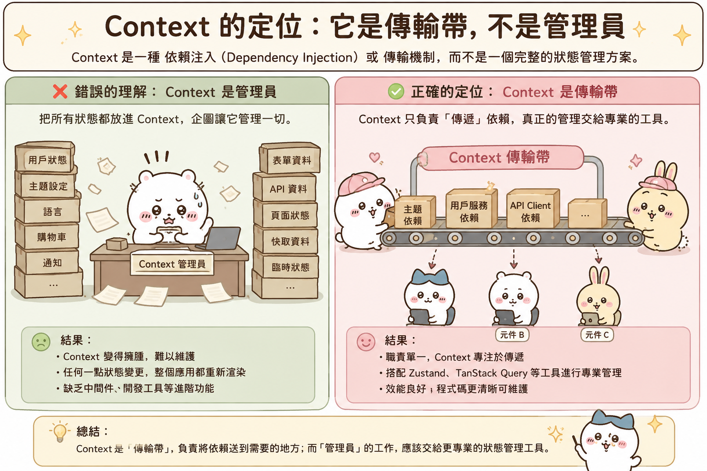
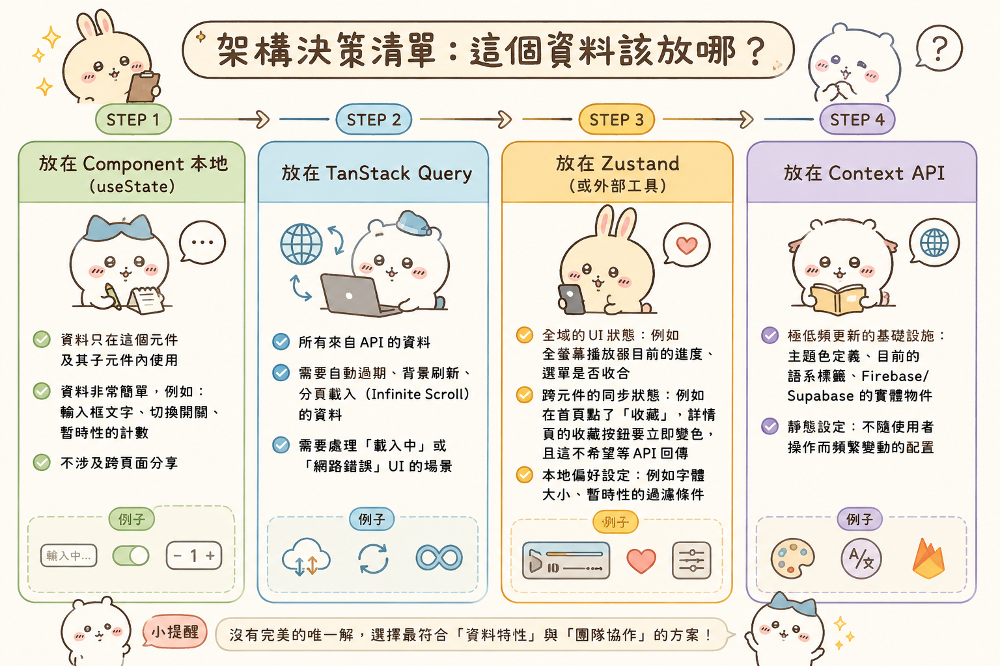
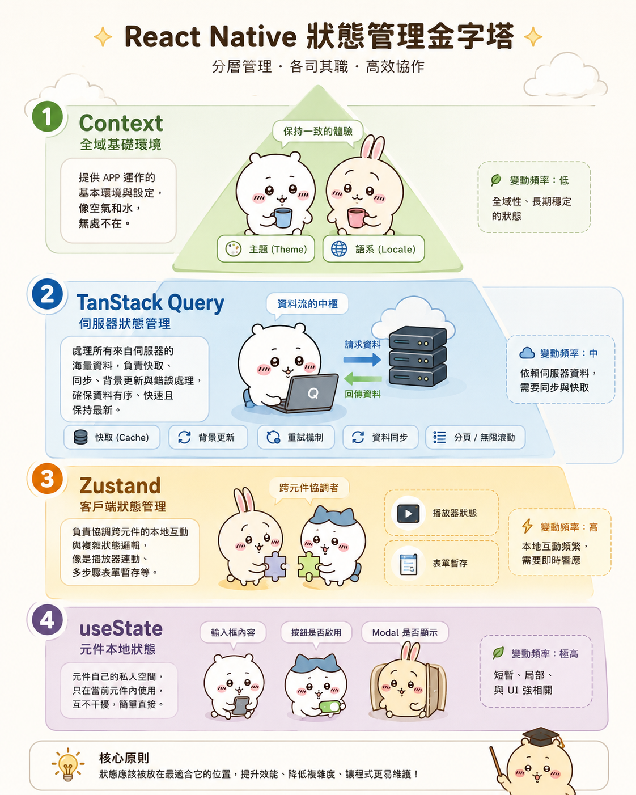

---
mdx:
  format: md
---

> 課程：RN 跨平台開發基礎
> 第 7 堂：狀態管理完整梳理

# Context、外部工具與伺服器狀態

當你的 APP 規模從「兩三個頁面」成長到「具有複雜互動的媒體平台」時，你會發現單靠 `useState` 和 `useReducer` 已經捉襟見肘。你可能會開始把所有的狀態都丟進 React Context，然後驚訝地發現：為什麼我在搜尋框打個字，整個 APP 的首頁、側邊欄、甚至是底部的播放控制器都在跟著閃爍（重新渲染）？

這是因為在狀態管理的領域中，有一個最常見的誤區：**把「資料傳輸工具」當成了「狀態管理工具」**。

這一部分我們將跳出 Hook 的微觀世界，從架構師的視角來重新審視狀態管理。我們要釐清 Context 的真實定位，引入更精準的外部工具如 Zustand，並理解現代開發中最重要的觀念：**伺服器狀態（Server State）與客戶端狀態（Client State）的分離**。

## Context 的定位：它是傳輸帶，不是管理員

很多開發者對 Context API 有一種誤解，認為它是 Redux 的輕量替代品。但事實上，React 官方對 Context 的定位非常明確：它是一種 **「依賴注入（Dependency Injection）」** 或 **「傳輸機制」**，而不是一個完整的狀態管理方案。

### Context 的核心痛點：全域重新渲染

Context 的設計初衷是為了解決「Prop Drilling（屬性鑽孔）」的問題，讓你不需要手動將資料透過五層元件傳遞。然而，它在效能上有一個致命的行為：**只要 Provider 的 **`**value**`** 發生改變，所有使用該 Context 的元件都會被強制重新渲染。**

想像一下，你建立了一個 `GlobalContext`，裡面存放了 `user`（使用者資訊）和 `isDark`（深色模式設定）：

```tsx
const GlobalContext = createContext(null);

function App() {
  const [state, setState] = useState({ user: { name: 'Aria' }, isDark: false });

  // 當我們只更新 isDark 時
  const toggleTheme = () => setState(prev => ({ ...prev, isDark: !prev.isDark }));

  return (
    <GlobalContext.Provider value={state}>
      <Header /> {/* 這裡使用了 user */}
      <ThemeSwitcher /> {/* 這裡使用了 isDark */}
    </GlobalContext.Provider>
  );
}
```

在這個結構中，當你點擊 `ThemeSwitcher` 切換主題時，`Header` 元件雖然只關心 `user`，但因為它訂閱了同一個 `GlobalContext`，而這個 Context 的 `value` 物件引用發生了變化，`Header` 也會被迫跟著重新渲染。

在一個內容/媒體類 APP 中，如果你的「播放進度」這種高頻更新的資料放在 Context 裡，而下方有一個包含上百個項目的評論列表也訂閱了這個 Context，後果將是災難性的卡頓。

### Context 的正確使用時機

這並不代表 Context 不好，而是要用在對的地方。Context 適合存放 **「低頻率更新」** 且 **「全域性」** 的資料，例如：

1. **主題（Theme）**：通常使用者設定完就不太會動。
2. **語系（Localization）**：App 執行期間很少切換。
3. **身份認證狀態（Auth Info）**：登入後直到登出前基本保持不變。

**架構建議：** 即使要用 Context，也要採取「原子化」策略。不要一個 `BigContext` 裝所有東西，而是拆分成 `ThemeContext`、`UserContext`、`ConfigContext`。這能將重新渲染的範圍控制在最小的邏輯區塊內。



---

## 外部狀態管理工具：Zustand 的魅力

當 Context 的效能限制成為瓶頸時，我們就需要外部狀態管理工具。過去 Redux 是標準答案，但其繁瑣的樣板程式碼（Boilerplate）常讓人卻步。在現代 React Native 開發中，**Zustand** 已成為許多開發者的首選。

### 為什麼選 Zustand 而非 Redux？

對於內容類 APP 來說，Zustand 有幾個核心優勢：

1. **輕量且無須 Provider**：Zustand 的 Store 存在於 React 渲染樹之外，你不需要在 `App.tsx` 裡面包裹層層疊疊的 Provider，這讓程式碼乾淨許多。
2. **外科手術式的重新渲染控制（Selectors）**：這是它最強大的地方。你可以精確指定元件要訂閱 Store 中的哪一個欄位。

### Selector 的威力

觀察以下 Zustand 的用法：

```tsx
import { create } from 'zustand';

const usePlayerStore = create((set) => ({
  volume: 80,
  isPlaying: false,
  trackName: 'React Native Deep Dive',
  setVolume: (v) => set({ volume: v }),
  togglePlay: () => set((state) => ({ isPlaying: !state.isPlaying })),
}));

// 在元件中使用
function PlayerVolumeControl() {
  // 元件只會在 volume 改變時重新渲染
  // 即使 trackName 或 isPlaying 變了，這個元件完全不動
  const volume = usePlayerStore((state) => state.volume);
  const setVolume = usePlayerStore((state) => state.setVolume);

  return <Slider value={volume} onValueChange={setVolume} />;
}
```

這種「選擇性訂閱」的機制，完美解決了 Context 的全域渲染問題。在開發媒體 APP 時，你可以把播放器的狀態（進度、音量、緩存狀態）放在 Zustand 中，各個元件按需取用，效能會非常優異。

### 什麼時候才需要 Redux Toolkit (RTK)？

如果你的專案规模極大（例如有數十位開發者共同維護），且需要：

- **強大的調試工具**（Redux DevTools 的時間旅行功能非常成熟）。
- **嚴格的開發規範**（強制的 Action/Reducer 結構）。
- **複雜的中間件（Middleware）** 處理。

那麼 RTK 仍然是個好選擇。但對於大多數獨立開發者或小型團隊，Zustand 提供的靈活性與效能已經綽綽有餘。

---

## 範式轉移：Server State vs. Client State

這是近年來 React 生態系最重要的思維變革。如果你還在用 `useEffect` + `useState` 來管理從 API 抓回來的資料，那麼你可能還沒體會到這層差異。

### Client State (客戶端狀態)

這是 **「你擁有完全主導權」** 的資料。

- **特性**：它是同步的、立即反應的、存在於記憶體中的。
- **範例**：目前的導航索引、搜尋框的輸入字串、彈窗是否開啟、播放器的音量。
- **工具**：`useState`、`useReducer`、Zustand。

### Server State (伺服器狀態)

這是 **「你只是暫時持有快照」** 的資料。

- **特性**：它不在你的掌控之下，你必須透過非同步請求來「索取」。資料可能在你拿到後的一秒鐘就在資料庫裡被別人修改了。它需要快取、需要過期失效機制、需要處理載入中與錯誤狀態。
- **範例**：影片列表、使用者個人資料、留言內容、推薦演算法的結果。
- **工具**：**TanStack Query (React Query)**。

### 為什麼不該用 Zustand 管理 API 資料？

很多開發者習慣把 API 回傳的 `videoList` 存進 Zustand。這會產生幾個問題：

1. **資料過時**：使用者留在這個頁面 10 分鐘，你的 Zustand 裡的列表還是舊的，除非你手動寫邏輯去刷新。
2. **重複請求**：兩個不同的元件都需要這份列表，你必須自己寫判斷邏輯，確保不會發出兩次一樣的 API 請求。
3. **快取邏輯複雜**：手動管理「什麼時候該清空快取」非常痛苦且容易出錯。

---

## TanStack Query：專為 Server State 而生

TanStack Query (原名 React Query) 解決的不是「如何發送 API」，而是 **「如何管理這份資料的生命週期」**。

它引入了一個核心觀念：**stale-while-revalidate (SWR)**。也就是先給你看舊的（快取）資料，同時在背後偷偷去抓新的資料，抓到後再更新給你。

### 它為內容型 APP 解決了什麼？

1. **自動處理 Loading 與 Error**：不再需要寫無數個 `const [loading, setLoading] = useState(false)`。
2. **智慧快取**：當使用者在頁面 A 看到列表，跳到頁面 B 再跳回 A 時，列表會立即出現（從快取讀取），不會有空白等待期。
3. **視窗聚焦重新讀取 (Refetch on Focus)**：這在行動裝置上非常實用。當使用者切換到別的 App 再切換回你的 App 時，TanStack Query 可以自動幫你檢查資料是否需要更新。
4. **重複請求消除 (Request Deduplication)**：如果一個頁面上有五個元件同時需要「使用者頭像」，Query 會合併成同一個網路請求。

### 程式碼範例：從 useEffect 進化

**舊的方式 (混亂且難維護)：**

```tsx
const [data, setData] = useState([]);
const [loading, setLoading] = useState(true);

useEffect(() => {
  fetchVideos().then(res => {
    setData(res);
    setLoading(false);
  }).catch(err => {
    // 這裡還要處理錯誤...
  });
}, []);
```

**TanStack Query 的方式 (語意化且強大)：**

```tsx
const { data, isLoading, error, refetch } = useQuery({
  queryKey: ['videos'],
  queryFn: fetchVideos,
  staleTime: 1000 * 60 * 5, // 5 分鐘內都算新鮮，不需要重新抓
});
```

---

## 架構決策清單：這個資料該放哪？

在規劃你的 APP 時，可以用以下流程進行判斷，這能確保你的架構既高效又易於維護：

### 1. 放在 Component 本地 (`useState`)

- 資料只在這個元件及其子元件內使用。
- 資料非常簡單，例如：輸入框文字、切換開關、暫時性的計數。
- 不涉及跨頁面分享。

### 2. 放在 TanStack Query

- **所有來自 API 的資料**。
- 需要自動過期、背景刷新、分頁載入（Infinite Scroll）的資料。
- 需要處理「載入中」或「網路錯誤」UI 的場景。

### 3. 放在 Zustand (或外部工具)

- **全域的 UI 狀態**：例如全螢幕播放器目前的進度、選單是否收合。
- **跨元件的同步狀態**：例如在首頁點了「收藏」，詳情頁的收藏按鈕要立即變色，且這不希望等 API 回傳。
- **本地偏好設定**：例如字體大小、暫時性的過濾條件。

### 4. 放在 Context API

- **極低頻更新的基礎設施**：主題色定義、目前的語系標籤、Firebase/Supabase 的實體物件。
- **靜態設定**：不隨使用者操作而頻繁變動的配置。



---

## 建立層次分明的狀態地圖

一個高品質的 React Native APP，其狀態管理應該像一座金字塔：

- **頂層 (Context)**：維持 APP 運作的基本空氣和水（主題、語系）。
- **中層 (TanStack Query)**：這是最重的一層，負責處理所有從伺服器來的海量資料，確保它們有序、快速且保持最新。
- **中層 (Zustand)**：負責協調複雜的本地互動，像是播放器的連動、多步驟表單的暫存。
- **底層 (useState)**：各個 UI 元件自己的私人空間，不干擾他人。

如果你能掌握這種「分而治之」的策略，你就能解決 90% 的效能問題，並且讓你的程式碼在面對複雜需求時，依然保持清晰的脈絡。



## 鞏固你的狀態管理觀念

至此，我們已經完整梳理了 Topic 4 的核心狀態管理邏輯。從單一 Hook 的精細操作，到 Reducer 的狀態機思維，再到 useEffect 的同步語義，最後到我們今天討論的架構層級選擇。這套組合拳能讓你不再只是被動地寫程式碼，而是能主動診斷 APP 的效能瓶頸，並根據資料的性質（Client vs. Server）給予最合適的對策。

在進入下一個主題「跨平台差異與避雷」之前，建議你審視一下目前開發中的兩款 APP：你的伺服器資料是不是還塞在全域 Store 裡？你的 UI 狀態是否因為 Context 過大而導致不必要的閃爍？理解了這些，你已經具備了邁向資深開發者的架構直覺。

### 重點總結

- **Context API**：定位是傳輸機制而非狀態管理，因全域重新渲染特性，僅適合低頻更新的資料。
- **Zustand**：藉由 Selector 機制實現精確渲染，是 React Native 處理複雜 UI 狀態的效能首選。
- **Server State**：具備非同步、非擁有的特性，應交由 **TanStack Query** 管理其快取與生命週期。
- **核心準則**：UI 狀態歸客戶端管理工具（Zustand/State），API 資料歸伺服器狀態工具（Query），依賴注入歸 Context。
