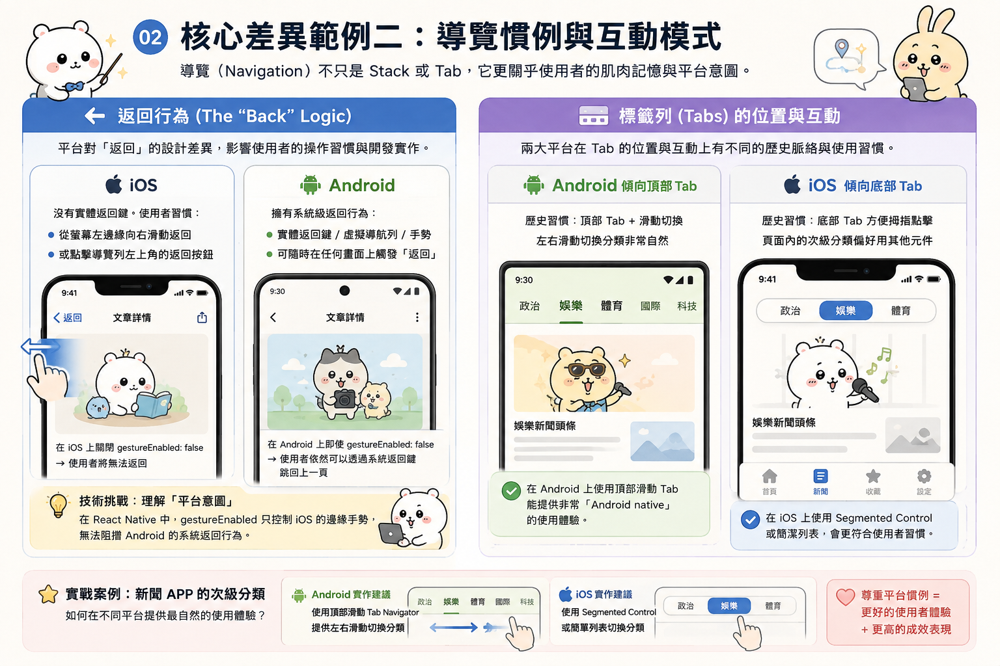
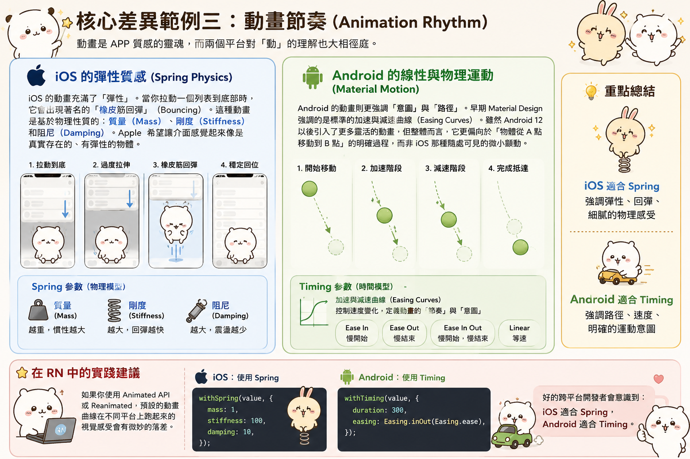

---
mdx:
  format: md
---

> 課程：RN 跨平台開發基礎
> 第 9 堂：跨平台差異根源

# 設計語言根本差異

在上一章節中，我們深入探討了 React Native 的「大腦」——狀態管理。我們學會了如何使用 `useState`、`useReducer` 以及 `Zustand` 或 `TanStack Query` 來處理數據流，確保應用程式的邏輯層（Logic Layer）穩定且可預測。然而，當這些數據要轉化為使用者觸手可及的介面時，我們便踏入了「表現層」（Representation Layer）的領域。

你可能已經發現，即使你寫的是同一套代碼，在 iOS 模擬器和 Android 實機上跑起來的感覺卻「不太一樣」。有時候是按鈕的陰影不見了，有時候是標題的位置顯得突兀，甚至連點擊後的反饋效果都截然不同。這些並非隨機的 Bug，而是源於兩大行動作業系統背後深層的設計哲學衝突。

作為一名 React Native 開發者，如果我們只追求「程式碼能跑」，那麼我們只是在寫 JavaScript；但如果我們想要打造出讓使用者感到「順手」的 APP，就必須理解 iOS 的 **Human Interface Guidelines (HIG)** 與 Android 的 **Material Design** 之間的本質差異。這堂課將帶領你建立一套底層框架，讓你不再只是盲目地調整樣式，而是能預判並系統性地解決跨平台開發的踩坑點。

## 兩大設計哲學的碰撞：毛玻璃 vs. 數位紙張

要理解為什麼同樣的 `View` 在兩個平台上會有不同的預設行為，我們得先回到設計的出發點。

### iOS：Human Interface Guidelines (HIG) —— 清晰、順從與深度

Apple 的設計語言強調的是 **「清晰度」（Clarity）**、**「順從性」（Deference）** 與 **「深度」（Depth）**。
在 iOS 的世界觀裡，UI 不應該喧賓奪主。它傾向於使用大量的「負空間」（Negative Space）、細長的線條以及半透明的「毛玻璃」效果（Vibrancy / Blur）。這種設計是為了讓使用者感覺內容是浮動在多層次的背景之上。

iOS 非常強調「層次感」，但這種層次感是透過模糊與景深（Blur）來達成的。當一個 Modal 彈出時，後方的背景會變得模糊，這是在告訴使用者：「你現在正在關注這層內容，但之前的脈絡依然存在於下方。」

### Android：Material Design —— 物理隱喻與紙張堆疊

Google 的 Material Design 則走了一條完全不同的路。它的核心口號是 **「Material is a metaphor」（材質即隱喻）**。
Android 將 UI 元素想像成現實世界中的「數位紙張」。這些紙張具有厚度（固定為 1dp），並且在一個受光的三維空間中移動。

在 Android 的邏輯裡，層次感不是靠模糊，而是靠 **「海拔」（Elevation）** 與 **「陰影」（Shadow）**。當一個元素浮起來時，它會根據它離背景的距離（Z 軸高度），投射出相應的物理陰影。這不是美學上的點綴，而是系統對於物體在空間中位置的物理模擬。

## 核心差異範例一：陰影 (Shadow) vs. 海拔 (Elevation)

這是 RN 開發者最常遇到的第一個坑。在 CSS 或 iOS 中，我們習慣用 `shadowColor`、`shadowOffset`、`shadowOpacity` 和 `shadowRadius` 這四個屬性來精確定義陰影。

但在 Android 上，這四個屬性完全不起作用。

### Android 的 Elevation 物理機制

Android 使用 `elevation` 屬性。當你設定 `elevation: 5` 時，你並不是在告訴系統「畫一個 5 像素的陰影」，而是在告訴系統「把這張數位紙張升高到 Z 軸 5 的位置」。

- **光線來源限制：** 因為 Android 模擬的是全局光照，所以你無法像 iOS 那樣自由設定陰影的偏移量（Offset）。陰影的方向是系統根據光線來源自動計算的。
- **背景依賴：** 在 Android 上，如果一個 View 沒有設定 `backgroundColor`，那麼它的陰影可能不會顯示。因為「沒有顏色的紙張」在物理上是不存在的，系統不知道該如何投射陰影。

### iOS 的樣式繪製機制

相比之下，iOS 的陰影更像是圖形編輯軟體（如 Photoshop）中的「外光暈」或「投影」。它是純粹的樣式繪製，與物體的物理屬性無關。你可以設定一個顏色極其詭異、偏移量極其誇張的陰影，iOS 都會照辦。

**開發者的思考框架：**
當你在寫內容類 APP 的卡片樣式時，不要試圖在兩個平台上強求像素級的陰影一致。相反，你應該使用 `Platform.select`：在 iOS 上定義細緻的 `shadow*` 屬性以符合其優雅的調性；在 Android 上則給予適當的 `elevation` 值，讓它符合系統的物理預期。

## 核心差異範例二：導覽慣例與互動模式

導覽（Navigation）不只是我們在 Topic 3 學到的 Stack 或 Tab，它更關乎使用者的肌肉記憶。

### 返回行為 (The "Back" Logic)

- **iOS：** 沒有實體返回鍵。使用者習慣於「從螢幕左邊緣向右滑動」來返回，或者點擊導覽列左上角的返回按鈕。
- **Android：** 擁有系統級的返回行為（無論是實體鍵、虛擬導航列，還是手勢）。這意味著使用者可以隨時在任何畫面上觸發「返回」。

這導致了一個有趣的技術挑戰：在 RN 中，如果你在 iOS 上關閉了 `gestureEnabled: false`，使用者就真的無法返回了；但在 Android 上，即使你關閉了手勢，使用者依然可以透過系統返回鍵跳回上一頁。這就是為什麼我們需要理解「平台意圖」。

### 標籤列 (Tabs) 的位置

雖然現在兩大平台都越來越傾向將主要導覽放在底部（Bottom Tabs），但歷史上 Android 習慣將切換分類的 Tab 放在頂部（Top Tabs），且支援左右滑動切換；而 iOS 則堅持底部 Tab 是為了方便大拇指點擊。

在開發媒體 APP 時，如果你需要在頁面內做次級分類（例如：新聞 APP 裡的「政治」、「娛樂」、「體育」分欄），在 Android 上使用頂部滑動 Tab 會讓使用者覺得非常「Android native」，而在 iOS 上則可能更適合用 Segmented Control 或簡單的列表。

## 核心差異範例三：動畫節奏 (Animation Rhythm)

動畫是 APP 質感的靈魂，而兩個平台對「動」的理解也大相徑庭。

### iOS 的彈性質感 (Spring Physics)

iOS 的動畫充滿了「彈性」。當你拉動一個列表到底部時，它會出現著名的「橡皮筋回彈」（Bouncing）。這種動畫是基於物理性質的：質量（Mass）、剛度（Stiffness）和阻尼（Damping）。Apple 希望讓介面感覺起來像是真實存在的、有彈性的物體。

### Android 的線性與物理運動 (Material Motion)

Android 的動畫則更強調「意圖」與「路徑」。早期 Material Design 強調的是標準的加速與減速曲線（Easing Curves）。雖然 Android 12 以後引入了更多靈活的動畫，但整體而言，它更偏向於「物體從 A 點移動到 B 點」的明確過程，而非 iOS 那種隨處可見的微小顫動。

在 RN 中，如果你使用 `Animated` API 或 `Reanimated`，預設的動畫曲線在不同平台上跑起來的視覺感受會有微妙的落差。好的跨平台開發者會意識到：**iOS 適合 Spring，Android 適合 Timing。**

## 建立正確的思考框架：追求「原生感」而非「一致性」

許多從 Web 轉向 React Native 的開發者，最容易陷入的陷阱就是「追求兩個平台長得一模一樣」。他們會花費大量時間去強迫 Android 顯示跟 iOS 完全相同的陰影，或者強迫 iOS 像 Android 那樣顯示點擊後的漣漪效果（Ripple Effect）。

**這是一個錯誤的戰略目標。**

我們應該建立的思考框架是：**「跨平台體驗的一致性，優於視覺的 1:1 一致。」**

### 1. 尊重平台語言

使用者買 iPhone 是因為他們喜歡 iOS 的互動邏輯，買 Android 亦然。如果你的 APP 在 Android 上表現得像個「外派的 iOS 介面」，使用者會感到一種莫名的違和感，這會直接降低產品的信任度。

### 2. 認清 RN 的角色：橋接者而非模擬器

記得我們在 Topic 1 提到的嗎？React Native 的 `View` 最終會變成 iOS 的 `UIView` 和 Android 的 `ViewGroup`。RN 的設計初衷不是為了抹平差異，而是為了讓你用同一套邏輯去操作兩個不同的原生系統。

當你發現某個樣式在 Android 上很難達成時，先停下來想一想：**「Android 的官方應用程式通常怎麼處理這個場景？」** 往往你會發現，有一個更符合 Android 規範的解決方案，比強行模擬 iOS 效果要好得多。

### 3. 先理解意圖，再找對策

當你遇到跨平台差異的 Bug 時，請依照以下順序思考：

1. **這是作業系統的設計規範嗎？**（例如：iOS 預設就是沒有 Elevation）
2. **這是 RN 元件的屬性支援差異嗎？**（例如：`TextInput` 在 Android 上有底線，iOS 沒有）
3. **這是否影響功能操作？**（如果只是陰影差 1 像素，或許不值得你寫 50 行代碼去修復它）

## 實踐：內容 / 媒體類 APP 的預判策略

以你正在開發的內容類 APP 為例，當你設計一個「影音播放清單」時：

- **iOS 側：** 你可以大膽使用 `blur` 背景來增加質感，讓播放控制介面看起來像是浮在影片之上。
- **Android 側：** 你應該使用顏色填充搭配適當的 `elevation`。如果需要毛玻璃感，在 Android 上通常需要額外的原生套件支援，且效能開銷較大，這時或許應該考慮使用半透明的深色遮罩作為替代方案。

這種「因地制宜」的策略，才是專業 React Native 開發者的表現。

## 總結與下一步預告：從哲學走向實作

在本節中，我們從最底層的設計哲學切入，理解了 iOS HIG 與 Android Material Design 的根本差異。我們探討了陰影與海拔的物理邏輯、導覽慣例的肌肉記憶，以及動畫質感的細微落差。

最重要的一點是：**React Native 的威力不在於「Write Once, Run Everywhere」，而在於它允許我們「Learn Once, Write Anywhere」，同時保留對原生體驗的敬畏****。**

理解了這些「為什麼」之後，我們就能更冷靜地應對那些「怎麼做」的技術細節。

### 關鍵重點回顧

- **iOS** 追求層次、模糊與彈性；**Android** 追求物理隱喻、紙張堆疊與 Z 軸海拔。
- **陰影處理**：iOS 是繪製出來的屬性，Android 是空間位置帶來的物理結果（Elevation）。
- **設計策略**：不要追求像素級一致，而要追求「平台原生的直覺一致」。

### 下一步

有了這層哲學底蘊後，下一個部分我們將進入最務實的「系統 UI 邊界」處理。我們將學習如何應對那些讓開發者頭痛的硬體特徵：劉海屏、底部手勢列，以及在不同平台上行為詭異的狀態列（Status Bar）。我們將深入研究 `SafeArea` 的正確配置方式，確保你的 APP 內容在任何形狀的螢幕上都能完美呈現。

---

## 視覺化設計哲學對比

為了讓你更有感，請參考下表對於兩大平台設計元素的對比總結：

| 特性 | iOS (Human Interface Guidelines) | Android (Material Design) |
| --- | --- | --- |
| **核心比喻** | 層次、透明、景深 (Glass) | 紙張、物理、海拔 (Paper) |
| **深度表現** | 毛玻璃模糊 (Blur / Vibrancy) | Z 軸陰影 (Elevation) |
| **邊角處理** | 圓角矩形 (Continuous Corner) | 標準圓角 |
| **導覽反饋** | 側滑返回 (Edge Swipe) | 系統級返回鍵 / 手勢 |
| **點擊反饋** | 變暗或變透明 (Opacity / Highlight) | 漣漪效果 (Ripple Effect) |
| **字體排版** | 強調標題層次、San Francisco 字體 | 強調資訊密度、Roboto 字體 |

理解這些差異，你就不會再為了「為什麼我的 Android 按鈕沒有陰影」而苦惱半天，因為你知道那是因為你還沒給它一個物理上的「高度」。

## 銜接下一個主題

在處理完這些抽象的設計哲學後，我們馬上要面對的是最現實的問題：螢幕的物理限制。

既然我們知道 iOS 喜歡內容「浮動」與「滲透」，而 Android 喜歡「實體分佈」，那麼當遇到 iPhone 的動態島（Dynamic Island）或是 Android 各式各樣的打孔螢幕時，我們的佈局該如何自適應？這就是我們下一個 Part：**系統 UI 邊界：SafeArea 與 StatusBar** 要解決的核心問題。
