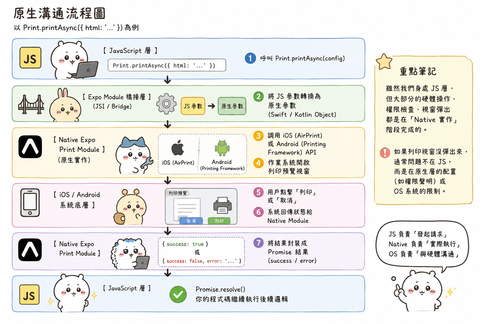

---
mdx:
  format: md
---

> 課程：RN 跨平台開發基礎
> 第 10 堂：原生功能整合

# Expo 模組與溝通機制

想像你在開發那款「人類圖 APP」時，你只需要呼叫一行 `Print.printAsync()`，手機就能彈出系統列印視窗；或者在你的「閱讀器 APP」中，呼叫 `Speech.speak()` 就能讓手機開口說話。你有沒有想過，這段簡單的 JavaScript 程式碼是如何跨越「網頁邏輯」的虛擬邊界，最終觸動到 iPhone 內部的 AirPrint 系統，或是 Android 的原生列印服務？

為什麼 `expo-speech` 讓手機說話的語法，跟 `expo-print` 列印文件的語法長得那麼像？這背後並非巧合，而是一套經過精心設計的原生橋接架構。理解這層架構，是你從「只會呼叫 API 的開發者」進化為「能診斷複雜原生問題的專家」的關鍵第一步。

## Expo Modules：統一的原生外掛系統

如果你曾接觸過早期的 React Native（純 CLI 模式），你可能還記得那段痛苦的「原生整合」時光：為了裝一個相機套件，你必須分別打開 Xcode (Objective-C/Swift) 和 Android Studio (Java/Kotlin)，修改 `AppDelegate.m` 和 `MainApplication.java`，然後祈禱編譯能通過。

Expo Modules 生態系徹底改變了這一點。它的核心目標是提供一套 **Universal API**（通用 API）。

### 為什麼 Expo 的模組長得如此相似？

無論是 `expo-speech`、`expo-print` 還是 `expo-camera`，它們在 JS 層的使用體驗幾乎一致：

1. **非同步優先**：原生功能（如列印、語音合成、掃描）通常涉及硬體資源的調度和 OS 系統回傳，因此 Expo 模組幾乎所有方法都是以 `Async` 結尾（如 `printAsync`），並回傳一個 Promise。
2. **型別定義嚴謹**：Expo 投入了大量精力在 TypeScript 定義上，這讓你在使用 AI 工具（如 Cursor 或 Copilot）時，能精準獲得參數補全。
3. **封裝設計模式**：Expo 內部使用了一種稱為 **"Sweet API"** 的 DSL（領域特定語言），這讓原生開發者可以用極致簡潔的方式編寫 Swift 或 Kotlin 程式碼，並自動對應到 JS 的介面。這就是為什麼不同的模組，其方法命名規範（CamelCase）、錯誤處理機制（Error Codes）都像出自同一人之手。

這對於開發內容類 APP 的你來說意義重大。這意味著當你學會了如何處理 `expo-speech` 的授權與非同步流程，你在處理 `expo-print` 時幾乎不需要重新學習。

## JS 與原生層的溝通原理：從 Bridge 到 JSI

在 React Native 的世界裡，JS 層就像是一個「指揮官」，而原生作業系統（iOS/Android）則是「執行部隊」。兩者之間並非直接連接，而是需要一個翻譯官。

### 舊時代的翻譯官：Bridge (橋接)

在舊架構下，JS 與原生的溝通是透過 **Bridge** 進行的。它的運作邏輯類似於「寄信」：

- **非同步 (Asynchronous)**：JS 發出指令後就去做別的事了，不知道原生層何時執行完。
- **序列化 (Serialization)**：JS 的指令必須被轉成 **JSON 字串**，透過 Bridge 傳給原生層，原生層再解析成物件執行。執行完後，再把結果轉成 JSON 傳回給 JS。

**這會產生什麼問題？**
想像你的「閱讀器 APP」正要將一大段 5000 字的文章傳給 `expo-speech`。在 Bridge 架構下，這 5000 字會被轉成巨大的 JSON 字串，擠在窄小的橋上傳輸。如果你這時候還在執行動畫或捲動列表，APP 就會感覺到明顯的卡頓，因為「翻譯官」忙不過來了。

### 新時代的翻譯官：JSI (JavaScript Interface)

這就是為什麼 React Native 轉向了 **New Architecture**。核心技術就是 **JSI**。
JSI 不再寄信，它讓 JS **直接持有** 原生對象的引用（C++ 指針）。這就像是 JS 指揮官現在可以直接對著原生執行部隊「當面下指令」。

- **同步呼叫 (Synchronous Calls)**：你可以像呼叫一般 JS function 一樣呼叫原生功能，不需要等待 JSON 序列化。
- **效能躍升**：資料不需要再被轉成 JSON，傳輸大型物件（如圖片數據或長文本）的負擔大幅降低。

目前多數 Expo 模組正在全面轉向 JSI（透過 Expo Modules SDK 封裝）。當你在「人類圖 APP」中生成複雜的 PDF 並準備列印時，這種更直接的溝通方式確保了介面的流暢度，避免了因為大量的數據傳輸導致 UI 凍結。

## 原生溝通流程圖

為了讓你更具體地理解這個過程，我們來看一下當你在 JS 中呼叫 `Print.printAsync({ html: '...' })` 時發生了什麼：

```
[ JavaScript 層 ]
      |
      | 1. 呼叫 Print.printAsync(config)
      V
[ Expo Module 橋接層 (JSI / Bridge) ]
      |
      | 2. 將 JS 參數轉換為原生參數 (Swift / Kotlin Object)
      V
[ Native Expo Print Module (原生實作) ]
      |
      | 3. 調用 iOS (AirPrint) 或 Android (Printing Framework) API
      | 4. 作業系統開啟列印預覽視窗
      V
[ iOS / Android 系統底層 ]
      |
      | 5. 用戶點擊「列印」或「取消」
      | 6. 系統回傳狀態給 Native Module
      V
[ Native Expo Print Module ]
      |
      | 7. 將結果封裝成 Promise 結果 (success / error)
      V
[ JavaScript 層 ]
      |
      | 8. Promise resolve，你的程式碼繼續執行後續邏輯
```

> **重點筆記**：雖然我們身處 JS 層，但大部分的硬體操作、權限檢查、視窗彈出都是在「Native 實作」階段完成的。如果列印視窗沒彈出來，通常問題不在 JS，而是在原生層的配置（如權限聲明）或 OS 系統的限制。



## 對比 Web API：為什麼我們不直接用 window.print？

如果你有 Web 開發經驗，你可能會問：「瀏覽器也有 `window.print()`，為什麼在 React Native 中非得用 `expo-print`？」

這觸及了原生 APP 開發與 Web 開發最本質的差異：**權限與能力範圍**。

1. **沙盒限制 (Sandboxing)**：瀏覽器的 Web API 受到極其嚴格的限制。`window.print()` 只能列印當前網頁內容，你很難精準控制列印的解析度、紙張大小或是將 HTML 直接轉成 PDF 檔案儲存。
2. **系統整合度**：`expo-print` 允許你傳入一個 HTML 字串（這在你的「人類圖 APP」中非常有用，可以用來動態生成圖表），並在後台靜默地將其轉換成 PDF 檔案，甚至可以直接分享給其他應用程式（如 LINE 或 WhatsApp）。這是瀏覽器 API 做不到的「深層連結」。
3. **一致性**：Web API 在不同行動瀏覽器（iOS Safari vs Android Chrome）上的表現往往不一致。Expo 模組則在 Native 層幫你抹平了這些差異，讓你在兩個平台上呼叫同一個 API，獲得幾乎相同的體驗。

## 為什麼理解這些原理對 Debug 至關重要？

你可能會覺得：「只要 API 能跑，為什麼我要管它是 JSI 還是 Bridge？」
但在開發內容類 APP 時，你一定會遇到以下情境，這時候原理就是你的救命稻草：

- **場景一：資料過載導致卡頓**
在「閱讀器 APP」中，如果你把整本小說（幾百萬字）一次丟給 `Speech.speak()`，在舊版 Bridge 模式下，你的 APP 會直接「假死」幾秒鐘。如果你知道這是 JSON 序列化的瓶頸，你就會學會將文本「分段處理」，或是確認該模組是否已升級到 JSI 架構。
- **場景二：原生行為不一致**
有時候 `Print.printAsync()` 在 iOS 上運作正常，但在 Android 上卻沒有反應。如果你理解「原生 Module」這層的存在，你就會知道去檢查 Android 的 `AndroidManifest.xml` 是否宣告了列印服務的權限，或是該 Android 版本的系統列印功能是否被廠商精簡掉了。
- **場景三：非同步競態問題 (Race Conditions)**
因為原生功能通常是非同步的。如果你在快速切換頁面時觸發了語音播放，頁面卸載後語音還在播，這就是因為「JS 指揮官」已經離開了，但「原生部隊」還沒收到停火指令。理解橋接機制，你就會知道在 `useEffect` 的 cleanup 函式中主動呼叫 `Speech.stop()`。

### 建立開發者直覺

以後當你在 Expo 文件中看到一個新的模組時，不要只看「怎麼用」，試著問自己三個問題：

1. 這個功能在 iOS/Android 上對應的原生組件是什麼？
2. 資料傳輸量大嗎？會不會造成 Bridge 阻塞？
3. 它是否需要請求系統權限？（這是我們接下來會深入探討的議題）。

掌握了這層溝通心法，你就擁有了診斷原生問題的「X 光眼」，而不再只是對著錯誤訊息不知所措。

## 學習總結與銜接

在這個部分，我們拆解了 Expo Modules 的底層設計，理解了它如何透過 JSI 與 Bridge 在 JS 層與原生系統之間搭建橋樑。我們看到了 `expo-speech` 與 `expo-print` 是如何利用這套機制，將複雜的作業系統功能簡化為一致的非同步函式。

這套機制是所有原生功能整合的基礎。有了這個底層認知後，接下來我們將進入實戰，探討內容/媒體類 APP 最核心的功能：**相機與圖片選取**。我們將看到這層橋接如何處理圖片這種大型資料，以及如何優雅地處理選取、壓縮到上傳的完整流程。
