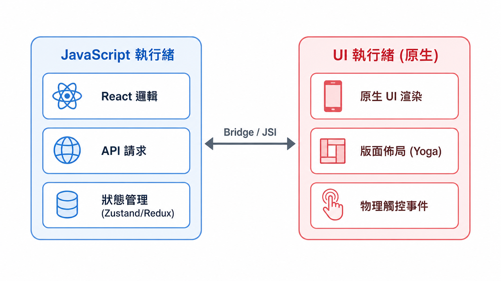

---
mdx:
  format: md
---

> 課程：RN 跨平台開發基礎
> 第 11 堂：效能基礎全覽

# JS Thread vs UI Thread

你有沒有遇過這種情況：你的 React Native APP 正在跑一個複雜的邏輯（例如把一千張圖片的元數據進行重新排序），這時候你瘋狂點擊畫面上的按鈕，或者試著滑動選單，結果 APP 像死機一樣完全沒反應。過了兩秒後，所有的點擊操作突然像「補課」一樣全部噴發出來，畫面也跟著劇烈跳動。

為什麼 React Native 既然宣稱使用了原生元件，卻還是會出現這種明顯的卡頓？

這背後的核心原因，就在於 React Native 獨特的**雙執行緒（Dual-Thread）模型**。理解這個模型，是從「會寫程式碼」進階到「能處理複雜效能問題」的第一步。

## 雙頭馬車：分工明確的兩個世界

在傳統的 Web 開發中，大部分的邏輯、DOM 操作和 UI 渲染都擠在同一個「主執行緒（Main Thread）」上。這意味著如果你的 JavaScript 算力爆表，瀏覽器的畫面更新就會直接被卡死。

但 React Native 的設計邏輯不同。為了追求流暢度，它強行將「思考」與「動作」拆分到了兩個獨立的執行緒中。我們可以把這想像成一個劇組：

### JS Thread：思考的大腦

這是你寫的所有 JavaScript 代碼居住的地方。不管是 React 的 `useState` 更新、從 API 抓取 JSON 資料、計算複雜的商務邏輯，還是處理 Redux/Zustand 的狀態轉換，全部都在這裡執行。

當你調用 `setState` 時，React 會在 JS Thread 啟動 **Re-render** 流程，計算出新的虛擬 DOM（Virtual DOM），並決定哪些 UI 需要更新。

### UI Thread (Main Thread)：執行的手腳

這是一個原生的世界（iOS 的原生主執行緒或 Android 的 UI 執行緒）。它的唯一職責就是**渲染畫面**和**處理使用者的物理觸控**。所有的原生 UI 元件（如 `UIView`、`UITextView`）都只能在這個執行緒上被操控。

除此之外，大部分由系統驅動的動畫（例如 Navigator 的頁面切換、或是設定了 `useNativeDriver: true` 的動畫）也都在這裡執行。

---

## 為什麼會卡？16ms 的物理極限

要理解卡頓，我們必須先理解「流暢」的物理定義。

目前大多數的手機螢幕更新率是 60Hz。這意味著螢幕每秒鐘會重新繪製 60 次。
計算一下：$1000ms / 60 = 16.67ms$。

這就是所謂的 **16ms 預算**。每一幀（Frame）的產生，從 JS 發出指令到 UI 繪製完成，如果超過了這 16.67 毫秒，手機就無法按時顯示下一張圖。這時候，螢幕就會維持在前一張圖的樣子，這就是我們感覺到的「掉幀（Frame Drop）」或「卡頓」。

### 當大腦（JS Thread）太忙時

雖然 UI Thread 和 JS Thread 是分開的，但它們並不是互不相干。UI Thread 負責捕捉你的手指點擊，然後透過「橋接器（Bridge）」發信號告訴 JS Thread：「嘿，使用者點了那個按鈕！」

如果此時你的 JS Thread 正在處理一個耗時 500ms 的迴圈（例如排序 1000 筆複雜的媒體資料），它就沒空理會這個信號。直到 500ms 結束後，JS Thread 才如夢初醒地處理點擊，並回信給 UI Thread 說：「好的，請把那個按鈕變色」。

在這 500ms 期間，即便 UI Thread 是閒置的，它也因為拿不到 JS 的指令而無法做出對應的 UI 變化。這就是為什麼你的 APP 會「暫時沒反應」。

> *React Native 的執行緒分工圖：JS 負責邏輯決策，UI 負責視覺呈現，兩者透過通訊層協作*

---

## 執行緒職責清單

為了讓你在 Debug 時能快速判斷問題出在哪個執行緒，我們可以參考下表：

| 功能分類 | 負責執行緒 | 影響 |
| --- | --- | --- |
| **API 請求與資料處理** | JS Thread | 如果資料量過大，會阻塞邏輯執行。 |
| **React Re-render (Diffing)** | JS Thread | 元件過度巢狀或頻繁 `setState` 會造成負荷。 |
| **Redux / Zustand 狀態更新** | JS Thread | 這是純 JS 運算。 |
| **螢幕渲染 (Rendering Pixels)** | UI Thread | 通常效能極高，除非 GPU 負擔過重。 |
| **版面計算 (Layout Calculation)** | UI Thread | 雖然在原生層執行，但如果層級太深也會耗時。 |
| **物理觸控監聽 (Touch Events)** | UI Thread | 這是原生行為，所以「滑動」本身通常很順。 |
| **非同步橋接通訊 (Bridge)** | 通訊層 | 大量資料往返（例如傳送大型 Base64 字串）會導致兩邊都變慢。 |

---

## 實戰場景分析：媒體內容排序

假設你正在開發一款閱讀器或音樂 APP，裡面有一個功能是「依據發布日期排序 1000 則貼文」。

當使用者點擊「排序」按鈕時：

1. **UI Thread** 接收到點擊，立刻透過 Bridge 通知 JS Thread。
2. **JS Thread** 開始執行 `data.sort()`。
3. 如果排序邏輯很複雜（例如要處理多語言字串比對或遞迴計算），假設耗時 **300ms**。
4. 在這 300ms 內，使用者嘗試滑動頁面。
  - **狀況 A (JS-driven Scroll):** 如果你的滾動列表強烈依賴 JS 回傳數據，滑動會變得很卡，甚至卡住。
- **狀況 B (Native Scroll):** 幸運的是，像 `ScrollView` 和 `FlatList` 的基本滑動是原生驅動的，所以手指滑動感可能還是順的，但你會發現列表內容是空的或是卡在舊數據，因為 JS Thread 沒空產出新的列表項目。

### 為什麼這在內容類 APP 特別致命？

內容類 APP 往往涉及大量的**列表渲染**與**圖片快取**。如果我們在 JS 層一次性要把 1000 個物件轉換成 UI 元件，JS Thread 會瞬間噴發數千個「建立 UI」的指令給 Bridge。

這就像是一次性有 1000 個人要擠進一個窄小的門（Bridge），即便 UI Thread 渲染速度再快，它也會因為等待指令到達而出現白屏。

---

## 新架構（JSI）帶來的改變

在 Topic 1.3 中我們提到過 **JSI (JavaScript Interface)**。在新架構下，JS Thread 可以直接持有原生對象的引用，不再需要把所有資料都序列化成 JSON 再傳過去。

這對效能有什麼實質幫助？

- **同步呼叫：** JS 可以直接「問」原生層資訊，不一定要等非同步回傳。
- **減少序列化成本：** 對於像排序、處理大型 Metadata 的情境，減少了 JSON 的包裝與拆解，減輕了 JS Thread 的負擔。

然而，**執行緒分開**的本質依然沒變。即便有了 JSI，如果你在 JS 裡寫了一個死迴圈，你的 UI 指令依然會發不出去。新架構優化的是「溝通的管道」，而你依然需要優化「大腦的運算」。

---

## 效能判斷準則：該放在哪裡？

身為開發者，你的目標是：**盡可能讓 JS Thread 保持清爽，隨時準備好接收使用者的指令。**

當你在寫一個功能時，請思考以下準則：

1. **能交給原生的，就不要在 JS 做：** 例如動畫，優先選擇 `useNativeDriver: true` 或 `Reanimated`。
2. **避免在 Render 函式中做重運算：** 排序、過濾（Filter）應該放在資料抓取後就處理好，或者是用 `useMemo` 保護起來，不要讓每次 Re-render 都重新算一遍。
3. **分片處理（Chunking）：** 如果真的有 5000 筆資料要處理，不要一次處理完。可以先處理前 50 筆，然後利用 `requestAnimationFrame` 或 `setTimeout` 將剩下的工作分開。

理解了執行緒的分工，你就會明白為什麼「把所有東西都塞在一個 ScrollView 裡」會是效能災難——因為那意味著 JS Thread 必須一次性產生所有的 UI 指令，並在瞬間塞爆那個窄小的通訊通道。

## 鞏固與轉折

執行緒模型是 React Native 效能的基石。因為 JS Thread 容易被繁重的 UI 指令塞滿，React Native 才需要一套聰明的機制來「只渲染你看得見的部分」。

這就帶到了我們下一個核心主題：**虛擬化（Virtualization）**。在下一個部分，我們將深入探討 `FlatList` 為什麼比 `ScrollView` 快，以及它是如何利用執行緒的空檔，巧妙地在後台按需產出元件，從而避免 JS Thread 崩潰。
