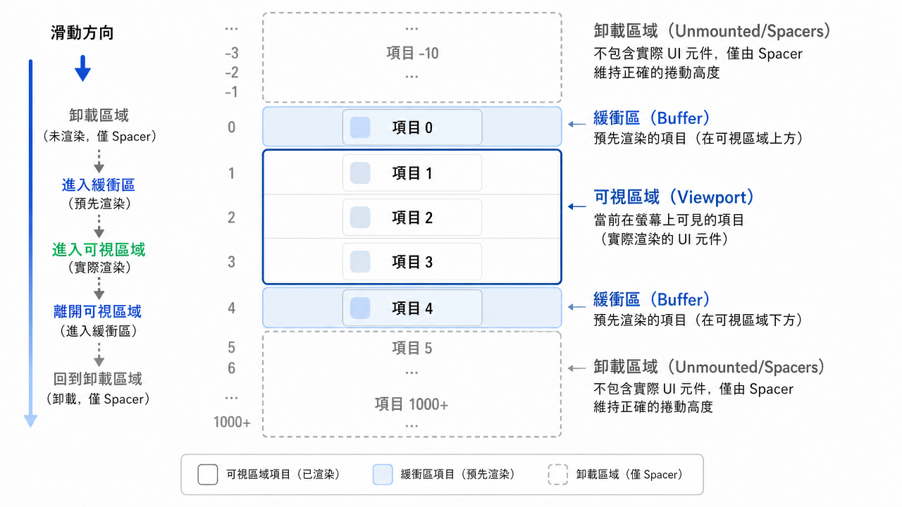

---
mdx:
  format: md
---

> 課程：RN 跨平台開發基礎
> 第 11 堂：效能基礎全覽

# FlatList 虛擬化與優化

想像你正在開發一款類似 YouTube 或 Instagram 的媒體類 APP，你的資料庫裡有幾千則影片或動態。如果你直接用一個簡單的循環將這些資料全部渲染出來，你的手機可能會在幾秒鐘內變得滾燙，滑動起來像是在看投影片，最後直接閃退。

為什麼會這樣？在上一節中，我們學到了 **JS Thread** 與 **UI Thread** 的分工。當你試圖一次顯示 1,000 個元件時，JS Thread 必須將這 1,000 個元件的佈局資訊、樣式、圖片路徑全部透過「橋接（Bridge）」發送給原生層。這就像是試圖在一個狹窄的單行道上擠進一萬輛車，交通癱瘓是必然的。

這一節我們將深入探討 React Native 處理大量數據的核心方案：**虛擬化（Virtualization）**，以及如何透過精確的參數調校，讓你的列表在處理成千上萬筆媒體內容時依然絲滑順暢。

## ScrollView 全量渲染 vs FlatList 虛擬化

在 React Native 中，顯示列表有兩種主要方式：`ScrollView` 和 `FlatList`。它們的效能差異來自於對記憶體與渲染路徑的完全不同哲學。

### ScrollView 的「全量渲染」陷阱

`ScrollView` 的工作方式非常直觀：你給它多少子元件，它就渲染多少。這稱為 **全量渲染（Full Rendering）**。

- **優點**：簡單、反應快。一旦渲染完成，滑動起來非常順暢，因為所有東西都在記憶體裡了。
- **致命傷**：它不會回收資源。如果你有 500 個包含高解析度縮圖的卡片，`ScrollView` 會試圖在 APP 啟動時一次性把這 500 個原生 UI 元件全部創建出來。
- **後果**：JS Thread 會因為計算大量佈局而長時間阻塞（導致 App 無反應），記憶體會因為持有大量圖片而飆升，最終導致系統強制關閉你的 APP（OOM, Out of Memory）。

### FlatList 的「虛擬化」救贖

`FlatList`（及其底層的 `VirtualizedList`）採用了完全不同的策略：**只渲染你現在看得到的東西**。

所謂的 **虛擬化（Virtualization）**，本質上是一種「視窗化」技術。它只會維護一個小型的「渲染視窗」，這個視窗內包含了目前螢幕上可見的元件，以及少量的「緩衝區（Buffer）」。當一個元件滑出視窗範圍很遠時，`FlatList` 會將其卸載（Unmount）以釋放記憶體，並在需要時重新渲染。




> *FlatList 透過動態掛載與卸載元件，確保 JS Thread 不需要同時處理過多數據。*

## keyExtractor：不只是為了消除警告

在使用 `FlatList` 時，開發者最常忽略的就是 `keyExtractor`。許多人為了省事直接傳入 `(item, index) => index.toString()`，但在高效能場景下，這是非常危險的。

`FlatList` 需要 `key` 來識別元件的身份。當列表資料發生變化（例如你從伺服器抓取了新資料並插入到列表頂部）時，React 會利用 `key` 來判斷哪些元件是「舊有的但換了位置」，哪些是「全新生成的」。

如果你使用 `index` 作為 key，當你在列表頂部插入一筆新資料時，原本 index 0 的項目變成了 index 1，index 1 變成了 2。對 React 來說，**所有的 key 都變了**。這會導致 `FlatList` 錯誤地認為所有舊元件都失效了，進而觸發「全量重新渲染」。

**最佳實踐：** 永遠使用來自資料庫的唯一 ID（如 `item.id`）。這能確保當資料順序變動或局部更新時，`FlatList` 能夠精確地只更新受影響的元件。

## getItemLayout：效能優化的「殺手鐧」

如果你問 React Native 專家哪個參數對列表效能影響最大，答案通常是 `getItemLayout`。

### 為什麼需要它？

預設情況下，`FlatList` 是不知道你的每個項目具體有多高、位在列表什麼位置的。為了實現虛擬化，它必須知道「現在滑動到哪裡了」以及「哪些項目應該出現在畫面上」。

如果沒有 `getItemLayout`，`FlatList` 必須在原生層渲染完元件後，再透過非同步的方式測量（Measure）每個元件的高度。這會產生一個惡性循環：

1. 使用者快速滑動。
2. `FlatList` 發現需要顯示新項目，但不知道它們在哪。
3. JS Thread 趕緊渲染新項目。
4. 原生層測量高度並回傳給 JS。
5. JS 重新計算滾動位置。

在這種狀態下，如果你滑得太快，JS Thread 計算速度跟不上，使用者就會看到一片白屏（White-out）。

### 如何實作？

如果你的列表項目是**固定高度**的（這在媒體類 APP 很常見，例如影片縮圖固定為 200dp 高），你可以透過 `getItemLayout` 直接跳過這個測量步驟：

```javascript
const ITEM_HEIGHT = 200;

<FlatList
  data={data}
  renderItem={renderItem}
  keyExtractor={item => item.id}
  getItemLayout={(data, index) => (
    {
      length: ITEM_HEIGHT, // 每個項目的高度
      offset: ITEM_HEIGHT * index, // 該項目相對於列表頂部的偏移量
      index,
    }
  )}
/>
```

**這是一個巨大的優化！** 它讓 `FlatList` 變成了「預測型」的。即使你有 10,000 筆資料，它也能立即計算出第 9,999 筆資料應該出現在什麼座標，完全不需要任何原生測量。這在處理大量影片縮圖或網格佈局時，是解決白屏問題的最佳方案。

## 調校首屏與緩衝：精細參數設定

除了 `getItemLayout`，還有三個參數決定了使用者「感覺」這份列表快不快。

### 1. initialNumToRender（優化 TTI）

這代表 APP 剛進入頁面時，第一批要渲染多少個項目。

- **設定策略**：剛好填滿一個螢幕，或稍微多一兩個。
- **為什麼**：設定太少，使用者一進來會看到底部空白；設定太多（例如預設是 10），如果你的元件很重（如包含複雜的 `Video` 元件），會拖慢頁面載入速度（Time to Interactive）。

### 2. maxToRenderPerBatch（控制 JS 負擔）

這決定了在滑動過程中，每一步（每個批次）最多渲染多少個新項目。

- **預設值**：10。
- **調校思維**：如果你的元件非常輕量，可以調高以減少渲染頻率；但如果你的元件很重（例如有複雜的動畫或陰影），請調低這個數值，以免一次渲染太多東西導致 JS Thread 卡住，進而讓滑動動畫掉幀。

### 3. windowSize（權衡記憶體與滑動體驗）

這是一個相對單位，1 代表一個螢幕高度。預設值是 21（代表可視區域上方渲染 10 個螢幕高的內容，下方渲染 10 個，中間 1 個）。

- **設定太高**：滑動時非常不容易看到白屏，因為緩衝區很大。但缺點是記憶體佔用極高。
- **設定太低**：記憶體很省，但只要稍微滑快一點，就會看到白屏。
- **建議**：對於圖片/影片列表，建議調低（例如 5 或 7），因為媒體資源非常吃記憶體，我們寧可讓快速滑動時出現一點點延遲，也不要讓 APP 因為記憶體不足而崩潰。

## 媒體類 APP 的實戰陷阱：以影片縮圖為例

假設你在開發 AuraFlow 的影片探索頁面。每個列表項目包含一個高畫質縮圖、標題、作者頭像。

### 陷阱：巢狀匿名函數

在 `renderItem` 中直接寫匿名函數是常見的效能殺手：

```javascript
// ❌ 壞做法
renderItem={({ item }) => (
  <TouchableOpacity onPress={() => handlePress(item.id)}>
    <VideoCard data={item} />
  </TouchableOpacity>
)}
```

為什麼這很糟？因為每次 `FlatList` 重新渲染時，這個匿名函數都會被重新創建。對於虛擬化列表來說，這會導致子元件（`VideoCard`）的 props 發生改變，進而觸發不必要的 re-render。

**對策：**

1. 將 `renderItem` 抽離成一個獨立的、被 `useCallback` 包裹的函數（或者定義在元件外部）。
2. 使用 `React.memo` 來包裹你的 `VideoCard` 元件。我們會在下一節詳細討論這一點，但現在你要知道：**虛擬化列表的效能，高度依賴於「項目元件是否能避免無意義的更新」。**

### 陷阱：未優化的圖片

即使用了 `FlatList`，如果你的每個 `Image` 都直接載入 4K 原圖，記憶體一樣會爆掉。

- **對策**：利用我們在 Topic 2 提到的 `PixelRatio`，或者使用 `expo-image` 這種支援快取與漸進式載入的模組。確保你的列表元件在滑出視窗（Unmount）時，真的有釋放掉圖片資源。

## 總結：高效列表的核對清單

當你發現列表效能不如預期時，請依序檢查以下幾點：

1. **是否使用了 **`**FlatList**`** 而非 **`**ScrollView**`**？**（針對長列表）
2. `**keyExtractor**`** 是否使用了唯一 ID 而非 index？**
3. **是否實作了 **`**getItemLayout**`**？**（如果項目高度固定，這絕對是第一優先級）
4. **是否調低了 **`**windowSize**`** 以節省記憶體？**
5. `**renderItem**`** 內的元件是否足夠輕量？**（是否避免了匿名函數？）

透過這些手段，你可以將原本會導致 App 崩潰的大量數據，轉化為一連串精準、低負擔的渲染指令，讓 JS Thread 始終保持輕鬆。

## 知識銜接

現在我們已經理解了如何透過「虛擬化」來管理「渲染多少東西」，但這只是問題的一半。即使我們只渲染螢幕上的 5 個元件，如果這 5 個元件因為父層級的一個無關狀態更新而頻繁、不必要地重新渲染，效能依然會受損。

下一節，我們將進入 **Re-render 控制術**，學習如何使用 `React.memo`、`useCallback` 與 `useMemo` 來對元件進行更細粒度的手術，確保每一毫秒的計算資源都花在刀口上。
